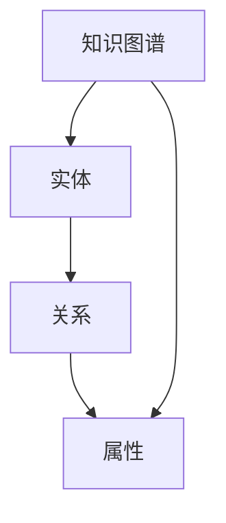
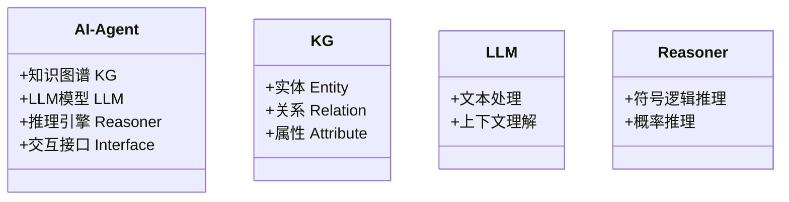
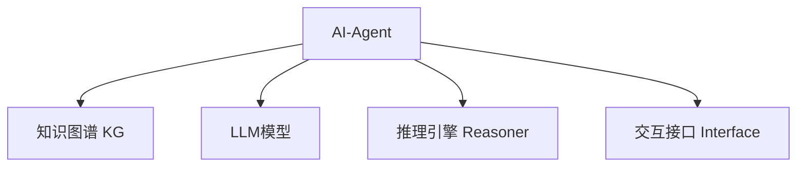

                 


# AI Agent 的知识图谱推理：增强 LLM 的关系理解

## 关键词：
AI Agent，知识图谱，LLM，关系理解，推理算法，系统架构，项目实战

## 摘要：
本文详细探讨了AI Agent如何通过知识图谱推理来增强大语言模型（LLM）的关系理解能力。文章从背景介绍、核心概念、算法原理、系统架构到项目实战，全面分析了知识图谱与LLM的结合，展示了如何通过符号逻辑推理和概率推理来提升模型的关系推理能力。通过具体案例和系统设计，本文为读者提供了从理论到实践的完整指导。

---

## 第一部分：背景介绍

### 第1章：AI Agent 与知识图谱的背景

#### 1.1 问题背景
随着AI Agent在复杂任务中的广泛应用，如何提升其理解和推理能力成为关键挑战。大语言模型（LLM）虽然在文本处理上表现出色，但在关系理解和复杂推理方面仍有不足。知识图谱作为一种结构化知识表示方法，能够有效补充LLM的这些能力。

#### 1.2 问题描述
AI Agent需要处理大量实体和复杂关系，而LLM在处理这些关系时容易出错。知识图谱通过明确的关系表示，可以帮助LLM更准确地理解上下文，从而提升推理能力。

#### 1.3 问题解决
通过结合知识图谱，AI Agent可以利用结构化的知识来增强LLM的关系理解，进而提升整体推理能力。

#### 1.4 边界与外延
知识图谱的边界在于其构建和存储的实体与关系，而LLM的关系理解能力的外延则包括更广泛的知识领域。

#### 1.5 核心概念与组成
- **知识图谱**：用于存储实体及其关系。
- **LLM**：用于理解和生成文本。
- **AI Agent**：整合知识图谱和LLM，实现复杂任务的推理。

---

## 第二部分：核心概念与联系

### 第2章：知识图谱与LLM的关系

#### 2.1 知识图谱的原理
知识图谱通过实体和关系的结构化表示，提供了一种清晰的知识组织方式。例如，实体“人”和关系“朋友”可以构成“人A是人B的朋友”。

#### 2.2 LLM的关系理解能力
LLM擅长处理上下文信息，但在复杂关系推理上依赖外部知识。知识图谱为LLM提供了这种外部支持。

#### 2.3 知识图谱与LLM的关系图
以下是一个简单的知识图谱ER图：



---

## 第三部分：算法原理讲解

### 第3章：符号逻辑推理

#### 3.1 算法原理
符号逻辑推理基于谓词逻辑，通过规则进行推理。例如，如果A是B的朋友，且B是C的朋友，则A和C可能是朋友。

#### 3.2 代码实现
以下是一个简单的符号逻辑推理示例：

```python
def symbolical_reasoning(fact1, fact2):
    # 假设fact1和fact2是知识图谱中的事实
    # 这里进行简单的逻辑推理
    return result
```

#### 3.3 数学模型
符号逻辑推理的数学模型如下：

$$
\text{如果 } P(A, B) \text{ 和 } P(B, C) \text{ 成立，则 } P(A, C) \text{ 可能成立。}
$$

---

## 第四部分：系统分析与架构设计

### 第4章：系统功能设计

#### 4.1 领域模型
以下是系统的类图：



#### 4.2 系统架构
以下是系统的架构图：



---

## 第五部分：项目实战

### 第5章：项目实战

#### 5.1 环境安装
需要安装的知识图谱库和大语言模型库。

#### 5.2 核心代码实现
以下是一个简单的知识图谱推理与LLM结合的代码示例：

```python
from kg_lib import KG
from llm_lib import LLM

class AI-Agent:
    def __init__(self):
        self.kg = KG()
        self.llm = LLM()
    
    def reason(self, query):
        # 使用知识图谱进行推理
        facts = self.kg.query(query)
        # 使用LLM进行上下文理解
        result = self.llm.predict(facts)
        return result
```

#### 5.3 实际案例分析
通过具体案例展示知识图谱如何增强LLM的关系理解。

---

## 第六部分：总结与展望

### 第6章：总结

#### 6.1 最佳实践
- 定期更新知识图谱以保持最新知识。
- 结合多种推理方法提升准确率。

#### 6.2 小结
通过结合知识图谱，AI Agent能够显著提升LLM的关系理解能力，从而在复杂任务中表现出色。

#### 6.3 注意事项
- 知识图谱的质量直接影响推理效果。
- 需要平衡符号逻辑推理和概率推理的复杂度。

#### 6.4 拓展阅读
建议阅读相关领域的最新论文和技术报告，以获取更多前沿知识。

---

通过以上结构，本文系统地介绍了AI Agent如何利用知识图谱推理增强LLM的关系理解能力，从理论到实践提供了全面的指导。

