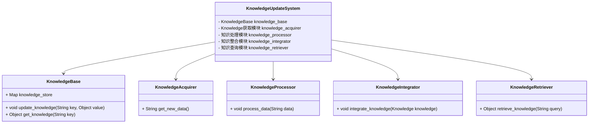
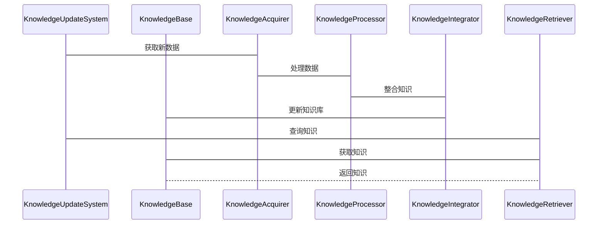

                 


# AI Agent 的知识更新：保持 LLM 知识的时效性

## 关键词：
AI Agent，知识更新，大语言模型（LLM），时效性，增量学习，在线学习，知识表示

## 摘要：
本文深入探讨了AI Agent如何保持其依赖的大语言模型（LLM）知识的时效性。通过分析知识更新的机制、算法原理以及系统架构设计，本文为AI Agent的知识更新提供了理论基础和实践指导。文章从背景介绍、核心概念、算法实现、系统设计、项目实战等多方面展开，结合具体案例和代码示例，详细阐述了如何实现高效的知识更新，确保AI Agent在快速变化的知识环境中保持竞争力。

---

## 第1章: AI Agent 与知识更新概述

### 1.1 AI Agent 的定义与核心功能

#### 1.1.1 AI Agent 的定义
AI Agent（人工智能代理）是指能够感知环境并采取行动以实现目标的智能实体。AI Agent 可以是软件程序、机器人或其他智能系统，其核心目标是通过自主决策和行动来优化特定任务的执行效果。

#### 1.1.2 AI Agent 的核心功能
1. **感知环境**：通过传感器或数据输入接口获取环境信息。
2. **决策与推理**：基于获取的信息进行分析、推理和决策。
3. **执行动作**：根据决策结果执行相应的动作或输出结果。
4. **自适应与学习**：通过学习算法不断优化自身的知识和行为模式。

#### 1.1.3 AI Agent 的应用场景
1. **智能助手**：如 Siri、Alexa 等，为用户提供信息查询、任务执行等服务。
2. **自动驾驶**：通过实时感知和决策实现车辆的自动驾驶。
3. **智能客服**：通过自然语言处理技术为用户提供个性化服务。

### 1.2 大语言模型（LLM）的概述

#### 1.2.1 LLM 的定义
大语言模型（Large Language Model，LLM）是指经过大规模数据训练的深度学习模型，能够理解和生成人类语言。LLM 的核心是其巨大的参数量和复杂性，使其在处理自然语言任务时表现出色。

#### 1.2.2 LLM 的主要特点
1. **大规模训练数据**：通常使用 billions 级别的数据进行训练。
2. **深度神经网络结构**：如 Transformer 模型，具有强大的上下文理解和生成能力。
3. **多任务通用性**：能够处理多种语言理解和生成任务，如翻译、问答、文本摘要等。

#### 1.2.3 LLM 在 AI Agent 中的作用
在 AI Agent 中，LLM 通常作为知识库或推理引擎，帮助 Agent 理解用户需求、生成回答或执行任务。例如，在智能客服中，LLM 可以根据用户的问题生成准确的回答。

### 1.3 知识更新的必要性

#### 1.3.1 知识更新的背景
随着知识的快速变化，LLM 的知识可能会过时。例如，新技术的发布、法律法规的变更或行业动态的更新都会导致 LLM 的知识变得陈旧。

#### 1.3.2 知识更新的重要性
知识更新是确保 AI Agent 能够持续提供准确、可靠服务的关键。如果 LLM 的知识过时，AI Agent 的决策和回答可能会出现错误，影响用户体验和信任度。

#### 1.3.3 知识更新的挑战
1. **数据获取的及时性**：如何快速获取最新知识数据。
2. **知识表示的复杂性**：如何将新知识有效地整合到现有的知识体系中。
3. **更新过程的稳定性**：如何确保知识更新不会破坏现有功能或引入错误。

---

## 第2章: 知识更新的核心概念与理论基础

### 2.1 知识更新的机制

#### 2.1.1 知识更新的定义
知识更新是指通过持续学习和调整，使 AI Agent 的知识库保持最新状态的过程。

#### 2.1.2 知识更新的原理
知识更新的原理可以简单理解为：通过不断地获取新知识、分析新知识并将其整合到现有的知识体系中，确保 AI Agent 的知识库始终反映最新的信息。

#### 2.1.3 知识更新的分类
1. **增量学习**：逐步获取新知识并更新知识库。
2. **在线学习**：实时获取新知识并动态更新知识库。
3. **批量学习**：定期获取大量新知识并一次性更新知识库。

### 2.2 LLM 的知识表示与存储

#### 2.2.1 知识表示的定义
知识表示是指将知识以某种形式存储在系统中，使其能够被理解和使用。常见的知识表示方法包括符号逻辑、概率图模型和向量表示等。

#### 2.2.2 知识存储的结构
1. **符号逻辑表示**：通过逻辑规则表示知识，如谓词逻辑。
2. **向量表示**：通过向量空间模型表示知识，如词嵌入。
3. **图结构表示**：通过图结构表示知识，如知识图谱。

#### 2.2.3 知识表示的优化
1. **压缩表示**：通过降维或其他方法减少存储空间。
2. **动态更新**：支持快速添加或修改知识。
3. **高效查询**：支持快速检索相关知识。

### 2.3 知识更新的流程

#### 2.3.1 知识获取
知识获取是知识更新的第一步，可以通过以下方式获取新知识：
1. **数据流**：实时接收新数据。
2. **文件导入**：定期导入新数据文件。
3. **API 调用**：通过 API 获取最新数据。

#### 2.3.2 知识处理
知识处理是指对获取的新知识进行清洗、解析和转换，使其能够被系统理解和使用。例如，将自然语言文本转换为结构化数据。

#### 2.3.3 知识整合
知识整合是指将新知识与现有知识体系进行融合，确保新知识不影响现有功能并保持知识库的完整性。例如，将新知识添加到知识图谱中。

---

## 第3章: 知识更新的算法原理

### 3.1 知识更新算法概述

#### 3.1.1 知识更新算法的分类
1. **增量学习算法**：适合逐步获取新知识的场景。
2. **在线学习算法**：适合实时更新知识的场景。
3. **批量学习算法**：适合定期更新知识的场景。

#### 3.1.2 算法选择的依据
选择算法时需要考虑以下因素：
1. **知识更新的频率**：实时更新还是定期更新。
2. **知识更新的规模**：单条知识更新还是批量更新。
3. **系统的资源限制**：计算资源和存储资源的可用性。

#### 3.1.3 算法的优缺点对比
| 算法类型 | 优点 | 缺点 |
|----------|------|------|
| 增量学习 | 知识更新速度快，适合实时场景 | 需要处理不完整的知识 |
| 在线学习 | 知识更新实时性强，适合动态环境 | 计算资源消耗较高 |
| 批量学习 | 知识更新稳定性高，适合批量处理 | 知识更新周期较长 |

### 3.2 增量学习算法

#### 3.2.1 增量学习的定义
增量学习是一种逐步获取新知识并更新知识库的算法。其核心思想是通过少量的数据逐步优化模型，而不是一次性训练整个数据集。

#### 3.2.2 增量学习的流程
1. 初始化模型参数。
2. 逐步获取新数据。
3. 更新模型参数。
4. 重复步骤 2-3 直到完成知识更新。

#### 3.2.3 增量学习的实现
以下是增量学习算法的伪代码示例：

```python
# 初始化模型参数
params = initial_params()

# 进入循环，逐步获取新数据
while True:
    # 获取一条新数据
    x, y = get_new_data()
    # 更新模型参数
    params = update_params(params, x, y)
```

### 3.3 在线学习算法

#### 3.3.1 在线学习的定义
在线学习是一种实时获取新知识并动态更新知识库的算法。其核心思想是通过实时数据流不断优化模型。

#### 3.3.2 在线学习的流程
1. 初始化模型参数。
2. 实时接收新数据。
3. 动态更新模型参数。
4. 重复步骤 2-3 直到完成知识更新。

#### 3.3.3 在线学习的实现
以下是在线学习算法的伪代码示例：

```python
# 初始化模型参数
params = initial_params()

# 开始实时接收数据
while True:
    # 接收一条新数据
    x, y = receive_real_time_data()
    # 动态更新模型参数
    params = update_params(params, x, y)
```

---

## 第4章: 系统分析与架构设计

### 4.1 系统需求分析

#### 4.1.1 系统的功能需求
1. 实时获取新知识。
2. 动态更新知识库。
3. 提供最新的信息查询服务。

#### 4.1.2 系统的性能需求
1. 知识更新的实时性。
2. 系统的稳定性。
3. 知识查询的响应速度。

#### 4.1.3 系统的约束条件
1. 知识更新的资源消耗。
2. 知识表示的复杂性。
3. 知识整合的效率。

### 4.2 系统架构设计

#### 4.2.1 系统架构的组成
1. **知识获取模块**：负责获取新知识。
2. **知识处理模块**：负责清洗和解析新知识。
3. **知识整合模块**：负责将新知识整合到现有知识体系中。
4. **知识查询模块**：负责提供最新的信息查询服务。

#### 4.2.2 系统架构的实现
以下是系统架构的类图表示：



### 4.3 系统接口设计

#### 4.3.1 系统接口的定义
1. `update_knowledge(key, value)`：更新特定键的知识。
2. `get_knowledge(key)`：获取特定键的知识。
3. `process_data(data)`：处理新数据。
4. `integrate_knowledge(knowledge)`：整合新知识。
5. `retrieve_knowledge(query)`：检索相关信息。

#### 4.3.2 系统接口的实现
以下是系统接口的交互流程图：



---

## 第5章: 项目实战

### 5.1 项目介绍

#### 5.1.1 项目背景
本项目旨在实现一个基于 AI Agent 的知识更新系统，通过持续更新 LLM 的知识库，确保 AI Agent 提供的信息始终最新。

#### 5.1.2 项目目标
1. 实现知识的实时获取和动态更新。
2. 提供高效的查询服务。
3. 确保知识更新的稳定性和可靠性。

### 5.2 环境配置

#### 5.2.1 环境要求
1. 操作系统：Linux 或 macOS。
2. Python 版本：3.8 或更高。
3. 依赖库：numpy, pandas, transformers, mermaid。

#### 5.2.2 安装依赖
```bash
pip install numpy pandas transformers mermaid
```

### 5.3 核心实现

#### 5.3.1 知识获取模块
```python
import requests

def get_new_data():
    # 获取新数据，例如通过 API 调用
    response = requests.get("https://example.com/api")
    return response.json()
```

#### 5.3.2 知识处理模块
```python
import json

def process_data(data):
    # 将数据转换为结构化格式
    processed_data = json.loads(data)
    return processed_data
```

#### 5.3.3 知识整合模块
```python
class KnowledgeIntegrator:
    def __init__(self, knowledge_base):
        self.knowledge_base = knowledge_base

    def integrate(self, knowledge):
        # 将知识整合到知识库中
        self.knowledge_base.update(knowledge)
```

#### 5.3.4 知识查询模块
```python
class KnowledgeRetriever:
    def __init__(self, knowledge_base):
        self.knowledge_base = knowledge_base

    def retrieve(self, query):
        # 根据查询返回相关信息
        return self.knowledge_base.get(query)
```

### 5.4 实际案例分析

#### 5.4.1 案例背景
假设我们有一个 AI Agent，需要实时更新关于 COVID-19 的最新研究进展。

#### 5.4.2 知识更新流程
1. 知识获取模块定期从指定的 API 获取最新的 COVID-19 研究数据。
2. 知识处理模块将获取的数据转换为结构化格式。
3. 知识整合模块将处理后的数据整合到现有的知识库中。
4. 知识查询模块根据用户的查询返回最新的相关信息。

#### 5.4.3 代码实现
```python
# 初始化知识库
knowledge_base = KnowledgeBase()

# 获取新数据
data = get_new_data()

# 处理数据
processed_data = process_data(data)

# 整合知识
integrator = KnowledgeIntegrator(knowledge_base)
integrator.integrate(processed_data)

# 查询知识
retriever = KnowledgeRetriever(knowledge_base)
result = retriever.retrieve("COVID-19 最新研究")
print(result)
```

### 5.5 项目小结

#### 5.5.1 项目总结
通过本项目的实现，我们成功构建了一个能够实时更新知识的 AI Agent 系统。该系统能够高效地获取、处理和整合新知识，确保知识库的时效性。

#### 5.5.2 项目成果
1. 实现了知识的实时获取和动态更新。
2. 提供了高效的查询服务。
3. 确保了知识更新的稳定性和可靠性。

---

## 第6章: 总结与展望

### 6.1 总结

通过本文的探讨，我们深入分析了 AI Agent 知识更新的背景、核心概念、算法原理和系统架构设计。我们还通过实际案例展示了如何实现知识更新，确保 LLM 的知识始终保持最新状态。

### 6.2 未来展望

未来，随着 AI 技术的不断发展，知识更新技术也将迎来新的挑战和机遇。我们可以期待以下发展：
1. 更高效的增量学习算法。
2. 更智能的知识表示方法。
3. 更强大的在线学习能力。

---

## 附录

### 附录 A: 知识更新相关术语表

1. **AI Agent**：人工智能代理，能够感知环境并采取行动以实现目标的智能实体。
2. **LLM**：大语言模型，经过大规模数据训练的深度学习模型，能够理解和生成人类语言。
3. **知识更新**：通过持续学习和调整，使 AI Agent 的知识库保持最新状态的过程。
4. **增量学习**：逐步获取新知识并更新知识库的算法。
5. **在线学习**：实时获取新知识并动态更新知识库的算法。

### 附录 B: 知识更新算法的数学模型

1. **增量学习的数学模型**
   $$ \theta_{t+1} = \theta_t + \eta (y_t - \hat{y}_t) $$
   其中，$\theta_t$ 表示第 $t$ 次迭代的模型参数，$\eta$ 表示学习率，$y_t$ 表示真实标签，$\hat{y}_t$ 表示预测标签。

2. **在线学习的数学模型**
   $$ \theta_{t+1} = \theta_t + \eta (y_t - \hat{y}_t) x_t $$
   其中，$x_t$ 表示输入数据。

---

# 结语

通过本文的深入探讨，我们不仅理解了 AI Agent 知识更新的核心原理，还掌握了其实现方法。希望本文能为相关领域的研究和实践提供有价值的参考。

