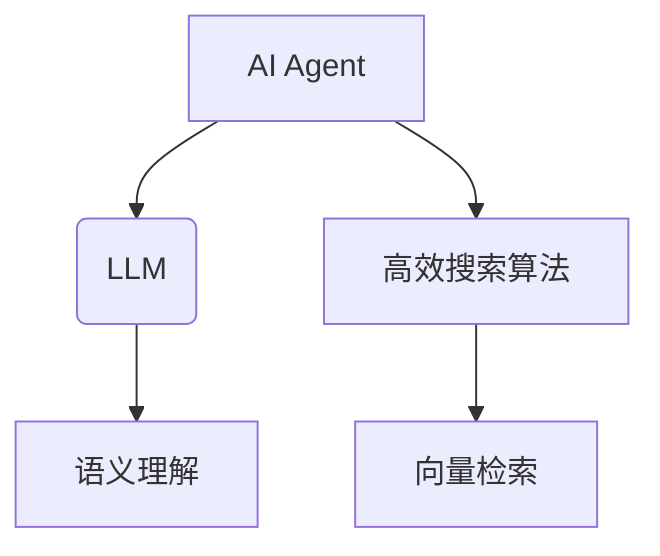
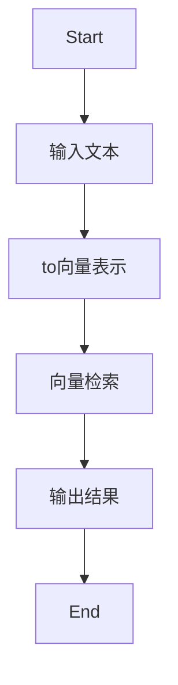
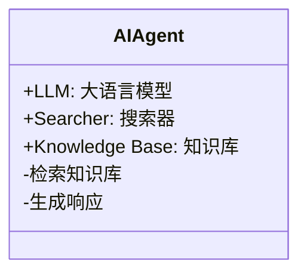
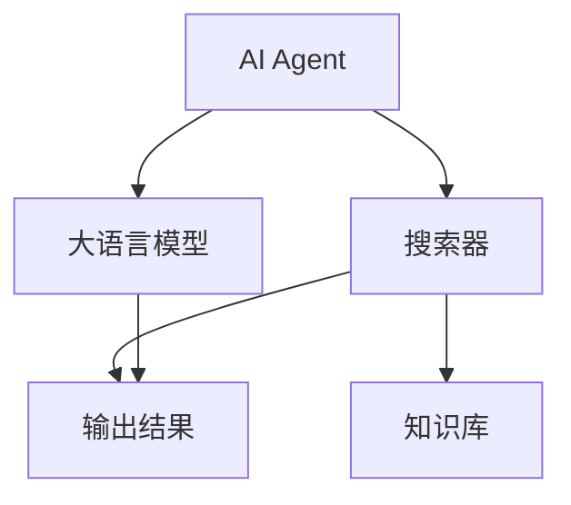
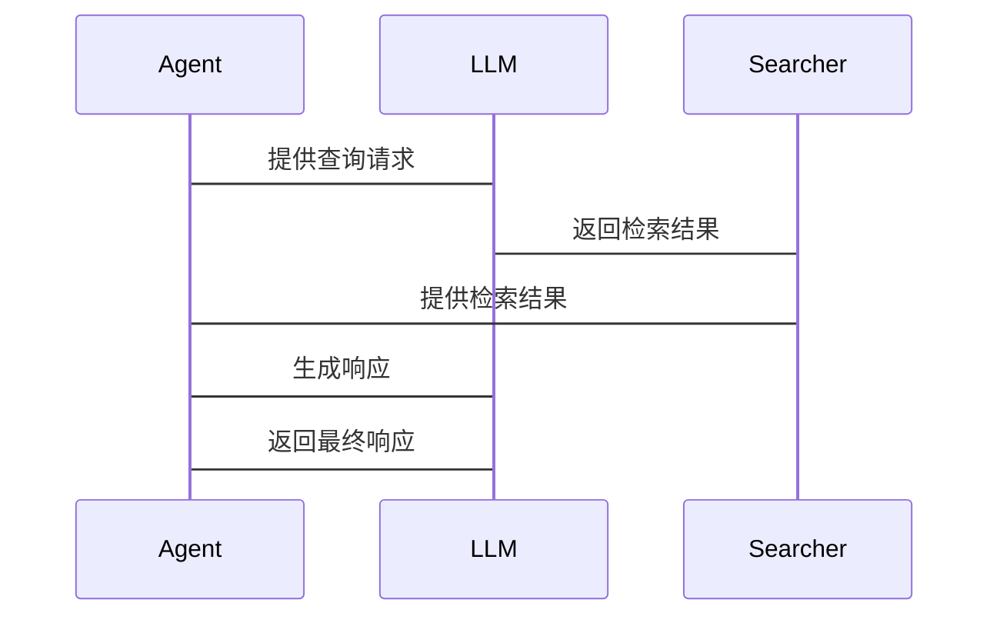

                 


# AI Agent 的知识检索增强：结合 LLM 与高效搜索算法

> 关键词：AI Agent，知识检索，LLM，高效搜索算法，向量数据库

> 摘要：本文探讨了如何通过结合大语言模型（LLM）与高效搜索算法来增强AI Agent的知识检索能力。文章首先介绍了AI Agent的基本概念和知识检索增强的必要性，接着详细讲解了LLM和高效搜索算法的核心原理，分析了它们的结合优势。随后，文章从系统架构设计、项目实战和最佳实践等多个维度，深入探讨了如何在实际应用中实现这一结合，为AI Agent的知识检索能力提供高效的解决方案。

---

# 第一部分: AI Agent 的知识检索增强背景介绍

# 第1章: AI Agent 的知识检索增强背景介绍

## 1.1 AI Agent 的核心概念

### 1.1.1 AI Agent 的定义与特点

AI Agent（人工智能代理）是指能够感知环境、自主决策并执行任务的智能实体。AI Agent具备以下特点：

1. **自主性**：能够独立决策和行动，无需外部干预。
2. **反应性**：能够实时感知环境并做出响应。
3. **目标导向**：基于目标驱动行为，优化决策过程。
4. **学习能力**：通过数据和经验不断优化自身性能。

### 1.1.2 知识检索增强的必要性

AI Agent的核心能力之一是知识检索，它依赖于高效的信息处理和检索机制。传统的知识检索方法存在以下局限性：

1. **检索效率低**：传统搜索引擎依赖关键词匹配，难以理解上下文语义。
2. **准确性不足**：检索结果可能存在噪声，影响决策质量。
3. **实时性差**：在动态变化的环境中，传统检索难以快速响应。

通过结合LLM与高效搜索算法，可以显著提升AI Agent的知识检索能力，使其更高效、准确地处理信息。

### 1.1.3 LLM 与高效搜索算法的结合优势

LLM（大语言模型）具备强大的语义理解和生成能力，而高效搜索算法则擅长快速、精准地检索信息。两者的结合优势在于：

1. **语义理解**：LLM能够理解用户的意图和上下文，提供更准确的检索结果。
2. **高效检索**：高效搜索算法能够在海量数据中快速找到相关结果，提升检索效率。
3. **协同优化**：通过LLM的语义分析和搜索算法的高效检索，实现知识检索的协同优化。

## 1.2 问题背景与描述

### 1.2.1 知识检索的传统方法与局限性

传统的知识检索方法主要依赖关键词匹配和基于向量的相似度检索。这些方法在面对复杂语义和动态数据时，检索效率和准确性都存在不足。

### 1.2.2 LLM 在知识检索中的应用现状

目前，LLM在自然语言处理领域表现出色，但在结合高效搜索算法方面仍处于探索阶段。如何将LLM的语义理解能力与高效搜索算法的检索能力结合，是当前研究的热点。

### 1.2.3 问题解决的思路与目标

本文旨在探索如何结合LLM与高效搜索算法，构建一种高效、准确的知识检索增强方法，提升AI Agent的知识处理能力。

## 1.3 边界与外延

### 1.3.1 知识检索增强的边界

知识检索增强的核心是提升检索效率和准确性，但并不涉及数据存储和生成内容的优化。

### 1.3.2 相关领域的外延

本文主要关注AI Agent的知识检索增强，不涉及其其他功能模块，如决策制定和行为规划。

### 1.3.3 核心要素组成

知识检索增强的核心要素包括：

1. **LLM**：提供语义理解和生成能力。
2. **高效搜索算法**：实现快速、精准的信息检索。
3. **向量数据库**：存储和管理知识库数据。

## 1.4 本章小结

本章介绍了AI Agent的基本概念，分析了知识检索增强的必要性，并探讨了LLM与高效搜索算法结合的优势。通过理解这些问题背景和概念，读者可以更好地理解后续的技术细节和实现方法。

---

# 第二部分: 核心概念与联系

# 第2章: 核心概念原理

## 2.1 LLM 的基本原理

### 2.1.1 大语言模型的训练机制

大语言模型通过监督学习和无监督学习结合的方式进行训练，利用海量数据进行预训练，然后通过微调任务特定的数据进行优化。

### 2.1.2 模型的输入输出机制

LLM的输入通常为文本序列，输出为生成的文本序列。模型通过编码器和解码器的结构进行信息处理。

### 2.1.3 模型的推理能力

LLM具备强大的语义理解能力，能够理解上下文并生成相关文本。

## 2.2 高效搜索算法的核心原理

### 2.2.1 向量数据库的构建原理

向量数据库通过将文本数据转换为向量表示，并基于向量的相似度进行检索。

### 2.2.2 基于相似度的检索算法

常用的检索算法包括余弦相似度和欧氏距离等方法。

### 2.2.3 分布式搜索算法的特点

分布式搜索算法通过并行计算提升检索效率，适用于大规模数据集。

## 2.3 核心概念属性特征对比

以下是LLM与高效搜索算法的对比表格：

| 属性 | LLM | 高效搜索算法 |
|------|------|--------------|
| 输入 | 文本序列 | 向量表示 |
| 输出 | 文本序列 | 相似度评分 |
| 核心能力 | 语义理解 | 快速检索 |
| 优势 | 高准确性 | 高效率 |

## 2.4 ER 实体关系图



---

# 第三部分: 算法原理讲解

# 第3章: 算法原理与实现

## 3.1 LLM 的工作流程

### 3.1.1 模型结构

LLM通常基于Transformer架构，包括编码器和解码器两部分。

### 3.1.2 输入处理

将输入文本转换为向量表示，通过多层变换提升语义表示能力。

### 3.1.3 输出生成

基于上下文信息生成相关文本。

## 3.2 高效搜索算法的实现细节

### 3.2.1 向量数据库的构建

使用预训练模型将文本转换为向量，存储在数据库中。

### 3.2.2 基于相似度的检索

通过计算查询向量与数据库向量的相似度，返回最相关的结果。

### 3.2.3 分布式检索优化

通过分布式计算提升检索效率，适用于大规模数据集。

## 3.3 算法流程图



## 3.4 核心公式与数学模型

### 3.4.1 余弦相似度

计算两个向量之间的余弦相似度：

$$\cos \theta = \frac{\vec{a} \cdot \vec{b}}{|\vec{a}||\vec{b}|}$$

### 3.4.2 BM25 算法

BM25是一种基于向量空间模型的检索算法，公式如下：

$$BM25得分 = \sum_{i=1}^{n} \frac{(\text{query中的词频} + \text{文档中的词频})}{\text{文档总数} \times \text{文档中词频} + \text{平滑因子}}$$

---

# 第四部分: 系统分析与架构设计

# 第4章: 系统架构与设计

## 4.1 问题场景介绍

AI Agent需要快速检索大量知识库中的信息，以支持其决策和行动。

## 4.2 系统功能设计

### 4.2.1 领域模型设计



### 4.2.2 系统架构设计



### 4.2.3 接口设计

AI Agent通过接口调用LLM和搜索器，实现知识检索功能。

### 4.2.4 交互流程图



---

# 第五部分: 项目实战

# 第5章: 项目实战与分析

## 5.1 环境安装

### 5.1.1 安装依赖

使用Python和相关库（如transformers、faiss）搭建环境。

### 5.1.2 数据准备

准备文本数据并进行向量化处理。

## 5.2 核心代码实现

### 5.2.1 LLM 接口实现

```python
from transformers import AutoModelForMaskedLM, AutoTokenizer

class LLMInterface:
    def __init__(self, model_name):
        self.model = AutoModelForMaskedLM.from_pretrained(model_name)
        self.tokenizer = AutoTokenizer.from_pretrained(model_name)
```

### 5.2.2 搜索器实现

```python
import faiss

class Searcher:
    def __init__(self, vector_db):
        self.vector_db = vector_db

    def search(self, query, k=5):
        # 将查询向量化
        # 返回前k个结果
        pass
```

### 5.2.3 知识库管理

```python
class KnowledgeBase:
    def __init__(self, vectors, ids):
        self.vectors = vectors
        self.ids = ids

    def add(self, new_vector, new_id):
        self.vectors.append(new_vector)
        self.ids.append(new_id)
```

## 5.3 代码解读与分析

### 5.3.1 LLM 接口

LLM接口负责与大语言模型交互，处理输入输出。

### 5.3.2 搜索器实现

搜索器负责将查询向量化，并在向量数据库中进行检索。

### 5.3.3 知识库管理

知识库管理模块负责存储和管理知识库数据，支持添加和查询操作。

## 5.4 案例分析与解读

### 5.4.1 项目实现

结合LLM和搜索器，实现知识检索增强的AI Agent。

### 5.4.2 功能测试

通过测试案例验证系统的检索效率和准确性。

### 5.4.3 性能优化

优化向量数据库和检索算法，提升整体性能。

## 5.5 项目小结

通过项目实战，我们验证了结合LLM与高效搜索算法的可行性，并总结了实现经验和优化方向。

---

# 第六部分: 最佳实践

# 第6章: 最佳实践与总结

## 6.1 小结

本文详细探讨了AI Agent的知识检索增强方法，结合了LLM与高效搜索算法的优势，提供了一种高效、准确的知识检索解决方案。

## 6.2 注意事项

- 确保向量数据库的质量和准确性。
- 优化检索算法，提升检索效率。
- 定期更新知识库，保持信息的时效性。

## 6.3 拓展阅读

推荐阅读相关领域的最新研究，如分布式检索算法和多模态信息检索。

---

# 参考文献

（此处列出相关文献和资源）

---

# 附录

（此处可以添加额外的代码示例或详细说明）

---

通过以上结构化的内容，您可以开始撰写具体的章节内容，每部分内容详细展开，确保逻辑清晰，技术专业，语言简洁明了。

