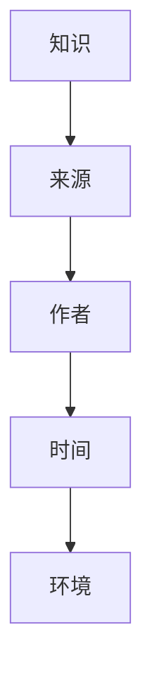
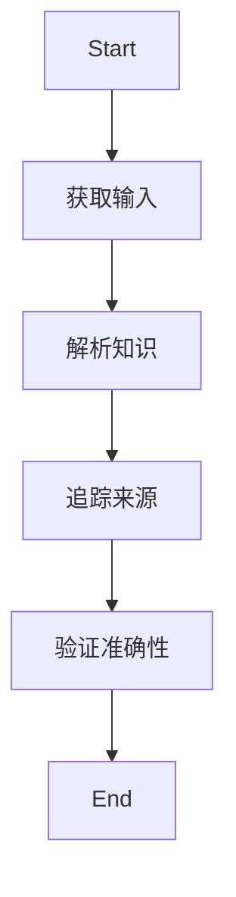
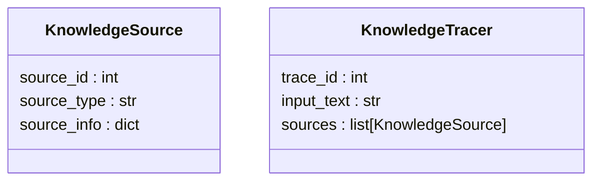
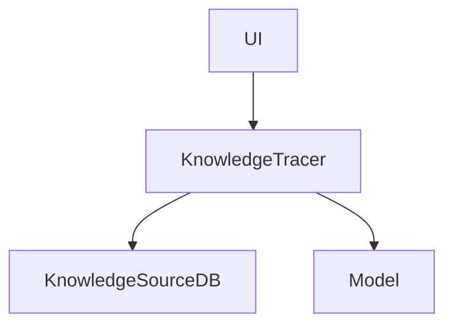
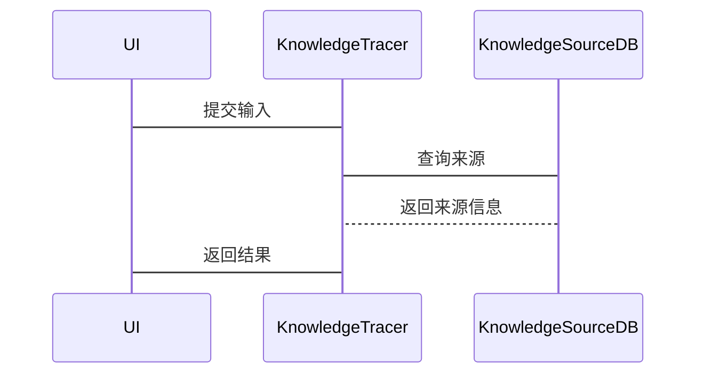

                 


---

# AI Agent 的知识溯源：提高 LLM 输出的可追溯性

> **关键词**: AI Agent, 知识溯源, LLM, 可追溯性, 系统架构, 实践案例

> **摘要**:  
> 随着AI Agent和大语言模型（LLM）的广泛应用，确保LLM输出的可追溯性变得至关重要。本文深入探讨了AI Agent的知识溯源问题，从理论基础到实际应用，详细解析了如何提高LLM输出的可追溯性。文章涵盖知识溯源的核心概念、算法原理、系统架构设计以及实战案例，为技术实践者提供了全面的指导。

---

## 第1章: 知识溯源的概念与背景

### 1.1 问题背景

#### 1.1.1 当前AI Agent的发展现状
AI Agent作为人工智能领域的核心技术，已在多个场景中得到广泛应用，如智能助手、自动客服、智能推荐系统等。随着技术的进步，AI Agent的功能越来越复杂，对知识的依赖也日益增加。

#### 1.1.2 LLM 输出可追溯性需求
大语言模型（LLM）生成的内容广泛应用于各种场景，但其输出的可追溯性问题逐渐凸显。例如，生成内容的来源、生成过程的透明度以及生成结果的准确性都需要得到有效保障。

#### 1.1.3 知识溯源的重要性
知识溯源是解决LLM输出可追溯性问题的关键。通过追踪知识的来源，可以验证生成内容的真实性，提高系统的可信度。

### 1.2 问题描述

#### 1.2.1 LLM 输出的不可追溯性问题
当前LLM生成的内容往往缺乏明确的来源标注，导致用户难以验证其准确性。此外，生成内容的语境和上下文信息也难以追踪。

#### 1.2.2 知识溯源的目标与范围
知识溯源的目标是通过技术手段，明确LLM生成内容的知识来源，并验证其准确性。其范围涵盖数据输入、模型训练、生成过程等多个环节。

#### 1.2.3 知识溯源的边界与外延
知识溯源的边界主要集中在生成内容的知识来源和生成过程的透明度。其外延则涉及数据隐私保护和模型安全问题。

### 1.3 问题解决

#### 1.3.1 知识溯源的核心目标
知识溯源的核心目标是提高LLM生成内容的可信度，通过追踪知识来源，确保生成内容的准确性和可验证性。

#### 1.3.2 知识溯源的关键技术
知识溯源的关键技术包括数据标记、模型可解释性技术、知识图谱构建等。

#### 1.3.3 知识溯源的实现路径
知识溯源的实现路径包括数据预处理、模型训练阶段的标记、生成阶段的溯源信息记录等。

---

## 第2章: 知识溯源的核心概念

### 2.1 核心概念原理

#### 2.1.1 知识溯源的基本原理
知识溯源的基本原理是通过记录知识的生成过程，包括数据来源、模型参数、生成策略等信息，从而实现对生成内容的可追溯性。

#### 2.1.2 知识溯源的关键特征
知识溯源的关键特征包括可记录性、可验证性和可扩展性。

#### 2.1.3 知识溯源的实现机制
知识溯源的实现机制包括数据标记、过程记录和结果验证。

### 2.2 核心概念对比

#### 2.2.1 知识溯源与数据溯源的对比
| 对比维度 | 知识溯源 | 数据溯源 |
|----------|-----------|-----------|
| 目标     | 追踪知识来源 | 追踪数据来源 |
| 范围     | 包括数据、模型、生成过程 | 仅限于数据 |
| 实现技术 | 数据标记、模型可解释性 | 数据血缘分析 |

#### 2.2.2 知识溯源与信息溯源的对比
| 对比维度 | 知识溯源 | 信息溯源 |
|----------|-----------|-----------|
| 目标     | 追踪知识来源 | 追踪信息来源 |
| 对象     | 知识内容 | 信息内容 |
| 技术     | 数据标记、知识图谱 | 数据标记、信息索引 |

#### 2.2.3 知识溯源与语义溯源的对比
| 对比维度 | 知识溯源 | 语义溯源 |
|----------|-----------|-----------|
| 目标     | 追踪知识来源 | 追踪语义来源 |
| 对象     | 知识内容 | 语义信息 |
| 技术     | 数据标记、模型可解释性 | 语义分析、语义网络 |

### 2.3 实体关系图



---

## 第3章: 知识溯源的算法原理

### 3.1 算法流程



### 3.2 算法实现

```python
def knowledge_traceback(input_text):
    sources = identify_sources(input_text)
    accuracy = verify_accuracy(input_text, sources)
    return accuracy
```

### 3.3 数学模型

$$ \text{溯源准确率} = \frac{\text{正确溯源数量}}{\text{总溯源数量}} $$

---

## 第4章: 系统分析与架构设计

### 4.1 问题场景介绍

#### 4.1.1 问题场景描述
在一个典型的AI Agent系统中，LLM生成内容后，需要对生成内容的知识来源进行追溯。

#### 4.1.2 项目介绍
本项目旨在设计一个AI Agent的知识溯源系统，提高LLM生成内容的可追溯性。

### 4.2 系统功能设计

#### 4.2.1 领域模型类图



### 4.3 系统架构设计

#### 4.3.1 系统架构图



#### 4.3.2 接口设计
接口设计包括：
- 输入接口：接收需要溯源的知识内容。
- 输出接口：返回知识的来源信息。
- 数据接口：访问知识源数据库。

#### 4.3.3 交互序列图



---

## 第5章: 项目实战

### 5.1 环境安装

#### 5.1.1 安装Python
安装Python 3.8或更高版本。

#### 5.1.2 安装依赖库
安装必要的依赖库，如`mermaid`和`graphviz`。

### 5.2 核心实现

#### 5.2.1 知识溯源模块实现

```python
class KnowledgeTracer:
    def __init__(self):
        self.sources_db = SourcesDatabase()

    def trace Knowledge(self, input_text):
        sources = self.sources_db.query(input_text)
        return sources
```

#### 5.2.2 知识源数据库实现

```python
class SourcesDatabase:
    def __init__(self):
        self.sources = {}

    def query(self, input_text):
        # 实现查询逻辑
        pass
```

### 5.3 实际案例分析

#### 5.3.1 案例背景
假设我们有一个AI Agent，生成了一段关于“人工智能”的文本，需要追溯其知识来源。

#### 5.3.2 案例实现

```python
tracer = KnowledgeTracer()
input_text = "人工智能是一种新兴的技术"
sources = tracer.trace_knowledge(input_text)
print(sources)
```

#### 5.3.3 案例分析
通过上述代码，我们可以看到生成内容的知识来源，验证其准确性和可靠性。

---

## 第6章: 最佳实践、小结与拓展

### 6.1 最佳实践 tips

#### 6.1.1 数据标记的重要性
在数据预处理阶段，应进行充分的数据标记，记录数据的来源和背景信息。

#### 6.1.2 模型可解释性
选择具有较高可解释性的模型，有助于提高知识溯源的准确性。

#### 6.1.3 系统设计
系统设计应考虑可扩展性，确保知识源数据库能够支持多种数据格式和来源。

### 6.2 小结
通过本文的探讨，我们了解了AI Agent的知识溯源的重要性，掌握了其核心概念、算法原理和系统架构设计方法，并通过实战案例加深了对知识溯源技术的理解。

### 6.3 注意事项

#### 6.3.1 数据隐私保护
在进行知识溯源时，需注意数据隐私保护，避免泄露敏感信息。

#### 6.3.2 系统性能优化
知识溯源系统的设计需考虑性能优化，避免影响整体系统的运行效率。

### 6.4 拓展阅读
推荐阅读以下内容：
- 《大语言模型的可解释性技术》
- 《知识图谱构建与应用》
- 《AI Agent系统设计与实现》

---

**结束语**
通过本文的系统讲解和实战案例，我们深入了解了AI Agent的知识溯源技术，并掌握了如何提高LLM输出的可追溯性。希望本文对技术实践者有所帮助，为未来的AI Agent系统设计提供参考。

