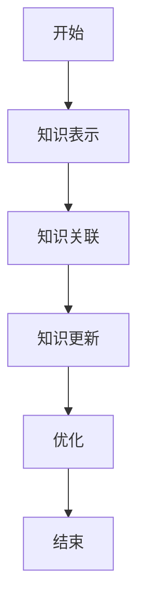
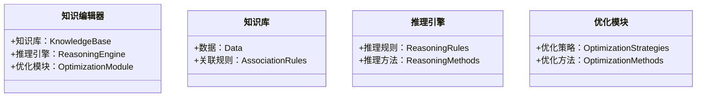
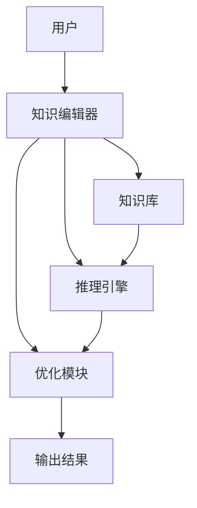

                 


# AI Agent 的知识编辑：动态调整 LLM 的知识库

> 关键词：AI Agent，知识编辑，大语言模型，LLM，动态知识库，知识管理

> 摘要：本文系统地探讨了AI Agent如何编辑和管理大语言模型（LLM）的知识库，重点分析了知识编辑的核心原理、算法实现、系统架构及实际应用案例。通过结合理论与实践，本文为AI Agent在动态调整知识库中的应用提供了全面的解决方案和实施策略。

---

# 第一部分: AI Agent 的知识编辑基础

## 第1章: AI Agent 与知识编辑概述

### 1.1 AI Agent 的核心概念

#### 1.1.1 什么是AI Agent
- AI Agent的定义与特征
- AI Agent 的类型与应用场景
- AI Agent 的核心能力：感知、决策、执行

#### 1.1.2 AI Agent 的基本特征
| 特征 | 描述 |
|------|------|
| 自主性 | 能够独立决策和行动 |
| 反应性 | 能够实时响应环境变化 |
| 持续性 | 能够长期运行并不断优化 |

#### 1.1.3 AI Agent 的类型与应用场景
- 知识型AI Agent：基于知识库进行推理和决策
- 行为型AI Agent：基于行为规则执行任务
- 混合型AI Agent：结合知识与行为的综合型AI Agent

### 1.2 大语言模型（LLM）的基本原理

#### 1.2.1 LLM 的定义与工作原理
- LLM 的定义：基于深度学习的大型语言模型
- LLM 的工作原理：从输入数据中学习语言模式，生成与训练数据相似的输出
- LLM 的主要技术：Transformer 架构、自注意力机制

#### 1.2.2 LLM 的训练与推理过程
- LLM 的训练：基于大量文本数据进行监督学习
- LLM 的推理：基于概率生成模型进行文本生成

#### 1.2.3 LLM 的优缺点分析
| 优缺点 | 描述 |
|------|------|
| 优点 | 高效的文本生成能力，强大的模式识别能力 |
| 缺点 | 知识有限，推理能力不足，容易受到训练数据偏差的影响 |

### 1.3 AI Agent 与 LLM 的结合

#### 1.3.1 AI Agent 调控 LLM 的必要性
- LLM 的局限性：知识库固定，无法动态更新
- AI Agent 的作用：动态调整 LLM 的知识库，提升模型性能

#### 1.3.2 LLM 知识库的动态调整需求
- 知识库动态更新的重要性：适应环境变化，提升模型准确性
- 知识库动态调整的实现方式：增量学习、在线更新、领域自适应

#### 1.3.3 AI Agent 在知识编辑中的角色
- AI Agent 的角色：知识编辑器、知识协调器、知识优化器
- AI Agent 的任务：动态调整 LLM 的知识库，优化模型性能

---

## 第2章: 知识编辑的核心概念与原理

### 2.1 知识编辑的基本概念

#### 2.1.1 知识编辑的定义
- 知识编辑：对知识库进行创建、更新和优化的过程
- 知识编辑的目标：提升知识库的准确性和适用性

#### 2.1.2 知识编辑的目标与范围
- 知识编辑的目标：提高 LLM 的性能和准确性
- 知识编辑的范围：知识库的构建、更新和优化

#### 2.1.3 知识编辑的实现方式
- 知识编辑的实现方式：基于规则的编辑、基于模型的编辑、人机协作编辑

### 2.2 动态知识库的构建与管理

#### 2.2.1 知识库的构建过程
- 知识库的构建步骤：数据收集、数据清洗、知识抽取、知识表示
- 知识库的表示方式：图结构、向量空间、规则库

#### 2.2.2 知识库的动态更新机制
- 知识库动态更新的流程：监测变化、提取增量、更新知识库
- 知识库动态更新的方法：增量学习、在线更新、领域自适应

#### 2.2.3 知识库的版本控制
- 知识库版本控制的重要性：确保知识库的准确性和一致性
- 知识库版本控制的实现：版本标记、变更记录、回滚机制

### 2.3 AI Agent 的知识编辑能力

#### 2.3.1 AI Agent 的知识理解能力
- 知识理解的核心：语义理解、上下文理解
- 知识理解的实现：基于LLM的理解能力、基于规则的理解能力

#### 2.3.2 AI Agent 的知识推理能力
- 知识推理的核心：逻辑推理、关联推理
- 知识推理的实现：基于规则的推理、基于模型的推理

#### 2.3.3 AI Agent 的知识优化能力
- 知识优化的核心：知识的精简、知识的增强
- 知识优化的实现：基于模型的优化、基于规则的优化

---

## 第3章: 知识编辑的算法原理与数学模型

### 3.1 知识编辑的算法原理

#### 3.1.1 知识表示与编码
- 知识表示的向量空间模型
- 知识编码的实现方式：词嵌入、句嵌入、段落嵌入

#### 3.1.2 知识关联与推理
- 知识关联的实现：基于图的关联、基于概率的关联
- 知识推理的实现：基于规则的推理、基于模型的推理

#### 3.1.3 知识更新与优化
- 知识更新的实现：增量学习、在线更新、领域自适应
- 知识优化的实现：基于模型的优化、基于规则的优化

### 3.2 数学模型与公式

#### 3.2.1 知识表示的向量空间模型
$$\text{向量表示} = [w_1, w_2, ..., w_n]$$

#### 3.2.2 知识关联的概率图模型
$$P(A|B) = \frac{P(B|A)P(A)}{P(B)}$$

#### 3.2.3 知识更新的优化算法
$$\text{损失函数} = \sum_{i=1}^{n} (y_i - \hat{y_i})^2$$

### 3.3 算法流程图（Mermaid）



---

## 第4章: 系统架构设计与实现

### 4.1 系统功能设计

#### 4.1.1 知识编辑器的功能模块
- 知识库管理模块：知识库的构建、更新和优化
- 知识推理模块：基于知识库的推理与决策
- 知识优化模块：知识库的精简与增强

#### 4.1.2 系统交互流程
1. 用户输入需求
2. 系统解析需求
3. 系统调用知识编辑器
4. 知识编辑器更新知识库
5. 系统返回结果

### 4.2 系统架构设计

#### 4.2.1 领域模型的类图（Mermaid）


#### 4.2.2 系统架构图（Mermaid）


### 4.3 系统接口设计

#### 4.3.1 知识编辑器的接口
- 输入接口：接收知识编辑请求
- 输出接口：返回知识编辑结果

#### 4.3.2 知识库的接口
- 数据接口：提供知识库数据的访问和修改
- 关联接口：提供知识库关联规则的访问和修改

---

## 第5章: 项目实战——医疗知识库的动态调整

### 5.1 项目背景

#### 5.1.1 项目目标
- 提升医疗知识库的准确性和适用性
- 实现医疗知识库的动态更新

#### 5.1.2 项目环境
- 知识库：医疗领域知识库
- 工具：AI Agent、LLM

### 5.2 核心代码实现

#### 5.2.1 知识库的构建
```python
# 知识库的构建代码
class KnowledgeBase:
    def __init__(self):
        self.data = {}
        self.association_rules = {}

    def add Knowledge(self, key, value):
        self.data[key] = value

    def add AssociationRule(self, rule):
        self.association_rules[rule['premise']] = rule['hypothesis']
```

#### 5.2.2 知识库的动态更新
```python
# 知识库的动态更新代码
def update_KnowledgeBase(old_KB, new_KB):
    for key in new_KB.data:
        if key not in old_KB.data:
            old_KB.data[key] = new_KB.data[key]
    for premise in new_KB.association_rules:
        if premise not in old_KB.association_rules:
            old_KB.association_rules[premise] = new_KB.association_rules[premise]
```

### 5.3 知识库的分析与优化

#### 5.3.1 知识库的分析
- 知识库的规模：数据量、关联规则的数量
- 知识库的准确率：与实际情况的符合程度

#### 5.3.2 知识库的优化
- 知识库的精简：去除冗余数据
- 知识库的增强：补充缺失知识

---

## 第6章: 知识编辑的优化与扩展

### 6.1 知识编辑的优化策略

#### 6.1.1 知识表示的优化
- 使用更高效的向量表示方法
- 使用更智能的关联规则

#### 6.1.2 知识推理的优化
- 使用更准确的推理算法
- 使用更强大的推理模型

### 6.2 知识编辑的扩展应用

#### 6.2.1 知识编辑在其他领域的应用
- 教育领域：个性化学习
- 商业领域：智能客服
- 医疗领域：智能诊断

#### 6.2.2 知识编辑的未来发展趋势
- 更智能的知识编辑工具
- 更高效的动态知识库管理方法

---

## 第7章: 总结与展望

### 7.1 核心观点回顾
- AI Agent 在知识编辑中的重要作用
- 知识编辑的核心原理与实现方法
- 动态知识库的构建与管理

### 7.2 未来展望
- 知识编辑的智能化发展
- 知识编辑的领域扩展
- 知识编辑的技术创新

### 7.3 最佳实践 tips
- 知识编辑的关键成功要素
- 知识编辑的常见问题与解决方案
- 知识编辑的未来发展建议

---

# 结语

AI Agent 的知识编辑是一项复杂但极具挑战性的任务，需要结合理论与实践，不断优化和创新。通过本文的探讨，我们希望能够为读者提供一个全面的知识编辑解决方案，帮助他们更好地理解和应用 AI Agent 的知识编辑技术。

---

