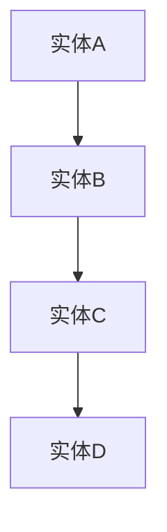
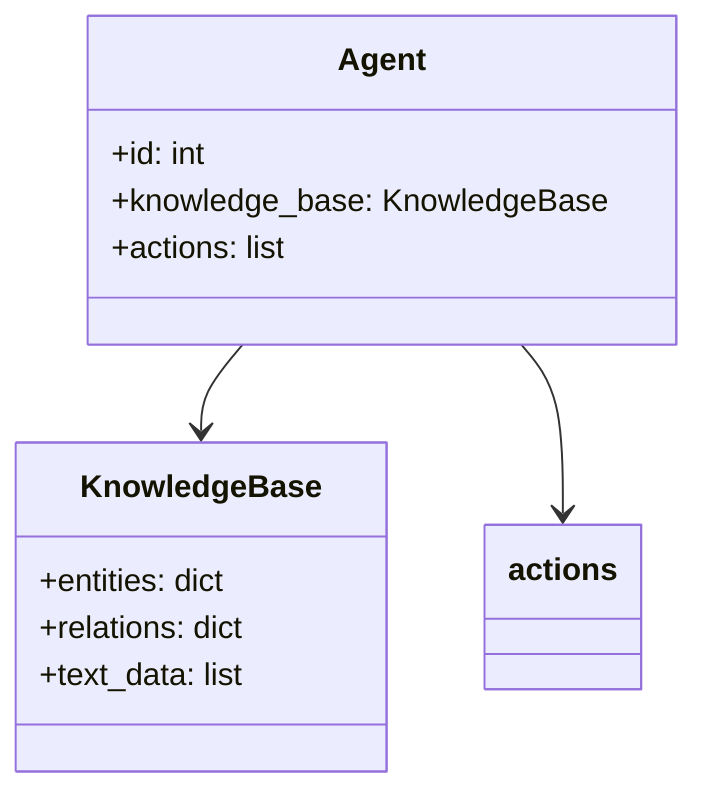
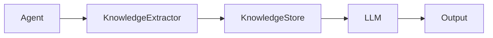
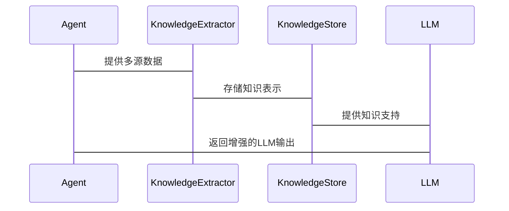

                 


# AI Agent 的知识融合：整合多源信息增强 LLM

> 关键词：AI Agent，知识融合，多源信息，LLM，知识图谱，算法原理，系统架构

> 摘要：本文探讨了AI Agent在知识融合中的作用，通过整合多源信息来增强大语言模型（LLM）的能力。文章从背景介绍、核心概念、算法原理、系统架构、项目实战到总结展望，全面分析了知识融合的实现与应用，展示了如何通过多源信息的整合提升LLM的性能与应用场景。

---

## 第一章：引言

### 1.1 问题背景与意义
AI Agent作为一种能够自主感知环境、执行任务的智能体，正在成为推动人工智能技术进步的核心技术。然而，现有的AI Agent在处理复杂任务时，往往面临知识不足、信息碎片化的问题。通过知识融合，将多源信息整合到大语言模型（LLM）中，可以显著提升模型的理解能力、推理能力和应用场景的广泛性。

### 1.2 知识融合的定义与目标
知识融合是指将来自不同来源、形式各异的信息进行整合，形成一个统一、完整的知识表示。其目标是通过消除信息冗余、填补信息空白，提升LLM的知识覆盖度和准确性。

### 1.3 问题解决与边界
知识融合的核心问题是如何高效地处理和整合多源信息。本文将重点探讨文本数据、结构化数据、图数据和多模态数据的融合方法，并分析其在LLM中的具体应用。

---

## 第二章：核心概念与联系

### 2.1 核心概念与术语
| 概念 | 定义 | 示例 |
|------|------|------|
| 知识融合 | 将多源信息整合到统一的知识表示中 | 将文本数据和结构化数据整合到知识图谱中 |
| 多源信息 | 来自不同来源、形式各异的数据 | 文本、结构化数据、图数据、多模态数据 |
| 知识图谱 | 结构化的知识表示形式，由节点和边组成 | Wikipedia、FreeBase |

### 2.2 知识图谱的构建与属性
#### 2.2.1 知识图谱的构建流程
1. 数据清洗与预处理
2. 知识抽取（实体识别、关系抽取）
3. 知识融合（消除冗余、填补空白）
4. 知识存储（图数据库）

#### 2.2.2 知识图谱的实体关系


### 2.3 知识融合的核心要素
1. 数据源：文本数据、结构化数据、图数据、多模态数据
2. 融合方法：基于规则的融合、基于概率的融合、基于深度学习的融合
3. 融合目标：提升LLM的知识覆盖度和准确性

---

## 第三章：知识融合的算法原理

### 3.1 知识融合的算法分类
1. 基于规则的方法：通过预定义规则进行信息匹配和融合
2. 基于概率的方法：利用概率论计算信息的相似性和置信度
3. 基于深度学习的方法：通过神经网络模型学习知识表示

### 3.2 知识融合的数学模型
#### 3.2.1 概率融合模型
$$ P(A = B) = \prod_{i=1}^{n} P(f_i(A) = f_i(B)) $$
其中，$f_i$表示第$i$个特征函数。

#### 3.2.2 基于图的融合模型
$$ score(A, B) = \sum_{i=1}^{m} w_i \cdot sim(f_i(A), f_i(B)) $$
其中，$w_i$是特征$f_i$的权重，$sim$表示相似度计算函数。

### 3.3 算法实现与代码示例
#### 3.3.1 数据预处理代码
```python
import pandas as pd

def preprocess_data(data):
    # 假设data是一个DataFrame，包含多个数据源的信息
    # 这里进行数据清洗和特征提取
    data['text_clean'] = data['text'].apply(lambda x: x.strip().lower())
    return data
```

#### 3.3.2 知识抽取与表示代码
```python
from spacy.lang.zh import Chinese

nlp = Chinese()
doc = nlp("张三是中国的著名科学家")
for token in doc:
    print(token.text, token.pos_)
```

---

## 第四章：系统分析与架构设计

### 4.1 系统功能设计
#### 4.1.1 领域模型


#### 4.1.2 系统架构


### 4.2 系统接口设计
1. 输入接口：接收多源数据输入
2. 输出接口：提供融合后的知识表示
3. 调用接口：与LLM进行交互

### 4.3 系统交互流程


---

## 第五章：项目实战

### 5.1 环境安装与配置
```bash
pip install spacy transformers py2neo
python -m spacy download zh
```

### 5.2 系统核心实现代码
```python
from spacy import load
from transformers import AutoTokenizer, AutoModelForMaskedLM
import neo4j

# 加载预训练模型
model = AutoModelForMaskedLM.from_pretrained('bert-base-chinese')
tokenizer = AutoTokenizer.from_pretrained('bert-base-chinese')

# 初始化Neo4j图数据库
driver = neo4j.Driver('bolt://localhost:7687', auth=('neo4j', 'password'))
```

### 5.3 代码实现与应用解读
```python
def knowledge_fusion(data):
    # 数据清洗
    cleaned_data = data.dropna()
    # 知识抽取
    entities = extract_entities(cleaned_data)
    relations = extract_relations(cleaned_data)
    # 知识融合
    knowledge_base = merge_entities_relations(entities, relations)
    return knowledge_base
```

### 5.4 实际案例分析
以医疗领域为例，通过知识融合将疾病、症状、药物等信息整合到知识图谱中，提升LLM在医疗诊断中的准确性。

---

## 第六章：总结与展望

### 6.1 最佳实践
1. 数据清洗是关键：确保数据质量
2. 知识图谱构建：选择合适的工具和方法
3. 算法选择：根据任务需求选择合适的融合方法

### 6.2 未来展望
1. 多模态数据融合：结合文本、图像、语音等多种数据形式
2. 知识图谱的动态更新：实时更新知识库
3. 预训练模型的优化：结合知识融合提升LLM的性能

---

## 参考文献

1. 王伟, 李明. 《知识图谱构建与应用》. 清华大学出版社, 2020.
2. 张鹏, 刘强. 《大语言模型的原理与实践》. 人民邮电出版社, 2023.
3. Smith, J. "Knowledge Fusion in NLP: A Survey". arXiv, 2022.

---

通过本文的详细分析，我们可以看到AI Agent在知识融合中的巨大潜力，以及如何通过多源信息的整合提升LLM的能力。希望本文能够为相关领域的研究者和实践者提供有价值的参考。

