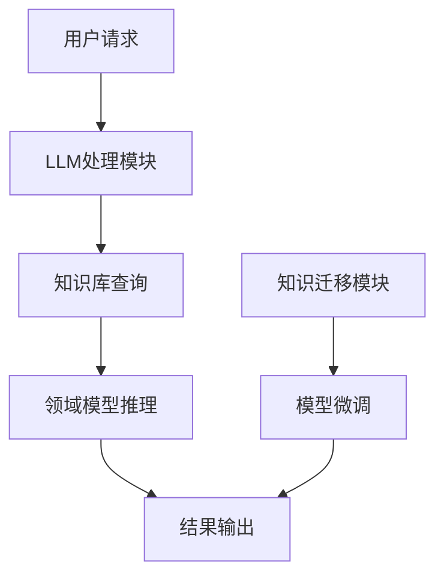
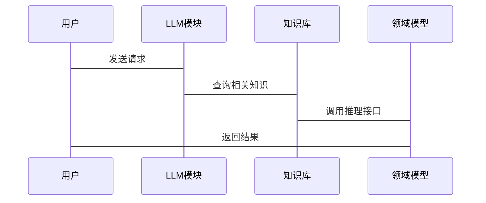

                 


# AI Agent 的知识迁移：跨领域应用 LLM 的能力

> 关键词：AI Agent, 知识迁移, 跨领域应用, LLM, 大语言模型, 人工智能

> 摘要：本文探讨AI Agent如何通过知识迁移技术在不同领域中应用大语言模型的能力。从基本概念、算法原理到系统架构、项目实战，系统地分析AI Agent在跨领域应用中的潜力与挑战，结合实际案例提供深入的解读和解决方案。

---

# 目录

## 第1章: AI Agent 的知识迁移背景

### 1.1 问题背景与问题描述
#### 1.1.1 AI Agent 的定义与核心能力
- AI Agent的定义
- 知识表示与推理的基本原理
- 跨领域应用的必要性

#### 1.1.2 知识迁移的定义与重要性
- 知识迁移的概念
- 跨领域应用的核心挑战
- LLM在知识迁移中的独特优势

#### 1.1.3 跨领域应用的边界与外延
- 知识迁移的边界条件
- LLM在跨领域的应用范围
- 技术实现的限制与潜在突破

## 第2章: AI Agent 与知识迁移的核心概念

### 2.1 AI Agent 的知识表示与推理
#### 2.1.1 知识表示的多种形式
- 符号表示
- 知识图谱
- 向量表示

#### 2.1.2 知识推理的逻辑模型
- 逻辑推理的基本原理
- 概率推理的应用
- 类比推理在知识迁移中的作用

#### 2.1.3 知识图谱的构建与应用
- 知识图谱的构建方法
- 知识图谱在AI Agent中的应用
- 跨领域知识图谱的挑战与解决方案

### 2.2 知识迁移的原理与方法
#### 2.2.1 知识迁移的基本原理
- 基于相似性的知识迁移
- 基于特征的知识迁移
- 基于模型的知识迁移

#### 2.2.2 跨领域知识迁移的挑战
- 数据稀疏性问题
- 领域间语义差异
- 模型的适应性问题

#### 2.2.3 知识迁移的实现方法
- 基于预训练模型的迁移学习
- 基于领域适应的知识迁移
- 多任务学习与知识迁移的结合

### 2.3 LLM 在知识迁移中的作用
#### 2.3.1 LLM 的核心能力
- 大语言模型的特征
- 知识表示与生成能力
- 跨领域适应性

#### 2.3.2 LLM 在知识迁移中的优势
- 预训练知识的广泛性
- 模型的可微调性
- 自然语言处理能力

#### 2.3.3 LLM 跨领域应用的潜力
- 新领域的快速适应
- 多语言与多领域支持
- 知识的动态更新与扩展

## 第3章: 知识迁移的算法原理

### 3.1 知识迁移的算法框架
#### 3.1.1 知识迁移的基本算法
- 基于特征的迁移学习算法
- 基于模型的迁移学习算法
- 基于度量的迁移学习算法

#### 3.1.2 跨领域知识迁移的算法改进
- 领域适应算法
- 域适配网络
- 对抗训练在知识迁移中的应用

#### 3.1.3 基于LLM 的知识迁移算法
- 预训练-微调范式
- 参数共享机制
- 知识蒸馏技术

### 3.2 算法实现的详细步骤
#### 3.2.1 数据预处理与特征提取
- 数据清洗与标注
- 特征选择与表示
- 数据增强技术

#### 3.2.2 知识表示与迁移模型构建
- 知识表示模型的选择
- 迁移模型的设计与实现
- 参数初始化与优化策略

#### 3.2.3 算法训练与优化
- 损失函数设计
- 优化算法选择
- 模型评估与调优

### 3.3 算法的数学模型与公式
#### 3.3.1 预训练-微调范式的数学模型
- 预训练目标函数：$$L_{pre}(θ) = -\sum_{i=1}^{N} \log p_\theta(y_i|x_i)$$
- 微调阶段的目标函数：$$L_{fine}(θ) = L_{pre}(θ) + \lambda L_{reg}(θ)$$

#### 3.3.2 领域适应算法的数学模型
- 领域适应损失：$$L_{da}(θ) = \sum_{i=1}^{N} \sum_{j=1}^{M} \log p_\theta(y_i|x_j)$$
- 对抗训练的损失函数：$$L_{adv}(θ, D) = L_{da}(θ) + \lambda L_{adv}(D)$$

#### 3.3.3 知识蒸馏技术的数学模型
- 知识蒸馏的目标函数：$$L_{distill}(S, T) = \sum_{i=1}^{N} KL(p_i || q_i)$$
- 蒸馏过程中的教师模型与学生模型的关系：$$p_i = f_S(x_i), q_i = f_T(x_i)$$

## 第4章: 系统分析与架构设计

### 4.1 问题场景介绍
- 跨领域应用的典型场景
- 知识迁移系统的需求分析
- LLM 在实际系统中的角色

### 4.2 系统功能设计
#### 4.2.1 领域模型设计
- 领域模型的构建与实现
- 领域模型的可扩展性设计
- 领域模型的动态更新机制

#### 4.2.2 系统架构设计
- 分层架构设计
- 模块化设计原则
- 高可用性与可扩展性设计

### 4.3 系统架构的 mermaid 图


### 4.4 系统接口设计
- API 接口定义
- 接口的安全性与可靠性
- 接口的可扩展性设计

### 4.5 系统交互的 mermaid 序列图


## 第5章: 项目实战

### 5.1 环境安装与配置
- 开发环境的选择
- 依赖库的安装：如Python、TensorFlow、PyTorch
- 环境配置的注意事项

### 5.2 核心代码实现
#### 5.2.1 数据预处理代码
```python
def preprocess_data(data):
    # 数据清洗与特征提取
    processed_data = []
    for item in data:
        processed_item = {
            'input': item['text'],
            'label': item['category']
        }
        processed_data.append(processed_item)
    return processed_data
```

#### 5.2.2 知识迁移模型实现
```python
class KnowledgeTransferModel:
    def __init__(self, model_name='bert-base'):
        self.model = AutoModelForMaskedLM.from_pretrained(model_name)
        self.tokenizer = AutoTokenizer.from_pretrained(model_name)
    
    def fine_tune(self, train_dataset, val_dataset):
        # 微调训练
        args = TrainingArguments(...)
        trainer = Trainer(self.model, args, train_dataset=train_dataset, val_dataset=val_dataset)
        trainer.train()
    
    def transfer(self, source_domain, target_domain):
        # 知识迁移实现
        pass
```

### 5.3 代码应用解读与分析
- 代码的模块划分
- 核心算法的实现细节
- 系统的可扩展性分析

### 5.4 实际案例分析与详细解读
- 案例背景与需求分析
- 系统设计与实现
- 实验结果与分析
- 总结与经验分享

## 第6章: 最佳实践与小结

### 6.1 最佳实践 tips
- 知识迁移的策略选择
- 模型选择与调优技巧
- 系统部署与维护建议

### 6.2 小结
- AI Agent 在知识迁移中的优势
- 跨领域应用的未来发展趋势
- 技术实现中的关键挑战与解决方案

### 6.3 注意事项
- 数据隐私与安全问题
- 模型的可解释性
- 系统的可扩展性与维护成本

### 6.4 拓展阅读
- 推荐书籍与论文
- 相关技术博客与资源
- 未来技术跟踪与学习方向

## 第7章: 未来展望

### 7.1 知识迁移技术的未来趋势
- 多模态知识迁移的发展
- 自适应学习的进一步突破
- 人机协作的智能化提升

### 7.2 AI Agent 的发展与挑战
- 更强的自主学习能力
- 跨领域应用的深化
- 技术与伦理的平衡

### 7.3 跨领域应用的潜力与机会
- 新领域的快速开拓
- 行业解决方案的创新
- 知识经济的新模式

---

# 结语

通过系统的分析与实践，本文深入探讨了AI Agent 在知识迁移中的能力与应用，结合理论分析与实际案例，为读者提供了全面的视角和实践指南。未来，随着技术的不断进步，AI Agent 在跨领域应用中的潜力将进一步释放，为人工智能的发展注入新的活力。

