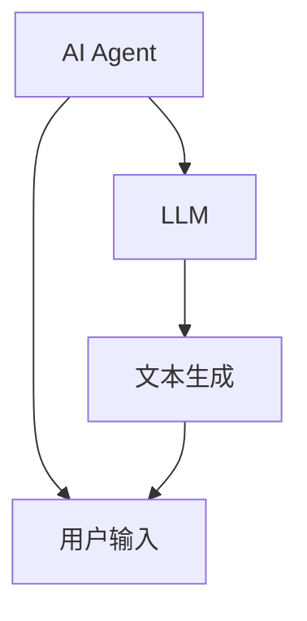
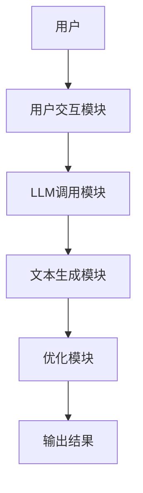

                 

# AI Agent 的语言生成：提升 LLM 的文本创作能力

> 关键词：AI Agent，大语言模型，文本生成，语言模型，自然语言处理，LLM，文本创作能力

> 摘要：本文深入探讨了AI Agent在语言生成中的应用，分析了如何通过优化大语言模型（LLM）来提升文本创作能力。文章从AI Agent和LLM的基本概念出发，详细阐述了它们的协同工作原理，通过算法解析和系统架构设计，展示了如何构建高效的文本生成系统。最后，通过实际案例分析和最佳实践，为读者提供了实用的指导和启示。

---

# 目录大纲

## 第1章: AI Agent与大语言模型（LLM）概述

### 1.1 AI Agent的基本概念
- 1.1.1 AI Agent的定义与特点
  - AI Agent的定义
  - AI Agent的主要特点：自主性、反应性、目标导向性、社会能力
- 1.1.2 LLM在AI Agent中的作用
  - LLM作为AI Agent的核心智能模块
  - LLM如何赋能AI Agent的文本生成能力
- 1.1.3 AI Agent与传统语言模型的对比
  - 传统语言模型的局限性
  - AI Agent的优势：智能化、个性化、实时性

### 1.2 大语言模型（LLM）的基本原理
- 1.2.1 LLM的核心概念
  - 什么是大语言模型
  - LLM的主要特点：大规模、多语言、多任务
- 1.2.2 LLM的训练过程
  - 数据预处理
  - 模型训练
  - 超参数调整
- 1.2.3 LLM的应用场景
  - 文本生成
  - 机器翻译
  - 联想与问答

### 1.3 AI Agent的文本生成能力
- 1.3.1 文本生成的基本原理
  - 输入与输出的关系
  - 解码策略
  - 采样方法
- 1.3.2 AI Agent的文本生成能力提升方法
  - 参数微调
  - 增量学习
  - 模型集成
- 1.3.3 LLM在文本生成中的优势
  - 高效性
  - 精准性
  - 创造性

## 第2章: AI Agent与LLM的核心概念

### 2.1 AI Agent与LLM的关系
- 2.1.1 AI Agent作为LLM的用户界面
  - AI Agent如何接收和处理用户输入
  - AI Agent如何优化LLM的输出
- 2.1.2 LLM作为AI Agent的智能核心
  - LLM如何支撑AI Agent的决策
  - LLM如何提升AI Agent的交互能力
- 2.1.3 两者结合的协同效应
  - 提升用户体验
  - 实现更复杂的任务

### 2.2 AI Agent的文本生成能力分析
- 2.2.1 文本生成的输入输出模型
  - 输入分析
  - 输出生成
  - 反馈机制
- 2.2.2 LLM的文本生成算法
  - 基于Transformer的文本生成
  - 基于RNN的文本生成
  - 混合模型的优势
- 2.2.3 AI Agent的文本生成优化策略
  - 优化输入
  - 优化输出
  - 优化过程

### 2.3 AI Agent与LLM的实体关系图

## 第3章: 大语言模型（LLM）的算法原理

### 3.1 LLM的训练过程
- 3.1.1 数据预处理
  - 数据清洗
  - 数据标注
  - 数据转换
- 3.1.2 模型训练
  - 网络结构的选择
  - 损失函数的定义
  - 优化算法的应用
- 3.1.3 超参数调整
  - 学习率的设置
  - 批大小的确定
  - 正则化的选择

### 3.2 LLM的生成机制
- 3.2.1 解码策略
  - 最大似然解码
  - 采样解码
  - 多样性控制
- 3.2.2 概率分布
  - 分布的计算方法
  - 分布的优化技巧
  - 分布的实际应用
- 3.2.3 采样方法
  - 随机采样
  - 重要性采样
  - 颤动采样

### 3.3 LLM的数学模型
- 3.3.1 Transformer模型结构
  - 编码器和解码器
  - 自注意力机制
  - 前馈神经网络
- 3.3.2 注意力机制
  - 注意力的计算公式
  - 注意力的应用场景
  - 注意力的优化方法
- 3.3.3 损失函数
  - 交叉熵损失函数
  - 解码器端损失函数
  - 损失函数的优化

## 第4章: AI Agent的系统架构与设计

### 4.1 系统架构概述
- 4.1.1 分层架构
  - 表示层
  - 业务逻辑层
  - 数据访问层
- 4.1.2 模块化设计
  - 用户交互模块
  - 模型调用模块
  - 文本生成模块
- 4.1.3 扩展性考虑
  - 模块的可扩展性
  - 系统的可维护性
  - 性能的可优化性

### 4.2 系统功能设计
- 4.2.1 用户交互模块
  - 用户输入的接收
  - 输入的预处理
  - 输入的反馈
- 4.2.2 LLM调用模块
  - 模型的选择
  - 模型的调用
  - 模型的监控
- 4.2.3 文本生成优化模块
  - 生成结果的优化
  - 生成过程的优化
  - 生成策略的优化

### 4.3 系统架构图

## 第5章: 项目实战

### 5.1 环境安装
- 安装Python
- 安装深度学习框架（如TensorFlow、PyTorch）
- 安装LLM模型库（如Hugging Face的Transformers库）
- 安装其他依赖库

### 5.2 核心代码实现
- 用户交互模块的实现
- LLM调用模块的实现
- 文本生成优化模块的实现

### 5.3 案例分析
- 案例背景
- 案例分析
- 案例实现
- 案例总结

## 第6章: 最佳实践

### 6.1 小结
- 本章的总结
- 关键点回顾
- 学习要点

### 6.2 注意事项
- 模型选择的注意事项
- 数据处理的注意事项
- 系统设计的注意事项

### 6.3 拓展阅读
- 相关领域的书籍推荐
- 相关论文推荐
- 在线资源推荐

## 附录

### 附录A: 参考资料
- 相关书籍
- 相关论文
- 相关网站

### 附录B: 工具与库
- 深度学习框架
- NLP库
- 其他工具

---

这个目录大纲覆盖了AI Agent和LLM的各个方面，从基础概念到算法原理，再到系统设计和项目实战，内容详实且结构清晰。每个章节都包含了足够的细节，确保读者能够逐步深入理解AI Agent在提升LLM文本生成能力中的作用和实现方法。

