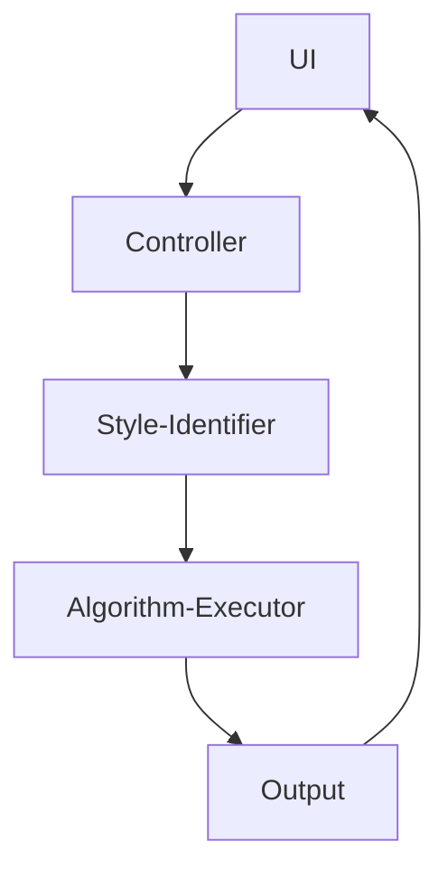
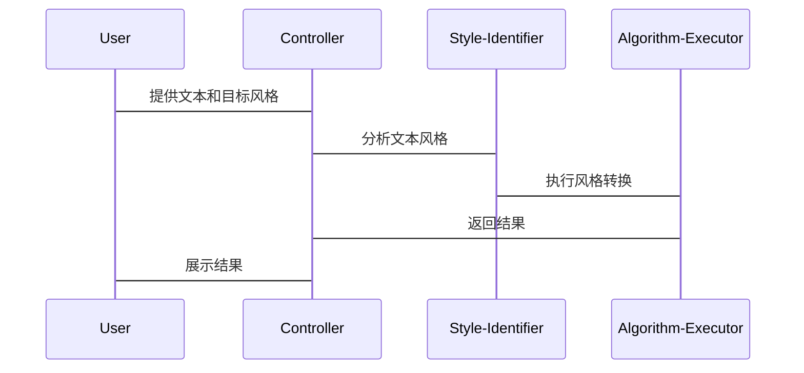

                 


# AI Agent 的语言风格转换：调整 LLM 的表达方式

> 关键词：AI Agent，语言风格转换，LLM，自然语言处理，深度学习

> 摘要：本文探讨了AI Agent在语言风格转换中的应用，特别是如何调整大型语言模型（LLM）的表达方式。文章从背景介绍、核心概念、算法原理、系统架构、项目实战到最佳实践等方面进行了详细阐述，帮助读者理解如何通过技术手段实现语言风格的灵活调整。

---

## 第一部分：背景介绍

### 第1章：AI Agent 的基本概念

#### 1.1 AI Agent 的定义与特点
AI Agent（人工智能代理）是指能够感知环境、自主决策并执行任务的智能实体。它通常具备以下特点：
- **自主性**：能够在没有外部干预的情况下执行任务。
- **反应性**：能够根据环境变化调整行为。
- **目标导向**：具有明确的目标，能够为实现目标优化决策。

**AI Agent 的应用场景**包括智能助手、推荐系统、自动驾驶等，广泛应用于多个领域。

#### 1.2 语言风格转换的背景
语言风格转换是指将文本从一种风格（如正式、技术性）转换为另一种风格（如口语化、通俗易懂）。随着自然语言处理技术的发展，语言风格转换在内容生成、教育、客户服务等领域具有重要应用。

#### 1.3 调整 LLM 表达方式的必要性
LLM（大型语言模型）生成的内容虽然准确，但风格可能过于正式或生硬。通过调整LLM的表达方式，可以使生成的内容更贴近目标受众的需求，提升用户体验。例如，在客户服务中，调整LLM的表达方式可以让回复更友好、更易于理解。

---

## 第二部分：核心概念与联系

### 第2章：AI Agent、语言风格转换与 LLM 的关系

#### 2.1 核心概念的定义与属性
- **AI Agent**：通过感知和决策实现目标的智能实体。
- **语言风格转换**：调整文本风格的技术。
- **LLM**：基于深度学习的大型语言模型，擅长生成和理解文本。

#### 2.2 AI Agent、语言风格转换与 LLM 的关系
通过表格对比三者的属性和特点：

| 概念       | 定义                                                                 | 特点                                                                 |
|------------|----------------------------------------------------------------------|----------------------------------------------------------------------|
| AI Agent   | 智能实体，自主决策并执行任务。                                      | 自主性、反应性、目标导向。                                              |
| 语言风格转换 | 将文本从一种风格转换为另一种风格的技术。                          | 灵活性、适应性、可定制化。                                              |
| LLM        | 基于深度学习的大型语言模型，擅长生成和理解文本。                  | 高准确性、多样性、可扩展性。                                              |

#### 2.3 概念结构与ER图
以下是AI Agent、语言风格转换和LLM之间的关系的Mermaid ER图：

```mermaid
erDiagram
    class AI-Agent {
        id
        name
        goal
    }
    class Language-Style-Conversion {
        id
        style-type
        conversion-rule
    }
    class LLM {
        id
        model-size
        training-data
    }
    AI-Agent --> Language-Style-Conversion : uses
    Language-Style-Conversion --> LLM : leverages
    AI-Agent --> LLM : integrates
```

---

## 第三部分：算法原理讲解

### 第3章：语言风格转换的算法实现

#### 3.1 基于规则的方法
基于规则的风格转换通过预定义的规则来调整文本。例如，将专业术语替换为通俗用语。

**步骤：**
1. 分析文本，识别需要替换的部分。
2. 根据规则进行替换。

**优点：** 易于实现，适合简单的风格转换。
**缺点：** 需要大量规则，难以处理复杂场景。

#### 3.2 统计方法
统计方法通过分析文本数据，学习风格特征，生成目标风格的文本。

**步骤：**
1. 收集不同风格的文本数据。
2. 使用统计模型学习风格特征。
3. 基于特征生成目标风格的文本。

**示例代码：**
```python
from sklearn.feature_extraction.text import TfidfVectorizer
from sklearn.decomposition import NMF

# 假设text_data包含不同风格的文本
vectorizer = TfidfVectorizer()
tfidf = vectorizer.fit_transform(text_data)

# 使用NMF提取主题
nmf = NMF(n_components=5)
nmf.fit(tfidf)
```

#### 3.3 基于深度学习的方法
深度学习方法（如Transformer模型）通过端到端的训练实现风格转换。

**步骤：**
1. 构建神经网络模型。
2. 使用双语数据训练模型。
3. 应用模型进行风格转换。

**模型结构：**
$$\text{编码器-解码器结构}$$
$$\text{编码器将输入文本转换为向量，解码器生成目标风格的文本}$$

---

## 第四部分：系统分析与架构设计方案

### 第4章：AI Agent 语言风格转换系统的架构设计

#### 4.1 问题场景介绍
- **输入：** 用户输入需要转换风格的文本。
- **需求：** 根据用户指定的风格生成输出。

#### 4.2 系统功能设计
- **语言风格识别：** 分析输入文本的风格特征。
- **风格转换：** 应用算法生成目标风格的文本。
- **输出反馈：** 提供生成文本的反馈机制。

#### 4.3 系统架构设计
以下是系统的架构图：



#### 4.4 接口设计
- **输入接口：** 用户输入文本和目标风格。
- **输出接口：** 返回生成的文本。

#### 4.5 交互设计
以下是交互流程的Mermaid序列图：



---

## 第五部分：项目实战

### 第5章：AI Agent 语言风格转换系统实现

#### 5.1 环境安装
- **Python 3.8+**
- **库：transformers, numpy, scikit-learn**

#### 5.2 核心代码实现
以下是基于深度学习的风格转换代码示例：

```python
from transformers import pipeline

# 初始化风格转换模型
converter = pipeline("text2text-generation", model="facebook/cornell-clic")

# 输入文本
input_text = "The experiment was conducted in a controlled environment."

# 应用风格转换
output = converter(input_text, max_length=50, num_beams=5)
print(output[0]['text'])
```

#### 5.3 案例分析
**案例：** 将技术性文本转换为口语化文本。

**输入：**
"The algorithm processes the input data and generates the output."

**输出：**
"The system takes the input and creates the output."

---

## 第六部分：最佳实践与总结

### 第6章：最佳实践与注意事项

#### 6.1 实践建议
- **数据多样性：** 确保训练数据多样化，覆盖不同风格和领域。
- **模型选择：** 根据需求选择合适的模型（规则、统计或深度学习）。
- **反馈机制：** 实现用户反馈机制，优化生成效果。

#### 6.2 小结
语言风格转换是提升AI Agent用户体验的重要技术。通过选择合适的算法和优化系统架构，可以实现高效且自然的风格转换。

#### 6.3 注意事项
- **数据隐私：** 注意处理敏感数据。
- **模型性能：** 确保模型在资源受限环境下的性能。

#### 6.4 拓展阅读
- [书籍推荐：《Deep Learning for NLP》](#)
- [论文推荐：Style-Transfer in Text](#)

---

以上是《AI Agent 的语言风格转换：调整 LLM 的表达方式》的完整内容，涵盖了从背景介绍到项目实战的各个方面，帮助读者全面理解语言风格转换的技术和应用。

