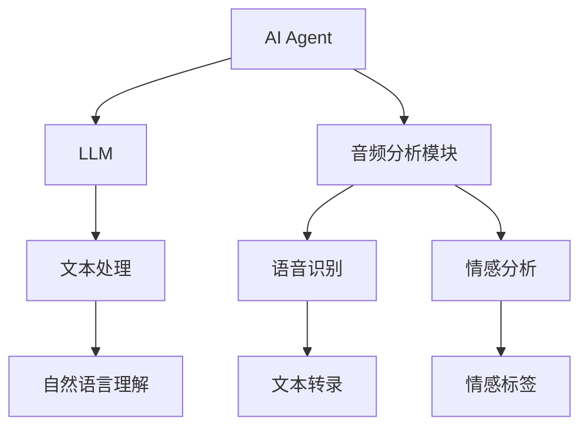
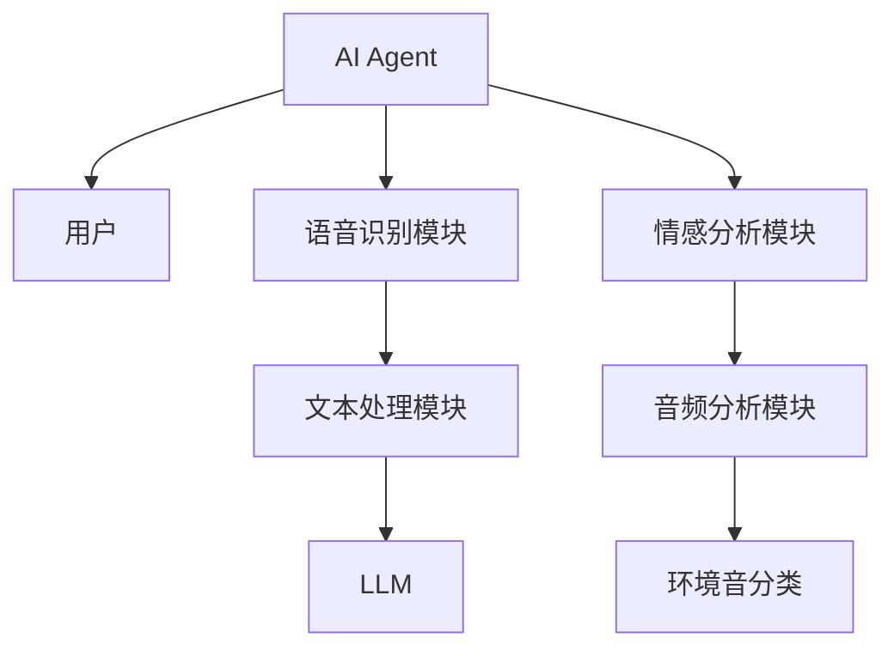
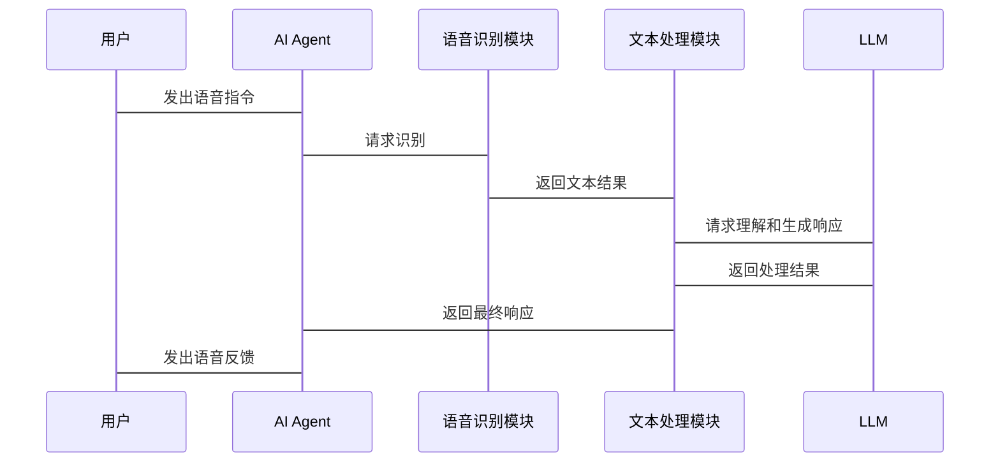

                 

<think>
好的，我现在需要根据用户的详细要求，逐步构建一篇关于《AI Agent 的跨模态理解：整合 LLM 与音频分析》的技术博客文章。用户已经提供了文章的结构和各部分的要求，我需要按照这个结构，逐步填充内容，确保每个部分都详细、准确，并符合技术博客的风格。

首先，我会从文章标题开始，然后列出关键词和摘要，接着按照目录大纲的结构撰写正文，每个部分都按照用户的约束条件来完成。

### 文章标题
AI Agent 的跨模态理解：整合 LLM 与音频分析

### 关键词
AI Agent, 跨模态理解, LLM, 音频分析, 人工智能, 大型语言模型

### 摘要
本文探讨AI Agent如何整合大型语言模型（LLM）与音频分析，实现跨模态理解。从背景、原理到系统架构，结合实际案例，详细分析其技术实现与应用，展望未来发展。

接下来，按照目录大纲的结构，逐步撰写正文内容。

---

### 第1章：AI Agent 的概念与背景

#### 1.1 AI Agent 的定义与核心概念
- **AI Agent 的定义**：AI Agent 是能够感知环境、自主决策并执行任务的智能体，具备学习、推理和自适应能力。
- **AI Agent 的核心特征**：
  - 感知能力：通过多模态数据输入理解环境。
  - 决策能力：基于理解做出最优选择。
  - 行动能力：执行任务，与环境互动。
- **AI Agent 的应用场景**：智能助手、自动驾驶、智能客服、机器人控制等。

#### 1.2 跨模态理解的背景与意义
- **跨模态理解的定义**：指AI能够处理和理解不同形式的数据，如文本、图像、音频、视频等。
- **跨模态理解的重要性**：提升AI的通用性和适应性，使其能够处理复杂多变的任务。
- **跨模态理解的应用领域**：自然语言处理、计算机视觉、语音识别、机器人技术等。

#### 1.3 LLM 与音频分析的整合
- **LLM 的核心能力**：处理和生成自然语言文本，理解上下文，进行推理。
- **音频分析的关键技术**：语音识别、声纹识别、情感分析、环境音分类。
- **整合的意义**：结合文本和音频信息，提升AI Agent的理解和交互能力，实现更智能的服务。

---

### 第2章：LLM 与音频分析的核心原理

#### 2.1 LLM 的工作原理
- **大型语言模型的结构**：基于Transformer架构，通过自注意力机制处理序列数据。
- **注意力机制的作用**：捕捉输入中的长距离依赖关系，提升模型的语义理解能力。
- **训练目标**：通过大量文本数据的预训练，学习语言的分布和语义关系。

#### 2.2 音频分析的关键技术
- **语音识别**：将语音信号转换为文字，常用模型如CTC、Transformer。
- **声纹识别**：通过语音特征识别说话人身份。
- **情感分析**：分析语音的声学特征，判断说话人的情感状态。
- **环境音分类**：识别环境中的背景声音，如音乐、噪音等。

#### 2.3 LLM 和音频分析的对比分析
- **输入输出形式对比**：
  | 属性       | LLM                  | 音频分析            |
  |------------|----------------------|--------------------|
  | 输入        | 文本                  | 音频信号            |
  | 输出        | 文本、摘要、翻译      | 文本（转录）、标签    |
- **处理任务类型对比**：
  | 任务         | LLM                  | 音频分析            |
  |--------------|----------------------|--------------------|
  | 自然语言处理 | 文本生成、问答系统    | 语音识别、情感分析  |
- **数据来源对比**：
  | 数据来源       | 文本库（书籍、网页） | 音频库（录音、语音） |
- **计算资源对比**：
  | 资源          | 高（需要大量计算）   | 中（依赖于算法复杂度） |

#### 2.4 实体关系图（ER图）分析


---

### 第3章：跨模态理解的算法原理

#### 3.1 LLM 的文本处理流程
- **输入阶段**：接收文本输入，生成嵌入向量。
- **编码阶段**：通过自注意力机制处理输入，生成上下文向量。
- **解码阶段**：基于上下文生成输出文本。

#### 3.2 音频分析的处理流程
- **预处理**：降噪、分段、特征提取（如MFCC）。
- **特征编码**：将音频特征映射到低维空间。
- **分类/识别**：使用深度学习模型进行分类或识别任务。

#### 3.3 跨模态融合的算法实现
- **多模态编码器**：将文本和音频特征分别编码，然后进行融合。
- **融合方法**：如早期融合（在特征层融合）、晚期融合（在决策层融合）。
- **融合模型**：如多模态Transformer、对比学习方法。

#### 3.4 数学模型与公式
- **文本编码**：输入序列 \( x = (x_1, x_2, ..., x_n) \) 转换为嵌入向量 \( X = (X_1, X_2, ..., X_n) \)。
- **自注意力机制**：
  \[
  \text{Attention}(Q, K, V) = \text{softmax}\left( \frac{QK^T}{\sqrt{d_k}} \right)V
  \]
- **音频特征提取**：MFCC计算公式：
  \[
  M(t) = \log\left( \sum_{i=1}^{N} a_i \cos(\theta_i - \theta) \right)
  \]
  其中，\( a_i \) 是梅尔滤波器系数，\( \theta_i \) 是滤波器中心频率。

---

### 第4章：系统分析与架构设计方案

#### 4.1 问题场景介绍
- **场景描述**：设计一个AI Agent，能够通过语音指令和环境声音识别，执行相应的任务。
- **需求分析**：实时性、准确性、多模态处理能力、鲁棒性。

#### 4.2 系统功能设计
- **核心功能模块**：
  - 语音识别模块：将语音转换为文本。
  - 情感分析模块：分析语音中的情感倾向。
  - 文本处理模块：理解指令并生成响应。
  - 执行模块：根据指令执行相应操作。

#### 4.3 系统架构设计


#### 4.4 系统接口设计
- **输入接口**：接收用户的语音输入。
- **输出接口**：通过文本或语音反馈结果。
- **内部接口**：模块之间的数据传递接口。

#### 4.5 系统交互流程


---

### 第5章：项目实战

#### 5.1 环境安装
- **工具安装**：Python 3.8+, PyTorch, Transformers库， librosa, soundfile。
- **依赖管理**：使用virtualenv或conda管理环境。
- **数据准备**：收集和整理多模态数据集，如语音指令数据。

#### 5.2 核心代码实现
```python
import librosa
from transformers import Wav2Vec2Model, Wav2Vec2Tokenizer
import torch

# 加载预训练模型
model = Wav2Vec2Model.from_pretrained("facebook/wav2vec2-base")
tokenizer = Wav2Vec2Tokenizer.from_pretrained("facebook/wav2vec2-base")

# 加载音频文件
audio_file = "path_to_audio.wav"
audio_data, sample_rate = librosa.load(audio_file, sr=None)

# 音频预处理
input_values = tokenizer(audio_data, return_tensors="np").input_values
input_values = torch.tensor(input_values).to(model.device)

# 获取模型输出
with torch.no_grad():
    outputs = model(input_values)
    features = outputs.last_hidden_state
```

#### 5.3 代码解读与应用分析
- **代码功能**：加载预训练的音频模型，处理输入音频文件，提取特征向量。
- **模型输出**：通过模型处理得到音频的特征表示，用于后续的文本处理和LLM融合。

#### 5.4 实际案例分析
- **案例描述**：设计一个AI Agent，能够识别用户的语音指令，并执行相应的操作。
- **案例实现**：
  - 语音识别模块将语音转换为文本指令。
  - LLM理解指令并生成响应。
  - AI Agent执行任务，如播放音乐、设置闹钟等。

#### 5.5 项目小结
- **项目总结**：通过项目实战，展示了整合LLM与音频分析的具体实现步骤和方法。
- **经验分享**：数据准备、模型选择、系统集成是项目成功的关键。

---

### 第6章：最佳实践与小结

#### 6.1 最佳实践 tips
- **数据质量**：确保数据的多样性和代表性。
- **模型选择**：根据任务需求选择合适的模型。
- **系统优化**：优化算法和架构，提升性能和效率。
- **用户体验**：注重交互设计，提升用户体验。

#### 6.2 小结
- **文章总结**：本文详细探讨了AI Agent整合LLM与音频分析的跨模态理解技术，从理论到实践，全面分析了其原理、算法、架构和应用。
- **未来展望**：随着技术进步，跨模态理解将更加广泛应用于各个领域，推动AI Agent的发展。

---

### 第7章：注意事项与拓展阅读

#### 7.1 注意事项
- **数据隐私**：处理用户数据时，需遵守相关隐私保护法规。
- **性能优化**：在资源受限的环境中，需优化模型以提升效率。
- **用户体验**：注重交互设计，提升用户的使用体验。

#### 7.2 拓展阅读
- **推荐书籍**：
  - 《Deep Learning》 - Ian Goodfellow
  - 《Python机器学习》 - Aurélien Géron
- **推荐论文**：
  - “Attention Is All You Need” - Vaswani et al.
  - “wav2vec 2: A General Framework for Self-supervised Audio Processing” - Baevski et al.
- **在线资源**：
  - Hugging Face的Transformers库文档
  - librosa库官方文档

---

### 结语
通过本文的学习，读者将深入了解AI Agent在跨模态理解中的应用，掌握整合LLM与音频分析的技术细节，为实际项目提供理论支持和实践指导。希望本文能为相关领域的研究者和开发者提供有价值的参考。

---

### 总结
以上是《AI Agent 的跨模态理解：整合 LLM 与音频分析》的完整目录大纲和详细内容。从背景介绍、核心概念、算法原理、系统架构到项目实战，结合实际案例和最佳实践，全面解析了AI Agent整合LLM与音频分析的技术细节，为读者提供了一个从理论到实践的完整指南。

