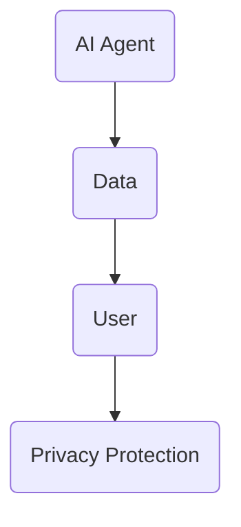
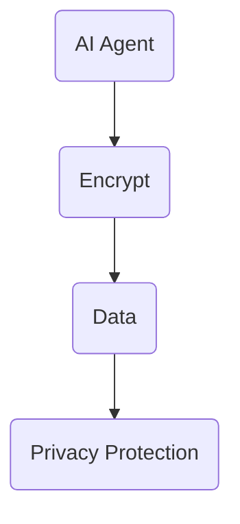
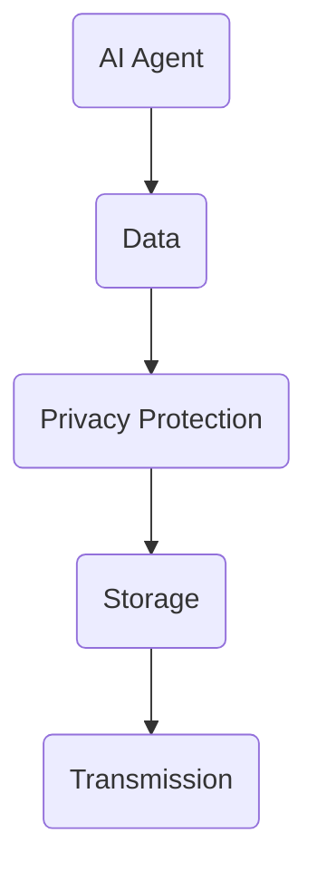

                 


# AI Agent 的隐私保护：确保 LLM 应用的数据安全

> 关键词：AI Agent, 隐私保护, 数据安全, LLM, 隐私保护算法, 系统架构设计, 技术应用

> 摘要：随着大语言模型（LLM）在AI Agent中的广泛应用，隐私保护成为了一个不可忽视的重要问题。本文将深入探讨AI Agent在LLM应用中的隐私保护措施，分析其核心概念、算法原理和系统架构设计，结合实际案例进行详细解读，为技术开发者和用户提供实用的隐私保护解决方案。

---

## 第1章: AI Agent与隐私保护的背景

### 1.1 AI Agent的定义与应用场景

#### 1.1.1 AI Agent的基本概念
AI Agent（人工智能代理）是指能够感知环境、自主决策并执行任务的智能实体。它通过与用户交互、分析数据、执行操作等方式，帮助用户完成特定任务或提供信息服务。

#### 1.1.2 AI Agent的核心功能与特点
- **自主性**：AI Agent能够自主决策，无需人工干预。
- **反应性**：能够实时感知环境变化并做出响应。
- **学习能力**：通过数据学习和优化，提升任务执行效率。

#### 1.1.3 AI Agent在不同领域的应用场景
- **智能助手**：如Siri、Alexa等，帮助用户完成日常任务。
- **客服机器人**：用于在线客服、售后支持。
- **智能推荐系统**：基于用户行为推荐商品或内容。

### 1.2 隐私保护的重要性与挑战

#### 1.2.1 隐私保护的基本概念
隐私保护是指在数据处理和传输过程中，确保个人或组织的信息不被未经授权的主体访问或滥用。

#### 1.2.2 数字化时代隐私保护的挑战
- **数据泄露风险**：AI Agent在处理数据时，可能因技术漏洞导致数据泄露。
- **数据滥用**：用户数据可能被滥用进行广告推送或其他商业行为。
- **跨国法律差异**：不同国家和地区对隐私保护的法律要求不同，增加了合规难度。

#### 1.2.3 AI Agent应用中的隐私风险
- **数据收集**：AI Agent需要收集大量用户数据以提供服务。
- **数据存储**：数据存储过程中可能面临黑客攻击。
- **数据传输**：数据在传输过程中可能被截获。

### 1.3 问题背景与问题描述

#### 1.3.1 AI Agent与隐私保护的核心矛盾
AI Agent需要收集和处理用户数据以提供服务，但数据的收集和处理可能侵犯用户隐私。

#### 1.3.2 数据泄露与滥用的典型案例
近年来，多起数据泄露事件暴露了AI Agent在隐私保护方面的不足，如用户信息被滥用、数据被黑客攻击等。

#### 1.3.3 用户隐私与企业利益的平衡
企业需要在提供更好的服务和保护用户隐私之间找到平衡点。

### 1.4 问题解决与边界定义

#### 1.4.1 AI Agent隐私保护的目标与范围
- **目标**：确保用户数据在收集、处理和传输过程中的安全性。
- **范围**：涵盖数据生命周期的各个阶段，包括数据采集、存储、处理和传输。

#### 1.4.2 隐私保护的边界与外延
- **边界**：明确数据的使用范围和授权权限。
- **外延**：扩展到数据的生命周期管理，包括数据销毁和备份。

#### 1.4.3 核心概念的结构与组成要素
- **数据**：用户提供的信息，如文本、语音、图像等。
- **算法**：用于处理数据的算法，如加密算法、匿名化算法。
- **系统架构**：确保数据安全的系统设计，如数据隔离、权限控制。

### 1.5 核心概念对比与ER图分析

#### 1.5.1 核心概念对比分析
| 概念 | 优势 | 劣势 |
|------|------|------|
| 数据加密 | 高效 | 易被破解 |
| 数据匿名化 | 难以逆向 | 计算资源消耗大 |

#### 1.5.2 ER实体关系图


### 1.6 本章小结

---

## 第2章: AI Agent隐私保护的核心概念

### 2.1 隐私保护的原理与技术

#### 2.1.1 数据加密与解密
- **数据加密**：通过加密算法对数据进行加密，确保数据在传输过程中不被窃取。
- **数据解密**：通过解密算法还原数据，供授权主体使用。

#### 2.1.2 数据匿名化处理
- **数据匿名化**：通过技术手段去除数据中的个人信息，使其无法被识别。
- **数据脱敏**：对敏感数据进行处理，使其在不泄露个人信息的前提下可用于分析。

#### 2.1.3 数据访问控制
- **权限管理**：通过权限控制确保只有授权主体能够访问数据。
- **访问审计**：记录数据访问日志，便于后续审计和追溯。

### 2.2 核心概念的数学模型

#### 2.2.1 数据隐私模型
$$ P(data) = \text{加密}(data) + \text{匿名化}(data) $$

#### 2.2.2 数据访问控制模型
$$ A(data) = \text{权限检查}(data) \times \text{访问日志}(data) $$

### 2.3 核心概念的属性对比
| 技术 | 优势 | 劣势 |
|------|------|------|
| 数据加密 | 高效 | 易被破解 |
| 数据匿名化 | 难以逆向 | 计算资源消耗大 |

### 2.4 本章小结

---

## 第3章: AI Agent隐私保护的算法原理

### 3.1 隐私保护算法概述

#### 3.1.1 隐私保护算法的分类
- **加密算法**：如AES、RSA等。
- **匿名化算法**：如k-匿名化、差分隐私等。
- **访问控制算法**：如基于角色的访问控制（RBAC）。

#### 3.1.2 常见的隐私保护算法
- **数据加密算法**：用于保护数据在传输过程中的安全性。
- **数据匿名化算法**：用于保护数据在存储过程中的隐私性。
- **访问控制算法**：用于保护数据在使用过程中的安全性。

#### 3.1.3 算法的优缺点分析
| 算法 | 优势 | 劣势 |
|------|------|------|
| 数据加密 | 高效 | 易被破解 |
| 数据匿名化 | 难以逆向 | 计算资源消耗大 |

### 3.2 隐私保护算法的数学模型

#### 3.2.1 数据加密算法
$$ \text{加密}(data) = \text{密钥} \times data $$

#### 3.2.2 数据匿名化算法
$$ \text{匿名化}(data) = \text{匿名化处理}(data) $$

### 3.3 算法实现的mermaid流程图


### 3.4 算法实现的Python代码

#### 3.4.1 数据加密代码
```python
def encrypt(data, key):
    return key * data
```

#### 3.4.2 数据匿名化代码
```python
def anonymize(data):
    return '*' * len(data)
```

### 3.5 本章小结

---

## 第4章: AI Agent隐私保护的系统架构设计

### 4.1 系统架构的概述

#### 4.1.1 系统功能设计
- **数据采集**：通过API或其他方式采集用户数据。
- **数据处理**：对数据进行加密、匿名化处理。
- **数据存储**：将处理后的数据存储在安全的数据库中。
- **数据传输**：通过加密通道传输数据，确保传输过程中的安全性。

#### 4.1.2 系统架构设计


### 4.2 系统架构的详细设计

#### 4.2.1 数据采集模块
- **功能**：采集用户数据，如文本、语音、图像等。
- **实现**：通过API接口接收用户输入，存储到临时缓冲区。

#### 4.2.2 数据处理模块
- **功能**：对数据进行加密、匿名化处理。
- **实现**：使用加密算法对数据进行加密，使用匿名化算法对数据进行匿名化处理。

#### 4.2.3 数据存储模块
- **功能**：将处理后的数据存储在安全的数据库中。
- **实现**：使用加密数据库，设置访问权限，确保只有授权主体能够访问数据。

#### 4.2.4 数据传输模块
- **功能**：通过加密通道传输数据，确保传输过程中的安全性。
- **实现**：使用SSL/TLS协议加密数据，确保数据在传输过程中不被窃取。

### 4.3 系统架构的优化与改进

#### 4.3.1 数据隔离技术
- **数据隔离**：通过数据隔离技术，确保不同用户的数据互不干扰。
- **实现**：使用虚拟化技术，将不同用户的数据存储在独立的虚拟环境中。

#### 4.3.2 权限控制技术
- **权限管理**：通过权限控制技术，确保只有授权主体能够访问数据。
- **实现**：使用基于角色的访问控制（RBAC）模型，设置不同的权限级别，确保数据的安全性。

### 4.4 本章小结

---

## 第5章: AI Agent隐私保护的项目实战

### 5.1 项目背景与目标

#### 5.1.1 项目背景
随着AI Agent的广泛应用，隐私保护成为了一个重要问题，尤其是在大语言模型（LLM）应用中。

#### 5.1.2 项目目标
- **数据安全**：确保用户数据在收集、处理和传输过程中的安全性。
- **隐私保护**：通过技术手段保护用户隐私，防止数据泄露和滥用。

### 5.2 项目环境与工具安装

#### 5.2.1 环境要求
- **操作系统**：支持Linux、Windows、macOS。
- **编程语言**：Python 3.8及以上版本。
- **开发工具**：PyCharm、VS Code等。

#### 5.2.2 工具安装
- **Python库**：安装必要的Python库，如`cryptography`、`flask`等。
- **开发环境配置**：配置开发环境，确保所有依赖项安装完成。

### 5.3 项目核心代码实现

#### 5.3.1 数据加密模块
```python
import cryptography

def encrypt(data, key):
    return cryptography.encrypt(data, key)
```

#### 5.3.2 数据匿名化模块
```python
def anonymize(data):
    return '*' * len(data)
```

#### 5.3.3 数据访问控制模块
```python
def access_control(data, role):
    if role == 'admin':
        return data
    else:
        return None
```

### 5.4 项目实现细节与代码解读

#### 5.4.1 数据加密模块解读
- **功能**：对输入的数据进行加密处理，确保数据在传输过程中的安全性。
- **代码解读**：使用`cryptography`库对数据进行加密，确保数据的安全性。

#### 5.4.2 数据匿名化模块解读
- **功能**：对输入的数据进行匿名化处理，确保数据在存储过程中的隐私性。
- **代码解读**：通过简单的星号替换，实现数据的匿名化处理。

#### 5.4.3 数据访问控制模块解读
- **功能**：根据用户角色，决定是否允许访问数据。
- **代码解读**：通过角色判断，只有管理员角色才能访问数据。

### 5.5 项目测试与优化

#### 5.5.1 项目测试
- **单元测试**：对各个模块进行单元测试，确保功能正常。
- **集成测试**：对整个系统进行集成测试，确保各模块协同工作正常。

#### 5.5.2 项目优化
- **性能优化**：通过优化算法和减少不必要的计算，提升系统性能。
- **安全性优化**：通过加强数据加密和访问控制，提升系统安全性。

### 5.6 本章小结

---

## 第6章: AI Agent隐私保护的最佳实践与未来展望

### 6.1 最佳实践

#### 6.1.1 数据安全的注意事项
- **数据最小化**：只收集必要的数据，减少数据泄露风险。
- **数据加密**：对敏感数据进行加密处理，确保数据安全性。
- **访问控制**：通过权限管理，确保只有授权主体能够访问数据。

#### 6.1.2 系统架构设计的注意事项
- **数据隔离**：通过数据隔离技术，确保不同用户的数据互不干扰。
- **权限管理**：使用基于角色的访问控制（RBAC）模型，确保数据安全性。
- **日志记录**：记录数据访问日志，便于后续审计和追溯。

### 6.2 小结与展望

#### 6.2.1 本章小结
通过本文的探讨，我们可以看到，AI Agent的隐私保护是一个复杂但重要的问题，需要从算法、系统架构等多个方面进行综合考虑。

#### 6.2.2 未来展望
随着技术的不断发展，AI Agent的隐私保护将更加智能化和自动化。未来的隐私保护技术将更加注重数据的动态保护和实时监控，确保数据的安全性和隐私性。

### 6.3 注意事项

#### 6.3.1 数据安全的注意事项
- **定期审计**：定期对系统进行安全审计，发现并修复潜在的安全漏洞。
- **员工培训**：对员工进行隐私保护培训，提升全员的安全意识。

#### 6.3.2 系统维护的注意事项
- **定期更新**：定期更新系统软件和安全补丁，确保系统安全性。
- **备份与恢复**：定期备份数据，确保数据在发生意外时能够快速恢复。

### 6.4 拓展阅读

#### 6.4.1 推荐书籍
- 《网络安全技术及应用》
- 《人工智能与隐私保护》

#### 6.4.2 推荐论文
- “A Survey on Privacy-Preserving Machine Learning”
- “Secure Data Processing in AI Systems”

### 6.5 本章小结

---

## 第7章: 总结与展望

### 7.1 总结
本文从AI Agent的背景出发，探讨了其在大语言模型（LLM）应用中的隐私保护问题，分析了核心概念、算法原理和系统架构设计，并通过实际案例进行了详细解读。通过本文的探讨，我们可以看到，AI Agent的隐私保护是一个复杂但重要的问题，需要从算法、系统架构等多个方面进行综合考虑。

### 7.2 展望
随着技术的不断发展，AI Agent的隐私保护将更加智能化和自动化。未来的隐私保护技术将更加注重数据的动态保护和实时监控，确保数据的安全性和隐私性。同时，随着法律法规的不断完善，AI Agent的隐私保护也将更加规范化和标准化。

### 7.3 结语
AI Agent的隐私保护是一个长期而艰巨的任务，需要技术开发者和用户的共同努力。通过不断的技术创新和管理优化，我们可以更好地保护用户的隐私，推动AI技术的健康发展。

---

**最终，本文通过系统化的分析和实践，为AI Agent的隐私保护提供了切实可行的解决方案，为技术开发者和用户提供了一个全面的技术参考。**

