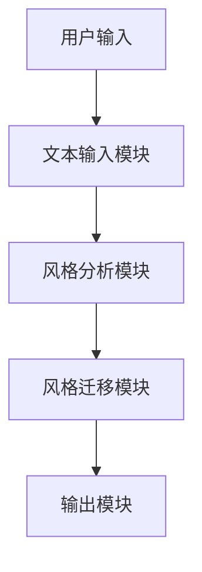

                 


# AI Agent 的风格迁移：让 LLM 模仿不同的写作风格

> 关键词：AI Agent, LLM, 风格迁移, 文本生成, 深度学习

> 摘要：本文深入探讨了如何利用AI Agent技术让大语言模型（LLM）模仿不同的写作风格。通过分析风格迁移的核心概念、算法原理、系统架构及实际案例，展示了如何实现风格迁移并应用于文本生成。文章从背景介绍到项目实战，全面解析了风格迁移的实现过程及应用价值。

---

## 第1章 引言与背景

### 1.1 AI Agent与LLM的概述

#### 1.1.1 AI Agent的基本概念
AI Agent（智能体）是指能够感知环境、自主决策并执行任务的智能系统。它可以是软件程序，也可以是物理机器人，通过与环境交互来实现特定目标。AI Agent的核心特征包括自主性、反应性、目标导向和学习能力。

#### 1.1.2 LLM在AI Agent中的作用
大语言模型（LLM）如GPT-3、GPT-4通过深度学习技术训练而成，能够理解和生成人类语言。LLM在AI Agent中主要用于文本生成、对话交互和内容创作，为Agent提供强大的语言处理能力。

#### 1.1.3 风格迁移的定义与目标
风格迁移是指将一种内容或形式转化为另一种风格的过程。在AI Agent中，风格迁移的目标是让LLM模仿特定的写作风格，生成符合目标风格的文本。

### 1.2 问题背景与目标

#### 1.2.1 风格迁移的核心问题
风格迁移的核心问题是如何将输入内容的语义保留，同时改变其表达形式，使其符合目标风格的要求。这需要处理内容与风格之间的关系。

#### 1.2.2 风格迁移的应用价值
在AI Agent中，风格迁移可以用于个性化内容生成、多语言翻译、文学创作等领域，为用户提供多样化的语言服务。

---

## 第2章 核心概念与理论基础

### 2.1 风格迁移的核心概念

#### 2.1.1 风格迁移的定义与范围
风格迁移不仅涉及文本，还可以应用于图像、音乐等领域。在文本领域，风格迁移关注如何模仿特定作者或文体的写作风格。

#### 2.1.2 风格迁移的关键技术
风格迁移的关键技术包括特征提取、对抗网络和预训练模型。这些技术帮助模型理解并转换不同风格的文本。

#### 2.1.3 AI Agent如何利用LLM进行风格迁移
AI Agent通过调用LLM的API，输入需要生成文本的风格参数，从而实现风格迁移。

### 2.2 风格迁移的原理与方法

#### 2.2.1 风格分析技术
通过分析目标风格的特征，提取其语言习惯、句式结构和主题倾向。

#### 2.2.2 风格转换技术
基于提取的风格特征，对输入文本进行调整，使其符合目标风格。

#### 2.2.3 风格迁移的实现流程
1. 输入原始文本和目标风格。
2. 提取目标风格的特征。
3. 将特征应用于原始文本，生成风格迁移后的文本。

---

## 第3章 算法原理与实现

### 3.1 风格迁移的数学模型

#### 3.1.1 风格迁移的目标函数
目标函数通常包括内容损失和风格损失，确保生成文本既保留内容又符合目标风格。

$$ \text{目标函数} = \lambda_1 \text{内容损失} + \lambda_2 \text{风格损失} $$

#### 3.1.2 风格迁移的损失函数
内容损失衡量生成文本与原始文本的内容相似度，风格损失衡量生成文本与目标风格的相似度。

#### 3.1.3 风格迁移的优化算法
使用梯度下降优化算法，如Adam，来最小化目标函数。

### 3.2 风格迁移的具体方法

#### 3.2.1 基于特征提取的风格迁移
通过预训练模型提取文本特征，然后调整这些特征以匹配目标风格。

#### 3.2.2 基于对抗网络的风格迁移
使用生成对抗网络（GAN），让生成器生成目标风格的文本，判别器判断文本的风格归属。

#### 3.2.3 基于预训练模型的风格迁移
利用如BERT、GPT等预训练模型，通过微调实现风格迁移。

---

## 第4章 系统架构与设计

### 4.1 系统功能模块

#### 4.1.1 文本输入模块
接收原始文本和目标风格参数。

#### 4.1.2 风格分析模块
分析目标风格的特征。

#### 4.1.3 风格迁移模块
生成符合目标风格的文本。

#### 4.1.4 输出模块
将生成的文本输出给用户。

### 4.2 系统架构设计

#### 4.2.1 系统架构图


#### 4.2.2 系统交互流程
1. 用户输入原始文本和目标风格。
2. 文本输入模块接收输入。
3. 风格分析模块提取目标风格特征。
4. 风格迁移模块生成文本。
5. 输出模块展示结果。

---

## 第5章 项目实战与案例分析

### 5.1 环境配置

#### 5.1.1 安装依赖
使用Python和相关库如TensorFlow、Keras等。

#### 5.1.2 下载预训练模型
选择合适的预训练模型，如GPT-2或GPT-3。

### 5.2 核心代码实现

#### 5.2.1 风格分析代码
```python
def extract_style_features(text):
    # 提取文本的风格特征
    return features
```

#### 5.2.2 风格迁移代码
```python
def style_transfer(text, target_style):
    # 使用预训练模型进行风格迁移
    return generated_text
```

### 5.3 案例分析

#### 5.3.1 案例介绍
以模仿福尔摩斯写作风格为例，生成侦探小说段落。

#### 5.3.2 代码实现
```python
input_text = "发生了谋杀案，现场发现..."
target_style = "福尔摩斯风格"
output = style_transfer(input_text, target_style)
print(output)
```

#### 5.3.3 案例分析
生成文本保留了谋杀案的情节，但语言风格更接近福尔摩斯的推理风格，逻辑清晰，细节丰富。

---

## 第6章 最佳实践与未来展望

### 6.1 最佳实践

#### 6.1.1 数据预处理的重要性
确保训练数据的多样性和代表性。

#### 6.1.2 模型调优技巧
通过调整超参数和优化算法提高生成效果。

#### 6.1.3 风格迁移的局限性
目前技术难以完全捕捉某些复杂风格的特征。

### 6.2 未来展望

#### 6.2.1 多模态风格迁移
结合图像和文本，实现跨模态的风格迁移。

#### 6.2.2 实时风格迁移
开发实时风格转换工具，提升用户体验。

#### 6.2.3 风格迁移的个性化应用
根据用户偏好定制独特的写作风格。

---

## 总结

本文详细探讨了AI Agent如何利用LLM实现风格迁移，从概念到实现，再到实际案例，全面解析了风格迁移的技术和应用。未来，随着技术进步，风格迁移将在更多领域发挥重要作用，为用户提供更丰富多样的语言服务。

