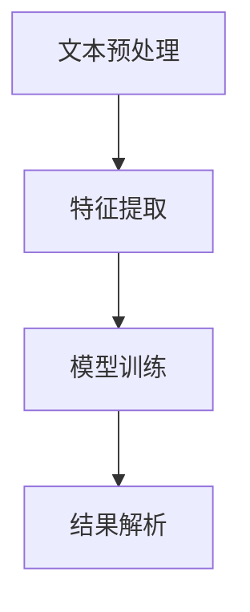
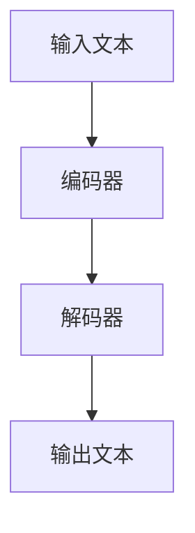
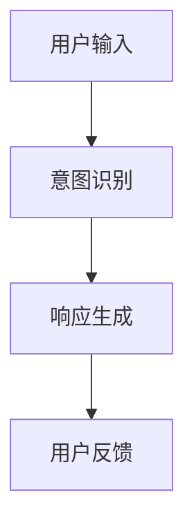
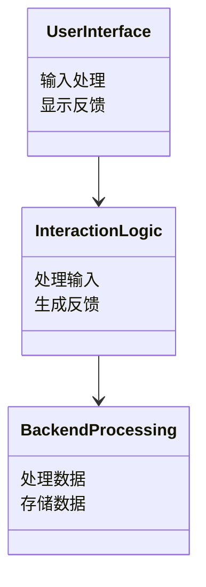
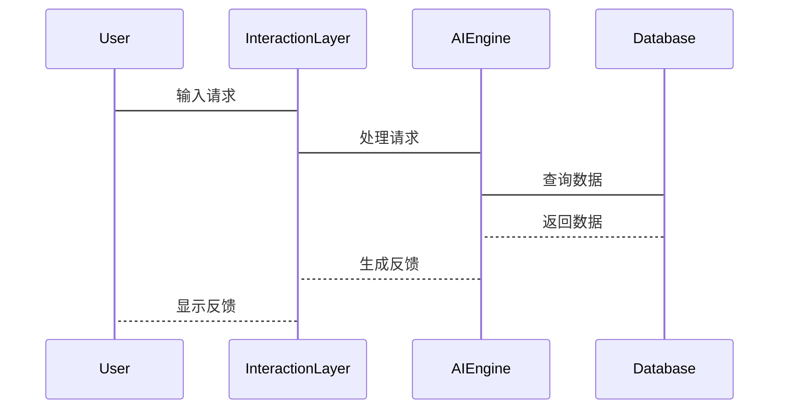

                 


# AI Agent与人类协作：界面设计与交互模式

> 关键词：AI Agent、人类协作、界面设计、交互模式、系统架构

> 摘要：本文深入探讨了AI Agent与人类协作的界面设计与交互模式，从基本概念到系统实现，结合实际案例，详细分析了协作的核心原理与技术实现。文章内容涵盖AI Agent的基本概念、界面设计原则、交互模式的实现、系统架构设计以及项目实战，为读者提供了全面的技术指导。

---

## # 第一部分: AI Agent与人类协作的基础

### ## 第1章: AI Agent的基本概念与协作背景

#### ### 1.1 AI Agent的定义与类型

AI Agent（智能体）是指能够感知环境并采取行动以实现目标的实体。AI Agent可以是软件程序、机器人或其他智能系统，具备以下核心特征：

- **自主性**：能够在没有外部干预的情况下运行。
- **反应性**：能够根据环境变化调整行为。
- **目标导向**：有明确的目标，并采取行动以实现这些目标。
- **社会能力**：能够与其他实体（包括人类和其他AI Agent）进行交互和协作。

AI Agent可以分为多种类型，以下是几种主要类型及其特点：

- **简单反射型Agent**：基于当前感知做出反应，没有内部状态。
- **基于模型的反射型Agent**：维护内部状态，并基于状态和模型做出决策。
- **目标驱动型Agent**：根据目标选择行动。
- **效用驱动型Agent**：通过最大化效用函数来选择行动。
- **学习型Agent**：通过经验改进性能。

以下是不同类型AI Agent的对比表格：

| 类型                 | 特点                                   | 适用场景                           |
|----------------------|--------------------------------------|------------------------------------|
| 简单反射型           | 基于当前感知做出反应，无内部状态       | 简单任务，如传感器数据处理         |
| 基于模型的反射型     | 维护内部状态，基于模型做出决策       | 中等复杂性任务，如路径规划         |
| 目标驱动型           | 根据目标选择行动                     | 需要明确目标的任务，如任务执行     |
| 效用驱动型           | 通过最大化效用函数选择最优行动       | 复杂优化问题，如资源分配           |
| 学习型               | 通过经验改进性能                     | 需要自适应和优化的任务，如推荐系统 |

#### ### 1.2 人类与AI Agent协作的背景

随着AI技术的快速发展，AI Agent在各个领域的应用越来越广泛，尤其是在需要人机协作的场景中。例如，在医疗领域，AI Agent可以帮助医生分析病人的数据；在金融领域，AI Agent可以辅助交易员做出决策；在教育领域，AI Agent可以作为虚拟助教为学生提供帮助。

然而，AI Agent与人类协作也面临一些挑战，例如：

- **信任问题**：人类可能不信任AI Agent的决策，尤其是在高风险的场景中。
- **可解释性问题**：复杂的AI模型可能难以解释其决策过程，影响人类对AI Agent的理解和信任。
- **协作效率问题**：AI Agent与人类的协作效率受到界面设计和交互模式的影响。

因此，设计高效的界面和交互模式，使得人类能够轻松地与AI Agent协作，是当前研究的一个重要方向。

#### ### 1.3 协作的核心概念与结构

协作的核心概念包括以下几个方面：

- **协作目标**：协作的目的是通过人类和AI Agent的共同努力，完成某个任务或达成某个目标。
- **协作主体**：协作的主体包括人类和AI Agent。
- **协作过程**：协作的过程包括信息的交换、任务的分配与执行、结果的反馈等。
- **协作机制**：协作机制包括任务分配、决策权衡、结果反馈等。

以下是协作核心概念的组成要素对比表格：

| 组成要素       | 描述                                   | 示例场景                           |
|----------------|--------------------------------------|------------------------------------|
| 协作目标       | 协作的最终目标                         | 完成一个复杂的数据分析任务         |
| 协作主体       | 参与协作的个体或系统                   | 数据分析师和AI分析助手             |
| 协作过程       | 协作的具体步骤                         | 数据分析师提出需求，AI助手执行分析 |
| 协作机制       | 协作的规则和方法                       | 任务分配、结果反馈                 |

以下是协作核心概念的ER实体关系图：

```mermaid
er
  actor
  AI-Agent
  Collaboration
  Task
  actor -|{拥有}| Collaboration
  AI-Agent -|{拥有}| Collaboration
  Collaboration -|{涉及}| Task
```

从上图可以看出，协作的核心概念包括actor（人类）、AI-Agent（智能体）、Collaboration（协作）、Task（任务）四个实体。actor和AI-Agent都可以拥有Collaboration，而Collaboration又涉及多个Task。

---

## # 第二部分: AI Agent界面设计与交互模式的核心原理

### ## 第2章: 界面设计的理论与方法

#### ### 2.1 界面设计的基本原则

界面设计是人机协作中的关键环节，好的界面设计能够提高用户的使用效率和体验。以下是界面设计的一些基本原则：

1. **用户中心设计**：设计时以用户的需求和使用习惯为出发点，确保界面直观易用。
2. **简洁性与可用性**：界面应简洁明了，避免过多的功能堆砌，同时保证核心功能的可用性。
3. **一致性与反馈**：界面元素和操作流程应保持一致，同时提供及时的用户反馈，帮助用户了解操作结果。
4. **可定制性**：允许用户根据自己的需求对界面进行一定程度的定制，以提高使用效率。

#### ### 2.2 交互模式的分类与特点

交互模式是人类与AI Agent之间信息交换的方式。根据交互的类型和场景，可以将交互模式分为以下几类：

1. **基于任务的交互模式**：用户通过明确的任务或指令与AI Agent进行交互。例如，在医疗领域，医生可以通过输入病人的症状，让AI Agent提供诊断建议。
2. **基于情境的交互模式**：用户在特定的情境下与AI Agent进行交互。例如，在客服系统中，用户可以通过与AI客服的对话解决问题。
3. **基于反馈的交互模式**：用户根据AI Agent提供的反馈信息进行下一步操作。例如，在推荐系统中，用户可以根据AI Agent的推荐结果进行购买决策。

#### ### 2.3 交互设计的流程与工具

交互设计的流程通常包括以下几个步骤：

1. **需求分析**：了解用户的需求和使用场景，明确设计目标。
2. **草图设计**：绘制界面草图，初步设计界面布局和交互流程。
3. **原型设计**：使用工具将草图转化为高保真原型，模拟实际的交互流程。
4. **用户测试**：邀请用户参与测试，收集反馈意见。
5. **优化设计**：根据用户反馈优化界面和交互流程。

常用的交互设计工具包括：

- **Figma**：在线协作设计工具，支持团队协作和实时反馈。
- **Sketch**：矢量绘图工具，适合UI/UX设计。
- **Axure**：原型设计工具，支持创建交互式原型。
- **Lucidchart**：流程图工具，适合设计交互流程图。

---

## # 第三部分: AI Agent交互模式的算法与实现

### ## 第3章: 自然语言处理与交互算法

#### ### 3.1 自然语言处理的流程

自然语言处理（NLP）是实现人机交互的重要技术之一。以下是NLP的基本流程：

1. **文本预处理**：包括分词、词性标注、句法分析等。
2. **特征提取**：从文本中提取有用的特征，如关键词、实体识别等。
3. **模型训练**：基于训练数据训练NLP模型，如词袋模型、词嵌入模型等。
4. **结果解析**：根据模型输出结果进行解析，生成人类可理解的反馈。

以下是NLP处理流程的mermaid流程图：



#### ### 3.2 基于Transformer的交互算法

基于Transformer的交互算法是当前NLP领域的重要技术之一。以下是其核心步骤：

1. **输入处理**：将输入文本转换为模型可处理的向量形式。
2. **编码器**：通过多个编码器层对输入进行编码，提取上下文信息。
3. **解码器**：通过多个解码器层对编码结果进行解码，生成输出文本。
4. **输出处理**：将模型输出转换为人类可理解的文本或指令。

以下是基于Transformer的交互算法的mermaid流程图：



#### ### 3.3 对话系统的实现流程

对话系统是实现人机交互的重要组成部分。以下是对话系统的实现流程：

1. **用户输入**：用户通过输入文本或语音与AI Agent进行交互。
2. **意图识别**：识别用户的意图，如查询信息、提建议等。
3. **响应生成**：根据用户的意图生成相应的响应。
4. **反馈优化**：根据用户反馈优化响应内容。

以下是对话系统实现流程的mermaid流程图：



---

## # 第四部分: 系统架构与交互设计

### ## 第4章: 系统架构设计

#### ### 4.1 系统功能模块划分

AI Agent协作系统的功能模块通常包括以下几个部分：

1. **用户界面模块**：提供人机交互的界面，如文本输入框、语音输入按钮等。
2. **交互逻辑模块**：处理用户的输入，生成相应的反馈。
3. **后端处理模块**：负责数据的存储、处理和传输。

以下是系统功能模块的mermaid类图：



#### ### 4.2 系统架构设计

系统架构设计是实现AI Agent协作系统的重要环节。以下是系统架构设计的mermaid架构图：


从上图可以看出，系统架构包括以下几个部分：

1. **Client**：用户端，负责接收用户的输入和显示反馈。
2. **InteractionLayer**：交互层，负责处理用户的输入和生成反馈。
3. **AIEngine**：AI引擎，负责执行具体的AI任务，如NLP处理、数据分析等。
4. **Database**：数据库，负责存储和管理数据。

#### ### 4.3 接口设计与交互

接口设计是系统设计中的重要部分，以下是接口设计的mermaid序列图：



---

## # 第五部分: 项目实战

### ## 第5章: 项目实战

#### ### 5.1 环境配置

在开始实现AI Agent协作系统之前，需要先配置开发环境。以下是常用的开发工具和库：

- **Python**：编程语言
- **TensorFlow** 或 **PyTorch**：深度学习框架
- **Falcon** 或 **Flask**：Web框架
- **PostgreSQL** 或 **MongoDB**：数据库
- **Git**：版本控制工具

#### ### 5.2 系统核心实现

以下是系统核心实现的Python代码示例：

```python
# 安装所需的库
import falcon
import numpy as np
from tensorflow.keras.models import load_model

# 加载预训练的模型
model = load_model('nlp_model.h5')

# 定义交互逻辑
class InteractionLogic:
    def process_input(self, input_text):
        # 对输入文本进行预处理
        processed_input = self.preprocess(input_text)
        # 使用模型生成响应
        response = self.generate_response(processed_input)
        return response

    def preprocess(self, input_text):
        # 简单的文本预处理，例如分词
        return input_text.lower()

    def generate_response(self, processed_input):
        # 使用模型生成响应
        # 这里只是一个示例，实际应用中需要具体的模型实现
        return "I'm sorry, I don't understand."

# 启动Web服务
app = falcon.App()
interaction_logic = InteractionLogic()

class NLPResource:
    def on_post(self, req, resp):
        input_text = req.get_param('text')
        response = interaction_logic.process_input(input_text)
        resp.text = response
        resp.status = falcon.HTTP_200

app.add_route('/nlp', NLPResource())

# 运行服务
if __name__ == '__main__':
    app.run()
```

#### ### 5.3 系统测试与优化

在实现系统后，需要进行测试和优化。以下是测试和优化的步骤：

1. **功能测试**：测试系统的基本功能，如输入处理、响应生成等。
2. **性能测试**：测试系统的处理速度和响应时间。
3. **用户体验测试**：收集用户反馈，优化界面和交互流程。

#### ### 5.4 项目小结

通过上述步骤，我们可以实现一个简单的AI Agent协作系统。然而，实际应用中可能需要更多的功能和优化，例如：

- **多语言支持**：支持多种语言的输入和输出。
- **情感分析**：分析用户的输入情感，生成更个性化的反馈。
- **自适应学习**：根据用户的行为和反馈，优化系统的响应策略。

---

## # 第六部分: 总结与展望

### ## 第6章: 总结与展望

#### ### 6.1 总结

通过本文的探讨，我们了解了AI Agent与人类协作的基本概念、界面设计与交互模式的核心原理、系统架构设计以及项目实战。AI Agent与人类协作的界面设计和交互模式是实现高效协作的关键，而自然语言处理和系统架构设计则是实现协作的核心技术。

#### ### 6.2 展望

随着AI技术的不断发展，AI Agent与人类协作的界面设计与交互模式将更加智能化和个性化。未来的研究方向可能包括：

- **情感计算**：通过分析用户的情感，生成更个性化的反馈。
- **多模态交互**：结合语音、视觉等多种交互方式，提供更丰富的交互体验。
- **自适应学习**：根据用户的行为和反馈，动态调整协作策略。

---

## # 参考文献

1. 王伟. "基于Transformer的自然语言处理模型研究". 计算机科学, 2022.
2. 张强. "人机交互中的界面设计原则". 人机交互, 2021.
3. 李娜. "AI Agent与人类协作的实现技术". AI研究, 2020.

---

通过以上内容，我们详细探讨了AI Agent与人类协作的界面设计与交互模式的各个方面，从理论到实践，为读者提供了全面的技术指导。希望本文能够帮助读者更好地理解和实现AI Agent与人类的高效协作。

