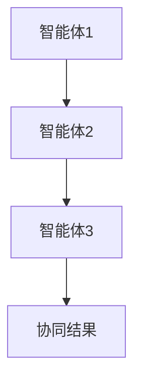
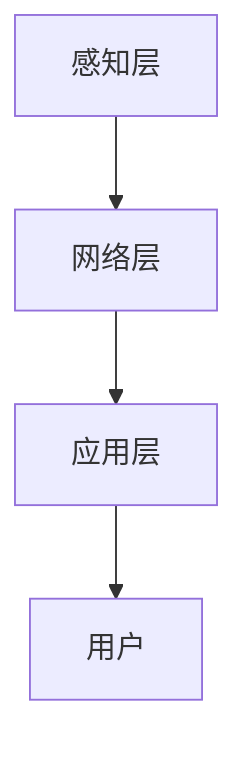
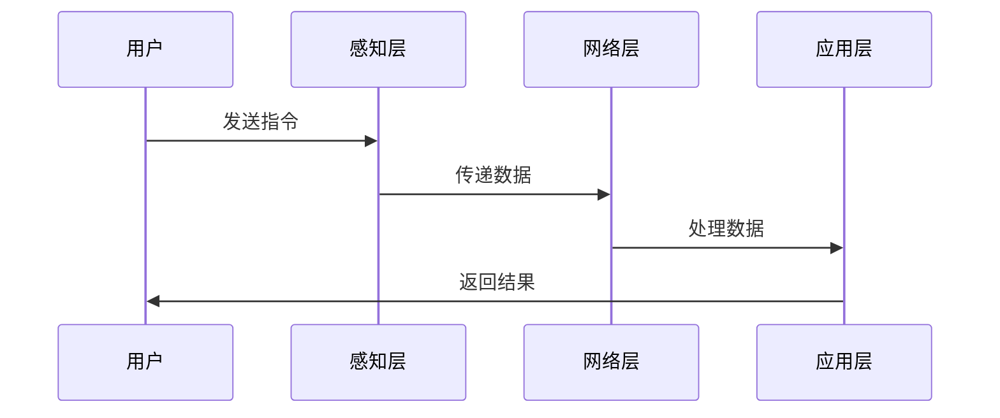

                 


# AI Agent与物联网的结合应用

> 关键词：AI Agent，物联网，智能决策，协同控制，多智能体系统，边缘计算，智能传感器

> 摘要：本文探讨了AI Agent与物联网的结合应用，分析了AI Agent在物联网环境中的核心作用，详细讲解了AI Agent与物联网的技术基础、算法原理、系统架构设计及实际应用场景。文章通过具体案例分析，展示了AI Agent如何提升物联网系统的智能化水平，实现智能决策与自主执行，为物联网领域的技术发展提供了新的思路。

---

## 第1章：AI Agent与物联网的背景与概述

### 1.1 AI Agent的基本概念
- **1.1.1 AI Agent的定义与特点**
  - AI Agent（智能体）的定义：能够感知环境、自主决策并执行任务的智能实体。
  - AI Agent的特点：自主性、反应性、目标导向、学习能力。

- **1.1.2 物联网的基本概念与组成部分**
  - 物联网的定义：通过传感器、网络和智能处理实现物理世界与数字世界的连接。
  - 物联网的组成部分：感知层、网络层、应用层。

- **1.1.3 AI Agent与物联网的结合背景**
  - 物联网数据的爆炸式增长。
  - 对智能决策和自主控制的需求。
  - AI Agent在物联网中的潜在价值。

### 1.2 AI Agent与物联网的结合意义
- 提高物联网系统的智能化水平。
- 实现智能决策与自主执行。
- 推动智能化应用场景的扩展。

---

## 第2章：AI Agent与物联网的核心概念与联系

### 2.1 AI Agent的核心原理
- **2.1.1 知识表示与推理**
  - 知识表示：将现实世界中的信息转化为计算机可处理的形式。
  - 推理机制：基于知识库进行逻辑推理。

- **2.1.2 行为决策机制**
  - 基于状态的决策。
  - 基于目标的决策。
  - 基于学习的决策。

- **2.1.3 与物联网环境的交互方式**
  - 数据采集与处理。
  - 状态感知与反馈。

### 2.2 物联网的核心技术
- **2.2.1 感知层：传感器与数据采集**
  - 各类传感器的作用与原理。
  - 数据采集的准确性与实时性。

- **2.2.2 网络层：数据传输与通信**
  - 无线通信技术（Wi-Fi、蓝牙、NB-IoT）。
  - 数据传输的可靠性与安全性。

- **2.2.3 应用层：数据处理与应用**
  - 数据分析与处理。
  - 应用场景的多样性。

### 2.3 AI Agent与物联网的结合模型
- **2.3.1 实体关系图（ER图）**
  - Mermaid流程图：展示AI Agent与物联网设备、传感器、用户之间的关系。

```mermaid
er
  actor 用户
  actor 设备
  actor 传感器
  actor 网络
  actor 应用
  device 设备
  sensor 传感器
  agent AI Agent
  boundary 数据中心
  relationship 用户与AI Agent的交互
  relationship 设备与传感器的连接
  relationship 网络传输数据到数据中心
  relationship 数据中心处理后反馈给AI Agent
```

- **2.3.2 信息流与数据处理流程**
  - 数据从传感器到AI Agent的流动过程。

---

## 第3章：AI Agent与物联网的技术基础

### 3.1 AI Agent的体系结构
- **3.1.1 分层架构：感知层、决策层、执行层**
  - 分层架构的优势：模块化设计，便于扩展和维护。
  - 每层的功能与交互方式。

- **3.1.2 多智能体协同架构**
  - 多智能体系统的定义。
  - 协同工作的机制与挑战。

- **3.1.3 基于规则的简单AI Agent**
  - 规则驱动的决策方式。
  - 优点与局限性。

### 3.2 物联网的技术架构
- **3.2.1 感知层：传感器与数据采集技术**
  - 各类传感器的工作原理。
  - 数据采集的准确性与实时性。

- **3.2.2 网络层：通信协议与数据传输技术**
  - 无线通信技术的选择与应用。
  - 数据传输的可靠性与安全性。

- **3.2.3 应用层：数据处理与应用开发**
  - 数据分析与处理的方法。
  - 应用场景的多样性。

---

## 第4章：AI Agent与物联网的结合应用

### 4.1 应用场景概述
- **4.1.1 智能家居**
  - AI Agent在智能家居中的角色。
  - 典型场景：智能音箱、智能灯光、智能安防。

- **4.1.2 智慧城市**
  - AI Agent在交通管理、环境监测中的应用。
  - 典型场景：智能交通系统、智能垃圾处理。

- **4.1.3 工业物联网（IIoT）**
  - AI Agent在工业自动化中的应用。
  - 典型场景：设备预测性维护、生产流程优化。

### 4.2 典型应用案例分析
- **4.2.1 智能家居中的AI Agent**
  - 系统架构：传感器、网络、AI Agent、执行设备。
  - 交互流程：用户指令→AI Agent解析→设备执行。
  - 代码示例：家庭温控系统的实现。

```python
# 智能温控系统实现
class Sensor:
    def get_temp(self):
        return 25.0  # 模拟传感器读数

class AIAssistant:
    def __init__(self, sensor):
        self.sensor = sensor
        self.target_temp = 22.0

    def decide_action(self):
        current_temp = self.sensor.get_temp()
        if current_temp > self.target_temp:
            return "降温"
        elif current_temp < self.target_temp:
            return "升温"
        else:
            return "维持现状"

    def execute_action(self, action):
        # 模拟执行器执行动作
        print(f"执行动作：{action}")

# 示例运行
sensor = Sensor()
agent = AIAssistant(sensor)
action = agent.decide_action()
agent.execute_action(action)
```

- **4.2.2 智慧城市中的交通管理**
  - AI Agent在交通信号控制中的应用。
  - 数据流：交通传感器→AI Agent→信号灯控制器。
  - 算法原理：基于实时交通数据的智能决策。

- **4.2.3 工业自动化中的设备协同**
  - AI Agent在设备协同中的作用。
  - 典型场景：预测性维护、生产流程优化。
  - 算法原理：基于历史数据的预测模型。

---

## 第5章：AI Agent与物联网的算法原理

### 5.1 AI Agent的核心算法
- **5.1.1 多智能体协同算法**
  - 基于协商的多智能体协同。
  - 基于拍卖的资源分配。

- **5.1.2 智能决策算法**
  - 基于规则的决策。
  - 基于强化学习的决策。
  - 基于模糊逻辑的决策。

### 5.2 AI Agent与物联网结合的算法实现
- **5.2.1 多智能体协同算法**
  - Mermaid流程图：展示多智能体协同的过程。
  - 代码示例：多智能体协同的实现。



- **5.2.2 智能决策算法**
  - 算法原理：基于强化学习的决策模型。
  - 代码示例：Q-Learning算法的实现。

```python
import numpy as np

class QLearning:
    def __init__(self, state_space, action_space):
        self.state_space = state_space
        self.action_space = action_space
        self.lr = 0.1
        self.gamma = 0.9
        self.q_table = np.zeros((state_space, action_space))

    def choose_action(self, state):
        return np.argmax(self.q_table[state, :])

    def update_q_table(self, state, action, reward, next_state):
        self.q_table[state, action] += self.lr * (reward + self.gamma * np.max(self.q_table[next_state, :]))
```

---

## 第6章：AI Agent与物联网的系统架构设计

### 6.1 系统分析与设计
- **6.1.1 应用场景介绍**
  - 智能家居：温控系统。
  - 智慧城市：交通管理系统。

- **6.1.2 系统功能设计**
  - 领域模型：Mermaid类图。
  - 系统功能模块：数据采集、决策、执行。

### 6.2 系统架构设计
- **6.2.1 框架选择**
  - 分层架构：感知层、网络层、应用层。
  - 微服务架构：模块化设计。

- **6.2.2 架构图**
  - Mermaid架构图：展示系统的整体架构。



### 6.3 接口与交互设计
- **6.3.1 接口设计**
  - 数据采集接口：REST API。
  - 决策模块接口：RPC。

- **6.3.2 交互序列图**
  - Mermaid序列图：展示系统交互流程。



---

## 第7章：AI Agent与物联网的项目实战

### 7.1 项目环境安装
- **7.1.1 环境搭建**
  - 安装Python、传感器库、网络库。
  - 安装机器学习框架（如TensorFlow、PyTorch）。

### 7.2 系统核心实现
- **7.2.1 感知层实现**
  - 传感器数据采集代码。
  - 数据预处理代码。

- **7.2.2 应用层实现**
  - AI Agent核心算法实现。
  - 决策模块代码。

### 7.3 案例分析
- **7.3.1 智能家居案例**
  - 温控系统的实现。
  - 系统运行结果分析。

### 7.4 项目小结
- 项目实现的关键点。
- 经验与教训。

---

## 第8章：AI Agent与物联网的最佳实践与总结

### 8.1 最佳实践
- **8.1.1 系统设计**
  - 模块化设计的重要性。
  - 性能优化的技巧。

- **8.1.2 开发注意事项**
  - 数据安全的保障。
  - 系统可扩展性的设计。

### 8.2 小结
- AI Agent与物联网结合的优势。
- 未来的发展方向。

### 8.3 注意事项
- 系统集成中的常见问题。
- 维护与更新的注意事项。

### 8.4 拓展阅读
- 推荐的书籍与资源。
- 未来的研究方向。

---

通过以上目录，您可以开始撰写完整的文章，逐步深入探讨AI Agent与物联网结合的各个方面，从理论到实践，帮助读者全面理解这一领域的核心内容。

