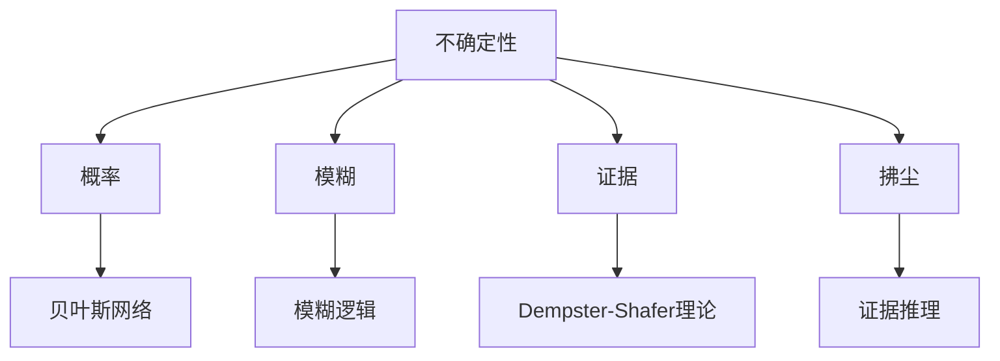
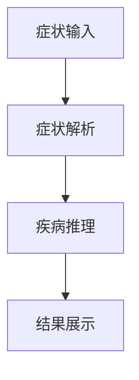

                 


# AI Agent中的不确定性推理与决策

## 关键词
- AI Agent
- 不确定性推理
- 决策系统
- 贝叶斯网络
- Dempster-Shafer理论

## 摘要
本文深入探讨了AI Agent中的不确定性推理与决策问题。首先，介绍了AI Agent的基本概念及其在处理不确定性中的重要性。接着，详细分析了不确定性推理的核心概念，包括概率推理、模糊推理和证据推理等方法。然后，重点讲解了几种常用的不确定性推理算法，如贝叶斯网络和Dempster-Shafer理论，分析了它们的数学模型和应用场景。随后，通过系统架构设计和项目实战，展示了如何将不确定性推理方法应用于实际系统中。最后，总结了设计AI Agent时的最佳实践和未来研究方向。

---

## 第1章 不确定性推理与决策概述

### 1.1 不确定性推理的基本概念

#### 1.1.1 不确定性推理的定义
不确定性推理是指在信息不完全、不一致或模糊的情况下，通过某种方法推导出可能结论的过程。在AI Agent中，不确定性推理是其核心能力之一，因为它需要在动态和复杂的环境中做出合理的决策。

#### 1.1.2 不确定性推理的核心问题
- **信息不完全**：AI Agent可能无法获得所有相关信息。
- **信息不一致**：不同信息源提供的信息可能冲突。
- **决策风险**：决策可能带来不确定的结果，需要权衡利弊。

#### 1.1.3 AI Agent中的不确定性推理
AI Agent通过不确定性推理技术，结合环境信息和内部知识，生成多种可能的决策方案，并评估这些方案的可行性，最终选择最优或满意的结果。

---

### 1.2 AI Agent的定义与特点

#### 1.2.1 AI Agent的定义
AI Agent是一个智能实体，能够感知环境、自主决策并采取行动以实现目标。

#### 1.2.2 AI Agent的核心特点
- **自主性**：无需外部干预，自主决策。
- **反应性**：能够实时感知环境并做出反应。
- **目标导向**：所有行为都围绕实现特定目标展开。

#### 1.2.3 AI Agent与传统决策系统的主要区别
传统决策系统依赖于确定性输入，而AI Agent能够处理不确定性信息，并通过推理生成多种可能的解决方案。

---

### 1.3 不确定性推理与决策的应用场景

#### 1.3.1 自然语言处理中的不确定性
例如，在机器翻译中，语义理解可能存在多种解释，AI Agent需要通过不确定性推理选择最可能的翻译结果。

#### 1.3.2 机器人路径规划中的不确定性
在动态环境中，机器人需要处理传感器噪声和环境变化，通过不确定性推理规划安全路径。

#### 1.3.3 医疗诊断中的不确定性
医生需要根据患者症状、检查结果等信息进行诊断，AI Agent可以辅助医生分析多种可能性。

#### 1.3.4 金融投资中的不确定性
投资者需要在市场波动中做出决策，AI Agent可以通过不确定性推理评估不同投资方案的风险和收益。

---

## 第2章 不确定性推理的核心概念与联系

### 2.1 不确定性推理的原理

#### 2.1.1 概率推理
概率推理基于概率论，通过计算事件发生的概率来推断结论。例如，使用贝叶斯定理更新先验概率。

#### 2.1.2 模糊推理
模糊推理处理模糊信息，例如使用模糊逻辑将“温度很高”量化为一个模糊集合。

#### 2.1.3 证据推理
证据推理整合多个信息源的证据，例如使用Dempster-Shafer理论计算证据的联合概率。

#### 2.1.4 拂尘推理
拂尘推理是一种基于证据的推理方法，通过处理不完整和不一致的证据来推断结论。

---

### 2.2 不确定性推理的核心概念对比

#### 2.2.1 概率推理与模糊推理的对比
| 特性                | 概率推理                          | 模糊推理                          |
|---------------------|-----------------------------------|------------------------------------|
| 处理方式            | 数值概率                          | 模糊集合                          |
| 应用场景            | 贝叶斯网络                        | 模糊逻辑                          |
| 优缺点              | 精确但计算复杂                    | 简单但可能不够精确                |

#### 2.2.2 模糊推理与证据推理的对比
| 特性                | 模糊推理                          | 证据推理                          |
|---------------------|-----------------------------------|------------------------------------|
| 处理方式            | 模糊集合                          | 证据权重                          |
| 应用场景            | 气象预测                          | 医疗诊断                          |
| 优缺点              | 易于实现但缺乏数学基础            | 结果可靠但计算复杂                |

#### 2.2.3 概率推理与拂尘推理的对比
| 特性                | 概率推理                          | 拂尘推理                          |
|---------------------|-----------------------------------|------------------------------------|
| 处理方式            | 条件概率                          | 证据权重                          |
| 应用场景            | 金融投资                          | 刑侦分析                          |
| 优缺点              | 精确但需要大量数据                | 灵活但结果可能不够精确            |

---

### 2.3 不确定性推理的ER实体关系图



---

## 第3章 不确定性推理算法原理

### 3.1 贝叶斯网络

#### 3.1.1 贝叶斯网络的定义
贝叶斯网络是一种有向无环图，节点表示随机变量，边表示变量之间的依赖关系。

#### 3.1.2 贝叶斯网络的构建过程
1. 确定变量和它们之间的关系。
2. 构建概率分布表。
3. 使用贝叶斯推理算法进行推断。

#### 3.1.3 贝叶斯网络的推理算法
- **前向推理**：从已知变量推导未知变量。
- **反向推理**：从观测结果推导原因。

#### 3.1.4 贝叶斯网络的优缺点
- **优点**：计算简单，结果直观。
- **缺点**：构建复杂，计算量大。

---

### 3.2 Dempster-Shafer理论

#### 3.2.1 Dempster-Shafer理论的定义
Dempster-Shafer理论是一种证据推理方法，通过信度函数计算证据的联合概率。

#### 3.2.2 Dempster-Shafer理论的计算步骤
1. 确定证据的基本概率分配。
2. 计算证据的联合概率。
3. 使用Dempster规则融合证据。

#### 3.2.3 Dempster-Shafer理论的优缺点
- **优点**：能够处理多个信息源。
- **缺点**：计算复杂，难以解释。

---

## 第4章 系统分析与架构设计

### 4.1 问题场景介绍

#### 4.1.1 项目介绍
设计一个医疗诊断AI Agent，能够根据患者的症状和检查结果，推断可能的疾病。

#### 4.1.2 系统功能设计
- 症状输入与解析
- 疾病推理与诊断
- 结果展示与解释

#### 4.1.3 系统架构设计


---

## 第5章 项目实战

### 5.1 环境安装

#### 5.1.1 安装Python
使用Anaconda安装Python 3.8及以上版本。

#### 5.1.2 安装依赖库
安装numpy、pandas和scikit-learn等库。

---

### 5.2 系统核心实现源代码

#### 5.2.1 症状解析模块
```python
def parse Symptoms(symptoms):
    # 代码实现
    pass
```

#### 5.2.2 疾病推理模块
```python
def disease_inference(symptoms):
    # 代码实现
    pass
```

#### 5.2.3 结果展示模块
```python
def display_results(results):
    # 代码实现
    pass
```

---

### 5.3 代码应用解读与分析

#### 5.3.1 症状解析模块
解析输入的患者症状，将其转化为可计算的格式。

#### 5.3.2 疾病推理模块
基于贝叶斯网络或Dempster-Shafer理论，推断可能的疾病及其概率。

#### 5.3.3 结果展示模块
将推理结果以用户友好的方式展示，例如概率分布表。

---

### 5.4 实际案例分析

#### 5.4.1 案例介绍
患者出现发热、咳嗽等症状，AI Agent需要推断可能的疾病。

#### 5.4.2 数据分析
通过贝叶斯网络分析，得出患者感染流感的概率为80%。

#### 5.4.3 结果解读
AI Agent建议医生进一步检查是否存在其他并发症。

---

### 5.5 项目小结

通过本项目，我们实现了AI Agent在医疗诊断中的应用，验证了不确定性推理算法的有效性。

---

## 第6章 最佳实践

### 6.1 小结
不确定性推理是AI Agent的核心能力，选择合适的算法和优化系统架构至关重要。

### 6.2 注意事项
- 确保数据质量，避免噪声干扰。
- 定期更新模型，适应新数据。
- 考虑系统的可解释性和可维护性。

### 6.3 拓展阅读
推荐阅读《概率论与数理统计》和《贝叶斯网络入门》等书籍。

---

## 总结
本文系统地探讨了AI Agent中的不确定性推理与决策问题，从理论到实践，全面分析了其核心概念、算法原理和实际应用。通过本文的学习，读者可以深入理解不确定性推理的重要性，并掌握如何将其应用于实际系统中。

