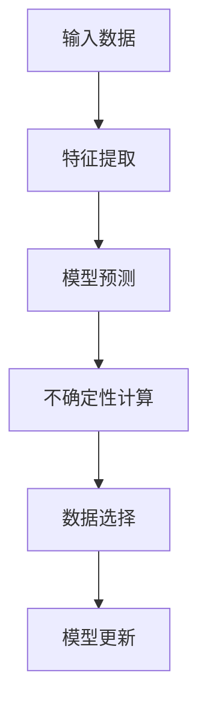
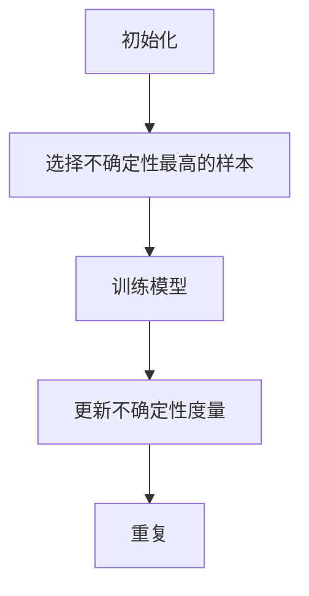
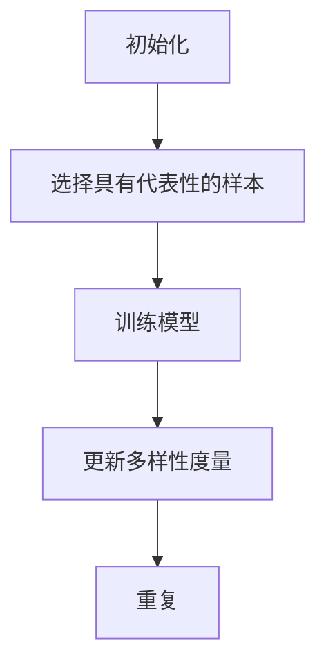
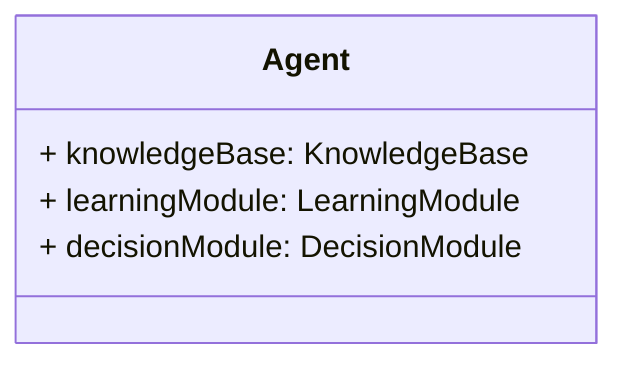
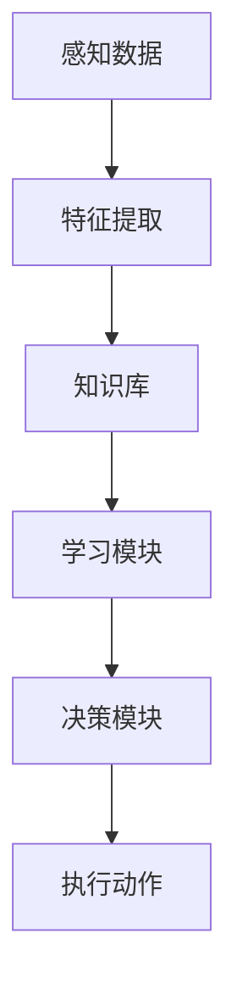
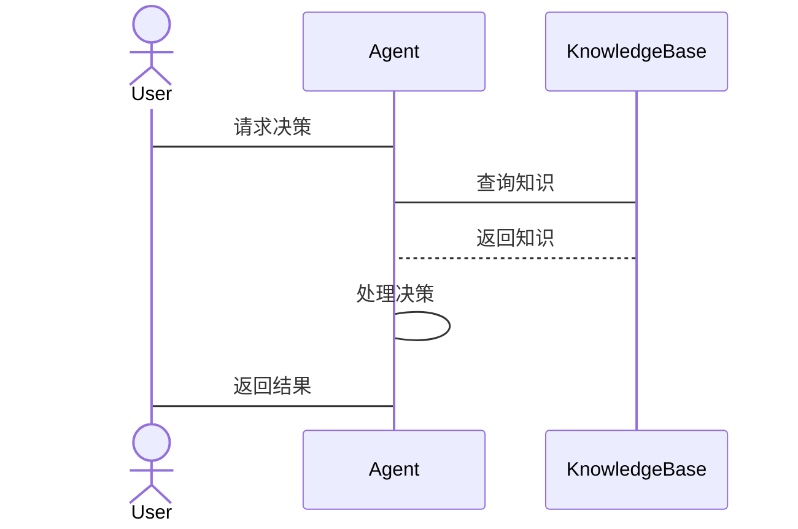

                 


# AI Agent中的主动学习与知识获取

> 关键词：主动学习、知识获取、AI Agent、不确定性采样、多样性采样

> 摘要：本文深入探讨了AI Agent中的主动学习与知识获取的核心概念、算法原理、系统设计及实际应用。通过分析主动学习的基本原理，结合具体的算法实现和系统架构设计，详细阐述了如何在AI Agent中实现高效的知识获取与学习过程。

---

# 第一部分: AI Agent中的主动学习与知识获取基础

# 第1章: 主动学习与知识获取概述

## 1.1 问题背景与描述

### 1.1.1 AI Agent的基本概念
AI Agent（人工智能代理）是一种能够感知环境、自主决策并执行任务的智能实体。它通过与环境交互，利用感知数据进行学习和推理，以实现预定目标。AI Agent的核心能力包括感知、决策、学习和执行。

### 1.1.2 主动学习的定义与特点
主动学习是一种机器学习方法，其中模型能够主动选择最有价值的数据进行学习。与被动学习不同，主动学习强调数据选择的主动性，目标是通过最少的数据量获得最佳的学习效果。其特点包括：
1. 主动性：模型主动选择数据。
2. 效率性：通过选择关键数据减少学习成本。
3. 适应性：能够根据反馈调整学习策略。

### 1.1.3 知识获取的核心问题
知识获取是AI Agent实现智能决策的关键步骤。知识获取的核心问题包括：
1. 知识表示：如何将知识以适当的形式表示。
2. 知识获取途径：通过数据、规则或人机交互获取知识。
3. 知识更新：如何动态更新知识以适应环境变化。

## 1.2 问题解决与边界

### 1.2.1 主动学习的目标与意义
主动学习的目标是通过优化数据选择策略，提高模型的学习效率和准确性。在AI Agent中，主动学习能够帮助模型更快地适应复杂环境，提升决策能力。

### 1.2.2 知识获取的边界与外延
知识获取的边界包括：
1. 数据范围：仅限于特定领域或任务。
2. 时间限制：在限定时间内完成知识获取。
3. 知识深度：获取的知识深度是否足以支持决策。

知识获取的外延包括：
1. 知识表示形式：从符号逻辑到概率模型。
2. 知识来源：包括数据、规则和人机交互。
3. 知识更新机制：动态调整知识库。

### 1.2.3 AI Agent中的主动学习与知识获取的联系
在AI Agent中，主动学习与知识获取密切相关。主动学习通过选择关键数据，帮助知识获取模块更高效地构建知识库。知识获取则为主动学习提供反馈，指导数据选择策略的优化。

## 1.3 核心概念结构与要素

### 1.3.1 主动学习的流程模型
主动学习的流程模型包括以下步骤：
1. 初始化：选择初始数据集。
2. 学习：利用当前数据训练模型。
3. 选择：根据模型预测结果选择新的数据。
4. 更新：将新数据加入训练集，重复学习过程。

### 1.3.2 知识获取的层次结构
知识获取的层次结构包括：
1. 数据层：原始感知数据。
2. 表示层：知识的符号化表示。
3. 推理层：基于知识的推理与决策。

### 1.3.3 核心要素的对比分析
下表对比了主动学习和被动学习的核心要素：

| 对比维度 | 主动学习                  | 被动学习                  |
|----------|---------------------------|---------------------------|
| 数据选择 | 主动选择最有价值的数据     | 依赖标注数据，被动接受     |
| 学习效率 | 高，数据选择优化           | 较低，依赖数据量的增加       |
| 适用场景 | 少标签数据，需要高效学习    | 标签数据充足，无需优化选择   |

## 1.4 本章小结

通过本章的介绍，我们了解了AI Agent中的主动学习与知识获取的基本概念、目标和核心要素。主动学习通过优化数据选择策略，帮助AI Agent高效地进行知识获取和学习。

---

# 第二部分: 主动学习的核心概念与原理

# 第2章: 主动学习的核心原理

## 2.1 主动学习的基本原理

### 2.1.1 主动学习的驱动因素
主动学习的驱动因素包括：
1. 数据稀缺性：在数据不足的情况下，主动选择关键数据进行学习。
2. 学习效率：通过减少数据量，降低计算成本。
3. 领域适应性：针对特定领域进行优化。

### 2.1.2 核心算法的特征对比
下表对比了主动学习算法的特征：

| 算法名称       | 数据选择策略                | 适用场景                     | 优缺点                       |
|----------------|-----------------------------|------------------------------|----------------------------|
| 不确定性采样    | 选择不确定性最高的样本        | 分类别任务                   | 高效，但可能忽略多样性       |
| 多样性采样      | 选择具有代表性的样本          | 分类别任务                   | 保持多样性，但计算复杂        |
| 最小化不确定性  | 选择能够减少模型不确定性的样本  | 回归任务                     | 高效，但依赖于模型的不确定性   |

### 2.1.3 主动学习与被动学习的异同
主动学习与被动学习的异同如下：
- 相同点：都是一种监督学习方法，依赖于标注数据。
- 不同点：主动学习强调数据选择的主动性，被动学习依赖于数据的被动输入。

## 2.2 知识获取的机制分析

### 2.2.1 知识表示的多样性
知识表示的多样性包括：
1. 符号表示：使用符号逻辑表示知识。
2. 概率表示：使用概率模型表示知识。
3. 图结构表示：使用图模型表示知识的关联性。

### 2.2.2 知识推理的逻辑性
知识推理的逻辑性包括：
1. 前向推理：从已知事实推导新的结论。
2. 后向推理：从目标推导达到目标的条件。
3. 类比推理：通过类比推理扩展知识。

### 2.2.3 知识更新的动态性
知识更新的动态性包括：
1. 动态学习：根据新数据动态更新知识库。
2. 知识融合：将新知识与已有知识融合。
3. 知识消解：消除知识中的矛盾与不确定性。

## 2.3 实体关系图与流程图

### 2.3.1 熵模型
熵公式为：
$$ H = -\sum p_i \log p_i $$

### 2.3.2 马尔可夫模型
马尔可夫假设：
$$ P(x_t | x_{t-1}) $$

### 2.3.3 主动学习的流程图


## 2.4 本章小结

通过本章的介绍，我们深入理解了主动学习的核心原理，包括数据选择策略、知识获取机制以及相关的数学模型。这些内容为后续的算法实现和系统设计奠定了基础。

---

# 第三部分: 主动学习算法的数学模型与实现

# 第3章: 主动学习算法的数学模型

## 3.1 不确定性采样

### 3.1.1 算法流程图


### 3.1.2 算法实现
```python
import numpy as np
from sklearn.svm import SVC

def uncertainty_sampling(X, y, model, num_samples=100):
    # 初始化模型
    model.fit(X, y)
    # 计算不确定性
    uncertainty = model.predict_proba(X)[:, 1]
    # 选择不确定性最高的样本
    selected_indices = np.argsort(-uncertainty)[:num_samples]
    return selected_indices
```

### 3.1.3 算法的数学模型
不确定性采样的数学模型如下：
$$ u(x_i) = \max(p(y|x_i), 1-p(y|x_i)) $$

## 3.2 多样性采样

### 3.2.1 算法流程图


### 3.2.2 算法实现
```python
def diversity_sampling(X, y, model, num_samples=100):
    # 初始化模型
    model.fit(X, y)
    # 计算样本之间的相似性
    similarity_matrix = np.dot(X, X.T)
    # 选择具有代表性的样本
    selected_indices = np.argmax(similarity_matrix, axis=1)[:num_samples]
    return selected_indices
```

### 3.2.3 算法的数学模型
多样性采样的数学模型如下：
$$ d(x_i, x_j) = 1 - \cos(\theta) $$

## 3.3 本章小结

通过本章的详细讲解，我们掌握了主动学习算法的核心数学模型与实现方法。不确定性采样和多样性采样是两种常用的主动学习算法，各有优缺点，适用于不同的场景。

---

# 第四部分: 系统分析与架构设计

# 第4章: 系统分析与架构设计

## 4.1 系统功能设计

### 4.1.1 领域模型


### 4.1.2 系统架构图


## 4.2 系统接口设计

### 4.2.1 系统接口
1. 数据接口：与感知模块交互，获取感知数据。
2. 知识库接口：与知识库模块交互，进行知识查询和更新。
3. 决策接口：与决策模块交互，提供决策支持。

## 4.3 系统交互设计

### 4.3.1 系统交互序列图


## 4.4 本章小结

通过本章的系统分析与架构设计，我们了解了AI Agent的整体架构及各模块之间的交互关系。系统设计为后续的实现提供了清晰的指导。

---

# 第五部分: 项目实战

# 第5章: 项目实战

## 5.1 环境安装

### 5.1.1 安装依赖
```bash
pip install numpy scikit-learn mermaid4jupyter
```

## 5.2 系统核心实现

### 5.2.1 知识获取模块实现
```python
class Knowledge获取器:
    def __init__(self, knowledge_base):
        self.knowledge_base = knowledge_base
    def 获取知识(self, 查询):
        # 实现知识获取逻辑
        pass
```

### 5.2.2 主动学习模块实现
```python
class 主动学习器:
    def __init__(self, 模型):
        self.模型 = 模型
    def 选择数据(self, 数据集):
        # 实现数据选择逻辑
        pass
```

## 5.3 代码应用解读与分析

### 5.3.1 代码功能分析
1. 知识获取器：负责从知识库中获取知识。
2. 主动学习器：负责选择最有价值的数据进行学习。

## 5.4 实际案例分析

### 5.4.1 案例分析
假设我们有一个分类任务，目标是通过主动学习选择最有价值的数据进行训练。

### 5.4.2 代码实现
```python
from sklearn.datasets import make_classification
from sklearn.svm import SVC
import numpy as np

X, y = make_classification(n_samples=100, n_features=2, n_classes=2, random_state=42)

def uncertainty_sampling(X, y, model, num_samples=10):
    model.fit(X, y)
    uncertainty = model.predict_proba(X)[:, 1]
    selected_indices = np.argsort(-uncertainty)[:num_samples]
    return selected_indices

selected_indices = uncertainty_sampling(X, y, SVC(), num_samples=10)
print(selected_indices)
```

## 5.5 项目小结

通过本章的项目实战，我们掌握了主动学习算法的具体实现方法，并通过实际案例分析验证了算法的有效性。

---

# 第六部分: 总结与展望

# 第6章: 总结与展望

## 6.1 核心要点总结

### 6.1.1 主动学习的核心概念
主动学习是一种通过优化数据选择策略来提高学习效率的机器学习方法。

### 6.1.2 知识获取的关键步骤
知识获取包括数据选择、知识表示和知识推理三个关键步骤。

### 6.1.3 系统设计的重要性
系统设计为AI Agent的实现提供了整体架构和模块划分的指导。

## 6.2 最佳实践 tips

### 6.2.1 数据选择策略
选择合适的数据选择策略可以显著提高学习效率。

### 6.2.2 知识表示形式
选择合适的知识表示形式可以提高知识推理的效率和准确性。

### 6.2.3 系统架构设计
合理的系统架构设计可以提高系统的可扩展性和可维护性。

## 6.3 小结

通过本文的详细讲解，我们掌握了AI Agent中的主动学习与知识获取的核心概念、算法实现和系统设计方法。这些内容为我们进一步研究和实践提供了坚实的基础。

## 6.4 注意事项

### 6.4.1 数据选择的合理性
数据选择策略需要根据具体任务和数据特点进行调整。

### 6.4.2 知识表示的准确性
知识表示的准确性直接影响知识推理的效果。

### 6.4.3 系统架构的可扩展性
系统架构设计需要考虑未来可能的功能扩展。

## 6.5 拓展阅读

### 6.5.1 推荐书籍
1. 《主动学习：理论与算法》
2. 《知识表示与推理》

### 6.5.2 推荐论文
1. “Active Learning: An Overview” by Mark A. Fard
2. “Knowledge Representation and Reasoning” by Stuart Russell and Peter Norvig

---

# 结语

AI Agent中的主动学习与知识获取是一个复杂而重要的研究领域。通过本文的系统介绍，我们不仅掌握了相关的核心概念和算法实现，还了解了系统设计的关键要点。未来，随着AI技术的不断发展，主动学习与知识获取将在更多领域发挥重要作用。

