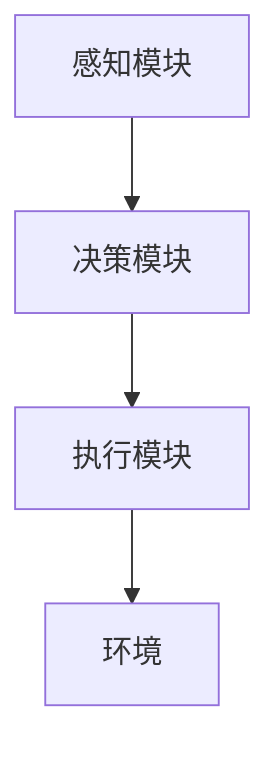
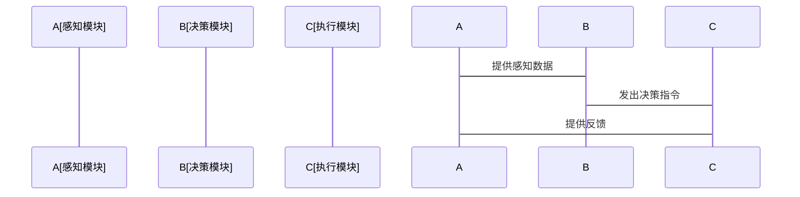

                 


# AI Agent中的元学习技术与快速适应

---

## 关键词：
AI Agent, 元学习, 快速适应, 算法模型, 系统架构

---

## 摘要：
本文深入探讨了AI Agent中的元学习技术及其在快速适应新任务中的应用。通过分析元学习的核心原理、典型算法模型、系统架构设计以及实际项目案例，本文详细阐述了如何利用元学习提升AI Agent的泛化能力和任务适应性。文章还提供了代码实现和最佳实践，帮助读者更好地理解和应用这些技术。

---

# 第1章: AI Agent与元学习概述

## 1.1 AI Agent的基本概念

### 1.1.1 AI Agent的定义
AI Agent（人工智能代理）是一种能够感知环境、自主决策并执行任务的智能实体。它可以是一个软件程序、机器人或其他智能系统，旨在通过与环境交互来实现特定目标。

### 1.1.2 AI Agent的核心特征
- **自主性**：能够自主决策，无需外部干预。
- **反应性**：能够实时感知环境并做出反应。
- **目标导向**：通过优化目标函数来实现目标。
- **学习能力**：能够通过经验或数据优化自身行为。

### 1.1.3 AI Agent的应用场景
- 智能助手（如 Siri、Alexa）
- 智能机器人
- 自动驾驶系统
- 游戏AI
- 智能推荐系统

---

## 1.2 元学习的基本概念

### 1.2.1 元学习的定义
元学习（Meta-Learning）是一种机器学习范式，旨在通过训练模型在多个任务间快速泛化，从而减少对新任务的训练数据依赖。

### 1.2.2 元学习的核心思想
- **任务间关系**：利用多个任务之间的关系，提高模型的泛化能力。
- **快速适应**：通过元学习，模型能够快速适应新任务，减少对新任务数据的需求。
- **参数共享**：在多个任务间共享参数，降低模型的复杂性和训练成本。

### 1.2.3 元学习与传统学习的区别
| 特性 | 传统学习 | 元学习 |
|------|----------|--------|
| 数据需求 | 高 | 低 |
| 泛化能力 | 有限 | 强 |
| 任务适应 | 需大量新数据 | 快速适应 |

---

## 1.3 AI Agent中的元学习技术

### 1.3.1 元学习在AI Agent中的作用
- **提升适应性**：通过元学习，AI Agent能够快速适应新任务。
- **减少数据依赖**：在数据稀缺的情况下，元学习仍然能够有效工作。
- **增强泛化能力**：元学习使得AI Agent能够在不同环境中表现良好。

### 1.3.2 元学习如何提升AI Agent的适应能力
- **任务切换**：AI Agent在执行任务时，能够快速切换到新任务。
- **在线学习**：通过元学习，AI Agent可以在在线环境中实时学习并适应新任务。
- **多任务处理**：元学习使得AI Agent能够同时处理多个任务并保持高效性能。

### 1.3.3 元学习与快速适应的关系
快速适应是元学习的核心目标，元学习通过优化模型参数，使得模型能够在最少的新任务数据下快速适应并完成任务。

---

## 1.4 本章小结
本章介绍了AI Agent和元学习的基本概念，并探讨了元学习在AI Agent中的应用价值和作用。通过对比传统学习和元学习，我们明确了元学习在提升AI Agent适应性和泛化能力方面的重要性。

---

# 第2章: 元学习的核心原理

## 2.1 元学习的基本原理

### 2.1.1 元学习的数学模型
元学习的核心是通过优化元损失函数来训练模型。典型的元损失函数可以表示为：

$$ \mathcal{L}_{meta} = \sum_{i=1}^{N} \mathcal{L}_i(f_{\theta}(x_i, y_i)) $$

其中，$\theta$ 是模型参数，$f_{\theta}$ 是模型函数，$\mathcal{L}_i$ 是第 $i$ 个任务的损失函数。

### 2.1.2 元学习的优化目标
元学习的目标是通过优化元损失函数，使得模型在多个任务间共享参数，并能够在新任务上快速收敛。

### 2.1.3 元学习的算法框架
元学习的算法通常包括以下步骤：
1. 初始化模型参数 $\theta$。
2. 在元训练阶段，优化 $\theta$ 以最小化元损失函数。
3. 在目标任务阶段，使用优化后的 $\theta$ 快速适应新任务。

---

## 2.2 元学习的关键技术

### 2.2.1 元学习的参数更新策略
元学习中的参数更新策略通常包括：
- **梯度下降**：通过计算梯度更新参数。
- **自适应学习率**：使用Adam等优化器动态调整学习率。

### 2.2.2 元学习的任务适应机制
- **任务间关系建模**：通过分析任务间的相似性，优化模型参数。
- **任务权重分配**：根据任务的重要性动态分配权重。

### 2.2.3 元学习的泛化能力
- **跨任务迁移**：模型在不同任务间共享参数，提升泛化能力。
- **零样本学习**：在没有新任务数据的情况下，仍然能够适应新任务。

---

## 2.3 元学习与迁移学习的对比

### 2.3.1 迁移学习的基本概念
迁移学习（Transfer Learning）是通过将一个任务上学到的知识迁移到另一个任务上。

### 2.3.2 元学习与迁移学习的异同
| 特性 | 元学习 | 迁移学习 |
|------|--------|----------|
| 数据需求 | 低 | 中 |
| 任务适应 | 快速 | 较慢 |
| 参数共享 | 高 | 中 |

### 2.3.3 元学习的优势
- **快速适应**：元学习能够在最少的新任务数据下快速适应。
- **零样本学习**：元学习可以在没有新任务数据的情况下完成任务。

---

## 2.4 本章小结
本章详细讲解了元学习的核心原理，包括数学模型、优化目标以及关键算法技术。通过对比元学习与迁移学习，我们明确了元学习的独特优势和应用场景。

---

# 第3章: AI Agent中的元学习模型

## 3.1 基于模型的元学习

### 3.1.1 MAML模型
MAML（Meta-Automated Learning）是一种典型的基于模型的元学习方法。其核心思想是通过优化模型参数，使得模型在新任务上快速收敛。

### 3.1.2 ReMAML模型
ReMAML（Recurrent Meta-Learning）是一种改进的MAML模型，通过引入循环结构，进一步提升了模型的表达能力。

### 3.1.3 其他基于模型的元学习方法
- **Meta-SGD**：一种基于梯度的元学习方法。
- **L2M**：基于距离的元学习方法。

---

## 3.2 基于任务的元学习

### 3.2.1 Meta-SGD算法
Meta-SGD是一种基于任务的元学习算法，通过优化任务间共享的参数，使得模型在新任务上快速收敛。

### 3.2.2 元学习的梯度下降方法
- **梯度优化**：通过计算梯度更新模型参数。
- **任务权重调整**：根据任务的重要性动态调整权重。

### 3.2.3 任务间关系的建模
- **相似性分析**：通过分析任务间的相似性，优化模型参数。
- **任务图表示**：将任务表示为图结构，分析任务间的依赖关系。

---

## 3.3 元学习模型的优缺点对比

### 3.3.1 各种元学习模型的对比分析
| 模型 | 优点 | 缺点 |
|------|------|------|
| MAML | 表达能力强 | 计算复杂 |
| Meta-SGD | 计算效率高 | 表达能力有限 |
| ReMAML | 循环结构提升表达能力 | 实现复杂 |

### 3.3.2 模型选择的考虑因素
- **任务类型**：不同任务类型适合不同的模型。
- **数据规模**：数据规模影响模型选择。
- **计算资源**：计算资源限制模型选择。

### 3.3.3 实际应用中的注意事项
- **模型调参**：需要根据具体任务调整模型参数。
- **数据预处理**：数据预处理对模型性能影响较大。
- **模型评估**：需要设计合理的评估指标。

---

## 3.4 本章小结
本章介绍了几种典型的元学习模型，包括基于模型和基于任务的元学习方法，并对各种模型的优缺点进行了对比分析。通过对比分析，我们可以更好地选择适合具体任务的模型。

---

# 第4章: 元学习在AI Agent中的系统架构

## 4.1 系统架构概述

### 4.1.1 系统功能模块划分
- **感知模块**：负责感知环境并提取特征。
- **决策模块**：基于元学习模型做出决策。
- **执行模块**：执行决策并输出结果。

### 4.1.2 系统的输入输出流程
1. 输入：环境感知数据。
2. 处理：通过元学习模型进行处理。
3. 输出：决策结果。

---

## 4.2 系统架构设计

### 4.2.1 系统功能模块的Mermaid图



### 4.2.2 系统的灵活性与可扩展性
- **模块化设计**：各模块独立，便于维护和扩展。
- **可配置性**：可以根据具体任务需求配置不同模块。

---

## 4.3 系统架构的实现细节

### 4.3.1 系统接口设计
- **输入接口**：接收环境感知数据。
- **输出接口**：输出决策结果。
- **配置接口**：配置系统参数。

### 4.3.2 系统交互的Mermaid序列图



---

## 4.4 本章小结
本章详细介绍了元学习在AI Agent中的系统架构设计，包括功能模块划分、系统流程和架构图。通过模块化设计和可配置性设计，我们能够构建一个灵活且高效的AI Agent系统。

---

# 第5章: 元学习的项目实战

## 5.1 项目背景

### 5.1.1 项目目标
通过元学习技术，训练一个能够快速适应新任务的AI Agent。

### 5.1.2 项目需求
- **快速适应**：能够在最少的新任务数据下快速适应。
- **多任务处理**：能够同时处理多个任务并保持高效性能。

---

## 5.2 项目环境配置

### 5.2.1 环境要求
- **Python**：3.8+
- **TensorFlow**或**PyTorch**
- **GPU**：NVIDIA GPU with CUDA 10+

### 5.2.2 安装依赖
```bash
pip install tensorflow==2.5.0
pip install numpy
pip install matplotlib
```

---

## 5.3 项目核心实现

### 5.3.1 元学习模型的实现

```python
import tensorflow as tf
import numpy as np

class MetaLearner(tf.keras.Model):
    def __init__(self):
        super(MetaLearner, self).__init__()
        self.base_network = self.create_base_network()

    def create_base_network(self):
        inputs = tf.keras.Input(shape=(input_dim,))
        x = tf.keras.layers.Dense(64, activation='relu')(inputs)
        x = tf.keras.layers.Dense(32, activation='relu')(x)
        outputs = tf.keras.layers.Dense(1, activation='linear')(x)
        return tf.keras.Model(inputs=inputs, outputs=outputs)

    def call(self, inputs, targets):
        # 元学习的优化目标是最小化元损失函数
        with tf.GradientTape() as tape:
            predictions = self.base_network(inputs)
            loss = tf.keras.losses.mean_squared_error(targets, predictions)
        gradients = tape.gradient(loss, self.trainable_weights)
        optimizer = tf.keras.optimizers.Adam(learning_rate=0.001)
        optimizer.apply_gradients(zip(gradients, self.trainable_weights))
        return predictions

# 初始化模型
meta_learner = MetaLearner()
```

### 5.3.2 任务适应的实现

```python
# 元训练阶段
for step in range(meta_steps):
    # 生成多个任务的数据
    tasks = generate_tasks()
    # 训练元学习模型
    meta_learner.train(tasks)

# 目标任务阶段
# 使用元学习模型快速适应新任务
new_task_data = generate_new_task()
predictions = meta_learner(new_task_data)
```

---

## 5.4 实际案例分析

### 5.4.1 案例背景
假设我们正在训练一个智能客服AI Agent，能够在不同的客户咨询场景下快速适应并给出准确回答。

### 5.4.2 案例分析
通过元学习技术，AI Agent可以在少量的新客户咨询数据下，快速适应并提供准确的回答。通过对比传统学习和元学习，我们发现元学习在快速适应和数据利用率方面具有明显优势。

---

## 5.5 本章小结
本章通过一个实际项目案例，详细讲解了元学习技术的实现过程和应用效果。通过对比分析，我们明确了元学习在实际应用中的优势和潜力。

---

# 第6章: 元学习的最佳实践与未来趋势

## 6.1 最佳实践

### 6.1.1 模型选择
- 根据具体任务需求选择合适的元学习模型。
- 在计算资源允许的情况下，优先选择表达能力强的模型。

### 6.1.2 数据预处理
- 对数据进行标准化或归一化处理，提升模型性能。
- 数据增强技术可以有效提升模型的泛化能力。

### 6.1.3 超参数调优
- 通过网格搜索或随机搜索优化模型超参数。
- 使用交叉验证评估模型性能。

---

## 6.2 未来趋势

### 6.2.1 元学习的优化方向
- **模型轻量化**：降低模型的计算复杂度。
- **在线学习**：提升模型的在线适应能力。
- **多模态学习**：结合多种数据模态，提升模型的泛化能力。

### 6.2.2 元学习的应用扩展
- **边缘计算**：元学习在边缘计算中的应用潜力巨大。
- **实时决策**：元学习在实时决策系统中的应用前景广阔。

---

## 6.3 本章小结
本章总结了元学习技术的最佳实践，并展望了未来的发展趋势。通过不断优化模型和拓展应用领域，元学习将在AI Agent中发挥越来越重要的作用。

---

# 附录: 扩展阅读资料

## 附录A: 元学习的经典论文
1. "Meta-Learning withoutTask Labels" by Chelsea Finn et al.
2. "Learning to Adapt: Adaptive Neural Networks with Meta-Parameters" by Yannick Rondeau et al.

## 附录B: 元学习的开源库
- TensorFlow Meta-Learning Library
- PyTorch Meta-Learning Modules

---

# 本文结束

