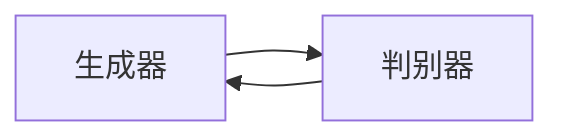
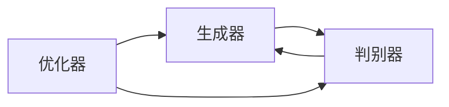

                 


# AI Agent中的对抗学习与鲁棒性增强

> 关键词：对抗学习，鲁棒性增强，AI Agent，机器学习，深度学习，强化学习，系统安全

> 摘要：本文深入探讨了AI Agent中对抗学习与鲁棒性增强的核心概念、算法原理、系统架构以及项目实战。通过详细分析对抗学习的基本原理、鲁棒性增强的实现方法及其在AI Agent中的应用，结合数学模型、算法流程图和代码示例，帮助读者理解如何通过对抗学习提升AI Agent的鲁棒性，并增强其在复杂环境中的适应能力。同时，本文还提供了系统设计的架构图和交互序列图，以直观展示系统的实现方案，并通过具体案例分析，指导读者在实际项目中应用这些技术。

---

## 第1章: 对抗学习与鲁棒性增强的背景介绍

### 1.1 对抗学习的基本概念

#### 1.1.1 什么是对抗学习
对抗学习（Adversarial Learning）是一种机器学习技术，通过两个或多个模型（称为生成器和判别器）之间的对抗过程进行训练。生成器的目标是生成能够欺骗判别器的样本，而判别器的目标是识别出这些样本与真实样本之间的区别。

- 对抗学习的核心思想来源于博弈论，两个模型在对抗中互相提升性能。
- 生成器和判别器之间的对抗关系使得生成模型能够生成更逼真、更符合目标分布的数据。

#### 1.1.2 对抗学习的核心要素
对抗学习的核心要素包括生成器、判别器、损失函数和优化过程。

- **生成器**：负责生成样本，目标是让判别器无法区分生成样本和真实样本。
- **判别器**：负责区分生成样本和真实样本，目标是最小化分类错误率。
- **损失函数**：用于衡量生成器和判别器的性能，通常是交叉熵损失函数。
- **优化过程**：通过交替训练生成器和判别器，逐步优化模型参数。

#### 1.1.3 对抗学习的应用场景
对抗学习广泛应用于图像生成、语音合成、自然语言处理等领域，尤其在AI Agent中，对抗学习可以用于生成对抗样本、增强模型的鲁棒性。

### 1.2 鲁棒性增强的基本概念

#### 1.2.1 鲁棒性的定义
鲁棒性（Robustness）是指系统在面对噪声、干扰或异常输入时仍然能够保持正常功能的能力。在AI Agent中，鲁棒性意味着模型在面对对抗样本或异常输入时仍能准确识别和决策。

#### 1.2.2 鲁棒性增强的目标
鲁棒性增强的目标是提升AI模型在面对对抗攻击或异常情况时的抗干扰能力和准确性。通过鲁棒性增强，AI Agent可以在复杂和不确定的环境中保持稳定性能。

#### 1.2.3 鲁棒性增强的实现方法
鲁棒性增强可以通过多种方法实现，包括：
- **对抗训练**：通过生成对抗样本，增强模型的鲁棒性。
- **扰动训练**：在训练过程中引入随机扰动，提升模型的泛化能力。
- **不确定性估计**：通过概率模型估计输入的不确定性，增强模型的鲁棒性。

### 1.3 AI Agent中的对抗学习与鲁棒性增强的关系

#### 1.3.1 对抗学习在AI Agent中的作用
对抗学习在AI Agent中起到关键作用，通过生成对抗样本和训练模型识别这些样本，增强模型的鲁棒性和泛化能力。

#### 1.3.2 鲁棒性增强对AI Agent的影响
鲁棒性增强能够提升AI Agent在面对对抗攻击和异常情况时的稳定性和准确性，增强系统的安全性。

#### 1.3.3 两者的结合与应用
对抗学习和鲁棒性增强的结合能够显著提升AI Agent的性能，通过对抗训练生成更强大的对抗样本，同时通过鲁棒性增强提升模型的抗干扰能力，使AI Agent在复杂环境中表现更优异。

---

## 第2章: 对抗学习与鲁棒性增强的核心概念与联系

### 2.1 对抗学习的原理

#### 2.1.1 对抗训练的基本流程
对抗训练的基本流程包括生成器和判别器的交替训练。

- **生成器训练**：生成器尝试生成与真实样本相似的样本，判别器给出反馈，生成器根据反馈调整参数。
- **判别器训练**：判别器尝试区分生成样本和真实样本，生成器给出反馈，判别器根据反馈调整参数。
- **交替优化**：生成器和判别器在交替训练中不断优化，最终达到纳什均衡。

#### 2.1.2 对抗网络的结构
对抗网络通常由生成器和判别器组成，生成器通常采用卷积生成网络（如DCGAN），判别器采用卷积判别网络。



#### 2.1.3 对抗学习中的损失函数
对抗学习的损失函数通常包括生成器损失和判别器损失。

- 生成器损失：$L_G = -\log(D(G(x)))$
- 判别器损失：$L_D = -[\log(D(x)) + \log(1-D(G(x)))]

### 2.2 鲁棒性增强的原理

#### 2.2.1 鲁棒性增强的基本方法
鲁棒性增强的基本方法包括：
- **对抗训练**：通过生成对抗样本，增强模型的鲁棒性。
- **扰动训练**：在训练中引入随机扰动，提升模型的泛化能力。
- **不确定性估计**：通过概率模型估计输入的不确定性，增强鲁棒性。

#### 2.2.2 鲁棒性增强的数学模型
鲁棒性增强可以通过优化模型的损失函数来实现，损失函数可以表示为：

$$L = \mathbb{E}_{x \sim \mathcal{D}} \left[ \max_{\delta} \mathcal{L}(f(x+\delta), y) \right]$$

其中，$\delta$是扰动，$\mathcal{L}$是损失函数。

#### 2.2.3 鲁棒性增强的实现步骤
鲁棒性增强的实现步骤包括：
1. 生成对抗样本。
2. 训练模型识别对抗样本。
3. 优化模型参数，增强鲁棒性。

### 2.3 对抗学习与鲁棒性增强的联系

#### 2.3.1 对抗学习如何提升鲁棒性
对抗学习通过生成对抗样本，增强模型的鲁棒性，使模型能够识别更多的样本，提升模型的泛化能力。

#### 2.3.2 鲁棒性增强如何优化对抗学习
鲁棒性增强能够优化对抗学习的过程，使生成器和判别器的对抗更加有效，提升对抗学习的效果。

#### 2.3.3 两者的结合对AI Agent性能的提升
对抗学习和鲁棒性增强的结合能够显著提升AI Agent的性能，使AI Agent在复杂环境中表现更优异。

---

## 第3章: 对抗学习的算法原理与数学模型

### 3.1 对抗学习的算法原理

#### 3.1.1 GAN（生成对抗网络）的原理
GAN（Generative Adversarial Networks）由生成器和判别器组成，生成器生成样本，判别器区分真实样本和生成样本。


#### 3.1.2 GAN的损失函数
GAN的损失函数包括生成器损失和判别器损失。

- 生成器损失：$L_G = -\log(D(G(x)))$
- 判别器损失：$L_D = -[\log(D(x)) + \log(1-D(G(x)))]

#### 3.1.3 GAN的训练过程
GAN的训练过程包括生成器和判别器的交替训练，最终达到纳什均衡。

### 3.2 对抗学习的数学模型

#### 3.2.1 对抗网络的数学表达
对抗网络的数学表达包括生成器和判别器的参数和损失函数。

- 生成器：$G(x; \theta_g)$
- 判别器：$D(x; \theta_d)$
- 损失函数：$L_G = -\log(D(G(x)))$，$L_D = -[\log(D(x)) + \log(1-D(G(x)))]

---

## 第4章: 鲁棒性增强的算法原理与数学模型

### 4.1 鲁棒性增强的算法原理

#### 4.1.1 基于对抗训练的鲁棒性增强
基于对抗训练的鲁棒性增强通过生成对抗样本，增强模型的鲁棒性。

#### 4.1.2 基于扰动的鲁棒性增强
基于扰动的鲁棒性增强在训练中引入随机扰动，提升模型的泛化能力。

#### 4.1.3 基于不确定性估计的鲁棒性增强
基于不确定性估计的鲁棒性增强通过概率模型估计输入的不确定性，增强模型的鲁棒性。

### 4.2 鲁棒性增强的数学模型

#### 4.2.1 鲁棒性增强的数学表达
鲁棒性增强的数学表达包括损失函数和优化目标。

- 损失函数：$L = \mathbb{E}_{x \sim \mathcal{D}} \left[ \max_{\delta} \mathcal{L}(f(x+\delta), y) \right]$
- 优化目标：最小化损失函数，使模型在面对扰动时表现更优。

---

## 第5章: 系统分析与架构设计方案

### 5.1 问题场景介绍

#### 5.1.1 对抗学习与鲁棒性增强的应用场景
对抗学习与鲁棒性增强在图像识别、语音识别、自然语言处理等领域有广泛应用。

#### 5.1.2 系统功能设计
系统功能设计包括生成对抗样本、训练模型识别对抗样本、优化模型参数，增强模型的鲁棒性。

### 5.2 系统功能设计

#### 5.2.1 领域模型
领域模型包括生成器、判别器和优化器。



#### 5.2.2 系统架构设计
系统架构设计包括生成器、判别器和优化器的交互。


#### 5.2.3 系统交互设计
系统交互设计包括生成对抗样本、训练模型识别对抗样本、优化模型参数的过程。

---

## 第6章: 项目实战

### 6.1 环境安装

#### 6.1.1 安装Python
安装Python 3.8及以上版本。

#### 6.1.2 安装依赖库
安装TensorFlow、Keras、PyTorch等深度学习框架。

### 6.2 系统核心实现源代码

#### 6.2.1 生成器实现
生成器实现：

```python
import tensorflow as tf
from tensorflow.keras import layers

def generator():
    model = tf.keras.Sequential()
    model.add(layers.Dense(256, activation='relu', input_dim=100))
    model.add(layers.Dense(784, activation='sigmoid'))
    return model
```

#### 6.2.2 判别器实现
判别器实现：

```python
def discriminator():
    model = tf.keras.Sequential()
    model.add(layers.Dense(256, activation='relu', input_dim=784))
    model.add(layers.Dense(1, activation='sigmoid'))
    return model
```

#### 6.2.3 对抗训练实现
对抗训练实现：

```python
def train(G, D, optimizer, epochs=100, batch_size=128):
    for epoch in range(epochs):
        for _ in range(batch_size):
            # 生成器训练
            with tf.GradientTape() as tape:
                fake = G(noise)
                d_fake = D(fake)
                g_loss = -tf.math.log(d_fake)
                gradients_g = tape.gradient(g_loss, G.trainable_weights)
                optimizer.apply_gradients(G.trainable_weights, gradients_g)
            
            # 判别器训练
            with tf.GradientTape() as tape:
                real = real_data
                d_real = D(real)
                d_fake = D(fake)
                d_loss = - (tf.math.log(d_real) + tf.math.log(1 - d_fake))
                gradients_d = tape.gradient(d_loss, D.trainable_weights)
                optimizer.apply_gradients(D.trainable_weights, gradients_d)
```

### 6.3 案例分析

#### 6.3.1 案例背景
案例背景：训练一个生成对抗网络，生成手写数字。

#### 6.3.2 数据预处理
数据预处理：使用MNIST数据集，归一化处理。

#### 6.3.3 模型训练
模型训练：训练生成器和判别器，生成手写数字。

#### 6.3.4 结果分析
结果分析：生成器能够生成逼真的手写数字，判别器能够准确区分生成样本和真实样本。

---

## 第7章: 最佳实践、小结与注意事项

### 7.1 最佳实践

#### 7.1.1 对抗学习与鲁棒性增强的结合
对抗学习与鲁棒性增强的结合能够显著提升模型的鲁棒性和泛化能力。

#### 7.1.2 模型优化
模型优化包括调整生成器和判别器的参数，选择合适的优化算法。

### 7.2 小结

对抗学习和鲁棒性增强在AI Agent中具有重要的应用价值，通过对抗训练生成对抗样本，增强模型的鲁棒性，提升模型的泛化能力。

### 7.3 注意事项

- **模型过拟合**：对抗学习可能导致生成器和判别器过拟合，需要引入正则化方法。
- **训练稳定性**：对抗训练可能不稳定，需要选择合适的优化算法和学习率。
- **计算资源**：对抗训练需要大量的计算资源，需要优化训练过程。

### 7.4 拓展阅读

- **生成对抗网络（GAN）**：深入理解GAN的原理和应用。
- **鲁棒性增强**：研究鲁棒性增强的最新进展和应用。

---

# 结语

通过对对抗学习与鲁棒性增强的深入探讨，我们能够更好地理解它们在AI Agent中的重要作用。通过对抗训练生成对抗样本，增强模型的鲁棒性，提升模型的泛化能力，使AI Agent在复杂环境中表现更优异。未来，随着对抗学习和鲁棒性增强技术的不断发展，AI Agent将在更多领域展现出强大的应用潜力。

