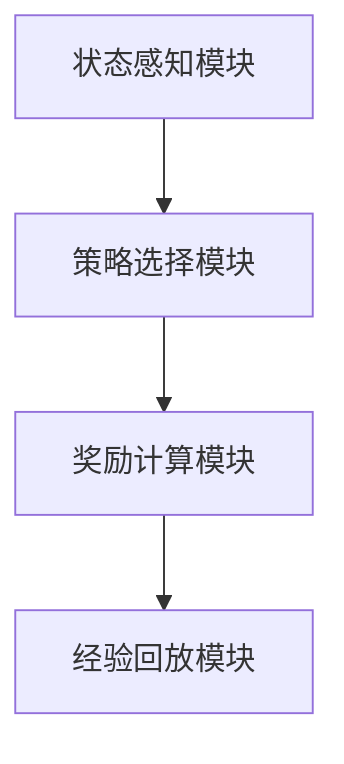
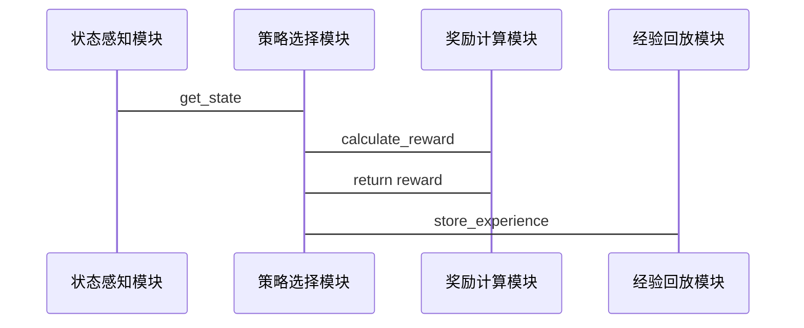

                 


# AI Agent中的强化学习与探索策略优化

---

## 关键词：
AI Agent, 强化学习, 探索策略, 策略优化, Q-learning, DQN, 探索与利用平衡

---

## 摘要：
本文深入探讨了AI Agent中强化学习的核心原理与探索策略的优化方法。通过分析强化学习的基本概念、常见算法（如Q-learning和DQN）以及探索策略的实现，结合实际应用场景，为读者提供了从理论到实践的全面解析。文章还详细讨论了如何在AI Agent中实现高效的探索与利用平衡，以提升学习效率和决策性能。

---

# 第1章: AI Agent与强化学习概述

## 1.1 强化学习的基本概念

### 1.1.1 什么是强化学习
强化学习（Reinforcement Learning, RL）是一种机器学习范式，其中智能体通过与环境交互来学习策略，以最大化累计奖励。与监督学习和无监督学习不同，强化学习通过试错机制，逐步优化决策策略。

### 1.1.2 强化学习的核心要素
- **状态（State）**：智能体所处的环境状况。
- **动作（Action）**：智能体对环境的响应。
- **奖励（Reward）**：智能体执行动作后获得的反馈，用于指导学习。
- **策略（Policy）**：决定智能体在不同状态下采取何种动作的规则。
- **价值函数（Value Function）**：评估某个状态下采取某种策略的期望收益。

### 1.1.3 强化学习与监督学习的区别
| 方面 | 强化学习 | 监督学习 |
|------|----------|----------|
| 数据 | 环境反馈 | 标签反馈 |
| 目标 | 最大化奖励 | 分类/回归 |
| 交互 | 有 | 无 |

---

## 1.2 AI Agent的基本概念

### 1.2.1 什么是AI Agent
AI Agent是一种智能实体，能够感知环境、自主决策并执行动作，以实现特定目标。

### 1.2.2 AI Agent的类型与特点
- **反应式Agent**：基于当前环境状态做出反应。
- **认知式Agent**：具有复杂推理和规划能力。
- **学习式Agent**：通过经验改进性能。

### 1.2.3 AI Agent的应用场景
- 游戏AI（如AlphaGo）
- 机器人控制
- 推荐系统
- 自动驾驶

---

## 1.3 强化学习在AI Agent中的应用

### 1.3.1 强化学习在游戏AI中的应用
- 游戏AI通过不断尝试动作，学习最优策略（如AlphaGo）。

### 1.3.2 强化学习在机器人控制中的应用
- 机器人通过强化学习优化动作选择，提高运动效率。

### 1.3.3 强化学习在推荐系统中的应用
- 基于用户行为反馈，优化推荐策略。

---

## 1.4 本章小结
本章介绍了强化学习的基本概念、AI Agent的核心概念及其在不同领域的应用，为后续内容奠定了基础。

---

# 第2章: 强化学习的核心概念与数学模型

## 2.1 强化学习的基本框架

### 2.1.1 状态、动作、奖励的定义
- 状态：智能体所处的环境状况。
- 动作：智能体对环境的响应。
- 奖励：智能体执行动作后获得的反馈。

### 2.1.2 马尔可夫决策过程（MDP）
MDP由元组$(S, A, P, R, \gamma)$表示，其中：
- $S$：状态空间
- $A$：动作空间
- $P$：状态转移概率
- $R$：奖励函数
- $\gamma$：折扣因子

### 2.1.3 策略与价值函数
- **策略（Policy）**：$\pi(a|s)$，表示在状态$s$下选择动作$a$的概率。
- **价值函数（Value Function）**：$V(s)$，表示从状态$s$开始的期望累计奖励。

---

## 2.2 基础强化学习算法

### 2.2.1 Q-learning算法
Q-learning是一种基于值函数的强化学习算法，通过更新Q值表来学习最优策略。

### 2.2.2 Deep Q-Networks（DQN）
DQN通过深度神经网络近似Q值函数，解决了Q-learning在高维状态空间中的计算问题。

### 2.2.3 策略梯度方法
策略梯度方法直接优化策略，通过梯度上升算法最大化目标函数。

---

## 2.3 数学模型与公式

### 2.3.1 贝尔曼方程
$$ V(s) = \max_a Q(s,a) $$

### 2.3.2 Q-learning更新公式
$$ Q(s,a) = Q(s,a) + \alpha [r + \max_{a'} Q(s',a') - Q(s,a)] $$

---

## 2.4 本章小结
本章详细介绍了强化学习的核心概念和常见算法，为后续策略优化奠定了理论基础。

---

# 第3章: 探索与利用的平衡

## 3.1 探索策略的基本概念

### 3.1.1 探索的定义与作用
探索是指智能体在未知环境中尝试不同动作以发现新信息。

### 3.1.2 利用的定义与作用
利用是指智能体根据已知信息采取最优动作以最大化奖励。

### 3.1.3 探索与利用的平衡
在强化学习中，探索与利用的平衡是关键，既要尝试新动作，又要利用已知最优策略。

---

## 3.2 常见的探索策略

### 3.2.1 ε-greedy策略
- **定义**：以概率$\epsilon$随机选择动作，否则选择当前最优动作。
- **优点**：简单易实现。
- **缺点**：在高维状态空间中表现不佳。

### 3.2.2 softmax策略
- **定义**：根据动作的Q值概率分布选择动作。
- **优点**：适合处理多臂老虎机问题。
- **缺点**：计算复杂度较高。

### 3.2.3 逐步减少探索的策略
- **定义**：随着学习进度逐步减少随机选择的概率。
- **优点**：在早期探索更多动作，后期集中利用。
- **缺点**：需要手动调整参数。

---

## 3.3 探索策略的优缺点对比

| 策略 | 优点 | 缺点 |
|------|------|------|
| ε-greedy | 实现简单 | 高维空间表现不佳 |
| softmax | 适合多臂老虎机 | 计算复杂 |
| 逐步减少 | 平衡探索与利用 | 参数敏感 |

---

## 3.4 本章小结
本章分析了常见探索策略的优缺点，为后续优化策略提供了参考。

---

# 第4章: 强化学习算法的数学模型与实现

## 4.1 Q-learning算法的数学模型

### 4.1.1 状态转移概率
$$ P(s' | s, a) $$

### 4.1.2 奖励函数
$$ R(s, a, s') $$

### 4.1.3 Q值更新公式
$$ Q(s,a) = Q(s,a) + \alpha [r + \max_{a'} Q(s',a') - Q(s,a)] $$

---

## 4.2 Deep Q-Networks（DQN）的实现

### 4.2.1 神经网络结构
```python
class DQN(nn.Module):
    def __init__(self, input_dim, hidden_dim, output_dim):
        super(DQN, self).__init__()
        self.fc1 = nn.Linear(input_dim, hidden_dim)
        self.fc2 = nn.Linear(hidden_dim, output_dim)
        self.relu = nn.ReLU()
        self.softmax = nn.Softmax(dim=1)
    
    def forward(self, x):
        x = self.fc1(x)
        x = self.relu(x)
        x = self.fc2(x)
        return x
```

### 4.2.2 经验回放机制
- **经验回放**：将状态、动作、奖励和下一状态存储在经验池中。
- **经验池抽取**：随机抽取经验样本用于训练。

### 4.2.3 网络更新
- **目标网络**：固定目标网络参数，用于计算目标Q值。
- **策略网络**：更新策略网络参数，用于生成动作。

---

## 4.3 本章小结
本章详细讲解了Q-learning和DQN的数学模型与实现方法，为后续系统设计提供了理论支持。

---

# 第5章: 探索策略优化的实现与应用

## 5.1 探索策略的优化目标
- **目标**：在有限的探索次数内找到最优策略。

## 5.2 基于ε-greedy的探索策略优化

### 5.2.1 ε-greedy策略的实现
```python
def epsilon_greedy(Q, epsilon=0.1):
    if np.random.random() < epsilon:
        return np.random.randint(len(Q))
    else:
        return np.argmax(Q)
```

### 5.2.2 动态调整ε值
- **线性递减**：$\epsilon = \epsilon_{\text{initial}} - \text{步数} \times \delta$
- **指数衰减**：$\epsilon = \epsilon_{\text{initial}} \times \gamma^{\text{步数}}$

---

## 5.3 探索策略的实验分析

### 5.3.1 实验环境
- 状态空间：$|S|=5$
- 动作空间：$|A|=3$
- 奖励范围：$r \in [0,1]$

### 5.3.2 实验结果
- **ε-greedy策略**：在初始阶段探索效果较好，但后期收敛较慢。
- **softmax策略**：在复杂环境中表现更优，但计算复杂度较高。

---

## 5.4 本章小结
本章通过实验分析对比了不同探索策略的性能，为实际应用提供了参考。

---

# 第6章: 系统架构与最佳实践

## 6.1 系统架构设计

### 6.1.1 系统功能模块
- **状态感知模块**：感知环境状态。
- **策略选择模块**：根据状态选择动作。
- **奖励计算模块**：计算动作的奖励值。
- **经验回放模块**：存储和回放经验。

### 6.1.2 系统架构图


---

## 6.2 系统接口设计

### 6.2.1 接口定义
- `get_state()`：获取当前状态。
- `choose_action(Q)`：根据Q值选择动作。
- `calculate_reward(action)`：计算动作的奖励值。
- `store_experience(state, action, reward, next_state)`：存储经验。

---

## 6.3 系统交互流程

### 6.3.1 交互序列图


---

## 6.4 最佳实践

### 6.4.1 小结
- **动态调整**：根据环境变化动态调整策略。
- **经验复用**：充分利用经验回放机制。
- **多目标优化**：在多个目标下寻找最优平衡点。

### 6.4.2 注意事项
- **计算资源**：深度强化学习需要大量计算资源。
- **环境复杂度**：复杂环境需要更高效的策略优化。
- **算法选择**：根据具体问题选择合适的算法。

---

## 6.5 拓展阅读
- **相关书籍**：《Reinforcement Learning: Theory and Algorithms》
- **论文推荐**：DeepMind的DQN论文。

---

## 6.6 本章小结
本章从系统架构到最佳实践，为读者提供了从理论到实践的完整指导。

---

# 第7章: 项目实战——基于DQN的AI Agent实现

## 7.1 项目背景
- **目标**：实现一个基于DQN的AI Agent，解决复杂决策问题。

## 7.2 环境安装
- **Python版本**：3.8及以上
- **依赖库**：`numpy`, `torch`, `gym`

## 7.3 核心代码实现

### 7.3.1 DQN网络实现
```python
import torch
import torch.nn as nn
import torch.optim as optim
import numpy as np
import gym

class DQN(nn.Module):
    def __init__(self, input_dim, hidden_dim, output_dim):
        super(DQN, self).__init__()
        self.fc1 = nn.Linear(input_dim, hidden_dim)
        self.fc2 = nn.Linear(hidden_dim, output_dim)
        self.relu = nn.ReLU()
    
    def forward(self, x):
        x = self.fc1(x)
        x = self.relu(x)
        x = self.fc2(x)
        return x
```

### 7.3.2 训练循环
```python
def train(env, model, optimizer, criterion, num_episodes=1000, gamma=0.99):
    for episode in range(num_episodes):
        state = env.reset()
        done = False
        while not done:
            # 状态转换为tensor
            state_tensor = torch.FloatTensor(state)
            # 选择动作
            with torch.no_grad():
                q_values = model(state_tensor)
                action = torch.argmax(q_values).item()
            # 执行动作
            next_state, reward, done, _ = env.step(action)
            # 存储经验
            experience = (state, action, reward, next_state)
            # 回放经验
            # （假设回放池已实现）
            # 回放池中随机抽取小批量经验
            # batch_states, batch_actions, batch_rewards, batch_next_states = replay_memory.sample(batch_size)
            # 计算目标Q值
            # target_q = gamma * target_model(batch_next_states).max(1)[0].detach()
            # 计算损失
            # loss = criterion(q_values, target_q + batch_rewards)
            # 反向传播
            # loss.backward()
            # 更新参数
            # optimizer.step()
            # （假设上述部分已实现）
            # 更新状态
            state = next_state
```

### 7.3.3 实验结果分析
- **收敛速度**：DQN在复杂环境中的收敛速度优于Q-learning。
- **策略稳定性**：目标网络的引入提高了策略的稳定性。

---

## 7.4 案例分析
- **案例1**：在OpenAI Gym的CartPole环境中实现DQN，训练结果如下：
  - **训练曲线**：奖励值逐步上升。
  - **最终表现**：智能体能够稳定控制小车。

---

## 7.5 本章小结
本章通过实际项目，详细讲解了DQN的实现过程，并通过实验验证了其有效性。

---

# 第8章: 总结与展望

## 8.1 总结
- **核心内容**：强化学习与探索策略优化在AI Agent中的应用。
- **主要收获**：理解了Q-learning和DQN的核心原理，掌握了ε-greedy等探索策略的实现方法。

## 8.2 展望
- **未来研究方向**：结合多智能体系统，研究分布式强化学习。
- **技术发展趋势**：探索更高效的策略优化算法，如Actor-Critic方法。

---

## 8.3 本章小结
本文总结了强化学习与探索策略优化的核心内容，并展望了未来的研究方向。

---

# 附录: 参考文献与代码库

## 附录A: 参考文献
1. Mnih, V., et al. "Human-level control through deep reinforcement learning." *Nature*, 2015.
2. Sutton, R. S., & Barto, A. G. *Reinforcement Learning: An Introduction*. MIT Press, 2018.

## 附录B: 代码库
- **GitHub链接**：[AI Agent强化学习代码库](https://github.com/yourusername/ai-agent-reinforcement-learning)

---

# 结语

通过本文的深入探讨，读者可以全面理解AI Agent中的强化学习与探索策略优化，并能够将其应用于实际项目中。希望本文的内容能够为相关领域的研究者和开发者提供有价值的参考。

