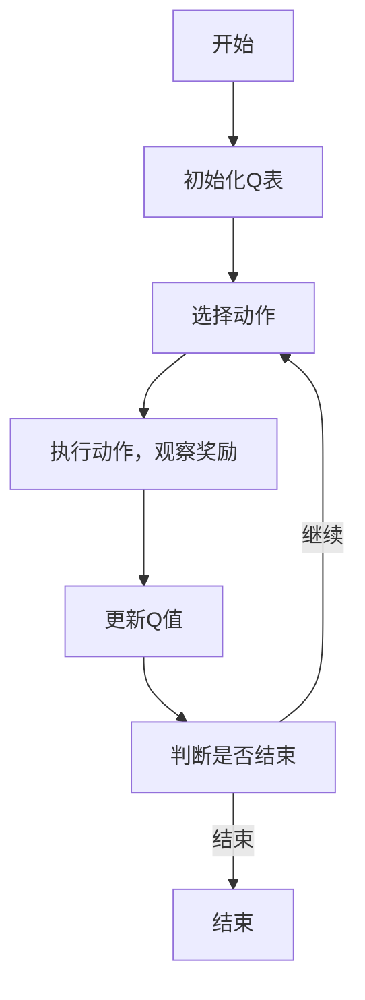
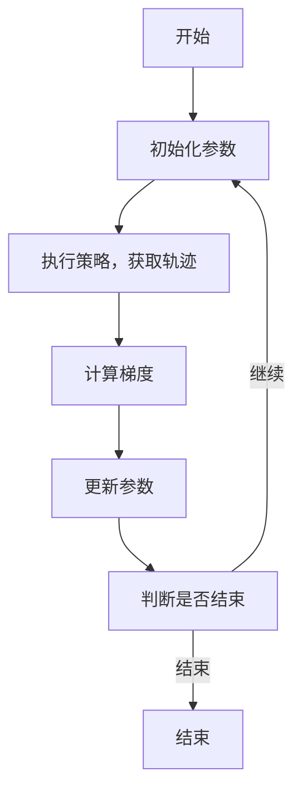
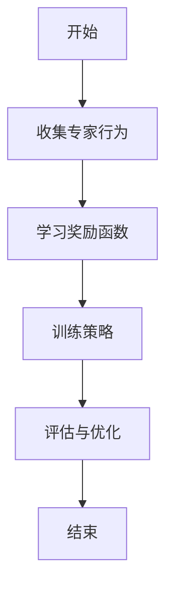
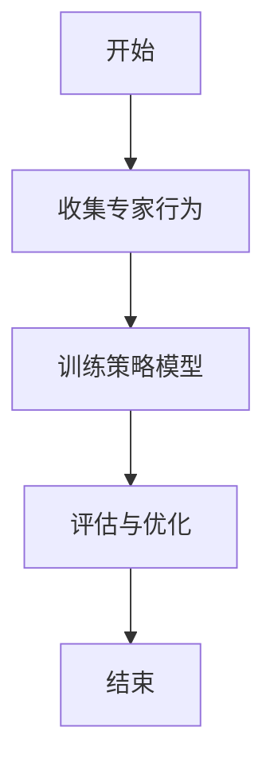
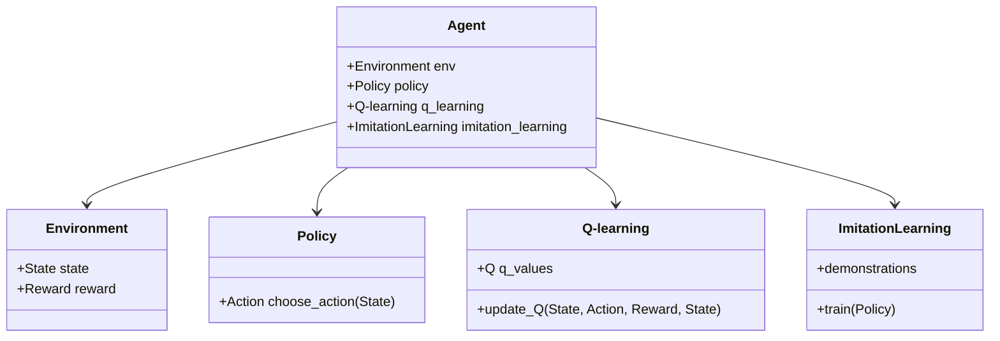
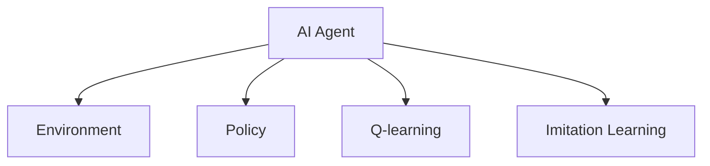
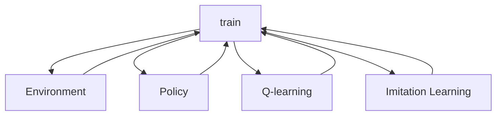

                 


# AI Agent中的强化学习与模仿学习结合

## 关键词：AI Agent, 强化学习, 模仿学习, 算法结合, 应用实践

## 摘要：本文探讨了AI Agent中强化学习与模仿学习的结合，分析了两种学习方法的原理与优势，并通过系统架构设计和实际案例展示了如何将两者有效结合，提升AI Agent的智能性和实用性。文章内容涵盖核心概念、算法原理、系统设计及项目实战，为读者提供了全面而深入的指导。

---

## 第1章: AI Agent的基本概念与应用背景

### 1.1 AI Agent的定义与特点
#### 1.1.1 AI Agent的定义
AI Agent（人工智能代理）是指能够感知环境、做出决策并执行动作的智能实体。AI Agent可以通过传感器获取信息，并根据目标和约束条件自主行动，以实现特定任务。

#### 1.1.2 AI Agent的核心特点
- **自主性**：能够在没有外部干预的情况下自主运行。
- **反应性**：能够实时感知环境变化并做出响应。
- **目标导向**：通过明确的目标或奖励机制驱动行为。
- **学习能力**：能够通过经验或数据不断优化自身行为。

#### 1.1.3 AI Agent的应用场景
AI Agent广泛应用于机器人控制、自动驾驶、游戏AI、智能推荐系统等领域。例如，在自动驾驶中，AI Agent需要实时感知路况并做出决策；在游戏AI中，AI Agent需要通过学习策略来提高游戏水平。

---

### 1.2 强化学习与模仿学习的基本概念
#### 1.2.1 强化学习的定义与特点
强化学习（Reinforcement Learning, RL）是一种通过试错机制来学习策略的方法。学习过程中，智能体通过与环境交互，获得奖励或惩罚信号，逐步优化自己的行为策略。

- **核心要素**：
  - 状态（State）：环境当前的状况。
  - 动作（Action）：智能体可以执行的操作。
  - 奖励（Reward）：智能体行为的反馈，用于评估行为的好坏。
  - 策略（Policy）：智能体选择动作的概率分布。
  - 值函数（Value Function）：评估状态或动作-状态对的价值。

#### 1.2.2 模仿学习的定义与特点
模仿学习（Imitation Learning）是一种通过观察和模仿专家行为来学习策略的方法。与强化学习不同，模仿学习通常需要参考专家的示范行为，并从中提取规律。

- **核心要素**：
  - 示范数据（Demonstration Data）：由专家提供的行为轨迹。
  - 状态（State）：环境当前的状况。
  - 动作（Action）：专家在特定状态下的选择。
  - 策略（Policy）：通过模仿专家行为生成的策略。

#### 1.2.3 强化学习与模仿学习的对比
| 对比维度 | 强化学习 | 模仿学习 |
|----------|----------|----------|
| 数据来源 | 环境反馈 | 专家示范 |
| 优化目标 | 奖励函数 | 行为与专家一致 |
| 稳定性 | 易受探索空间影响 | 更易收敛 |
| 样本效率 | 通常较低 | 通常较高 |

---

### 1.3 强化学习与模仿学习的结合意义
#### 1.3.1 结合强化学习与模仿学习的必要性
- **互补性**：强化学习适用于未知环境中的探索，而模仿学习适用于已知任务的快速学习。
- **稳定性与效率**：通过结合两种方法，可以在保持较高效率的同时，提高策略的稳定性。

#### 1.3.2 结合后的优势与应用前景
- **加速收敛**：利用模仿学习的高效性，减少强化学习的探索时间。
- **提升性能**：结合两种方法可以提高AI Agent在复杂环境中的表现。
- **广泛应用**：在自动驾驶、机器人控制等领域具有广阔的应用前景。

---

## 第2章: 强化学习的原理与算法

### 2.1 强化学习的基本原理
#### 2.1.1 状态、动作与奖励的定义
- **状态（State）**：智能体所处的环境状况，例如自动驾驶中的车速、距离等。
- **动作（Action）**：智能体可以执行的操作，例如加速、刹车等。
- **奖励（Reward）**：智能体行为的反馈，例如完成任务后的奖励或碰撞后的惩罚。

#### 2.1.2 马尔可夫决策过程（MDP）
马尔可夫决策过程是一种数学模型，用于描述强化学习问题。它由状态空间、动作空间、转移概率和奖励函数组成。

#### 2.1.3 动作选择策略（ε-greedy）
ε-greedy策略是一种常用的探索与利用策略。智能体以概率ε选择随机动作（探索），以概率1-ε选择当前最优动作（利用）。

---

### 2.2 强化学习的核心算法
#### 2.2.1 Q-learning算法
Q-learning是一种经典的值函数迭代算法，通过更新Q表来学习状态-动作对的价值。

**算法流程图：**



**Python代码示例：**

```python
import numpy as np

class QLearning:
    def __init__(self, state_space, action_space, learning_rate=0.1, gamma=0.9):
        self.state_space = state_space
        self.action_space = action_space
        self.lr = learning_rate
        self.gamma = gamma
        self.Q = np.zeros((state_space, action_space))

    def choose_action(self, state, epsilon=0.1):
        if np.random.random() < epsilon:
            return np.random.randint(self.action_space)
        else:
            return np.argmax(self.Q[state])

    def update_Q(self, state, action, reward, next_state):
        self.Q[state, action] = self.Q[state, action] + self.lr * (reward + self.gamma * np.max(self.Q[next_state]) - self.Q[state, action])
```

---

#### 2.2.2 策略梯度方法（Policy Gradient）
策略梯度是一种直接优化策略的算法，通过计算策略的梯度来更新参数。

**算法流程图：**



**Python代码示例：**

```python
import torch
import torch.nn as nn

class PolicyGradient:
    def __init__(self, state_dim, action_dim, hidden_dim=32, learning_rate=0.01):
        self.actor = nn.Sequential(
            nn.Linear(state_dim, hidden_dim),
            nn.ReLU(),
            nn.Linear(hidden_dim, action_dim)
        )
        self.optimizer = torch.optim.Adam(self.actor.parameters(), lr=learning_rate)

    def choose_action(self, state):
        state = torch.FloatTensor(state)
        logits = self.actor(state)
        action_probs = torch.softmax(logits, dim=0)
        action = torch.multinomial(action_probs, 1).item()
        return action

    def update_policy(self, rewards, actions, states):
        states = torch.FloatTensor(np.array(states))
        actions = torch.LongTensor(np.array(actions))
        rewards = torch.FloatTensor(np.array(rewards))

        logits = self.actor(states)
        loss = torch.mean(-torch.log(torch.softmax(logits, dim=1)) * rewards[torch.arange(len(actions)), actions])
        self.optimizer.zero_grad()
        loss.backward()
        self.optimizer.step()
```

---

#### 2.2.3 深度强化学习（Deep RL）
深度强化学习将深度学习与强化学习结合，用于处理高维状态空间的问题。

**数学模型：**

- **值函数近似**：
  $$ Q(s, a; \theta) = \theta^T \phi(s, a) $$
  其中，$\theta$为网络参数，$\phi$为特征函数。

- **策略梯度近似**：
  $$ \nabla J(\theta) = \mathbb{E}[ \nabla \log \pi(a|s) Q(s,a) ] $$

---

## 第3章: 模仿学习的原理与算法

### 3.1 模仿学习的基本原理
#### 3.1.1 模仿学习的定义与特点
模仿学习通过观察专家行为，学习专家的决策策略。其核心思想是通过匹配专家的决策过程，逐步优化自身的策略。

#### 3.1.2 模仿学习的核心思想
- **监督学习与强化学习的结合**：模仿学习可以看作是一种监督学习，通过专家的示范数据进行训练，同时结合强化学习的目标函数。

---

### 3.2 模仿学习的核心算法
#### 3.2.1 逆强化学习（Inverse Reinforcement Learning）
逆强化学习通过观察专家行为，推断出奖励函数，从而学习专家的决策策略。

**算法流程图：**



**Python代码示例：**

```python
import numpy as np
from sklearn import linear_model

class InverseReinforcementLearning:
    def __init__(self, state_space, action_space):
        self.state_space = state_space
        self.action_space = action_space
        self.model = linear_model.LinearRegression()

    def fit(self, states, actions):
        # 将状态转换为特征向量
        X = np.array(states)
        y = np.array(actions)
        self.model.fit(X, y)

    def predict(self, state):
        return self.model.predict(np.array(state).reshape(1, -1))[0]
```

---

#### 3.2.2 模拟学习（Demonstration-based Learning）
模拟学习通过收集专家的示范数据，直接训练策略模型。

**算法流程图：**



---

## 第4章: 系统分析与架构设计

### 4.1 项目背景
在本项目中，我们旨在设计一个结合强化学习与模仿学习的AI Agent，用于解决复杂环境中的决策问题。

---

### 4.2 系统功能设计
#### 4.2.1 领域模型（Domain Model）
领域模型描述了AI Agent与环境之间的交互关系。

**领域模型类图：**



---

### 4.3 系统架构设计
#### 4.3.1 系统架构图
系统架构图展示了AI Agent的整体结构。



---

### 4.4 系统接口设计
- **输入接口**：接收环境状态和专家示范数据。
- **输出接口**：输出AI Agent的动作和策略更新信息。

---

### 4.5 系统交互流程
**交互流程图：**



---

## 第5章: 项目实战

### 5.1 环境搭建
安装必要的库：
```bash
pip install numpy matplotlib torch
```

---

### 5.2 核心代码实现
#### 5.2.1 强化学习部分
```python
import numpy as np
import torch
import torch.nn as nn

class DQN(nn.Module):
    def __init__(self, input_dim, output_dim):
        super(DQN, self).__init__()
        self.fc = nn.Sequential(
            nn.Linear(input_dim, 32),
            nn.ReLU(),
            nn.Linear(32, output_dim)
        )

    def forward(self, x):
        return self.fc(x)

# 初始化
env = GymEnvironment('CartPole-v1')
input_dim = env.observation_space.shape[0]
output_dim = env.action_space.n
model = DQN(input_dim, output_dim)
optimizer = torch.optim.Adam(model.parameters(), lr=0.001)
criterion = nn.MSELoss()

# 训练
for episode in range(1000):
    state = env.reset()
    while not done:
        q_values = model(torch.FloatTensor(state))
        action = torch.argmax(q_values).item()
        next_state, reward, done, _ = env.step(action)
        target = torch.FloatTensor([reward + (0 if done else 0.1 * np.max(q_values))])
        loss = criterion(q_values, target)
        optimizer.zero_grad()
        loss.backward()
        optimizer.step()
```

---

#### 5.2.2 模仿学习部分
```python
import torch
import torch.nn as nn

class ImitationModel(nn.Module):
    def __init__(self, input_dim, output_dim):
        super(ImitationModel, self).__init__()
        self.fc = nn.Sequential(
            nn.Linear(input_dim, 32),
            nn.ReLU(),
            nn.Linear(32, output_dim)
        )

    def forward(self, x):
        return self.fc(x)

# 初始化
expert_demonstrations = load_expert_data()
input_dim = expert_demonstrations['state'].shape[1]
output_dim = expert_demonstrations['action'].shape[1]
model = ImitationModel(input_dim, output_dim)
optimizer = torch.optim.Adam(model.parameters(), lr=0.001)
criterion = nn.CrossEntropyLoss()

# 训练
for batch in expert_demonstrations:
    inputs = torch.FloatTensor(batch['state'])
    targets = torch.LongTensor(batch['action'])
    outputs = model(inputs)
    loss = criterion(outputs, targets)
    optimizer.zero_grad()
    loss.backward()
    optimizer.step()
```

---

### 5.3 实际案例分析
以自动驾驶为例，结合强化学习和模仿学习，设计一个AI Agent，能够在复杂交通环境中做出合理的驾驶决策。

---

## 第6章: 最佳实践与总结

### 6.1 关键点总结
- **数据质量**：强化学习和模仿学习都依赖高质量的数据，尤其是模仿学习需要专家的示范数据。
- **算法选择**：根据任务特点选择合适的算法，例如在未知环境中优先选择强化学习，在已知任务中优先选择模仿学习。
- **模型泛化能力**：结合两种方法可以提高模型的泛化能力，使其在不同环境中表现更佳。

### 6.2 小结
通过本文的探讨，我们了解了强化学习与模仿学习的基本原理及其结合方式，并通过实际案例展示了如何将两者结合应用于AI Agent的设计与实现中。

### 6.3 注意事项
- **计算资源**：深度学习算法需要较高的计算资源，建议使用GPU加速。
- **算法调参**：不同算法需要不同的超参数设置，建议逐步调整并进行实验验证。
- **数据安全**：在实际应用中，需要注意数据隐私和安全问题。

### 6.4 拓展阅读
- 《Deep Reinforcement Learning》
- 《Imitation Learning: Theory and Practice》
- 《Multi-Agent Reinforcement Learning》

---

以上是《AI Agent中的强化学习与模仿学习结合》的技术博客文章的完整目录和内容概要。希望这篇文章能够为读者提供清晰的思路和实用的指导！

