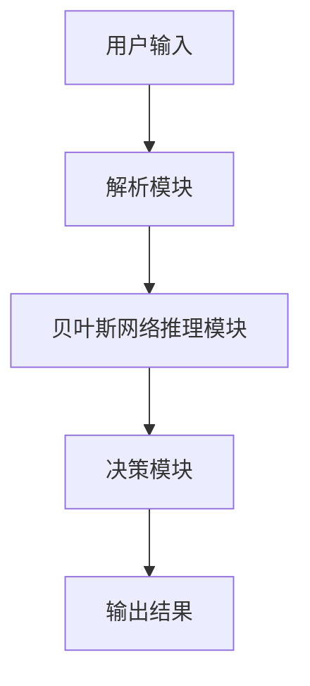

                 


# AI Agent中的概率推理与贝叶斯网络

> **关键词**: AI Agent, 概率推理, 贝叶斯网络, 动态推理, 决策优化, 知识表示

> **摘要**: 本文深入探讨了AI Agent中的概率推理与贝叶斯网络的核心原理、算法实现及其在实际应用中的重要作用。文章首先介绍了概率推理的基本概念和贝叶斯网络的结构与模型，接着详细讲解了贝叶斯定理与概率传播的算法原理，然后分析了贝叶斯网络在AI Agent中的应用，包括知识表示、动态推理和决策优化。此外，文章还探讨了贝叶斯网络的高级主题，如推理算法优化、复杂网络的处理以及证据推理。最后，通过项目实战部分，展示了贝叶斯网络在AI Agent中的具体实现与应用案例，为读者提供了丰富的实践参考。

---

## 第一部分: 背景介绍与核心概念

### 第1章: 概率推理的基本概念

#### 1.1 概率推理的定义与特点
概率推理是一种基于概率论的推理方法，通过量化不确定性来推导结论。其特点包括：
- **不确定性量化**: 概率推理能够处理知识和推理过程中的不确定性。
- **条件依赖**: 基于条件概率进行推理，能够反映事件之间的依赖关系。
- **动态适应**: 在动态环境中，概率推理能够根据新证据动态更新概率分布。

#### 1.2 贝叶斯网络的定义与特点
贝叶斯网络是一种有向无环图（DAG），由节点和边组成，节点表示随机变量，边表示变量之间的条件依赖关系。其特点包括：
- **直观性**: 贝叶斯网络通过图形化的方式展示变量之间的关系。
- **可解释性**: 贝叶斯网络的结构直观，便于理解和解释。
- **灵活性**: 贝叶斯网络能够处理复杂的关系，适用于多种应用场景。

#### 1.3 贝叶斯网络与AI Agent的关系
贝叶斯网络为AI Agent提供了一种强大的概率推理框架，帮助Agent在不确定性环境中做出决策。AI Agent通过贝叶斯网络可以实现：
- **知识表示**: 将问题领域中的知识建模为贝叶斯网络。
- **动态推理**: 根据实时信息动态更新概率分布，适应环境变化。
- **决策优化**: 基于概率推理结果，选择最优行动方案。

---

### 第2章: 贝叶斯网络的结构与模型

#### 2.1 贝叶斯网络的节点与边
- **节点**: 表示随机变量，分为输入节点（已知变量）、隐藏节点（中间变量）和输出节点（目标变量）。
- **边**: 表示变量之间的条件依赖关系，边的方向表示因果关系或影响关系。

#### 2.2 贝叶斯网络的概率分布
贝叶斯网络的概率分布由节点的条件概率表（CPT）定义，表示每个节点在给定父节点条件下取值的概率分布。

#### 2.3 贝叶斯网络的构建方法
- **手动构建**: 根据领域知识手动设计网络结构和参数。
- **自动构建**: 使用数据驱动的方法，通过参数学习和结构学习自动构建网络。

---

## 第二部分: 贝叶斯定理与概率推理

### 第3章: 贝叶斯定理的基本原理

#### 3.1 贝叶斯定理的公式推导
贝叶斯定理公式为：
$$ P(A|B) = \frac{P(B|A)P(A)}{P(B)} $$
其中：
- $P(A|B)$ 是在$B$发生的条件下，$A$发生的后验概率。
- $P(B|A)$ 是$A$发生的条件下，$B$发生的似然概率。
- $P(A)$ 是$A$的先验概率。
- $P(B)$ 是$B$的全概率。

#### 3.2 贝叶斯定理的应用场景
- **医疗诊断**: 根据症状和检查结果推断疾病的可能性。
- **垃圾邮件分类**: 根据邮件内容的关键词和特征判断是否为垃圾邮件。
- **金融风险评估**: 根据历史数据和市场情况评估投资风险。

---

### 第4章: 贝叶斯网络中的概率传播

#### 4.1 概率传播的定义
概率传播是指在贝叶斯网络中，根据已知证据，通过传播概率来更新其他节点的概率分布。

#### 4.2 概率传播的算法实现
概率传播的算法包括：
- **变量消除法**: 通过消除无关变量，逐步计算目标变量的概率。
- **马尔可夫链蒙特卡罗方法**: 使用采样方法估计概率分布。

#### 4.3 概率传播的优化方法
- **分层推理**: 将网络分成多个层次，逐步进行概率传播。
- **并行计算**: 利用多核计算资源，加速概率传播过程。

---

## 第三部分: 贝叶斯网络在AI Agent中的应用

### 第5章: 贝叶斯网络与知识表示

#### 5.1 知识表示的基本概念
知识表示是将问题领域中的知识以某种形式表示，以便计算机理解和推理。

#### 5.2 贝叶斯网络在知识表示中的作用
贝叶斯网络能够将领域知识转化为概率模型，支持动态推理和不确定性处理。

#### 5.3 贝叶斯网络与语义网络的对比
- **语义网络**: 基于符号逻辑的知识表示方法。
- **贝叶斯网络**: 基于概率的不确定性知识表示方法。

---

### 第6章: 贝叶斯网络与动态推理

#### 6.1 动态推理的基本概念
动态推理是指在动态变化的环境中，根据新的证据或信息，实时更新知识和推理结果。

#### 6.2 贝叶斯网络在动态推理中的应用
- **实时更新**: 根据新证据，动态更新贝叶斯网络的概率分布。
- **状态预测**: 根据当前状态和历史数据，预测未来的状态变化。

---

### 第7章: 贝叶斯网络与决策优化

#### 7.1 决策优化的基本概念
决策优化是指在多个备选方案中选择最优的行动方案，以实现目标。

#### 7.2 贝叶斯网络在决策优化中的应用
- **风险评估**: 评估不同决策方案的风险和收益。
- **决策树构建**: 基于贝叶斯网络构建决策树，选择最优路径。

---

## 第四部分: 贝叶斯网络的高级主题

### 第8章: 贝叶斯网络的推理算法优化

#### 8.1 算法优化的基本概念
算法优化是指通过改进算法结构和方法，提高算法的效率和性能。

#### 8.2 贝叶斯网络中的分层推理
分层推理是指将网络分成多个层次，逐步进行概率传播，减少计算复杂度。

#### 8.3 贝叶斯网络中的并行推理
并行推理是指利用多核计算资源，同时进行多个节点的概率传播，提高计算效率。

---

### 第9章: 贝叶斯网络的复杂性分析

#### 9.1 贝叶斯网络的复杂性来源
- **网络结构**: 网络的规模和复杂性直接影响推理的效率。
- **计算复杂度**: 概率传播的计算复杂度与网络的结构和参数有关。

#### 9.2 贝叶斯网络的优化策略
- **网络简化**: 通过简化网络结构，降低计算复杂度。
- **近似方法**: 使用蒙特卡罗方法等近似方法，提高计算效率。

---

## 第五部分: 系统设计与架构

### 第10章: 系统设计与架构方案

#### 10.1 项目介绍
本文将通过一个具体的AI Agent项目，展示贝叶斯网络的应用与实现。

#### 10.2 系统功能设计
- **领域模型**: 定义问题领域的变量和关系。
- **系统架构**: 设计系统的模块结构和接口。

#### 10.3 系统架构图
以下是系统架构的Mermaid图：


---

## 第六部分: 项目实战

### 第11章: 项目实战

#### 11.1 环境安装
- **Python环境**: 安装Python 3.8及以上版本。
- **依赖库安装**: 使用pip安装numpy、pymc等库。

#### 11.2 核心代码实现
以下是贝叶斯网络推理的核心代码：
```python
import numpy as np
from pymc import Model, Bernoulli

def bayesian_network():
    with Model() as model:
        # 定义变量
        A = Bernoulli('A', 0.5)
        B = Bernoulli('B', 0.5)
        C = Bernoulli('C', 0.5, observed=True)
        
        # 定义模型
        model.add_factors([A, B, C])
    
    return model

# 运行模型
model = bayesian_network()
```

#### 11.3 代码解读与分析
上述代码定义了一个简单的贝叶斯网络模型，并使用PyMC库进行推理。模型包括三个变量：A、B和C，其中C为观测变量。

#### 11.4 案例分析
通过具体案例分析，展示贝叶斯网络在AI Agent中的实际应用。

---

## 第七部分: 总结与展望

### 第12章: 总结与展望

#### 12.1 全文总结
本文深入探讨了AI Agent中的概率推理与贝叶斯网络的核心原理、算法实现及其在实际应用中的重要作用。

#### 12.2 未来展望
未来的研究方向包括：
- **更高效的推理算法**: 开发更高效的算法，提高贝叶斯网络的推理效率。
- **复杂网络的处理**: 研究如何处理更大规模和更复杂结构的贝叶斯网络。

---

### 最佳实践 Tips
- 在实际应用中，建议结合领域知识和数据驱动的方法，优化贝叶斯网络的结构和参数。
- 使用可视化工具（如NetworkX、Graphviz）帮助理解和设计贝叶斯网络。
- 在动态环境中，定期更新贝叶斯网络，以适应环境的变化。

---

### 参考文献
1. Bishop, C. M. (2006). Pattern Recognition and Machine Learning.
2. Pearl, J. (1988). Probabilistic Reasoning in Intelligent Systems.
3. Murphy, K. (2012). Machine Learning: A Probabilistic Perspective.

---

通过本文的学习，读者将能够掌握贝叶斯网络的核心原理和算法实现，并能够将其应用于实际的AI Agent开发中。

