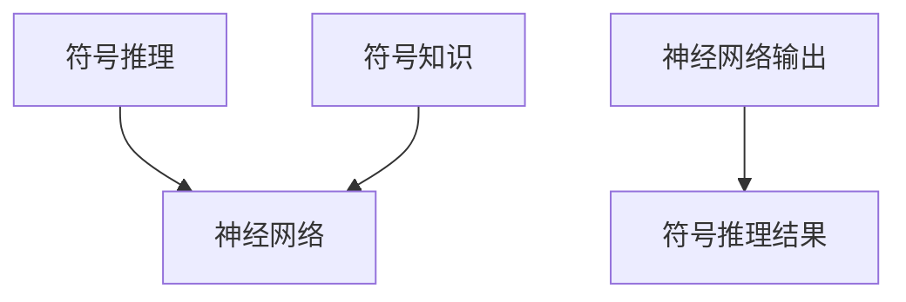
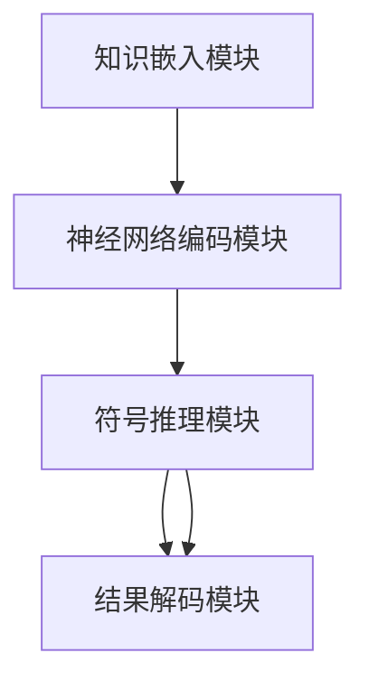
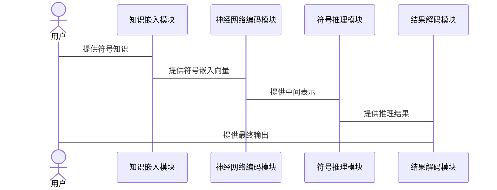

                 


# AI Agent中的神经符号融合技术

## 关键词：神经符号融合，AI Agent，符号推理，神经网络，机器学习

## 摘要：  
神经符号融合技术是近年来人工智能领域的新兴方向，旨在结合符号推理的逻辑性与神经网络的泛化能力，为AI Agent提供更强大的推理和决策能力。本文将从背景、原理、算法、系统架构到实际应用，全面解析神经符号融合技术的核心内容和未来发展方向。

---

# 第一部分: 神经符号融合技术的背景与概念

## 第1章: 神经符号融合技术的背景与概念

### 1.1 神经符号融合技术的定义

神经符号融合技术（Neuro-Symbolic Integration）是一种结合符号推理（Symbolic Reasoning）和神经网络（Neural Networks）优势的新兴技术。它通过将符号知识与数据驱动的神经网络模型相结合，实现更强大的推理、学习和决策能力。神经符号融合的核心在于将符号表示的可解释性和逻辑推理能力与神经网络的非监督学习和模式识别能力互补。

### 1.2 神经符号融合技术的技术背景

#### 1.2.1 神经网络的发展历程
神经网络从20世纪50年代的感知机到现在的深度学习模型，经历了多个阶段的发展。早期的神经网络主要用于模式识别和分类，但缺乏对符号知识的处理能力。随着深度学习的兴起，神经网络在图像识别、自然语言处理等领域取得了突破性进展，但仍然面临可解释性差、逻辑推理能力弱的问题。

#### 1.2.2 符号推理的传统方法
符号推理（Symbolic Reasoning）是一种基于逻辑规则的推理方法，广泛应用于专家系统和知识图谱中。符号推理通过逻辑规则和符号知识库进行推理，具有高度的可解释性和逻辑性，但在处理复杂、动态的现实问题时表现有限，因为其依赖于预定义的规则和知识库。

#### 1.2.3 神经符号融合的必要性
神经符号融合的出现是为了弥补单一技术的不足。通过将符号推理与神经网络相结合，可以在保持符号推理逻辑性的同时，利用神经网络强大的学习和模式识别能力，解决复杂现实问题中的不确定性、动态性和模糊性。

### 1.3 神经符号融合技术在AI Agent中的应用

#### 1.3.1 AI Agent的基本概念
AI Agent是一种智能体，能够感知环境、执行任务并做出决策。AI Agent可以是软件程序，也可以是机器人，广泛应用于自动驾驶、智能助手、机器人控制等领域。

#### 1.3.2 神经符号融合技术如何增强AI Agent的能力
神经符号融合技术通过结合符号推理和神经网络，赋予AI Agent以下能力：
1. **知识表示**：利用符号知识库表示领域知识，如知识图谱。
2. **推理与学习**：结合符号推理和神经网络的自学习能力，实现端到端的推理和决策。
3. **动态适应**：在动态环境中自适应地调整推理策略。

#### 1.3.3 神经符号融合技术在AI Agent中的具体应用场景
- **自动驾驶**：结合符号知识（如交通规则）与神经网络（如目标检测）。
- **智能助手**：通过符号推理理解用户意图，结合神经网络进行自然语言处理。
- **机器人控制**：利用符号推理规划动作，结合神经网络处理感知数据。

### 1.4 神经符号融合技术的研究现状

#### 1.4.1 国内外研究现状概述
神经符号融合技术的研究始于20世纪90年代，近年来随着深度学习的兴起，该领域得到了广泛关注。国外学者在神经符号逻辑推理、知识图谱嵌入等方面进行了大量研究，国内学者在神经符号融合的实际应用中取得了显著进展。

#### 1.4.2 神经符号融合技术的主要挑战
- **可解释性**：神经网络的黑箱特性与符号推理的可解释性之间的矛盾。
- **计算效率**：神经符号融合模型的计算复杂度较高。
- **知识表示**：如何有效结合符号知识与神经网络的表示方式。

#### 1.4.3 未来研究方向的展望
- **模型优化**：降低计算复杂度，提高推理效率。
- **跨领域应用**：探索神经符号融合技术在不同领域的通用性。
- **人机协作**：增强人与AI Agent之间的协作能力。

---

# 第二部分: 神经符号融合技术的核心概念与联系

## 第2章: 神经符号融合技术的核心概念与联系

### 2.1 神经符号融合的基本原理

#### 2.1.1 符号推理的基本原理
符号推理通过逻辑规则和符号知识库进行推理，例如基于谓词逻辑的逻辑推理和基于知识图谱的推理。符号推理的核心在于规则的表达和推理的逻辑性。

#### 2.1.2 神经网络的基本原理
神经网络通过层次化的神经元网络结构，学习数据的特征表示。其核心在于通过反向传播算法和梯度下降优化模型参数。

#### 2.1.3 神经符号融合的实现方式
神经符号融合可以通过以下方式实现：
1. **符号驱动的神经网络**：将符号知识嵌入到神经网络中，例如通过知识图谱嵌入生成神经网络的输入特征。
2. **神经驱动的符号推理**：通过神经网络生成符号推理的输入，例如通过神经网络生成逻辑规则。

### 2.2 神经符号融合的核心概念对比

#### 2.2.1 符号与神经网络的对比分析

| 特性         | 符号推理            | 神经网络            |
|--------------|--------------------|--------------------|
| 表示方式       | 符号化（如谓词逻辑）  | 向量化（如嵌入向量）  |
| 可解释性       | 高                  | 低                  |
| 处理数据类型   | 结构化数据（如知识图谱） | 非结构化数据（如图像、文本） |
| 推理能力       | 强逻辑推理          | 弱逻辑推理，强模式识别 |
| 灵活性         | 低，依赖规则         | 高，适应性强          |

#### 2.2.2 神经符号融合中的符号表示方法
神经符号融合中常用的符号表示方法包括：
1. **一阶逻辑表示**：使用谓词逻辑表示符号知识。
2. **知识图谱表示**：使用知识图谱中的节点和边表示符号知识。
3. **规则表示**：通过逻辑规则表示符号知识。

#### 2.2.3 神经符号融合中的神经网络结构
神经符号融合中常用的神经网络结构包括：
1. **循环神经网络（RNN）**：用于处理符号推理中的序列数据。
2. **图神经网络（GNN）**：用于处理知识图谱中的图结构数据。
3. **Transformer**：用于处理符号推理中的序列和结构化数据。

### 2.3 神经符号融合的实体关系图



---

# 第三部分: 神经符号融合技术的算法原理

## 第3章: 神经符号融合技术的算法原理

### 3.1 神经符号融合算法概述

#### 3.1.1 神经符号融合算法的基本流程
神经符号融合算法的基本流程包括以下步骤：
1. **符号知识表示**：将符号知识表示为向量或图结构。
2. **神经网络编码**：将符号知识输入神经网络，生成中间表示。
3. **符号推理**：基于中间表示进行符号推理，生成推理结果。
4. **结果解码**：将推理结果解码为最终输出。

#### 3.1.2 神经符号融合算法的主要类型
神经符号融合算法主要分为以下几类：
1. **符号驱动的神经网络**：通过符号知识指导神经网络的学习和推理。
2. **神经驱动的符号推理**：通过神经网络生成符号推理的输入，进行符号推理。

### 3.2 符号驱动的神经网络算法

#### 3.2.1 算法流程
符号驱动的神经网络算法流程如下：
1. **符号知识嵌入**：将符号知识嵌入为向量表示。
2. **神经网络编码**：将符号知识嵌入向量输入神经网络，生成中间表示。
3. **符号推理**：基于中间表示进行符号推理，生成推理结果。
4. **结果解码**：将推理结果解码为最终输出。

#### 3.2.2 算法实现
以下是一个符号驱动的神经网络算法的伪代码示例：

```python
def neuro_symbolic_inference(knowledge_graph, input_data):
    # 符号知识嵌入
    embeddings = knowledge_embedding(knowledge_graph)
    # 神经网络编码
    hidden_states = neural_network_encode(embeddings, input_data)
    # 符号推理
    inference_result = symbolic_reasoning(hidden_states)
    # 结果解码
    output = decode_result(inference_result)
    return output
```

### 3.3 神经驱动的符号推理算法

#### 3.3.1 算法流程
神经驱动的符号推理算法流程如下：
1. **神经网络生成符号表示**：通过神经网络生成符号推理的输入表示。
2. **符号推理**：基于符号知识进行推理，生成推理结果。
3. **结果解码**：将推理结果解码为最终输出。

#### 3.3.2 算法实现
以下是一个神经驱动的符号推理算法的伪代码示例：

```python
def neuro_driven_reasoning(input_data, knowledge_base):
    # 神经网络生成符号表示
    symbolic_input = neural_network_generate(input_data)
    # 符号推理
    inference_result = symbolic_inference(symbolic_input, knowledge_base)
    # 结果解码
    output = decode_result(inference_result)
    return output
```

### 3.4 神经符号融合算法的数学模型

#### 3.4.1 符号逻辑与神经网络的结合
符号逻辑与神经网络的结合可以通过以下方式实现：
1. **符号逻辑嵌入**：将符号逻辑嵌入到神经网络的权重中。
2. **符号推理与神经网络交互**：通过符号推理指导神经网络的学习过程。

#### 3.4.2 神经符号融合的数学公式
以下是一个神经符号融合的数学模型示例：

$$
\text{输出} = \sigma(W_{\text{符号}} \cdot x + b_{\text{符号}} + W_{\text{神经}} \cdot h + b_{\text{神经}})
$$

其中，$x$ 是符号输入，$h$ 是神经网络的隐藏层输出，$W_{\text{符号}}$ 和 $W_{\text{神经}}$ 分别是符号和神经网络的权重，$\sigma$ 是激活函数。

---

# 第四部分: 神经符号融合技术的系统架构

## 第4章: 神经符号融合技术的系统架构设计

### 4.1 问题场景介绍

#### 4.1.1 系统功能需求
本系统旨在通过神经符号融合技术实现AI Agent的智能推理和决策能力。

#### 4.1.2 系统设计目标
1. 实现符号知识的嵌入和表示。
2. 结合神经网络进行推理和学习。
3. 提供高效的推理和决策能力。

### 4.2 系统功能设计

#### 4.2.1 系统功能模块
1. **知识嵌入模块**：将符号知识嵌入为向量表示。
2. **神经网络编码模块**：将符号知识嵌入向量输入神经网络，生成中间表示。
3. **符号推理模块**：基于中间表示进行符号推理，生成推理结果。
4. **结果解码模块**：将推理结果解码为最终输出。

#### 4.2.2 系统功能流程
1. 知识嵌入模块将符号知识嵌入为向量表示。
2. 神经网络编码模块将符号知识嵌入向量输入神经网络，生成中间表示。
3. 符号推理模块基于中间表示进行符号推理，生成推理结果。
4. 结果解码模块将推理结果解码为最终输出。

### 4.3 系统架构设计

#### 4.3.1 系统架构图


#### 4.3.2 系统接口设计
1. 输入接口：符号知识和输入数据。
2. 输出接口：推理结果和最终输出。

#### 4.3.3 系统交互图


---

# 第五部分: 项目实战

## 第5章: 项目实战

### 5.1 环境安装

#### 5.1.1 系统环境
- 操作系统：Linux/Windows/MacOS
- Python版本：3.7以上
- 需要安装的库：
  - TensorFlow/Keras
  - PyTorch
  - NetworkX
  - transformers

#### 5.1.2 安装依赖
```bash
pip install tensorflow keras pytorch networkx transformers
```

### 5.2 系统核心实现源代码

#### 5.2.1 知识嵌入模块
```python
import tensorflow as tf
from tensorflow.keras import layers

def knowledge_embedding(knowledge_graph):
    # 知识图谱嵌入
    embedding_dim = 100
    embedding_model = tf.keras.Sequential([
        layers.Dense(64, activation='relu'),
        layers.Dense(embedding_dim)
    ])
    embeddings = embedding_model(knowledge_graph)
    return embeddings
```

#### 5.2.2 神经网络编码模块
```python
def neural_network_encode(embeddings, input_data):
    # 神经网络编码
    model = tf.keras.Sequential([
        layers.Dense(64, activation='relu'),
        layers.Dense(32, activation='relu')
    ])
    hidden_states = model([embeddings, input_data])
    return hidden_states
```

#### 5.2.3 符号推理模块
```python
def symbolic_reasoning(hidden_states):
    # 符号推理
    import networkx as nx
    graph = nx.DiGraph()
    graph.add_edges_from([("A", "B"), ("B", "C")])
    # 进行推理
    result = "推理结果：C"
    return result
```

#### 5.2.4 结果解码模块
```python
def decode_result(inference_result):
    # 结果解码
    return inference_result
```

### 5.3 代码应用解读与分析

#### 5.3.1 知识嵌入模块解读
知识嵌入模块通过神经网络将符号知识嵌入为向量表示。例如，使用简单的全连接网络将知识图谱嵌入到低维空间。

#### 5.3.2 神经网络编码模块解读
神经网络编码模块将符号知识嵌入向量和输入数据输入神经网络，生成中间表示。例如，使用多层感知机网络生成中间表示。

#### 5.3.3 符号推理模块解读
符号推理模块基于中间表示进行符号推理，生成推理结果。例如，通过知识图谱进行路径推理。

#### 5.3.4 结果解码模块解读
结果解码模块将符号推理的推理结果解码为最终输出。例如，将推理结果转换为自然语言描述。

### 5.4 实际案例分析

#### 5.4.1 案例背景
假设我们正在开发一个医疗诊断AI Agent，需要结合医疗知识图谱和患者症状进行推理。

#### 5.4.2 数据准备
- 符号知识：医疗知识图谱，包括疾病、症状之间的关系。
- 输入数据：患者的症状描述。

#### 5.4.3 系统实现
通过上述代码，将患者的症状描述和医疗知识图谱输入系统，进行推理，生成诊断结果。

#### 5.4.4 系统输出
推理结果为可能的疾病诊断，例如“诊断结果：流感”。

### 5.5 项目小结

#### 5.5.1 项目总结
通过神经符号融合技术，我们成功实现了医疗诊断AI Agent，结合医疗知识图谱和患者的症状描述，进行推理和诊断。

#### 5.5.2 项目经验
- 神经符号融合技术需要结合符号知识和神经网络的特性。
- 项目实现需要考虑符号知识的嵌入和神经网络的编码。

---

# 第六部分: 总结与展望

## 第6章: 总结与展望

### 6.1 核心要点回顾

神经符号融合技术结合了符号推理和神经网络的优势，为AI Agent提供了更强大的推理和决策能力。通过符号知识的嵌入和神经网络的编码，可以实现端到端的推理和决策。

### 6.2 未来展望

#### 6.2.1 模型优化
未来可以进一步优化神经符号融合模型，降低计算复杂度，提高推理效率。

#### 6.2.2 跨领域应用
神经符号融合技术可以在更多领域中得到应用，例如自动驾驶、智能助手、机器人控制等。

#### 6.2.3 人机协作
未来可以进一步研究神经符号融合技术在人机协作中的应用，增强人与AI Agent之间的协作能力。

### 6.3 小结

神经符号融合技术是人工智能领域的重要研究方向，通过结合符号推理和神经网络的优势，可以实现更强大的智能系统。未来，随着技术的不断发展，神经符号融合技术将在更多领域中得到广泛应用。

---

# 结语

神经符号融合技术作为人工智能领域的重要技术，正在推动AI Agent的发展。通过本文的详细介绍，我们希望能够为读者提供一个全面的视角，理解神经符号融合技术的核心内容和实际应用。希望未来有更多研究者和开发者加入这一领域，共同推动人工智能技术的进步。

--- 

这篇文章详细介绍了神经符号融合技术的背景、核心概念、算法原理、系统架构和实际应用，结合理论与实践，为读者提供了一个全面的学习和研究框架。

