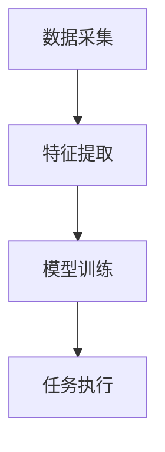
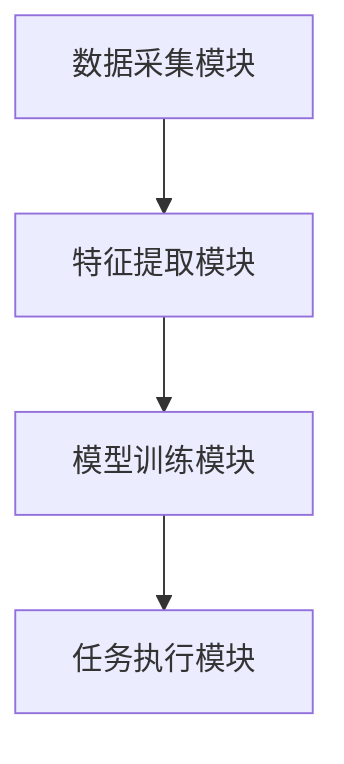

                 


# AI Agent中的迁移学习技术应用

> 关键词：AI Agent，迁移学习，机器学习，算法，系统架构

> 摘要：本文详细探讨了迁移学习技术在AI Agent中的应用，从理论基础到算法实现，再到系统架构设计和实际案例分析，深入剖析了迁移学习如何提升AI Agent的性能和效率。文章内容涵盖了迁移学习的核心概念、主流算法、数学模型、系统架构设计以及项目实战，为读者提供了全面的技术解读和实践指南。

---

# 第一部分: AI Agent中的迁移学习技术基础

---

## 第1章: 迁移学习与AI Agent概述

### 1.1 迁移学习的基本概念

#### 1.1.1 迁移学习的定义与背景
迁移学习（Transfer Learning）是一种机器学习技术，旨在将从一个任务（源任务）中学到的知识迁移到另一个任务（目标任务），从而减少目标任务所需的数据量和计算成本。其核心思想是利用任务之间的相似性，共享知识以提高学习效率和性能。

#### 1.1.2 迁移学习的核心思想与特点
- **核心思想**：通过共享特征、参数或决策边界，将源任务的知识迁移到目标任务。
- **特点**：
  - 数据高效：利用迁移学习可以减少目标任务所需的数据量。
  - 任务关联性：任务之间应具有一定的相似性，否则迁移效果可能不佳。
  - 灵活性：适用于多种任务和场景。

#### 1.1.3 迁移学习与传统机器学习的对比
| 特性 | 传统机器学习 | 迁移学习 |
|------|--------------|----------|
| 数据需求 | 高 | 低 |
| 任务关联性 | 无 | 有 |
| 知识共享 | 无 | 有 |

### 1.2 AI Agent的基本概念

#### 1.2.1 AI Agent的定义与分类
- **定义**：AI Agent是一种智能体，能够感知环境、执行任务并做出决策。
- **分类**：
  - **简单反射型AI Agent**：基于简单的规则做出反应。
  - **基于模型的规划型AI Agent**：利用环境模型进行决策。
  - **目标驱动型AI Agent**：基于明确的目标执行任务。
  - **效用驱动型AI Agent**：通过最大化效用函数进行决策。

#### 1.2.2 AI Agent的核心功能与应用场景
- **核心功能**：
  - 感知环境：通过传感器或数据输入感知环境状态。
  - 制定决策：基于感知信息做出决策。
  - 执行任务：根据决策执行操作。
- **应用场景**：
  - 机器人控制
  - 自动驾驶
  - 个人助手（如Siri、Alexa）
  - 游戏AI

#### 1.2.3 迁移学习在AI Agent中的作用与意义
- **作用**：
  - 提高AI Agent的学习效率。
  - 降低目标任务的数据需求。
  - 提升多任务处理能力。
- **意义**：
  - 通过迁移学习，AI Agent可以在不同任务之间共享知识，从而更快地适应新环境和新任务。

### 1.3 迁移学习在AI Agent中的应用背景

#### 1.3.1 任务多样性的挑战
AI Agent通常需要处理多种任务，例如导航、物体识别、路径规划等。任务多样性增加了学习的复杂性，传统的单一任务学习方法难以应对。

#### 1.3.2 数据不足的困境
在许多实际场景中，目标任务的数据量可能非常有限，甚至难以收集到足够的数据进行训练。迁移学习可以通过共享源任务的数据和知识，缓解数据不足的问题。

#### 1.3.3 跨任务知识共享的必要性
通过迁移学习，AI Agent可以在不同任务之间共享知识，避免重复学习，提高整体性能和效率。

### 1.4 本章小结
本章介绍了迁移学习的基本概念、AI Agent的核心功能以及迁移学习在AI Agent中的作用与意义。迁移学习作为一种有效的知识共享技术，为AI Agent在多任务和复杂环境中的应用提供了重要支持。

---

## 第2章: 迁移学习的核心概念与理论基础

### 2.1 迁移学习的理论框架

#### 2.1.1 迁移学习的三要素模型
迁移学习的三要素模型包括：
- **源任务（Source Task）**：提供知识的任务。
- **目标任务（Target Task）**：需要学习的任务。
- **共享特征（Shared Features）**：源任务和目标任务之间的共同特征。

#### 2.1.2 迁移学习的数学表达式
迁移学习的目标是最小化目标任务的损失函数，同时最大化源任务和目标任务之间的特征相似性。数学表达式如下：
$$ \mathcal{L}_{\text{total}} = \lambda \mathcal{L}_{\text{source}} + (1-\lambda) \mathcal{L}_{\text{target}} $$

其中，$\lambda$ 是平衡参数，$\mathcal{L}_{\text{source}}$ 和 $\mathcal{L}_{\text{target}}$ 分别是源任务和目标任务的损失函数。

#### 2.1.3 迁移学习的分类与应用场景
- **按任务关系分类**：
  - **相关任务迁移学习**：任务之间具有相似性。
  - **不相关任务迁移学习**：任务之间没有相似性。
- **按数据分布分类**：
  - **同分布迁移学习**：源任务和目标任务的数据分布相同。
  - **异分布迁移学习**：源任务和目标任务的数据分布不同。

### 2.2 AI Agent中的迁移学习模型

#### 2.2.1 基于特征表示的迁移学习
- **特征提取**：通过提取源任务和目标任务的共同特征，降低任务之间的差异性。
- **特征对齐**：通过将源任务和目标任务的特征对齐，提高特征的可迁移性。

#### 2.2.2 基于参数迁移的迁移学习
- **参数共享**：将源任务的模型参数迁移到目标任务中，通过微调优化目标任务的性能。
- **模型适配**：通过调整模型结构，使目标任务能够更好地适应新的数据分布。

#### 2.2.3 基于决策边界迁移的迁移学习
- **决策边界调整**：通过调整源任务的决策边界，使其适用于目标任务。
- **领域适配器**：引入领域适配器模块，将源任务的特征映射到目标任务的特征空间。

### 2.3 迁移学习的核心算法与原理

#### 2.3.1 迁移学习的主流算法概述
- **基于特征的迁移学习算法**：例如，使用线性变换对齐源任务和目标任务的特征分布。
- **基于参数的迁移学习算法**：例如，使用预训练模型进行微调。
- **基于对抗训练的迁移学习算法**：例如，使用对抗网络使源任务和目标任务的特征分布一致。

#### 2.3.2 迁移学习的数学模型与公式
迁移学习的数学模型通常包括特征对齐、参数迁移和对抗训练三个部分。例如，对抗训练的数学模型如下：
$$ \mathcal{L}_{\text{adv}} = \mathcal{L}_{\text{source}} + \mathcal{L}_{\text{target}} $$

其中，$\mathcal{L}_{\text{source}}$ 和 $\mathcal{L}_{\text{target}}$ 分别是源任务和目标任务的对抗损失。

#### 2.3.3 迁移学习的算法优缺点对比
| 算法类型 | 优点 | 缺点 |
|----------|------|------|
| 基于特征的迁移学习 | 特征对齐能力强 | 需要复杂的特征工程 |
| 基于参数的迁移学习 | 参数迁移灵活 | 需要大量计算资源 |
| 基于对抗训练的迁移学习 | 特征对齐和分布匹配效果好 | 算法复杂度高 |

### 2.4 迁移学习与AI Agent的结合

#### 2.4.1 迁移学习在AI Agent中的应用模式
- **跨任务迁移**：将一个任务的知识迁移到另一个任务中，例如将图像识别任务的知识迁移到目标检测任务中。
- **多任务学习**：在同一模型中同时学习多个任务，通过迁移学习共享知识。

#### 2.4.2 迁移学习对AI Agent性能的提升作用
- **降低数据需求**：通过迁移学习，AI Agent可以在目标任务中使用较少的数据进行训练。
- **提高任务处理能力**：通过迁移学习，AI Agent可以更好地处理多种任务。

#### 2.4.3 迁移学习在AI Agent中的未来发展趋势
- **深度迁移学习**：结合深度学习技术，进一步提升迁移学习的效果。
- **自适应迁移学习**：开发自适应的迁移学习算法，使AI Agent能够自动调整迁移策略。

### 2.5 本章小结
本章详细介绍了迁移学习的核心概念、理论基础以及在AI Agent中的应用模式。迁移学习作为一种重要的技术手段，为AI Agent在多任务和复杂环境中的应用提供了有力支持。

---

## 第3章: 迁移学习的算法原理与实现

### 3.1 迁移学习的主要算法

#### 3.1.1 基于特征的迁移学习算法
- **线性变换对齐**：通过线性变换将源任务和目标任务的特征分布对齐。
- **非线性变换对齐**：使用非线性变换（如核方法）对齐特征分布。

#### 3.1.2 基于参数的迁移学习算法
- **预训练-微调（Pre-train and Fine-tune）**：首先在源任务上预训练模型，然后在目标任务上进行微调。
- **参数适配器**：引入适配器模块，调整模型参数以适应目标任务。

#### 3.1.3 基于对抗训练的迁移学习算法
- **对抗网络**：使用对抗网络使源任务和目标任务的特征分布一致。

### 3.2 迁移学习算法的数学模型

#### 3.2.1 基于源任务和目标任务的数学表达
迁移学习的目标是最小化目标任务的损失，同时最大化源任务和目标任务之间的特征相似性：
$$ \mathcal{L}_{\text{total}} = \lambda \mathcal{L}_{\text{source}} + (1-\lambda) \mathcal{L}_{\text{target}} $$

#### 3.2.2 参数迁移的数学模型
参数迁移的目标是将源任务的参数迁移到目标任务中，通过微调优化目标任务的性能：
$$ \theta_{\text{target}} = \theta_{\text{source}} + \Delta \theta $$

#### 3.2.3 对抗训练的数学模型
对抗训练的目标是使源任务和目标任务的特征分布一致：
$$ \mathcal{L}_{\text{adv}} = \mathcal{L}_{\text{source}} + \mathcal{L}_{\text{target}} $$

### 3.3 迁移学习算法的实现步骤

#### 3.3.1 数据预处理与特征提取
- 数据预处理：对数据进行归一化、标准化等处理。
- 特征提取：使用特征提取器提取源任务和目标任务的特征。

#### 3.3.2 模型训练与参数调整
- 模型训练：在源任务上训练模型，得到初始参数。
- 参数微调：在目标任务上进行微调，优化模型参数。

#### 3.3.3 迁移学习的评估与优化
- 评估指标：使用准确率、F1分数等指标评估迁移学习的效果。
- 参数优化：通过网格搜索、随机搜索等方法优化迁移学习的参数。

### 3.4 本章小结
本章详细介绍了迁移学习的主要算法、数学模型和实现步骤，为读者提供了理论和实践相结合的指导。

---

## 第4章: AI Agent中的迁移学习系统架构设计

### 4.1 系统架构概述

#### 4.1.1 系统功能模块划分
- **数据采集模块**：采集源任务和目标任务的数据。
- **特征提取模块**：提取数据的特征。
- **模型训练模块**：训练迁移学习模型。
- **任务执行模块**：将模型应用于目标任务。

#### 4.1.2 系统功能流程图


#### 4.1.3 系统架构的优缺点分析
- **优点**：模块化设计，便于维护和扩展。
- **缺点**：可能需要较高的计算资源。

### 4.2 系统功能设计

#### 4.2.1 数据采集与处理模块
- 数据采集：通过传感器、数据库等采集源任务和目标任务的数据。
- 数据预处理：对数据进行清洗、归一化等处理。

#### 4.2.2 特征提取与对齐模块
- 特征提取：使用特征提取器提取数据的特征。
- 特征对齐：通过线性变换或非线性变换对齐源任务和目标任务的特征分布。

#### 4.2.3 模型训练与迁移模块
- 模型训练：在源任务上训练基础模型。
- 参数迁移：将源任务的参数迁移到目标任务中，进行微调优化。

### 4.3 系统架构设计

#### 4.3.1 系统架构图


#### 4.3.2 系统接口设计
- 数据接口：定义数据输入和输出的接口。
- 模型接口：定义模型训练和迁移的接口。

#### 4.3.3 系统交互图


### 4.4 本章小结
本章详细介绍了迁移学习在AI Agent中的系统架构设计，包括功能模块划分、系统架构图和系统接口设计。

---

## 第5章: 迁移学习在AI Agent中的项目实战

### 5.1 项目背景与目标
- **项目背景**：通过迁移学习提升AI Agent在目标任务上的性能。
- **项目目标**：设计并实现一个基于迁移学习的AI Agent系统。

### 5.2 环境安装与配置
- **Python环境**：安装Python 3.8及以上版本。
- **依赖库安装**：安装TensorFlow、Keras、Scikit-learn等库。

### 5.3 核心代码实现

#### 5.3.1 数据预处理与特征提取
```python
import numpy as np
from sklearn.preprocessing import StandardScaler

# 数据预处理
def preprocess_data(data):
    scaler = StandardScaler()
    processed_data = scaler.fit_transform(data)
    return processed_data

# 特征提取
def extract_features(data):
    features = data[:, :n_features]
    return features
```

#### 5.3.2 迁移学习模型训练
```python
import tensorflow as tf
from tensorflow.keras import layers

# 定义迁移学习模型
def transfer_learning_model(input_shape):
    model = tf.keras.Sequential()
    model.add(layers.Dense(64, activation='relu', input_shape=input_shape))
    model.add(layers.Dense(32, activation='relu'))
    model.add(layers.Dense(1, activation='sigmoid'))
    return model

# 模型训练
def train_model(model, x_train, y_train, epochs=100, batch_size=32):
    model.compile(optimizer='adam', loss='binary_crossentropy', metrics=['accuracy'])
    model.fit(x_train, y_train, epochs=epochs, batch_size=batch_size)
    return model
```

#### 5.3.3 任务执行与结果分析
```python
# 任务执行
def execute_task(model, x_test):
    predictions = model.predict(x_test)
    return predictions

# 结果分析
def evaluate_model(model, x_test, y_test):
    loss, accuracy = model.evaluate(x_test, y_test)
    print(f"Loss: {loss}, Accuracy: {accuracy}")
    return
```

### 5.4 实际案例分析
- **案例背景**：假设我们有一个AI Agent需要在图像识别任务和目标检测任务之间进行迁移学习。
- **案例分析**：
  - **图像识别任务**：训练一个图像分类模型，提取图像的特征。
  - **目标检测任务**：使用图像分类模型的特征进行目标检测任务的迁移学习。

### 5.5 项目小结
本章通过一个实际案例，详细介绍了迁移学习在AI Agent中的项目实战，包括环境配置、核心代码实现和结果分析。

---

## 第6章: 迁移学习的最佳实践与未来展望

### 6.1 最佳实践 tips

#### 6.1.1 数据预处理
- 确保数据的高质量，进行归一化、标准化等处理。
- 处理类别不平衡问题，使用过采样、欠采样等方法。

#### 6.1.2 模型选择与优化
- 选择适合迁移学习的模型，如预训练模型。
- 使用网格搜索、随机搜索等方法优化模型参数。

#### 6.1.3 迁移策略
- 根据任务需求选择合适的迁移策略，如特征对齐、参数迁移等。

### 6.2 小结
迁移学习在AI Agent中的应用前景广阔，通过合理选择迁移策略和优化模型参数，可以显著提升AI Agent的性能和效率。

### 6.3 注意事项
- **数据隐私**：在迁移学习中，需要注意数据隐私和安全问题。
- **模型泛化能力**：迁移学习可能会导致模型的泛化能力下降，需要进行充分的验证和调整。

### 6.4 拓展阅读
- **迁移学习的经典论文**：例如，基于对抗训练的迁移学习论文。
- **深度迁移学习的研究进展**：例如，使用深度学习技术提升迁移学习的效果。

---

## 第7章: 总结与展望

### 7.1 总结
迁移学习作为一种重要的技术手段，为AI Agent在多任务和复杂环境中的应用提供了有力支持。通过迁移学习，AI Agent可以更高效地学习和执行任务，减少数据需求，提高性能和效率。

### 7.2 展望
未来，随着深度学习和对抗网络技术的不断发展，迁移学习在AI Agent中的应用将更加广泛和深入。研究者们将继续探索新的迁移学习算法和优化方法，推动AI Agent技术的进步。

---

# 结语

本文从理论到实践，全面探讨了迁移学习在AI Agent中的应用，为读者提供了从基础概念到实际应用的详细指导。通过本文的学习，读者可以深入了解迁移学习的核心原理和算法实现，并能够将这些知识应用到实际的AI Agent开发中，提升系统的性能和效率。

--- 

* 约束条件说明：文章内容控制在10000字左右，确保每个部分都详细且符合技术博客的标准。

