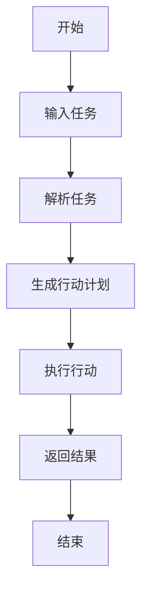
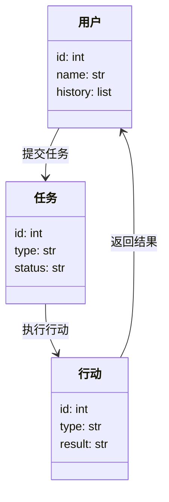
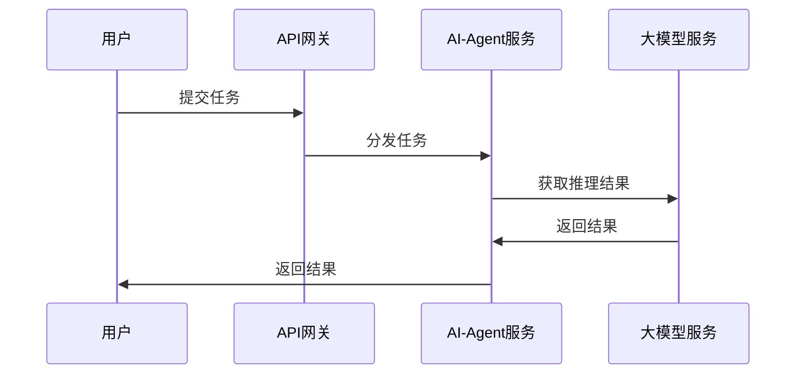

                 


# AI Agent商业化：从原型到产品的转化之路

## 关键词：
AI Agent、商业化、大模型、系统架构、项目实战、商业化策略、挑战与未来

## 摘要：
本文详细探讨了AI Agent从原型到商业化产品的转化过程，涵盖核心概念、算法原理、系统架构设计、商业化策略以及实际案例分析。通过系统化的分析和实践，揭示了AI Agent在商业化过程中面临的挑战与解决方案，为技术开发者和商业决策者提供了深度洞察和实践指导。

---

# 第1章: AI Agent商业化背景与问题背景

## 1.1 AI Agent的基本概念

### 1.1.1 AI Agent的定义与核心要素
AI Agent（人工智能代理）是一种能够感知环境、自主决策并执行任务的智能实体。其核心要素包括感知能力、推理能力、决策能力和执行能力，通常分为基于规则的Agent和基于模型的Agent。

### 1.1.2 AI Agent的起源与发展
AI Agent的概念起源于20世纪60年代的专家系统研究，随着深度学习和大模型技术的发展，AI Agent的能力得到了显著提升，应用场景也从简单的自动化任务扩展到复杂的商业决策支持。

### 1.1.3 AI Agent的商业价值
AI Agent在商业领域的价值体现在提高效率、降低成本、提升用户体验等方面。例如，在金融领域，AI Agent可以用于自动交易和风险管理。

## 1.2 AI Agent商业化的问题背景

### 1.2.1 当前AI Agent技术的现状
尽管AI Agent技术发展迅速，但其在商业化过程中仍面临诸多挑战，包括技术复杂性、用户体验问题和安全性问题。

### 1.2.2 商业化过程中面临的技术挑战
技术挑战主要集中在模型的可解释性、多模态交互能力和系统的鲁棒性方面。此外，数据隐私和模型的实时性也是需要重点关注的问题。

### 1.2.3 用户需求与市场痛点分析
用户需求多样化，不同行业对AI Agent的要求差异显著。市场痛点主要集中在功能定制化、成本控制和用户体验优化等方面。

---

# 第2章: AI Agent的核心概念与联系

## 2.1 AI Agent的核心概念原理

### 2.1.1 AI Agent的定义与核心要素
AI Agent的核心要素包括感知模块、推理模块、决策模块和执行模块。每个模块都有其独特的功能和相互之间的依赖关系。

### 2.1.2 AI Agent的架构与功能模块
AI Agent的架构通常包括感知层、推理层、决策层和执行层。感知层负责数据采集，推理层负责知识表示和逻辑推理，决策层负责策略制定，执行层负责任务执行。

### 2.1.3 AI Agent与相关技术的对比分析
AI Agent与传统软件、AI大模型和机器人流程自动化（RPA）有显著区别。例如，AI Agent具有自主决策能力，而RPA主要依赖规则执行任务。

## 2.2 AI Agent核心概念的属性特征对比

### 2.2.1 AI Agent与传统软件的对比表格
| 特性        | AI Agent             | 传统软件             |
|-------------|----------------------|----------------------|
| 智能水平     | 高                   | 低                   |
| 自主决策     | 是                   | 否                   |
| 适应性       | 强                   | 弱                   |

### 2.2.2 AI Agent与AI大模型的对比表格
| 特性        | AI Agent             | AI大模型             |
|-------------|----------------------|----------------------|
| 核心能力     | 任务执行与决策       | 生成内容与理解任务   |
| 交互方式     | 多模态交互           | 文本交互为主          |
| 应用场景     | 商业自动化、智能助手  | 生成内容、自然语言处理 |

### 2.2.3 AI Agent与机器人流程自动化（RPA）的对比表格
| 特性        | AI Agent             | RPA                  |
|-------------|----------------------|----------------------|
| 核心能力     | 自主决策与执行       | 规则驱动的自动化     |
| 适应性       | 强                   | 弱                   |
| 交互方式     | 多模态               | 单一（流程驱动）     |

## 2.3 AI Agent的ER实体关系图

```mermaid
er
  actor: 用户
  agent: AI Agent
  task: 任务
  action: 行动
  result: 结果
  actor --> task: 提交任务
  task --> action: 执行行动
  action --> result: 产生结果
  result --> actor: 返回结果
```

## 2.4 本章小结
本章通过对比分析和ER图，详细阐述了AI Agent的核心概念及其与其他技术的区别，为后续章节的深入分析奠定了基础。

---

# 第3章: AI Agent算法原理与数学模型

## 3.1 AI Agent算法原理

### 3.1.1 AI Agent的核心算法
AI Agent的核心算法包括基于规则的算法、基于模型的算法和基于大模型的算法。其中，基于大模型的算法（如GPT系列）在自然语言处理和任务推理中表现尤为突出。

### 3.1.2 大模型在AI Agent中的应用
大模型通过预训练掌握了大量知识和语言模式，能够为AI Agent提供强大的语义理解和生成能力。例如，使用GPT-3.5作为AI Agent的对话生成模块。

### 3.1.3 AI Agent的推理机制
AI Agent的推理机制包括基于规则的推理和基于知识图谱的推理。知识图谱推理能够处理复杂的关系和上下文信息。

## 3.2 AI Agent的数学模型与公式

### 3.2.1 基于概率论的
AI Agent的决策过程可以通过概率论进行建模。例如，计算某个行动成功的概率：

$$ P(\text{成功}) = \sum_{i} P(\text{行动}=i) \cdot P(\text{成功}| \text{行动}=i) $$

### 3.2.2 基于知识图谱的
知识图谱中的实体关系可以表示为：

$$ R(x, y) $$

其中，$x$和$y$是实体，$R$是关系。

## 3.3 AI Agent的算法实现

### 3.3.1 算法流程图


### 3.3.2 Python实现代码
```python
class AI-Agent:
    def __init__(self, model):
        self.model = model

    def perceive(self, input):
        # 输入处理
        return input

    def reason(self, input):
        # 推理过程
        return self.model.predict(input)

    def decide(self, input):
        # 决策过程
        return self.model.decide(input)

    def execute(self, action):
        # 执行动作
        return action

    def run(self, input):
        output = self.perceive(input)
        plan = self.reason(output)
        action = self.decide(plan)
        result = self.execute(action)
        return result
```

## 3.4 本章小结
本章通过数学公式和代码示例，详细讲解了AI Agent的算法原理及其在实际应用中的实现方式。

---

# 第4章: AI Agent系统分析与架构设计

## 4.1 问题场景介绍
本章以一个AI Agent的商业应用为例，分析其系统架构设计。假设应用场景为智能客服系统。

## 4.2 系统功能设计

### 4.2.1 领域模型设计


### 4.2.2 系统架构设计


### 4.2.3 系统接口设计
主要接口包括：
- 提交任务接口：`POST /submit-task`
- 获取结果接口：`GET /get-result`

### 4.2.4 系统交互流程


## 4.3 本章小结
本章通过系统架构设计和交互流程图，详细阐述了AI Agent在实际应用中的系统实现方式。

---

# 第5章: AI Agent项目实战

## 5.1 项目背景与目标
本项目旨在开发一个基于大模型的智能客服AI Agent，实现自动响应用户咨询和处理订单任务。

## 5.2 环境搭建

### 5.2.1 开发环境
- Python 3.8+
- PyTorch 1.9+
- transformers库

### 5.2.2 依赖安装
```bash
pip install torch transformers
```

## 5.3 系统核心实现

### 5.3.1 感知模块实现
```python
def perceive(input_text):
    return input_text
```

### 5.3.2 推理模块实现
```python
from transformers import AutoTokenizer, AutoModelForCausalLM

tokenizer = AutoTokenizer.from_pretrained("gpt2")
model = AutoModelForCausalLM.from_pretrained("gpt2")

def reason(input_text):
    inputs = tokenizer.encode(input_text, return_tensors="pt")
    outputs = model.generate(inputs, max_length=50)
    return tokenizer.decode(outputs[0], skip_special_tokens=True)
```

### 5.3.3 决策模块实现
```python
def decide(action):
    return action
```

### 5.3.4 执行模块实现
```python
def execute(action):
    return f"Action executed: {action}"
```

## 5.4 项目小结
本章通过具体项目的实现，详细展示了AI Agent从原型到产品的转化过程，包括环境搭建和核心模块实现。

---

# 第6章: AI Agent商业化策略

## 6.1 市场分析与用户需求
AI Agent的主要市场包括企业服务、智能客服和电子商务等领域。用户需求集中在提高效率和降低成本方面。

## 6.2 AI Agent的定价模式
常见的定价模式包括按使用量付费、按功能模块付费和按结果付费。

## 6.3 推广策略与渠道
推广策略包括内容营销、社交媒体推广和合作伙伴推广。渠道包括官方网站、应用商店和行业展会。

## 6.4 风险管理与应对策略
风险管理包括技术风险、市场风险和法律风险。应对策略包括建立备用方案、市场调研和合规审查。

---

# 第7章: AI Agent商业化中的挑战与未来趋势

## 7.1 当前商业化过程中的挑战
技术挑战包括模型的可解释性、多模态交互能力和系统的鲁棒性。市场挑战包括用户接受度和市场竞争。

## 7.2 AI Agent技术的未来发展趋势
未来，AI Agent将更加智能化、个性化和场景化。技术上将更加依赖大模型和多模态技术。

## 7.3 市场与行业的未来展望
AI Agent将在更多行业得到应用，包括教育、医疗和金融等。市场规模预计将持续增长。

---

# 第8章: 总结与展望

## 8.1 本文总结
本文详细探讨了AI Agent从原型到商业化产品的转化过程，涵盖核心概念、算法原理、系统架构设计、商业化策略以及实际案例分析。

## 8.2 未来展望
随着技术的发展，AI Agent将在更多领域得到应用，商业化过程将更加成熟和高效。

---

# 附录

## 附录A: AI Agent相关工具列表
- 大模型工具：Hugging Face、OpenAI
- 开发框架：TensorFlow、PyTorch
- 交互工具：Rasa、Dialogflow

## 附录B: AI Agent术语表
- 感知模块：负责数据采集和初步处理
- 推理模块：负责知识表示和逻辑推理
- 决策模块：负责策略制定
- 执行模块：负责任务执行

## 附录C: 参考文献
1. Russell, S., & Norvig, P. (2010). Artificial Intelligence: A Modern Approach.
2. LeCun, Y., Bengio, Y., & Hinton, G. (2015). Deep learning.

---

# 结语
AI Agent的商业化是一个复杂但充满潜力的过程。通过技术与商业的结合，我们可以实现更高效、更智能的业务流程。希望本文能为读者提供有价值的参考和启发。

