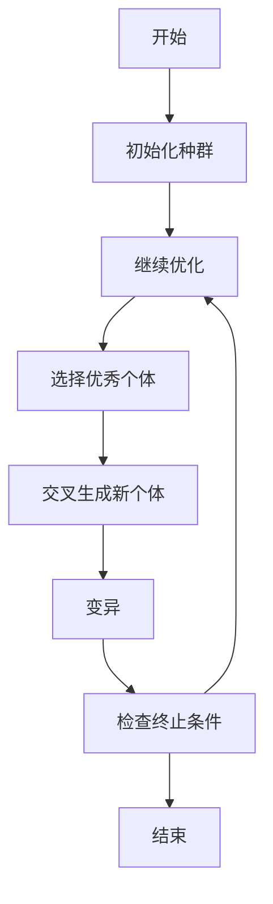

                 


# AI Agent在3D建模中的应用：自动生成与优化

---

## 关键词：AI Agent、3D建模、自动生成、优化、强化学习、遗传算法、流程图

---

## 摘要

本文探讨了AI Agent在3D建模中的应用，重点介绍如何利用AI技术实现3D模型的自动生成与优化。通过分析AI Agent的核心原理、算法实现和系统架构，结合实际案例，详细阐述了AI Agent如何提升3D建模的效率和质量。文章还总结了最佳实践经验和未来发展方向，为读者提供全面的技术视角。

---

# 第一部分: AI Agent与3D建模背景

## 第1章: AI Agent与3D建模概述

### 1.1 AI Agent的基本概念

- **AI Agent的定义**：AI Agent（智能体）是指能够感知环境、做出决策并采取行动的智能系统。它具备自主性、反应性、目标导向和学习能力的特点。
- **AI Agent的特点**：
  - 自主性：无需外部干预，自主决策。
  - 反应性：能够实时感知环境并做出反应。
  - 目标导向：基于目标驱动行为。
  - 学习能力：通过数据学习优化自身性能。
- **AI Agent在3D建模中的作用**：AI Agent可以辅助建模、优化模型质量、自动化建模流程。

### 1.2 3D建模的基本概念

- **3D建模的定义**：3D建模是通过数学方法构建三维物体或场景的过程，广泛应用于游戏开发、影视特效、虚拟现实等领域。
- **3D建模的类型**：
  - 多边形建模：使用三角形或四边形构建模型。
  - 曲面建模：使用NURBS等技术创建光滑曲面。
  - 体素建模：基于体积数据进行建模。
- **3D建模的核心要素**：
  - 几何结构：模型的形状和拓扑。
  - 材质与纹理：模型表面的外观。
  - 光照与阴影：模型的视觉效果。

### 1.3 AI Agent与3D建模的结合

- **AI Agent在3D建模中的应用背景**：
  - 传统3D建模依赖人工操作，效率低且成本高。
  - AI Agent可以通过自动化技术提升建模效率和质量。
  - AI Agent可以辅助解决复杂建模问题，如角色动画、场景优化等。
- **3D建模中AI Agent的应用场景**：
  - 自动化建模：AI Agent根据输入数据自动生成3D模型。
  - 模型优化：AI Agent可以优化模型的几何结构和视觉效果。
  - 智能交互：AI Agent可以实现与用户的智能交互，提供实时反馈和建议。

### 1.4 本章小结

本章介绍了AI Agent和3D建模的基本概念，并分析了AI Agent在3D建模中的作用和应用场景。通过理解AI Agent和3D建模的核心概念，为后续章节的深入分析奠定了基础。

---

# 第二部分: AI Agent与3D建模的核心概念与联系

## 第2章: AI Agent与3D建模的核心概念

### 2.1 AI Agent的基本原理

- **AI Agent的感知与决策机制**：
  - 感知：通过传感器或数据输入获取环境信息。
  - 决策：基于感知信息，选择最优行动方案。
  - 行动：执行决策并输出结果。
- **AI Agent的学习与优化算法**：
  - 强化学习：通过试错学习，优化行动策略。
  - 监督学习：基于标注数据，学习任务目标。
  - 无监督学习：从无标签数据中发现模式。
- **AI Agent的通信与协作机制**：
  - 多智能体系统：多个AI Agent协作完成复杂任务。
  - 通信协议：定义AI Agent之间的信息交互方式。
  - 协作策略：制定协作规则，确保任务高效完成。

### 2.2 3D建模的核心要素

- **3D建模的几何表示**：
  - 点、线、面：构成3D模型的基本几何单元。
  - 拓扑结构：模型的连接方式。
  - 坐标系统：模型在空间中的位置和方向。
- **3D建模的纹理与材质**：
  - 纹理：模型表面的细节图案。
  - 材质：模型表面的物理属性，如反射、折射等。
  - 光滑度：模型表面的平滑程度。
- **3D建模的光照与阴影**：
  - 光源类型：点光源、平行光、聚光灯等。
  - 光照计算：漫反射、镜面反射、环境光等。
  - 阴影生成：通过光照计算生成模型阴影。

### 2.3 AI Agent与3D建模的核心联系

- **AI Agent如何影响3D建模的质量**：
  - AI Agent可以通过学习优化模型的几何结构，减少模型的多边形数量，同时保持模型的外观细节。
  - AI Agent可以自动调整材质和光照参数，提升模型的视觉效果。
- **AI Agent如何提升3D建模的效率**：
  - AI Agent可以自动生成模型的拓扑结构，减少人工建模的时间。
  - AI Agent可以自动优化模型的光照和阴影效果，降低渲染时间。
- **AI Agent如何优化3D建模的过程**：
  - AI Agent可以通过强化学习优化建模的流程，减少不必要的操作。
  - AI Agent可以实现多智能体协作，提高建模的并行效率。

### 2.4 核心概念对比表格

| **对比维度** | **AI Agent** | **传统3D建模工具** |
|--------------|--------------|---------------------|
| **自主性**   | 高           | 低                 |
| **学习能力** | 高           | 低                 |
| **优化能力** | 高           | 低                 |
| **效率**     | 高           | 低                 |

### 2.5 ER实体关系图

```mermaid
erd
  entity AI Agent {
    id
    感知数据
    决策结果
  }
  entity 3D建模 {
    id
    几何结构
    材质参数
    光照参数
  }
  AI Agent -->> 3D建模: 优化建模过程
  AI Agent --> 3D建模: 提供建模建议
```

---

# 第三部分: AI Agent在3D建模中的算法原理

## 第3章: AI Agent的核心算法与实现

### 3.1 强化学习算法

- **强化学习的定义**：强化学习是一种机器学习方法，通过智能体与环境的交互，学习最优策略以最大化累积奖励。
- **强化学习的算法实现**：
  - 状态空间：智能体所处的环境状态。
  - 动作空间：智能体可以执行的动作。
  - 奖励函数：智能体执行动作后获得的奖励。
- **强化学习在3D建模中的应用**：
  - 自动化建模：AI Agent通过强化学习优化建模流程。
  - 模型优化：AI Agent通过强化学习优化模型的几何结构和视觉效果。

### 3.2 遗传算法

- **遗传算法的定义**：遗传算法是一种模拟自然选择和遗传的优化算法，适用于复杂的非线性优化问题。
- **遗传算法的实现步骤**：
  1. 初始化种群：生成初始的候选解。
  2. 计算适应度：评估候选解的优劣。
  3. 选择：保留适应度高的个体。
  4. 交叉：将优秀个体的特征组合，生成新的个体。
  5. 变异：随机改变个体的某些特征，增加种群的多样性。
  6. 重复步骤2-5，直到满足终止条件。
- **遗传算法在3D建模中的应用**：
  - 模型优化：通过遗传算法优化模型的几何结构和视觉效果。
  - 参数调整：通过遗传算法优化建模过程中的参数设置。

### 3.3 算法实现代码

```python
import numpy as np
import random

# 强化学习算法实现
class AI-Agent:
    def __init__(self, state_space, action_space):
        self.state_space = state_space
        self.action_space = action_space
        self奖励函数 = {}
        self.策略 = {}
    
    def perceive(self, 状态):
        return 状态
    
    def decide(self, 状态):
        return self.策略[状态]
    
    def update(self, 状态, 动作, 奖励):
        self.奖励函数[状态, 动作] = 奖励
        self.策略[状态] = max(self.策略[状态], 奖励)

# 遗传算法实现
def 遗传算法优化():
    初始化种群
    while 满足终止条件:
        计算适应度
        选择优秀个体
        交叉生成新个体
        变异
```

### 3.4 数学公式

- **强化学习的Q-learning公式**：
  $$ Q(s, a) = Q(s, a) + \alpha \times (r + \gamma \times \max Q(s', a') - Q(s, a)) $$
  其中，$\alpha$是学习率，$\gamma$是折扣因子。
- **遗传算法的适应度函数**：
  $$适应度 = \sum_{i=1}^{n} f_i(x_i)$$
  其中，$f_i$是第i个目标函数，$x_i$是决策变量。

### 3.5 算法流程图



---

## 第4章: 系统分析与架构设计方案

### 4.1 系统架构设计

- **系统功能设计**：
  - 自动化建模模块：AI Agent根据输入数据自动生成3D模型。
  - 模型优化模块：AI Agent优化模型的几何结构和视觉效果。
  - 智能交互模块：AI Agent与用户进行实时交互，提供建模建议。
- **系统架构图**：
  ```mermaid
  系统架构图
  classDiagram
      class AI-Agent {
          感知数据
          决策结果
      }
      class 3D建模系统 {
          几何结构
          材质参数
          光照参数
      }
      AI-Agent --> 3D建模系统: 优化建模过程
  ```

### 4.2 系统交互设计

- **系统交互流程**：
  1. 用户输入建模需求。
  2. AI Agent感知需求，生成初始模型。
  3. 用户反馈模型优化建议。
  4. AI Agent优化模型，输出最终结果。
- **系统交互图**：
  ```mermaid
  sequenceDiagram
      用户 -> AI-Agent: 提供建模需求
      AI-Agent -> 3D建模系统: 生成初始模型
      用户 -> AI-Agent: 提供优化建议
      AI-Agent -> 3D建模系统: 优化模型
      3D建模系统 -> 用户: 输出最终模型
  ```

---

## 第5章: 项目实战

### 5.1 项目环境安装

- **安装Python环境**：建议使用Anaconda或virtualenv。
- **安装相关库**：如numpy、pandas、matplotlib等。
- **安装3D建模工具**：如Blender、Maya或unity。

### 5.2 项目核心实现

```python
import numpy as np

def 自动化建模():
    # 初始化AI Agent
    agent = AI-Agent(几何结构空间, 材质参数空间)
    # 生成初始模型
    初始模型 = agent.perceive(输入数据)
    # 优化模型
    优化后的模型 = agent.update(初始模型, 建模参数, 奖励)
    return 优化后的模型

def 模型优化():
    # 初始化种群
    种群 = 初始化种群(几何结构, 材质参数)
    # 遗传算法优化
    最终模型 = 遗传算法优化(种群)
    return 最终模型
```

### 5.3 代码解读与分析

- **自动化建模代码**：
  ```python
  def 自动化建模():
      agent = AI-Agent(几何结构空间, 材质参数空间)
      初始模型 = agent.perceive(输入数据)
      优化后的模型 = agent.update(初始模型, 建模参数, 奖励)
      return 优化后的模型
  ```
  说明：AI Agent根据输入数据生成初始模型，并通过强化学习优化模型的几何结构和材质参数。

- **遗传算法优化代码**：
  ```python
  def 遗传算法优化():
      种群 = 初始化种群(几何结构, 材质参数)
      while 满足终止条件:
          计算适应度
          选择优秀个体
          交叉生成新个体
          变异
      return 最终模型
  ```
  说明：通过遗传算法优化3D模型的几何结构和材质参数，生成最终优化的模型。

### 5.4 案例分析

- **案例1：自动生成一个简单的3D模型**：
  ```python
  输入数据 = [点坐标, 面连接]
  初始模型 = agent.perceive(输入数据)
  优化后的模型 = agent.update(初始模型, 建模参数, 奖励)
  输出结果：优化后的3D模型
  ```
  说明：AI Agent根据输入的点和面信息生成初始模型，并通过强化学习优化模型的几何结构。

- **案例2：优化一个复杂3D模型的材质参数**：
  ```python
  种群 = 初始化种群(几何结构, 材质参数)
  最终模型 = 遗传算法优化(种群)
  输出结果：优化后的材质参数
  ```
  说明：通过遗传算法优化3D模型的材质参数，提升模型的视觉效果。

### 5.5 项目小结

通过本项目，我们可以看到AI Agent在3D建模中的强大能力。通过自动化建模和模型优化，AI Agent能够显著提升建模效率和质量。同时，通过遗传算法优化模型参数，可以进一步提升模型的视觉效果。

---

## 第6章: 最佳实践与未来展望

### 6.1 最佳实践

- **经验总结**：
  - 在使用AI Agent进行3D建模时，建议先明确建模目标和需求。
  - 合理选择AI算法，根据具体问题选择合适的算法。
  - 定期优化模型参数，保持模型性能。
- **注意事项**：
  - 注意数据质量，确保输入数据的准确性和完整性。
  - 在使用AI Agent进行复杂建模任务时，建议设置合理的终止条件。
  - 定期备份模型，防止数据丢失。

### 6.2 小结

本文详细探讨了AI Agent在3D建模中的应用，从核心概念到算法实现，再到系统架构和项目实战，为读者提供了全面的技术视角。通过本文的学习，读者可以掌握AI Agent在3D建模中的核心原理和实际应用方法。

### 6.3 未来展望

随着AI技术的不断发展，AI Agent在3D建模中的应用将更加广泛和深入。未来，AI Agent可以通过与其他技术的结合，如区块链、物联网等，进一步提升3D建模的智能化和自动化水平。

---

# 结语

本文系统地探讨了AI Agent在3D建模中的应用，从理论到实践，全面分析了AI Agent在3D建模中的核心概念、算法原理和系统架构。通过实际案例的分析和解读，读者可以深入了解AI Agent在3D建模中的强大能力。未来，随着AI技术的不断进步，AI Agent在3D建模中的应用将更加广泛和深入，为3D建模领域带来更多的创新和突破。

