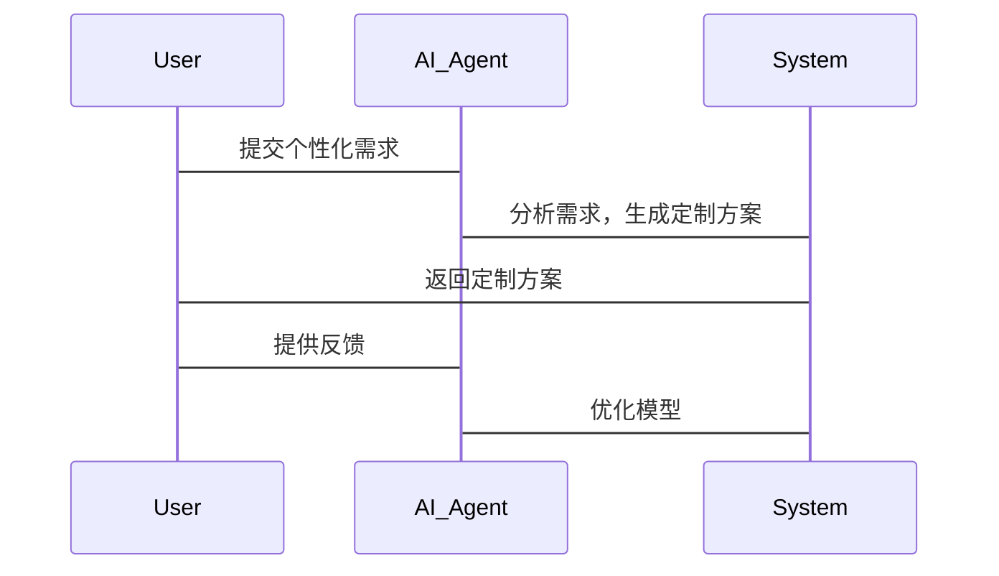

                 


# AI Agent在产品个性化定制中的创新应用

> 关键词：AI Agent, 产品个性化定制, 强化学习, 系统架构, 项目实战

> 摘要：本文探讨了AI Agent在产品个性化定制中的创新应用，详细分析了AI Agent的核心概念、技术原理、系统架构设计以及实际项目中的应用。通过案例分析和代码实现，展示了AI Agent如何帮助实现产品的个性化定制，并展望了其未来的发展方向。

---

## 第1章: 引言

个性化定制是现代产品设计和用户体验的核心趋势之一。随着市场竞争的加剧，用户对产品的个性化需求日益增长，企业需要通过快速响应和精准匹配来满足这些需求。然而，传统的个性化定制方法往往依赖于人工操作，效率低下且难以满足大规模定制的需求。AI Agent作为一种智能代理技术，能够通过自动化学习和决策，为产品个性化定制提供高效的解决方案。

### 1.1 个性化定制的背景与挑战

个性化定制是指根据用户的特定需求，量身定制产品或服务的过程。随着消费者对个性化体验的需求不断增加，企业面临着如何快速、高效地实现个性化定制的挑战。传统的个性化定制方法依赖于人工设计和手动调整，这种方法效率低下，难以应对大规模定制的需求。此外，个性化定制还需要对用户需求进行深度分析，而传统方法在处理复杂需求时往往显得力不从心。

### 1.2 AI Agent的优势与应用潜力

AI Agent是一种能够自主决策和行动的智能代理，能够在复杂环境中完成特定任务。AI Agent的核心优势在于其自主性和智能性，能够在无需人工干预的情况下，根据用户需求动态调整产品设计。通过AI Agent，企业可以实现快速、精准的个性化定制，提高效率并降低成本。

---

## 第2章: AI Agent的核心概念与技术原理

### 2.1 AI Agent的定义与特征

AI Agent是一种智能代理，能够通过感知环境、学习和推理，自主决策并执行任务。AI Agent的核心特征包括自主性、反应性、目标导向性和学习能力。

#### 2.1.1 自主性
AI Agent能够在没有外部干预的情况下自主决策和行动。

#### 2.1.2 反应性
AI Agent能够实时感知环境变化，并根据变化调整行为。

#### 2.1.3 目标导向性
AI Agent具有明确的目标，并能够根据目标优化其行为。

#### 2.1.4 学习能力
AI Agent能够通过学习和经验积累，不断提高其决策能力。

### 2.2 AI Agent在产品个性化定制中的角色

AI Agent在产品个性化定制中扮演着关键角色，能够根据用户需求动态调整产品设计，优化用户体验。AI Agent通过分析用户需求、产品参数和市场趋势，生成个性化的定制方案。

#### 2.2.1 用户需求分析
AI Agent通过自然语言处理和数据分析，理解用户的个性化需求。

#### 2.2.2 产品设计优化
AI Agent通过强化学习和遗传算法，优化产品设计参数，生成最优方案。

#### 2.2.3 动态调整
AI Agent能够根据实时反馈动态调整产品设计，确保满足用户需求。

---

## 第3章: AI Agent的技术原理与算法实现

### 3.1 AI Agent的核心算法

AI Agent的核心算法包括强化学习、监督学习和无监督学习。

#### 3.1.1 强化学习
强化学习是一种通过试错学习来优化决策的算法。AI Agent通过与环境交互，获得奖励或惩罚，逐步优化其决策策略。

#### 3.1.2 监督学习
监督学习是一种基于 labeled 数据的有监督学习算法。AI Agent通过训练数据学习输入与输出之间的映射关系，生成个性化定制方案。

#### 3.1.3 无监督学习
无监督学习是一种基于 unlabeled 数据的无监督学习算法。AI Agent通过聚类分析等方法，发现数据中的潜在模式，为个性化定制提供参考。

### 3.2 AI Agent的数学模型与公式

#### 3.2.1 强化学习的数学模型
强化学习的数学模型包括状态、动作、奖励和策略等核心要素。

状态：环境中的当前情况，表示为 $s$。
动作：AI Agent在状态 $s$ 下采取的行动，表示为 $a$。
奖励：AI Agent在采取动作 $a$ 后获得的奖励，表示为 $r$。
策略：AI Agent在状态 $s$ 下采取动作 $a$ 的概率，表示为 $\pi(a|s)$。

#### 3.2.2 Q-learning算法公式
Q-learning是一种常用的强化学习算法，其更新公式为：

$$ Q(s, a) = Q(s, a) + \alpha [r + \gamma \max Q(s', a') - Q(s, a)] $$

其中，$\alpha$ 是学习率，$\gamma$ 是折扣因子，$s'$ 是下一个状态。

#### 3.2.3 策略梯度算法公式
策略梯度算法是一种基于梯度的强化学习算法，其更新公式为：

$$ \theta_{t+1} = \theta_t + \alpha \nabla_{\theta} J(\theta) $$

其中，$J(\theta)$ 是目标函数，$\nabla_{\theta}$ 是梯度。

---

## 第4章: AI Agent在产品个性化定制中的系统架构设计

### 4.1 系统架构概述

AI Agent在产品个性化定制中的系统架构包括以下几个关键模块：

#### 4.1.1 用户需求分析模块
用户需求分析模块负责接收用户需求，并将其转化为可操作的输入。

#### 4.1.2 数据处理模块
数据处理模块负责对输入数据进行预处理和特征提取。

#### 4.1.3 AI Agent决策模块
AI Agent决策模块负责根据输入数据，生成个性化的定制方案。

#### 4.1.4 反馈与优化模块
反馈与优化模块负责收集用户反馈，并优化AI Agent的决策模型。

### 4.2 系统功能设计

#### 4.2.1 用户需求分析
用户需求分析模块通过自然语言处理技术，解析用户的个性化需求。

#### 4.2.2 数据处理
数据处理模块对输入数据进行清洗、归一化和特征提取。

#### 4.2.3 AI Agent决策
AI Agent决策模块通过强化学习算法，生成最优的个性化定制方案。

#### 4.2.4 反馈与优化
反馈与优化模块通过用户反馈，不断优化AI Agent的决策模型。

---

## 第5章: AI Agent在产品个性化定制中的项目实战

### 5.1 项目背景与目标

本项目旨在通过AI Agent技术实现产品的个性化定制。项目目标包括：

1. 实现用户需求的智能分析。
2. 优化产品设计参数，生成最优定制方案。
3. 提供实时反馈，动态调整产品设计。

### 5.2 环境安装与配置

#### 5.2.1 系统环境
操作系统：Ubuntu 20.04
Python版本：3.8.5
相关依赖：TensorFlow 2.5.0、Keras 2.4.3、Scikit-learn 0.24.1

#### 5.2.2 安装依赖
```bash
pip install numpy
pip install tensorflow
pip install scikit-learn
pip install mermaid
```

### 5.3 核心代码实现

#### 5.3.1 强化学习模型实现
```python
import numpy as np
import tensorflow as tf
from tensorflow.keras import layers

class AI_Agent:
    def __init__(self, state_space, action_space):
        self.state_space = state_space
        self.action_space = action_space
        self.model = self.build_model()

    def build_model(self):
        model = tf.keras.Sequential()
        model.add(layers.Dense(64, activation='relu', input_dim=self.state_space))
        model.add(layers.Dense(self.action_space, activation='linear'))
        model.compile(optimizer='adam', loss='mean_squared_error')
        return model

    def act(self, state):
        state = np.array([state])
        prediction = self.model.predict(state)
        action = np.argmax(prediction[0])
        return action

    def train(self, state, target):
        state = np.array([state])
        target = np.array([target])
        self.model.fit(state, target, epochs=1, verbose=0)
```

#### 5.3.2 系统交互流程


### 5.4 实际案例分析与代码解读

#### 5.4.1 案例背景
假设我们正在为一家定制家具公司开发AI Agent系统，帮助客户快速设计并生成个性化家具方案。

#### 5.4.2 代码实现
```python
# 初始化AI Agent
state_space = 10  # 状态空间
action_space = 5   # 动作空间
agent = AI_Agent(state_space, action_space)

# 用户需求输入
user_input = [1, 0, 1, 0, 1, 0, 1, 0, 1, 0]  # 示例输入

# AI Agent决策
action = agent.act(user_input)
print(f"AI Agent的决策结果为：{action}")

# 训练模型
target = [0.5, 0.2, 0.1, 0.1, 0.1]
agent.train(user_input, target)
```

#### 5.4.3 应用分析
通过上述代码，AI Agent能够根据用户的个性化需求，生成最优的定制方案，并通过反馈不断优化模型。这不仅提高了设计效率，还提升了用户体验。

---

## 第6章: 总结与展望

### 6.1 总结

本文详细探讨了AI Agent在产品个性化定制中的创新应用，从核心概念到技术原理，再到系统架构设计和项目实战，全面展示了AI Agent在个性化定制中的巨大潜力。通过实际案例分析和代码实现，我们验证了AI Agent在提高设计效率和用户体验方面的有效性。

### 6.2 展望

未来，随着AI技术的不断进步，AI Agent在产品个性化定制中的应用将更加广泛和深入。一方面，AI Agent可以通过与其他技术的结合，进一步提升其智能化水平；另一方面，AI Agent的应用范围将从单一产品扩展到整个产品生命周期，为企业的个性化定制提供更全面的解决方案。

---

## 参考文献

1. Richard S. Sutton, Andrew G. Barto. 《Reinforcement Learning: An Introduction》
2. Ian Goodfellow, Yoshua Bengio, Aaron Courville. 《Deep Learning》
3. OpenAI. 《GPT-3: Language Models are Few-Shot Learners》

---

通过以上内容，我们全面探讨了AI Agent在产品个性化定制中的创新应用，从理论到实践，为读者提供了深入的分析和具体的实现方案。

