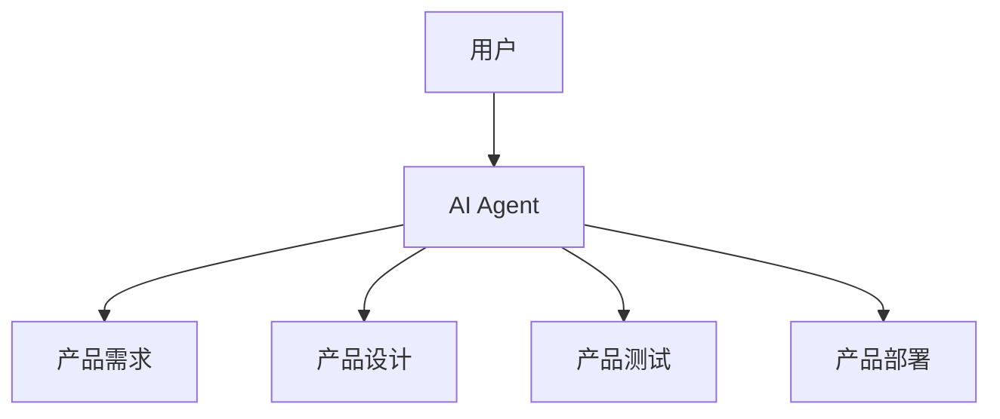
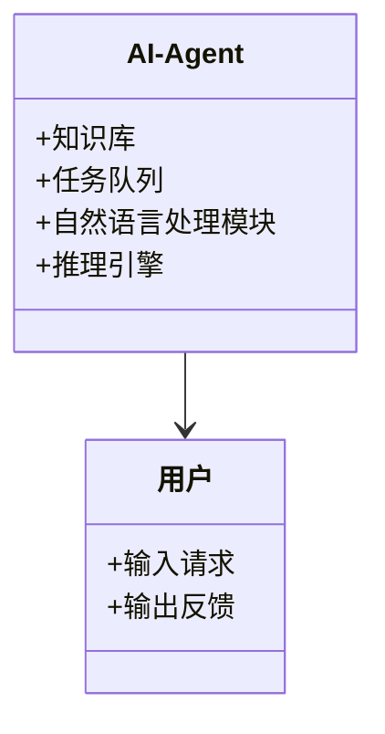
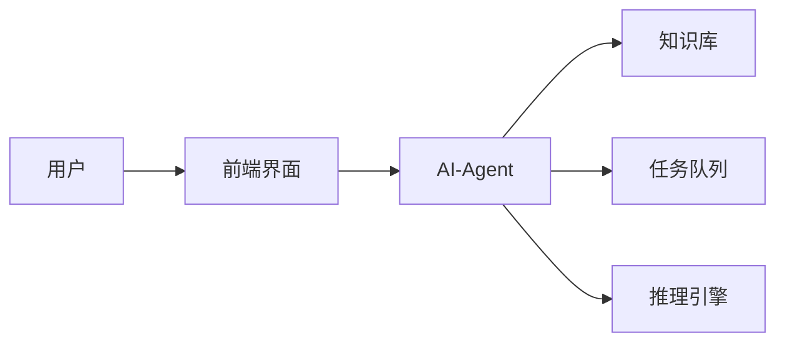

                 


# AI Agent在产品生命周期管理中的全面应用

> 关键词：AI Agent, 产品生命周期管理, 算法原理, 系统架构, 项目实战

> 摘要：本文探讨AI Agent在产品生命周期管理中的全面应用，从核心概念到算法原理，再到系统架构和项目实战，系统性地分析其在产品需求分析、设计、开发、测试和部署等阶段中的具体应用场景和价值。通过实例分析和详细的技术实现，揭示AI Agent如何赋能现代产品生命周期管理，提升效率和质量。

---

# 第一部分: AI Agent与产品生命周期管理概述

## 第1章: AI Agent与产品生命周期管理的背景

### 1.1 AI Agent的基本概念
AI Agent（人工智能代理）是指能够感知环境、自主决策并执行任务的智能实体。它具备以下核心特点：
- **自主性**：能够在没有外部干预的情况下自主运作。
- **反应性**：能够实时感知环境并做出反应。
- **目标导向**：基于目标驱动行为，优化决策以达到目标。

AI Agent的核心属性包括：
- **知识表示**：通过知识库表示任务相关的知识。
- **推理能力**：基于知识进行逻辑推理，推导出解决方案。
- **任务规划**：根据目标生成执行步骤并优化路径。
- **自然语言处理**：与用户进行自然语言交互，理解需求并提供反馈。

AI Agent的分类主要基于应用场景和功能：
1. **任务驱动型**：专注于完成特定任务。
2. **服务驱动型**：提供持续的服务支持。
3. **知识密集型**：依赖丰富的知识库进行推理。

---

### 1.2 产品生命周期管理的背景
产品生命周期（Product Life Cycle）是指产品从构思、设计、生产、销售到退市的整个过程。传统的产品生命周期管理依赖人工操作，存在以下问题：
- **效率低下**：手动处理需求、设计和测试，耗时且容易出错。
- **信息孤岛**：不同阶段的数据分散，缺乏有效整合。
- **决策滞后**：依赖人工分析，难以快速响应变化。

随着人工智能技术的发展，智能化的工具和方法被引入产品生命周期管理，以提升效率和质量。AI Agent在其中扮演了关键角色，通过自动化处理和智能决策，优化各个阶段的流程。

---

### 1.3 AI Agent在产品生命周期管理中的应用背景
AI Agent的应用为产品生命周期管理带来了以下优势：
- **自动化处理**：AI Agent可以自动处理需求分析、任务分配和进度跟踪。
- **实时反馈**：通过实时监控产品状态，AI Agent能够快速识别问题并提供解决方案。
- **数据驱动决策**：基于历史数据和实时信息，AI Agent能够做出更精准的决策。

当前，AI Agent在产品生命周期管理中的应用主要集中在以下几个方面：
1. **需求分析**：通过自然语言处理技术，AI Agent能够从客户需求中提取关键信息。
2. **设计优化**：利用知识表示和推理能力，AI Agent可以帮助设计师优化产品方案。
3. **测试与验证**：AI Agent可以自动化执行测试用例，并根据结果调整测试策略。
4. **部署与监控**：AI Agent能够实时监控产品运行状态，及时发现并解决问题。

---

## 第2章: AI Agent的核心概念与原理

### 2.1 AI Agent的核心原理
AI Agent的核心原理包括任务规划、知识表示和自然语言处理三部分：
1. **任务规划**：AI Agent需要根据目标生成执行步骤，并优先处理重要任务。
2. **知识表示**：通过知识库表示任务相关的知识，并支持推理和学习。
3. **自然语言处理**：AI Agent能够理解用户输入的自然语言，并生成相应的反馈。

---

### 2.2 AI Agent的属性特征对比
以下是不同类型AI Agent的特征对比：

| 属性                | 任务驱动型AI Agent | 服务驱动型AI Agent |
|---------------------|---------------------|---------------------|
| 目标                | 完成特定任务         | 提供持续服务         |
| 交互方式            | 主动执行任务         | 被动响应请求         |
| 知识库              | 任务相关知识         | 广泛领域知识         |
| 应用场景            | 特定任务场景         | 多场景服务支持       |

---

### 2.3 AI Agent的实体关系图
以下是AI Agent在产品生命周期管理中的实体关系图：



---

### 2.4 本章小结
本章介绍了AI Agent的基本概念、核心原理和属性特征，通过对比分析和实体关系图展示了AI Agent在产品生命周期管理中的应用潜力。

---

## 第3章: AI Agent的算法原理与数学模型

### 3.1 AI Agent的任务规划算法
AI Agent的任务规划算法通常包括任务分解、优先级排序和路径规划三部分。以下是任务分解的步骤：
1. **目标分解**：将大目标分解为子任务。
2. **优先级排序**：根据任务的重要性和紧急性进行排序。
3. **路径规划**：根据优先级生成执行路径。

以下是任务规划的数学模型：

$$
\text{优先级} = \alpha \times \text{重要性} + \beta \times \text{紧急性}
$$

其中，$\alpha$ 和 $\beta$ 是权重系数，$\alpha + \beta = 1$。

---

### 3.2 AI Agent的自然语言处理算法
自然语言处理（NLP）是AI Agent与用户交互的核心技术。以下是NLP的主要步骤：
1. **分词**：将输入文本分割为词语或短语。
2. **实体识别**：识别文本中的实体。
3. **意图识别**：理解用户的意图。

以下是意图识别的数学模型：

$$
P(\text{意图}|x) = \frac{P(x|\text{意图}) \times P(\text{意图})}{\sum_{i} P(x|\text{意图}_i) \times P(\text{意图}_i)}
$$

---

## 第4章: AI Agent的系统分析与架构设计

### 4.1 系统功能设计
AI Agent在产品生命周期管理中的系统功能包括：
1. **需求管理**：提取和分析需求。
2. **设计优化**：辅助产品设计。
3. **测试管理**：自动化测试和结果分析。

以下是系统功能设计的类图：



---

### 4.2 系统架构设计
以下是系统架构设计的架构图：



---

### 4.3 系统接口设计
AI Agent与外部系统的接口设计包括：
1. **用户接口**：接收用户的输入请求。
2. **知识库接口**：与知识库进行数据交互。
3. **推理引擎接口**：与推理引擎进行通信。

---

## 第5章: AI Agent的项目实战

### 5.1 项目介绍
本项目旨在开发一个基于AI Agent的产品生命周期管理工具，实现从需求分析到产品部署的全流程管理。

---

### 5.2 环境安装
以下是项目所需的环境和工具：
- **Python 3.8及以上**
- **TensorFlow 2.0及以上**
- **spaCy 2.2及以上**
- **Mermaid CLI**

---

### 5.3 核心代码实现
以下是AI Agent的核心代码实现：

```python
class AI-Agent:
    def __init__(self):
        selfknowledge_base = {}
        self.task_queue = []
        self.nlp_module = NLP_Module()

    def process_request(self, request):
        # 分析请求
        entities = self.nlp_module.extract_entities(request)
        intent = self.nlp_module.detect_intent(request)
        
        # 执行任务
        self.task_queue.append((intent, entities))
        self.execute_task(intent, entities)
    
    def execute_task(self, intent, entities):
        # 根据意图执行任务
        pass
```

---

### 5.4 案例分析
以下是AI Agent在产品测试阶段的应用案例：

1. **需求分析**：用户输入需求文档，AI Agent提取关键需求。
2. **任务分配**：AI Agent将需求分配给开发人员。
3. **进度跟踪**：AI Agent实时跟踪开发进度并提供反馈。

---

### 5.5 项目小结
本项目展示了AI Agent在产品生命周期管理中的具体应用，通过实际案例分析，验证了其在需求分析、任务分配和进度跟踪等阶段的价值。

---

## 第6章: 最佳实践与总结

### 6.1 最佳实践
1. **数据隐私保护**：在设计AI Agent时，必须重视数据隐私保护。
2. **模型泛化能力**：需要关注AI Agent的模型泛化能力，避免过度依赖特定场景。
3. **持续优化**：定期更新知识库和模型，提升AI Agent的性能。

---

### 6.2 小结
本文全面探讨了AI Agent在产品生命周期管理中的应用，从核心概念到算法原理，再到系统架构和项目实战，系统性地分析了其在产品需求分析、设计、开发、测试和部署等阶段中的具体应用场景和价值。

---

### 6.3 注意事项
1. **数据质量问题**：AI Agent的性能依赖于数据质量，需要确保数据的准确性和完整性。
2. **算法可解释性**：在实际应用中，需要关注AI Agent的算法可解释性，以便更好地理解和优化其行为。

---

### 6.4 拓展阅读
1. 《人工智能: 现代方法》
2. 《自然语言处理实战》
3. 《软件工程: 现代方法》

---

# 结语
AI Agent作为人工智能领域的前沿技术，正在逐步改变产品生命周期管理的方式。通过本文的分析，我们可以看到，AI Agent在提升效率、优化决策和降低成本方面具有巨大的潜力。未来，随着技术的不断进步，AI Agent将在产品生命周期管理中发挥更大的作用。

