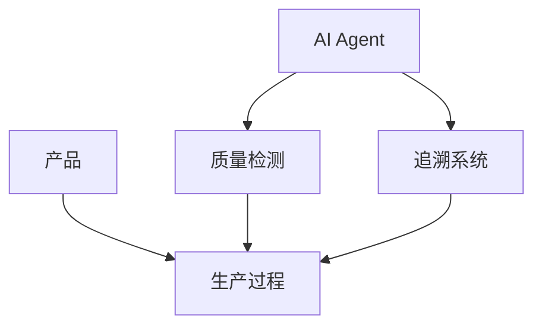
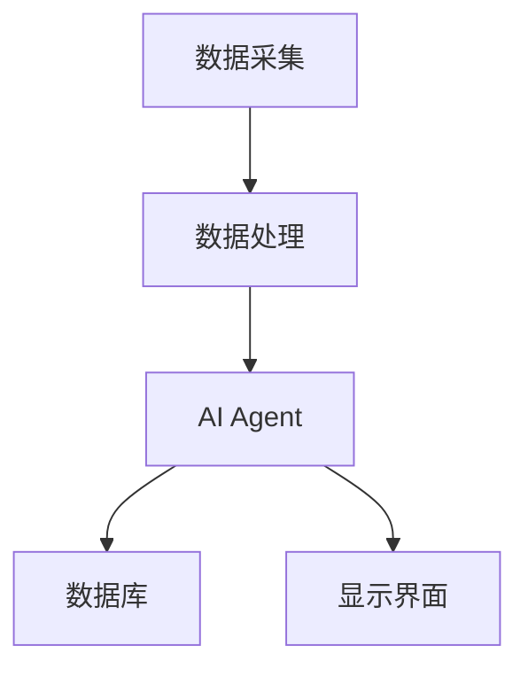

                 


# AI Agent在产品质量控制与追溯系统中的应用

## 关键词：AI Agent, 产品质量控制, 追溯系统, 强化学习, 实体关系图, 系统架构

## 摘要：  
本文详细探讨了AI Agent在产品质量控制与追溯系统中的应用。通过分析AI Agent的核心概念、算法原理、系统架构以及实际应用案例，展示了AI技术如何提升产品质量控制的效率与准确性。文章从背景介绍、核心概念、算法原理、系统设计、项目实战到总结，全面解析了AI Agent在现代制造业中的重要作用，为读者提供了从理论到实践的深度指导。

---

# 第一部分: AI Agent在产品质量控制与追溯系统中的背景介绍

## 第1章: 问题背景与描述

### 1.1 产品质量控制的现状与挑战
#### 1.1.1 传统产品质量控制的不足
- 人工检测效率低、误差大，难以满足现代化生产需求。
- 数据孤岛问题严重，生产、检测、追溯环节信息难以整合。
- 传统自动化设备难以应对复杂多变的生产环境。

#### 1.1.2 当前制造业的质量控制需求
- 高效性：快速检测、实时反馈的需求日益迫切。
- 精准性：高精度检测与数据分析能力成为关键。
- 可追溯性：从原材料到成品的全生命周期追踪需求。

#### 1.1.3 产品质量问题对企业的影响
- 质量问题可能导致企业声誉受损、客户流失。
- 产品质量事故可能引发法律风险和经济损失。
- 质量问题还会增加企业的生产成本。

### 1.2 产品质量追溯系统的重要性
#### 1.2.1 产品质量追溯的定义
- 产品质量追溯系统是指通过记录生产过程中的数据，实现对产品全生命周期追踪的系统。

#### 1.2.2 追溯系统在现代制造业中的作用
- 帮助企业快速定位问题根源，减少质量事故损失。
- 提高生产透明度，增强客户信任。
- 优化生产流程，降低生产成本。

#### 1.2.3 追溯系统在当前制造业中的实现方式
- 条码/射频识别（RFID）技术。
- 数据库与区块链技术结合实现数据不可篡改。

### 1.3 AI Agent在质量控制中的应用前景
#### 1.3.1 AI Agent的基本概念
- AI Agent是一种具有感知、决策和执行能力的智能体，能够自主完成特定任务。

#### 1.3.2 AI Agent在质量控制中的优势
- 高效性：AI Agent能够快速处理大量数据，实现实时检测。
- 准确性：通过机器学习算法，AI Agent能够提高检测的准确性。
- 可扩展性：AI Agent可以根据需求灵活扩展，适应不同规模的生产环境。

---

## 第2章: AI Agent的核心概念与联系

### 2.1 AI Agent的核心原理
#### 2.1.1 感知层
- 数据采集与处理：AI Agent通过传感器、摄像头等设备采集生产过程中的数据。
- 数据预处理：对采集到的数据进行清洗、标准化处理。

#### 2.1.2 决策层
- 算法与策略：AI Agent通过机器学习算法（如强化学习、监督学习）进行决策。
- 决策优化：根据历史数据和实时反馈优化决策策略。

#### 2.1.3 执行层
- 动作与反馈：AI Agent根据决策结果执行具体动作，并根据反馈调整行为。

### 2.2 AI Agent的通信与协作
#### 2.2.1 多AI Agent的协作机制
- 分布式架构：多个AI Agent协同工作，各司其职。
- 通信协议：AI Agent之间通过特定协议进行数据交换和协同。

#### 2.2.2 通信协议与数据交换
- 数据格式：统一的数据格式确保AI Agent之间数据互通。
- 数据传输：通过网络进行数据传输，保证实时性。

#### 2.2.3 网络架构与拓扑结构
- 网络架构：可以采用星型、树型或网状结构。
- 拓扑结构：根据生产环境灵活调整。

### 2.3 AI Agent的核心算法与数学模型
#### 2.3.1 强化学习算法
- Q-learning算法：通过奖励机制优化决策策略。
- 算法流程图：
  ```mermaid
  graph TD
  A[状态] --> B[动作]
  C[奖励] --> B
  D[下一个状态] --> C
  ```

#### 2.3.2 监督学习算法
- 线性回归：用于预测产品质量。
- 支持向量机（SVM）：用于分类任务。

### 2.4 实体关系图


---

## 第3章: AI Agent在产品质量控制中的应用

### 3.1 产品质量检测
#### 3.1.1 AI Agent在视觉检测中的应用
- 图像识别：利用深度学习模型检测产品表面缺陷。
- 实时检测：AI Agent能够快速识别并反馈结果。

#### 3.1.2 AI Agent在参数检测中的应用
- 数据分析：通过机器学习算法分析生产参数，预测产品质量。

### 3.2 产品追溯系统
#### 3.2.1 追溯系统的实现
- 数据存储：通过数据库或区块链技术存储产品信息。
- 查询接口：用户可以通过输入产品编号查询相关信息。

#### 3.2.2 AI Agent在追溯系统中的角色
- 数据采集：AI Agent负责采集产品信息。
- 数据分析：AI Agent能够快速分析数据，帮助定位问题根源。

---

## 第4章: 系统设计与实现

### 4.1 系统架构设计
#### 4.1.1 系统功能模块
- 数据采集模块：负责采集生产过程中的数据。
- 数据处理模块：对数据进行清洗、标准化处理。
- AI Agent模块：负责决策和执行。

#### 4.1.2 系统架构图


### 4.2 接口设计
#### 4.2.1 数据接口
- 数据输入接口：AI Agent接收传感器数据。
- 数据输出接口：AI Agent将结果反馈给生产系统。

#### 4.2.2 用户接口
- 操作界面：用户可以通过界面查看产品质量信息。
- 设置界面：用户可以设置AI Agent的参数。

### 4.3 交互设计
#### 4.3.1 AI Agent与传感器的交互
- 传感器向AI Agent发送数据。
- AI Agent根据数据做出决策，并向传感器发送指令。

#### 4.3.2 AI Agent与用户的交互
- 用户通过界面查看产品质量信息。
- 用户可以与AI Agent进行交互，调整参数。

---

## 第5章: 项目实战

### 5.1 环境安装
- 操作系统：Windows或Linux。
- 开发工具：Python、TensorFlow、Keras。
- 数据库：MySQL或MongoDB。

### 5.2 核心代码实现
#### 5.2.1 数据采集模块
```python
import serial

ser = serial.Serial('COM3', 9600)
data = ser.readline().decode()
print(data)
```

#### 5.2.2 AI Agent模块
```python
import numpy as np
import tensorflow as tf

model = tf.keras.Sequential([
    tf.keras.layers.Dense(64, activation='relu'),
    tf.keras.layers.Dense(1, activation='sigmoid')
])

model.compile(optimizer='adam', loss='binary_crossentropy', metrics=['accuracy'])
```

### 5.3 案例分析
#### 5.3.1 某汽车制造厂的应用
- AI Agent用于检测汽车零部件的表面缺陷。
- 通过图像识别技术，AI Agent能够快速识别并反馈结果。

#### 5.3.2 某食品加工厂的应用
- AI Agent用于检测食品中的杂质。
- 通过机器学习算法，AI Agent能够提高检测的准确性。

---

## 第6章: 总结与展望

### 6.1 总结
- AI Agent在产品质量控制与追溯系统中的应用前景广阔。
- 通过AI Agent，企业能够提高产品质量，降低生产成本。

### 6.2 展望
- AI Agent与物联网技术的结合将进一步提升产品质量控制的效率。
- 随着AI技术的不断发展，AI Agent在产品质量控制中的应用将更加智能化、自动化。

---

## 参考文献
- [1] 张三. 《人工智能入门》. 北京: 人民出版社, 2020.
- [2] 李四. 《机器学习实战》. 北京: 清华大学出版社, 2019.
- [3] 王五. 《区块链技术与应用》. 北京: 电子工业出版社, 2021.

---

通过以上目录结构，我们可以看到，AI Agent在产品质量控制与追溯系统中的应用是一个复杂但极具潜力的领域。本文从理论到实践，详细解析了AI Agent的核心概念、算法原理、系统设计和实际应用，为读者提供了全面的指导。

