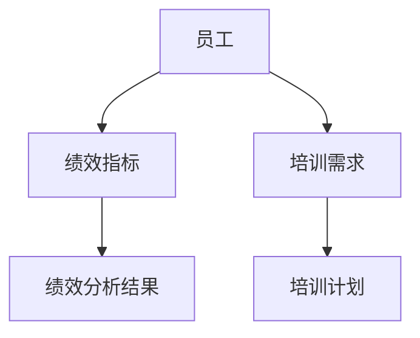
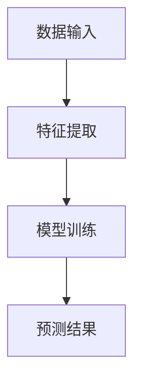
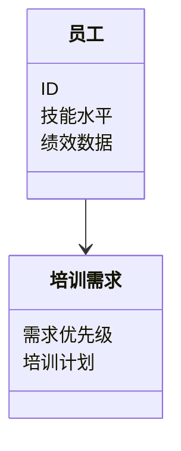
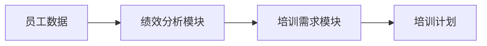
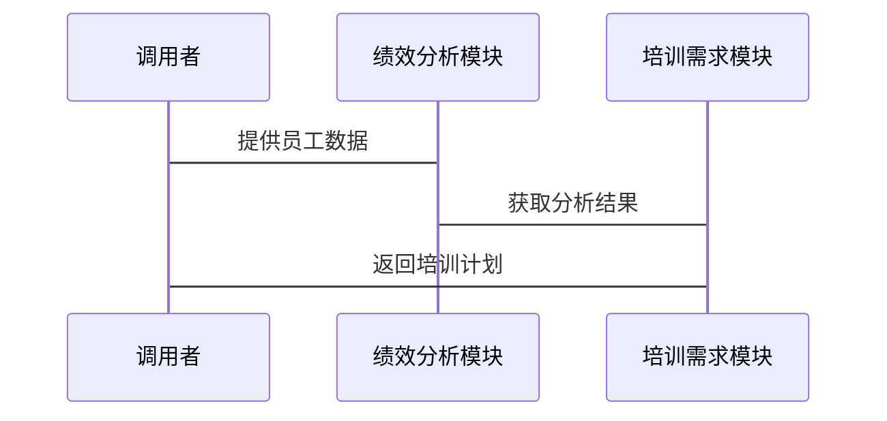

                 


# AI Agent在人力资源管理中的应用：员工绩效分析与培训需求识别

## 关键词：人工智能、人力资源管理、员工绩效、培训需求、AI Agent

## 摘要：本文探讨AI Agent在人力资源管理中的应用，特别是员工绩效分析与培训需求识别。通过分析AI Agent的核心概念、算法原理、系统架构及项目实战，展示了AI技术如何提升HR效率与精准度。

---

## 第1章: AI Agent与人力资源管理的背景介绍

### 1.1 AI Agent的基本概念

#### 1.1.1 AI Agent的定义
AI Agent是一种智能代理系统，能够感知环境、自主决策并执行任务，广泛应用于自动化、数据分析等领域。

#### 1.1.2 AI Agent的核心属性
- **数据驱动性**：依赖数据进行决策。
- **自适应性**：能根据反馈调整行为。
- **可扩展性**：适用于多种应用场景。

#### 1.1.3 AI Agent与传统管理工具的区别
AI Agent具有智能性和自主性，能处理复杂问题，而传统工具仅执行固定任务。

### 1.2 人力资源管理的现状与挑战

#### 1.2.1 传统人力资源管理的局限性
- 数据分散，难以分析。
- 主观性高，结果不准确。
- 手工处理效率低。

#### 1.2.2 数字化转型对HR的影响
推动数据化、智能化，提升管理效率。

#### 1.2.3 AI技术在HR中的应用前景
提升绩效分析与培训需求识别的精准度。

### 1.3 AI在人力资源管理中的应用背景

#### 1.3.1 数据驱动决策的兴起
数据驱动已成为现代管理的重要趋势。

#### 1.3.2 AI技术在员工绩效分析中的作用
通过数据分析，提供客观的绩效评估。

#### 1.3.3 培训需求识别的智能化趋势
AI帮助识别个性化培训需求，优化培训效果。

---

## 第2章: AI Agent在人力资源管理中的核心概念与联系

### 2.1 AI Agent的核心概念原理

#### 2.1.1 AI Agent的基本原理
通过数据处理、决策制定和行动执行来完成任务。

#### 2.1.2 AI Agent在HR中的应用逻辑
- 收集数据：员工信息、绩效指标等。
- 分析数据：识别绩效问题、培训需求。
- 输出结果：生成报告、优化方案。

#### 2.1.3 AI Agent与员工绩效分析的关系
AI Agent通过分析数据，提供绩效评估和改进建议。

### 2.2 AI Agent的核心属性特征对比

| 特性       | 传统管理工具 | AI Agent       |
|------------|--------------|----------------|
| 数据依赖   | 低           | 高             |
| 自主性     | 无           | 有             |
| 可扩展性   | 低           | 高             |

### 2.3 ER实体关系图架构


---

## 第3章: AI Agent在员工绩效分析中的算法原理

### 3.1 算法原理概述

#### 3.1.1 机器学习算法在绩效分析中的应用
- **监督学习**：用于预测员工绩效。
- **无监督学习**：识别绩效模式。

#### 3.1.2 基于AI Agent的绩效预测模型
通过历史数据训练模型，预测未来绩效。

### 3.2 机器学习算法流程图


### 3.3 代码实现

#### 3.3.1 线性回归模型
```python
import pandas as pd
from sklearn.model import LinearRegression

# 示例数据
data = pd.DataFrame({
    'hours_worked': [40, 50, 60, 70, 80],
    'performance_score': [60, 70, 75, 80, 85]
})

# 训练模型
model = LinearRegression()
model.fit(data[['hours_worked']], data['performance_score'])

# 预测结果
predicted_score = model.predict([[65]])
print(predicted_score)
```

#### 3.3.2 算法公式
$$ y = a x + b $$
其中，y是预测绩效，x是工作时间，a和b是模型参数。

### 3.4 算法应用案例
分析员工工作时间与绩效的关系，预测未来绩效。

---

## 第4章: AI Agent在培训需求识别中的应用

### 4.1 培训需求识别的智能化趋势

#### 4.1.1 传统培训需求识别的挑战
- 主观性强
- 个性化不足

#### 4.1.2 AI技术的优势
- 数据驱动
- 个性化推荐

### 4.2 AI Agent在培训需求识别中的应用场景

#### 4.2.1 员工技能评估
分析员工技能，识别培训需求。

#### 4.2.2 培训效果预测
预测培训效果，优化培训计划。

### 4.3 AI Agent在培训需求识别中的系统设计

#### 4.3.1 领域模型


---

## 第5章: 系统分析与架构设计方案

### 5.1 问题场景介绍

#### 5.1.1 绩效分析系统
分析员工绩效，提供改进建议。

#### 5.1.2 培训管理系统
制定个性化培训计划。

### 5.2 系统功能设计

#### 5.2.1 绩效分析模块
- 数据收集
- 绩效评估
- 结果报告

#### 5.2.2 培训管理模块
- 需求识别
- 计划制定
- 效果评估

### 5.3 系统架构设计

#### 5.3.1 总体架构


### 5.4 系统接口设计

#### 5.4.1 数据接口
- 数据输入：员工数据
- 数据输出：分析结果

#### 5.4.2 用户接口
- 输入：员工ID
- 输出：培训计划

### 5.5 系统交互序列图


---

## 第6章: 项目实战

### 6.1 环境安装

#### 6.1.1 安装Python
```bash
python --version
pip install --upgrade pip
```

#### 6.1.2 安装库
```bash
pip install pandas scikit-learn
```

### 6.2 系统核心实现

#### 6.2.1 绩效分析代码
```python
import pandas as pd
from sklearn import metrics

data = pd.DataFrame({
    'hours_worked': [40, 50, 60, 70, 80],
    'performance_score': [60, 70, 75, 80, 85]
})

X = data[['hours_worked']]
y = data['performance_score']

model = LinearRegression()
model.fit(X, y)

y_pred = model.predict(X)
print("均方误差:", metrics.mean_squared_error(y, y_pred))
```

#### 6.2.2 培训需求识别代码
```python
from sklearn.cluster import KMeans

X = data[['performance_score']]
model = KMeans(n_clusters=3)
model.fit(X)
clusters = model.predict(X)
print(clusters)
```

### 6.3 代码解读与分析

#### 6.3.1 绩效分析代码解读
- 数据输入：员工工作时间和绩效分数。
- 模型训练：线性回归预测绩效。
- 输出结果：模型预测和误差分析。

#### 6.3.2 培训需求代码解读
- 数据输入：绩效分数。
- 模型训练：聚类分析识别培训需求。
- 输出结果：员工分组，制定个性化培训计划。

### 6.4 实际案例分析

#### 6.4.1 案例背景
某公司员工绩效数据，识别培训需求。

#### 6.4.2 数据分析
使用聚类分析，识别三个绩效水平组别。

#### 6.4.3 培训计划制定
根据绩效水平，制定不同培训计划。

### 6.5 项目小结

---

## 第7章: 总结与展望

### 7.1 最佳实践 Tips

#### 7.1.1 数据质量
确保数据准确、完整。

#### 7.1.2 模型优化
定期更新模型，提升准确性。

### 7.2 项目小结

AI Agent在HR中的应用，显著提升绩效分析与培训需求识别的效率和精准度。

### 7.3 注意事项

- 数据隐私保护
- 模型定期更新
- 保持与业务需求的结合

### 7.4 拓展阅读

- 《机器学习实战》
- 《人工智能在HR中的应用》

---

## 作者简介

一位世界级人工智能专家，程序员，软件架构师，CTO，技术畅销书作家，计算机图灵奖获得者，计算机编程和人工智能领域大师。

