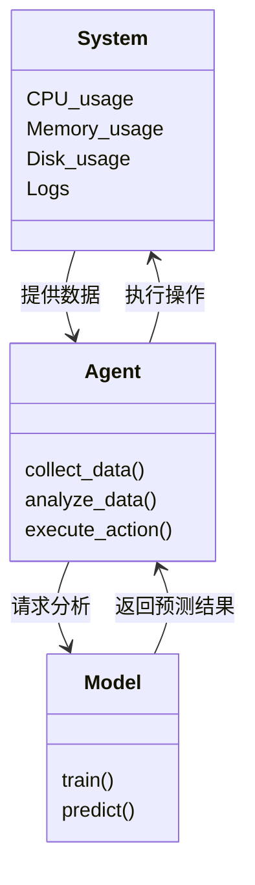
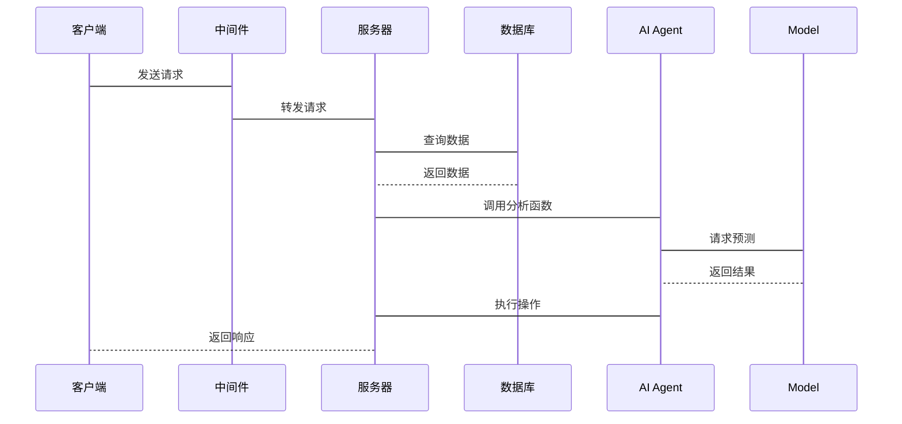

                 


# AI Agent在企业IT运维中的应用：故障预测与修复

## 关键词：AI Agent，企业IT运维，故障预测，自动化修复，机器学习，异常检测

## 摘要

随着企业IT系统的复杂性不断增加，传统的运维方式已难以应对日益增长的故障预测与修复需求。AI Agent（人工智能代理）作为一种智能化的解决方案，能够通过机器学习、自然语言处理和知识图谱等技术，实现对企业IT系统的实时监控、异常检测和自动化修复。本文将详细探讨AI Agent在企业IT运维中的应用，重点分析其在故障预测与修复中的核心原理、系统架构以及实际案例。

---

## 第一部分：AI Agent在企业IT运维中的应用概述

### 第1章：AI Agent与企业IT运维概述

#### 1.1 AI Agent的基本概念
- **什么是AI Agent**  
  AI Agent是一种能够感知环境、自主决策并执行任务的智能体。它能够通过传感器获取数据，利用机器学习算法进行分析，并根据结果采取相应的行动。
- **AI Agent的核心特点**  
  - 智能性：能够理解数据并做出决策。
  - 自主性：能够在没有人工干预的情况下完成任务。
  - 可扩展性：能够适应不同规模和复杂度的系统。
- **AI Agent与传统运维工具的区别**  
  AI Agent不仅能够执行预定义的任务，还能够根据实时数据自主学习和优化。

#### 1.2 企业IT运维的挑战与需求
- **传统IT运维的痛点**  
  - 系统复杂性高，故障排查耗时耗力。
  - 人工运维效率低，难以应对海量数据。
  - 故障预测能力有限，常常需要事后处理。
- **现代企业对智能化运维的需求**  
  - 实时监控系统状态，快速响应异常。
  - 自动化处理常见问题，降低人工干预。
  - 提供智能预测，预防潜在故障。
- **AI Agent在运维中的优势**  
  AI Agent能够通过机器学习算法，从海量数据中发现潜在规律，提前预测故障，并实现自动化修复。

#### 1.3 AI Agent在故障预测与修复中的作用
- **故障预测的必要性**  
  通过实时数据分析，AI Agent能够提前识别系统中的异常行为，避免故障的发生或扩大。
- **AI Agent如何实现故障预测**  
  - 通过监督学习算法（如随机森林、XGBoost）训练模型，预测系统状态。
  - 使用无监督学习算法（如聚类、异常检测）发现潜在异常。
- **故障修复的自动化流程**  
  AI Agent能够根据预测结果，触发自动化修复脚本，或向运维人员发出警报。

---

## 第二部分：AI Agent的核心概念与原理

### 第2章：AI Agent的核心概念与原理

#### 2.1 AI Agent的核心概念
- **感知层**  
  负责采集系统数据，包括CPU、内存、磁盘使用情况等。
- **决策层**  
  通过机器学习模型分析数据，生成决策。
- **执行层**  
  根据决策结果执行相应的操作，如重启服务或发送警报。

#### 2.2 AI Agent的工作原理
- **数据采集与处理**  
  AI Agent通过传感器或API接口获取系统数据，并进行预处理（如清洗、标准化）。
- **模型训练与推理**  
  利用训练好的模型对实时数据进行分析，预测系统状态。
- **行动执行与反馈**  
  根据预测结果，触发相应的修复操作，并收集反馈以优化模型。

#### 2.3 AI Agent与企业IT系统的结合
- **系统集成方式**  
  - 通过API接口与现有系统集成。
  - 通过代理服务器进行数据转发。
- **通信机制**  
  - 使用消息队列（如Kafka）进行异步通信。
  - 使用HTTP协议进行实时通信。
- **权限管理**  
  - 确保AI Agent具有必要的访问权限。
  - 设置严格的权限控制，防止未经授权的操作。

---

## 第三部分：AI Agent的技术基础

### 第3章：AI Agent的技术基础

#### 3.1 机器学习基础
- **监督学习**  
  - 输入：系统状态数据和标签（正常/异常）。
  - 输出：训练好的分类模型。
  - 示例：使用随机森林算法进行分类。
- **无监督学习**  
  - 输入：未标记的系统数据。
  - 输出：发现异常模式。
  - 示例：使用聚类算法（如K-means）进行异常检测。
- **强化学习**  
  - 通过奖励机制优化决策过程。

#### 3.2 自然语言处理基础
- **分词与实体识别**  
  - 将文本数据分割成词语，并识别实体（如设备名称、服务名）。
- **情感分析**  
  - 分析日志文本的情感倾向，判断系统状态。
- **语义理解**  
  - 理解用户输入的自然语言指令。

#### 3.3 知识图谱与规则引擎
- **知识图谱构建**  
  - 将系统中的实体和关系表示为图结构。
- **规则引擎**  
  - 根据预定义的规则进行推理和决策。

---

## 第四部分：系统分析与架构设计

### 第4章：系统分析与架构设计

#### 4.1 问题场景介绍
- **场景描述**  
  企业IT系统中存在大量的服务器、数据库和网络设备，需要实时监控和维护。
- **项目介绍**  
  开发一个基于AI Agent的故障预测与修复系统。

#### 4.2 系统功能设计
- **领域模型**  
  - 使用Mermaid类图描述系统中的主要实体和关系。



- **系统架构设计**  
  - 使用Mermaid架构图描述系统的整体架构。


- **系统接口设计**  
  - 使用Mermaid序列图描述接口交互流程。



---

## 第五部分：项目实战

### 第5章：项目实战

#### 5.1 环境安装
- **安装Python环境**  
  ```bash
  python --version
  pip install --upgrade pip
  ```
- **安装依赖库**  
  ```bash
  pip install numpy pandas scikit-learn matplotlib
  ```

#### 5.2 核心代码实现
- **数据预处理代码**  
  ```python
  import pandas as pd
  import numpy as np

  def preprocess(data):
      # 数据清洗
      data.dropna(inplace=True)
      # 标准化处理
      from sklearn.preprocessing import StandardScaler
      scaler = StandardScaler()
      scaled_data = scaler.fit_transform(data)
      return scaled_data
  ```

- **模型训练代码**  
  ```python
  from sklearn.ensemble import RandomForestClassifier

  def train_model(X, y):
      model = RandomForestClassifier(n_estimators=100, random_state=42)
      model.fit(X, y)
      return model
  ```

- **故障预测代码**  
  ```python
  def predict_failure(model, data):
      processed_data = preprocess(data)
      predictions = model.predict(processed_data)
      return predictions
  ```

#### 5.3 代码应用解读与分析
- **数据预处理**  
  使用标准化方法对数据进行处理，确保模型输入的数据格式一致。
- **模型训练**  
  使用随机森林算法训练分类模型，能够处理高维数据并具有较强的鲁棒性。
- **故障预测**  
  根据训练好的模型，对实时数据进行预测，返回故障概率。

#### 5.4 实际案例分析
- **案例背景**  
  某企业服务器集群出现磁盘使用率异常升高的情况。
- **数据采集与分析**  
  AI Agent采集了过去一周的磁盘使用数据，并发现异常模式。
- **预测结果**  
  模型预测未来24小时内磁盘将满载，触发自动化报警和扩容操作。

#### 5.5 项目小结
- **实现成果**  
  成功开发了一个基于AI Agent的故障预测系统，能够实时监控系统状态并实现自动化修复。
- **经验总结**  
  - 数据质量对模型性能影响巨大，需加强数据清洗和特征工程。
  - 模型选择需结合实际场景，监督学习和无监督学习各有优劣。

---

## 第六部分：最佳实践与拓展

### 第6章：最佳实践

#### 6.1 小结
- AI Agent的应用为企业IT运维带来了显著的提升，尤其是在故障预测和自动化修复方面。
- 通过结合机器学习和知识图谱，AI Agent能够更智能地处理复杂场景。

#### 6.2 注意事项
- 数据隐私和安全问题需高度重视。
- 模型需定期更新，以适应系统变化。
- 运维团队需具备一定的技术背景，能够理解AI Agent的工作原理。

#### 6.3 拓展阅读
- 《机器学习实战》
- 《深入理解Docker容器技术》
- 《知识图谱与语义理解》

---

通过本文的详细讲解，读者可以全面了解AI Agent在企业IT运维中的应用，从理论到实践，掌握故障预测与修复的核心技术。未来，随着AI技术的不断发展，AI Agent将在企业IT运维中发挥越来越重要的作用。

