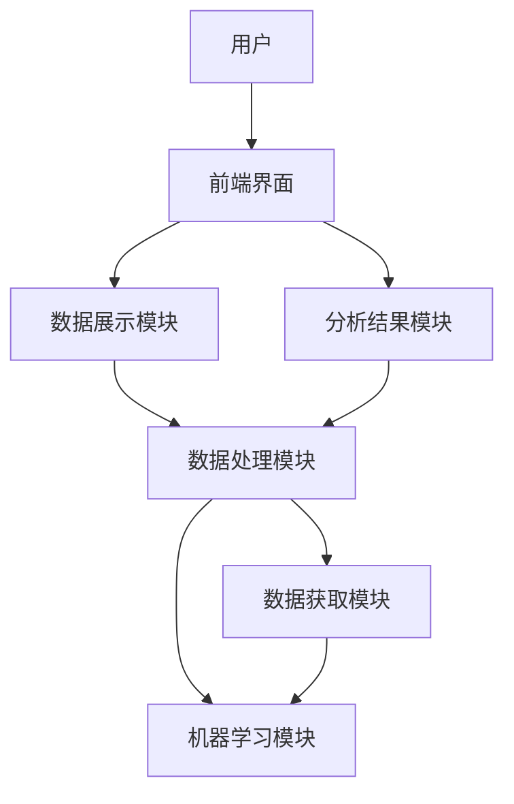
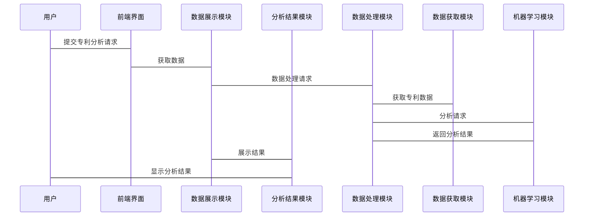

                 


# AI Agent在企业专利分析与技术趋势预测中的应用

> 关键词：AI Agent，专利分析，技术趋势预测，机器学习，知识图谱

> 摘要：随着人工智能技术的快速发展，AI Agent在企业专利分析与技术趋势预测中的应用日益广泛。本文详细探讨了AI Agent在专利数据处理、技术识别、网络分析以及技术趋势预测中的应用，结合实际案例分析，展示了如何利用AI Agent提高专利分析的效率和准确性，并为企业制定技术战略提供有力支持。

---

# 第1章: AI Agent的基本概念与技术基础

## 1.1 AI Agent的定义与核心特征

### 1.1.1 AI Agent的定义

AI Agent（人工智能代理）是一种能够感知环境、自主决策并执行任务的智能系统。它通过传感器获取信息，利用推理引擎进行分析，并通过执行器采取行动，以实现特定目标。

### 1.1.2 AI Agent的核心特征

- **自主性**：能够独立决策和行动。
- **反应性**：能够实时感知环境变化并做出反应。
- **学习能力**：通过数据和经验不断优化自身性能。
- **协作性**：能够与其他系统或人类协同工作。

### 1.1.3 AI Agent与传统数据分析的区别

AI Agent不仅仅是数据处理工具，它具备自主学习和决策能力，能够根据环境反馈动态调整分析策略。

## 1.2 企业专利分析的背景与需求

### 1.2.1 专利分析的重要性

专利是企业技术创新的核心成果，专利分析能够帮助企业了解竞争对手的技术布局、识别技术空白点，并制定有效的技术研发策略。

### 1.2.2 企业专利分析的主要需求

- **技术布局分析**：识别技术领域的重点发展方向。
- **竞争对手分析**：监控竞争对手的专利申请动态。
- **技术风险评估**：评估企业的技术风险，如专利侵权风险。

### 1.2.3 专利分析的挑战与难点

- **数据复杂性**：专利数据量大、格式多样，处理难度高。
- **技术多样性**：不同技术领域的专利分析方法差异大。
- **动态变化性**：技术发展趋势快速变化，需要实时更新分析结果。

## 1.3 AI Agent在专利分析中的价值

### 1.3.1 提高专利分析效率

AI Agent能够快速处理大量专利数据，显著提高分析效率。

### 1.3.2 增强专利分析的准确性

通过机器学习和自然语言处理技术，AI Agent能够准确识别专利中的技术关键词和关联关系。

### 1.3.3 创新性预测与技术趋势分析

AI Agent能够基于历史专利数据，预测未来技术发展趋势，为企业制定技术战略提供支持。

## 1.4 本章小结

本章介绍了AI Agent的基本概念、核心特征及其在企业专利分析中的价值，为后续章节奠定了基础。

---

# 第2章: 专利分析的基础知识

## 2.1 专利数据的结构与分类

### 2.1.1 专利的基本构成要素

- **发明名称**：专利的核心内容。
- **申请号**：专利的唯一标识符。
- **申请人**：专利的发明者或申请单位。
- **申请日期**：专利的申请时间。
- **技术领域**：专利所属的技术领域。

### 2.1.2 专利分类体系

专利通常按照国际专利分类（IPC）进行分类，例如A类是人类生活必需品，B类是作业、运输。

### 2.1.3 专利数据的获取与处理

- **数据获取**：通过专利数据库（如专利合作条约数据库）获取专利数据。
- **数据清洗**：去除重复数据、填补缺失值。
- **数据标注**：标注专利的技术领域、申请人等信息。

## 2.2 专利分析的主要方法

### 2.2.1 基于关键词的分析方法

- **关键词提取**：使用自然语言处理技术提取专利中的技术关键词。
- **关键词频次分析**：统计关键词出现的频次，识别技术热点。

### 2.2.2 基于引用网络的分析方法

- **专利引用网络**：分析专利之间的引用关系，识别技术发展的脉络。

### 2.2.3 基于技术领域的分析方法

- **技术领域分布**：分析专利在不同技术领域的分布情况，识别技术空白点。

## 2.3 专利分析工具与平台

### 2.3.1 常用专利分析工具

- **PatentScope**：世界知识产权组织（WIPO）提供的在线专利检索和分析工具。
- **Inventivice**：基于AI的专利分析工具，提供智能分析和可视化功能。

### 2.3.2 开源专利分析工具

- **Bulk_extractor**：用于从专利文档中提取信息的开源工具。
- **Python中的专利分析库**：如`patent_client`，用于连接专利数据库并进行分析。

### 2.3.3 商业化专利分析平台

- **Thomson Reuters的Innovation**：提供全面的专利分析和可视化功能。
- **LexisNexis的Total**：提供专利数据检索、分析和报告生成功能。

## 2.4 本章小结

本章介绍了专利数据的结构、分类方法以及常用的专利分析工具，为后续章节中AI Agent的应用奠定了基础。

---

# 第3章: AI Agent在专利分析中的应用

## 3.1 专利检索与数据清洗

### 3.1.1 基于AI Agent的专利检索方法

AI Agent能够根据设定的条件自动检索专利数据，例如检索特定技术领域的专利。

### 3.1.2 数据清洗与预处理

AI Agent能够自动识别和处理数据中的噪声，例如去除重复数据、填补缺失值。

### 3.1.3 数据标注与特征提取

AI Agent利用自然语言处理技术自动标注专利的技术领域、申请人等信息，并提取关键词特征。

## 3.2 专利分类与技术识别

### 3.2.1 基于机器学习的专利分类

AI Agent可以利用机器学习算法，如支持向量机（SVM），对专利进行分类。

### 3.2.2 技术领域识别与映射

AI Agent能够将专利映射到特定的技术领域，并识别技术趋势。

### 3.2.3 技术趋势的初步识别

通过分析专利在不同技术领域的分布情况，AI Agent可以初步识别技术发展趋势。

## 3.3 专利网络分析

### 3.3.1 专利引用网络分析

AI Agent能够构建专利引用网络，并识别技术发展的关键节点。

### 3.3.2 专利申请趋势分析

AI Agent能够分析专利申请的趋势，识别技术发展的热点和趋势。

### 3.3.3 竞争对手分析与技术布局

AI Agent能够分析竞争对手的专利布局，并识别企业的技术优势和劣势。

## 3.4 本章小结

本章详细介绍了AI Agent在专利检索、分类、网络分析中的应用，展示了AI Agent如何提高专利分析的效率和准确性。

---

# 第4章: 技术趋势预测的原理与方法

## 4.1 技术趋势预测的基本原理

### 4.1.1 技术趋势预测的定义

技术趋势预测是通过分析历史专利数据，预测未来技术的发展方向和趋势。

### 4.1.2 技术趋势预测的核心要素

- **历史数据**：专利申请的趋势和分布。
- **技术关联性**：不同技术领域之间的关联关系。
- **外部因素**：市场需求、政策法规等外部因素对技术趋势的影响。

### 4.1.3 技术趋势预测的常用方法

- **统计分析法**：基于时间序列分析预测技术发展趋势。
- **机器学习法**：利用监督学习、无监督学习等方法预测技术趋势。
- **深度学习法**：利用神经网络模型捕捉技术趋势的复杂模式。

## 4.2 基于AI Agent的技术趋势预测模型

### 4.2.1 基于知识图谱的技术趋势预测

AI Agent通过构建技术知识图谱，识别技术之间的关联关系，并预测技术发展趋势。

### 4.2.2 基于自然语言处理的技术趋势预测

AI Agent利用自然语言处理技术分析专利文档中的技术关键词，识别技术趋势。

### 4.2.3 基于机器学习的技术趋势预测

AI Agent利用机器学习算法，如随机森林、支持向量机等，预测技术趋势。

## 4.3 本章小结

本章介绍了技术趋势预测的基本原理和常用方法，并详细讲解了基于AI Agent的技术趋势预测模型，展示了AI Agent在技术趋势预测中的应用。

---

# 第5章: AI Agent的算法原理

## 5.1 知识图谱构建

### 5.1.1 知识图谱的定义

知识图谱是一种将知识表示为图结构的数据模型，节点表示实体，边表示实体之间的关系。

### 5.1.2 知识图谱的构建步骤

1. **数据预处理**：清洗和标注数据。
2. **实体识别**：识别专利文档中的技术实体。
3. **关系抽取**：识别技术实体之间的关系。
4. **知识融合**：将多个数据源中的知识进行融合。
5. **知识存储**：将知识存储到图数据库中。

### 5.1.3 知识图谱的表示方法

- **节点表示**：使用唯一标识符表示节点。
- **边表示**：使用关系类型和权重表示边。

## 5.2 自然语言处理

### 5.2.1 自然语言处理的定义

自然语言处理（NLP）是研究如何让计算机理解和处理人类语言的学科。

### 5.2.2 自然语言处理的核心技术

- **分词**：将文本分割成词语或短语。
- **词性标注**：标注词语的词性。
- **句法分析**：分析句子的语法结构。
- **语义分析**：理解文本的语义含义。

### 5.2.3 自然语言处理在专利分析中的应用

- **关键词提取**：提取专利文档中的技术关键词。
- **文本摘要**：生成专利文档的摘要。
- **相似性计算**：计算专利文档之间的相似性。

## 5.3 机器学习模型

### 5.3.1 机器学习的定义

机器学习是一种人工智能技术，通过数据训练模型，使其能够从数据中学习规律。

### 5.3.2 机器学习的核心算法

- **监督学习**：如支持向量机（SVM）、随机森林。
- **无监督学习**：如聚类、主题模型。
- **深度学习**：如卷积神经网络（CNN）、循环神经网络（RNN）。

### 5.3.3 机器学习在技术趋势预测中的应用

- **分类**：预测技术领域的未来趋势。
- **回归**：预测技术发展趋势的强度或速度。

## 5.4 本章小结

本章详细介绍了AI Agent中使用的知识图谱构建、自然语言处理和机器学习算法的原理和应用，为后续章节的系统设计和项目实战奠定了基础。

---

# 第6章: 系统设计与架构

## 6.1 问题场景介绍

AI Agent需要处理大量的专利数据，实现专利检索、分类、网络分析和趋势预测等功能。

## 6.2 系统功能设计

### 6.2.1 功能模块划分

- **数据获取模块**：从专利数据库中获取专利数据。
- **数据处理模块**：清洗、标注和特征提取。
- **专利分析模块**：实现专利分类、网络分析和趋势预测。
- **结果展示模块**：将分析结果以可视化形式展示。

### 6.2.2 功能流程设计

1. 数据获取模块从专利数据库中获取专利数据。
2. 数据处理模块对获取的数据进行清洗、标注和特征提取。
3. 专利分析模块利用AI算法对专利进行分类、网络分析和趋势预测。
4. 结果展示模块将分析结果以可视化形式展示给用户。

## 6.3 系统架构设计

### 6.3.1 系统架构图



### 6.3.2 关键模块设计

- **数据处理模块**：负责数据的清洗、标注和特征提取。
- **机器学习模块**：负责专利分类和趋势预测。
- **数据展示模块**：负责将分析结果以可视化形式展示。

## 6.4 系统接口设计

### 6.4.1 数据接口

- **输入接口**：从专利数据库中获取专利数据。
- **输出接口**：将处理后的数据传递给分析模块。

### 6.4.2 分析接口

- **分类接口**：将专利数据传递给分类模块，返回分类结果。
- **趋势预测接口**：将专利数据传递给趋势预测模块，返回预测结果。

## 6.5 系统交互流程图



## 6.6 本章小结

本章详细介绍了AI Agent系统的功能设计、架构设计和接口设计，展示了如何构建一个完整的AI Agent系统。

---

# 第7章: 项目实战

## 7.1 环境搭建

### 7.1.1 开发环境

- **操作系统**：Windows 10或更高版本。
- **Python版本**：Python 3.8或更高版本。
- **开发工具**：PyCharm或VS Code。

### 7.1.2 依赖库安装

安装以下依赖库：
- `patent_client`：用于连接专利数据库。
- `networkx`：用于构建专利网络图。
- `numpy`：用于数据处理。
- `scikit-learn`：用于机器学习。

## 7.2 系统核心实现

### 7.2.1 数据获取模块

```python
import patent_client

def get_patents():
    client = patent_client.Client()
    patents = client.search('artificial intelligence')
    return patents
```

### 7.2.2 数据处理模块

```python
def preprocess_patents(patents):
    processed_patents = []
    for patent in patents:
        title = patent.title
        applicant = patent.applicant
        date = patent.date
        processed_patents.append({'title': title, 'applicant': applicant, 'date': date})
    return processed_patents
```

### 7.2.3 专利分类模块

```python
from sklearn.svm import SVC

def classify_patents(patents, labels):
    X = [[patent['date'], len(patent['title'])] for patent in patents]
    y = labels
    model = SVC()
    model.fit(X, y)
    return model
```

### 7.2.4 技术趋势预测模块

```python
from sklearn.ensemble import RandomForestRegressor

def predict_trends(patents):
    X = [[patent['date'], len(patent['title'])] for patent in patents]
    y = [patent['applicant'] for patent in patents]
    model = RandomForestRegressor()
    model.fit(X, y)
    return model
```

## 7.3 代码应用解读与分析

### 7.3.1 数据获取模块

上述代码使用`patent_client`库从专利数据库中检索与“artificial intelligence”相关的专利。

### 7.3.2 数据处理模块

上述代码将检索到的专利数据进行清洗和标注，提取标题、申请人和申请日期等信息。

### 7.3.3 专利分类模块

上述代码使用支持向量机（SVM）对专利进行分类，输入特征包括申请日期和标题长度，输出专利类别。

### 7.3.4 技术趋势预测模块

上述代码使用随机森林回归模型预测技术趋势，输入特征包括申请日期和标题长度，输出申请人信息。

## 7.4 实际案例分析

### 7.4.1 案例背景

假设我们想要分析人工智能领域的专利趋势，从专利数据库中检索相关专利数据。

### 7.4.2 数据处理与分析

使用上述代码对检索到的专利数据进行清洗和分类，构建专利网络图，识别技术发展的关键节点。

### 7.4.3 结果展示

将分析结果以可视化形式展示，例如绘制专利申请趋势图，识别技术空白点和竞争对手的技术布局。

## 7.5 项目小结

本章通过实际案例分析，展示了如何利用AI Agent进行专利分析和趋势预测，帮助企业在技术创新中制定有效的战略。

---

# 第8章: 总结与展望

## 8.1 本章总结

本文详细探讨了AI Agent在企业专利分析与技术趋势预测中的应用，结合实际案例分析，展示了如何利用AI Agent提高专利分析的效率和准确性，并为企业制定技术战略提供支持。

## 8.2 未来展望

随着人工智能技术的不断发展，AI Agent在专利分析和趋势预测中的应用将更加广泛和深入。未来的研究方向包括：

- **多模态分析**：结合文本、图像等多种数据源进行分析。
- **实时分析**：实现专利数据的实时分析和动态更新。
- **智能化决策**：基于AI Agent的分析结果，实现智能化的技术决策支持。

## 8.3 最佳实践 Tips

- **数据质量**：确保专利数据的完整性和准确性。
- **模型优化**：根据实际需求不断优化AI Agent的算法模型。
- **团队协作**：结合领域专家和数据科学家的力量，提高分析结果的准确性。

## 8.4 本章小结

本章总结了全文内容，并展望了未来的研究方向，为读者提供了进一步学习和实践的指导。

---

# 结语

AI Agent在企业专利分析与技术趋势预测中的应用前景广阔，随着技术的不断进步，AI Agent将为企业提供更加智能化、高效化的专利分析和决策支持，推动企业技术创新和市场竞争优势。

