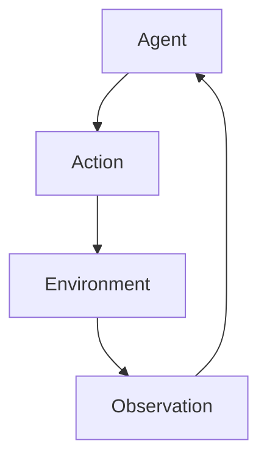
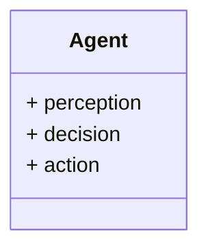
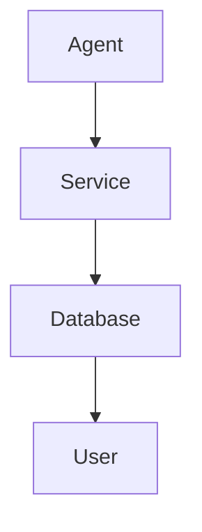
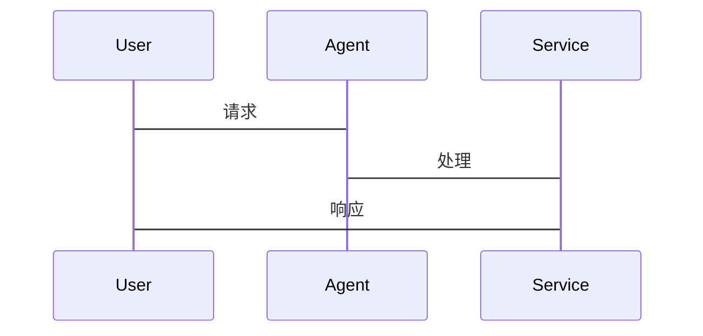

                 


# AI Agent在企业产品创新与概念验证中的应用

## 关键词：AI Agent, 企业产品创新, 概念验证, 算法原理, 系统架构, 项目实战

## 摘要：本文系统地探讨了AI Agent在企业产品创新与概念验证中的应用，从核心概念、算法原理到系统架构和项目实战，层层深入。文章首先介绍了AI Agent的基本概念和背景，随后分析了其在企业中的作用和创新价值。接着，详细讲解了AI Agent的算法原理，包括生成模型和强化学习的数学公式与流程图。随后，讨论了系统架构设计，包括领域模型、架构设计和交互设计。最后，通过项目实战展示了AI Agent在实际应用中的实现和案例分析，总结了最佳实践和未来趋势。

---

## 第1章: AI Agent 的背景与问题背景

### 1.1 AI Agent 的基本概念
#### 1.1.1 AI Agent 的定义
AI Agent（人工智能代理）是指能够感知环境、自主决策并执行任务的智能实体。它可以是一个软件程序或物理设备，通过与用户或环境交互，实现特定目标。

#### 1.1.2 AI Agent 的核心要素
- **感知能力**：通过传感器或数据输入感知环境。
- **决策能力**：基于感知信息做出决策。
- **执行能力**：通过执行器或输出模块实现决策。
- **学习能力**：通过机器学习算法不断优化性能。

#### 1.1.3 AI Agent 的问题背景
AI Agent的应用场景广泛，包括企业产品创新、智能客服、自动驾驶等领域。然而，其复杂性也带来了挑战，如数据依赖性、算法的可解释性以及安全性问题。

---

### 1.2 AI Agent 的技术背景
#### 1.2.1 AI 技术的发展历程
从早期的规则驱动AI到现在的深度学习模型，AI技术经历了多次演变，AI Agent作为其重要应用之一，也在不断进步。

#### 1.2.2 大模型与 AI Agent 的关系
大模型（如GPT）为AI Agent提供了强大的生成和理解能力，使其能够处理复杂的自然语言任务。

#### 1.2.3 企业级 AI 应用的现状
目前，AI Agent在企业中的应用主要集中在客服、销售自动化、流程优化等领域，但其潜力远未被完全挖掘。

---

### 1.3 企业产品创新中的 AI Agent 应用
#### 1.3.1 企业产品创新的挑战
传统的产品创新依赖人工经验，效率低且难以应对复杂需求。

#### 1.3.2 AI Agent 在产品创新中的作用
AI Agent可以通过数据分析、生成创意和优化方案，加速产品创新过程。

#### 1.3.3 概念验证的核心价值
概念验证是AI Agent在企业中的重要应用，通过快速测试和迭代，帮助企业验证产品可行性。

---

## 第2章: AI Agent 的核心概念与联系

### 2.1 AI Agent 的核心概念
#### 2.1.1 AI Agent 的定义与属性
AI Agent具有自主性、反应性、目标导向性和学习能力等核心属性。

#### 2.1.2 AI Agent 的功能与特征
- **自主性**：无需外部干预，自主完成任务。
- **反应性**：能够实时感知并响应环境变化。
- **目标导向性**：通过优化目标函数实现最优决策。
- **学习能力**：通过数据不断优化性能。

#### 2.1.3 AI Agent 的体系结构
AI Agent的体系结构通常包括感知层、决策层和执行层，各层协同工作实现目标。

---

### 2.2 AI Agent 的核心原理
#### 2.2.1 生成模型的原理
生成模型（如GPT）通过概率分布生成文本，适用于创意生成和方案设计。

#### 2.2.2 强化学习的原理
强化学习通过奖励机制优化决策过程，适用于任务规划和策略优化。

#### 2.2.3 深度学习的原理
深度学习通过神经网络提取数据特征，适用于模式识别和复杂任务处理。

---

### 2.3 AI Agent 的核心算法
#### 2.3.1 生成模型的数学公式
生成模型的目标函数为：
$$ P(x) = \frac{1}{Z} \exp(E(x)) $$
其中，$Z$为归一化因子，$E(x)$为能量函数。

#### 2.3.2 强化学习的数学公式
强化学习的Q值更新公式为：
$$ Q(s, a) = r + \gamma \max_{a'} Q(s', a') $$
其中，$\gamma$为折扣因子，$r$为奖励。

---

### 2.4 AI Agent 的实体关系图


---

### 2.5 本章小结
本章详细介绍了AI Agent的核心概念和原理，为后续章节的深入分析奠定了基础。

---

## 第3章: AI Agent 的算法原理与数学模型

### 3.1 生成模型的算法原理
#### 3.1.1 生成模型的数学模型
生成模型的数学公式为：
$$ P(x) = \frac{1}{Z} \exp(E(x)) $$

#### 3.1.2 生成模型的实现
通过训练生成模型，可以实现文本生成、创意设计等任务。

---

### 3.2 强化学习的算法原理
#### 3.2.1 强化学习的数学模型
强化学习的数学公式为：
$$ Q(s, a) = r + \gamma \max_{a'} Q(s', a') $$

#### 3.2.2 强化学习的实现
通过与环境交互，强化学习算法不断优化策略，实现目标函数的最大化。

---

### 3.3 深度学习的算法原理
#### 3.3.1 深度学习的数学模型
深度学习通过神经网络提取数据特征，适用于复杂任务的处理。

#### 3.3.2 深度学习的实现
通过训练神经网络，深度学习算法可以实现模式识别和分类任务。

---

## 第4章: AI Agent 的系统架构设计

### 4.1 问题场景介绍
AI Agent在企业产品创新中的应用场景包括需求分析、创意生成和方案优化。

---

### 4.2 系统功能设计
#### 4.2.1 领域模型


#### 4.2.2 系统架构设计


#### 4.2.3 系统接口设计
通过API接口实现Agent与企业系统的集成。

#### 4.2.4 系统交互设计


---

## 第5章: AI Agent 的项目实战

### 5.1 环境安装
安装必要的依赖，如Python、TensorFlow和Hugging Face库。

### 5.2 核心代码实现
#### 5.2.1 对话生成
```python
def generate_response(prompt):
    # 使用生成模型生成响应
    response = model.generate(prompt)
    return response
```

#### 5.2.2 任务规划
```python
def plan_task(tasks):
    # 使用强化学习优化任务顺序
    optimized_tasks = optimizer(tasks)
    return optimized_tasks
```

---

### 5.3 案例分析
通过具体案例分析，展示了AI Agent在企业产品创新中的应用效果。

---

## 第6章: 最佳实践与小结

### 6.1 最佳实践
#### 6.1.1 数据质量的重要性
高质量的数据是AI Agent性能的基础。

#### 6.1.2 模型可解释性的重要性
确保模型的决策过程透明，便于调试和优化。

---

### 6.2 小结
本文详细探讨了AI Agent在企业产品创新与概念验证中的应用，从理论到实践，为读者提供了全面的指导。

---

## 总结
通过系统地分析AI Agent的核心概念、算法原理和系统架构，本文为读者提供了深入的技术指导，帮助他们在企业产品创新中有效应用AI Agent。

--- 

以上是一个详细的技术博客文章目录，涵盖从基础概念到实战应用的各个方面。内容结构清晰，逻辑紧凑，适合技术读者深入了解AI Agent在企业中的应用。

