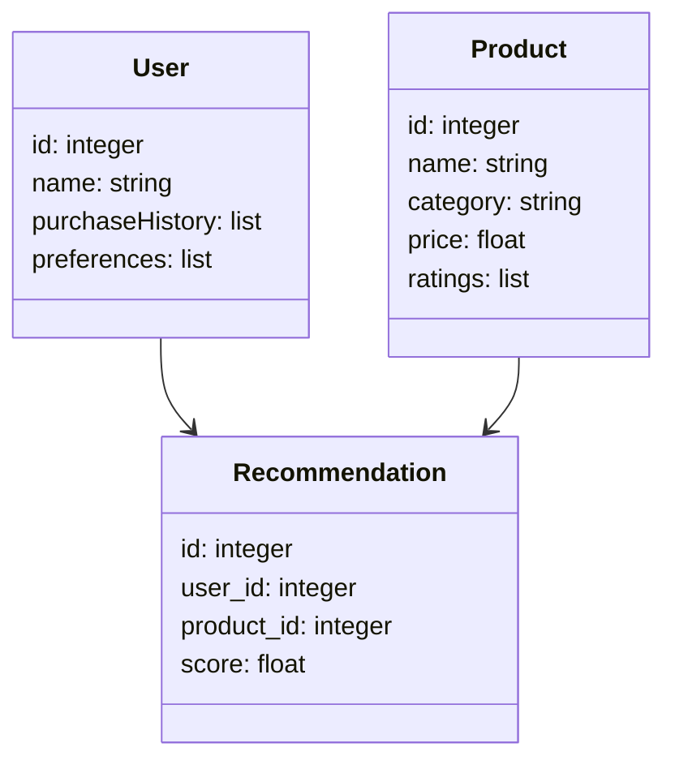
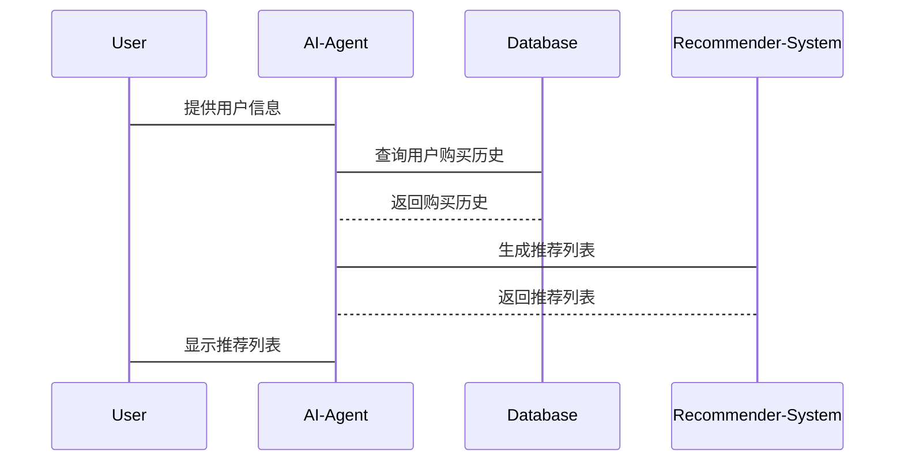

                 


# AI Agent在企业产品创新与概念验证中的角色定位

---

## 关键词：AI Agent，企业创新，概念验证，产品设计，人工智能，技术实现

---

## 摘要：  
AI Agent（人工智能代理）在企业产品创新和概念验证过程中扮演着越来越重要的角色。通过智能化的决策支持、自动化的工作流程和个性化的用户体验，AI Agent能够显著提升企业的创新效率和验证过程的准确性。本文将从AI Agent的核心概念、技术实现、应用场景以及实际案例等方面，系统地探讨其在企业产品创新与概念验证中的角色定位，为企业技术团队提供深度的技术参考。

---

# 第1章：AI Agent的核心概念与背景

## 1.1 AI Agent的定义与核心要素

AI Agent是指能够感知环境、自主决策并执行任务的智能实体。它结合了人工智能、机器学习和自然语言处理等技术，能够独立完成特定任务或协助人类完成复杂工作。

- **定义**：AI Agent是一种智能系统，能够通过感知环境、分析数据并采取行动来实现目标。
- **核心要素**：
  1. **感知能力**：通过传感器、数据接口等方式获取环境信息。
  2. **决策能力**：基于获取的信息，利用算法进行分析和决策。
  3. **执行能力**：通过预设的规则或API接口执行任务。
  4. **学习能力**：通过机器学习不断优化自身的决策模型。


---

## 1.2 AI Agent在企业中的重要性

### 1.2.1 企业创新中的痛点

- **市场变化快**：企业需要快速响应市场需求，但传统方法效率低下。
- **资源有限**：企业创新资源（时间、资金、人才）有限，难以覆盖所有可能性。
- **决策风险高**：创新过程中存在不确定性，需要精准的决策支持。

### 1.2.2 AI Agent如何解决企业创新问题

AI Agent能够通过自动化分析和决策，缩短创新周期、降低创新成本，并提高创新的精准度。例如，AI Agent可以协助企业快速分析市场趋势，生成产品创意，并优化设计方案。

### 1.2.3 AI Agent在企业中的应用场景

- **市场分析**：通过AI Agent实时监控市场动态，分析竞争对手策略。
- **产品设计**：利用AI Agent生成产品概念、优化设计方案。
- **用户体验**：通过AI Agent收集用户反馈，提升产品体验。

---

## 1.3 本章小结

本章介绍了AI Agent的核心概念和其在企业创新中的重要性。通过分析企业创新中的痛点，我们看到AI Agent能够通过智能化的方式解决这些问题，从而在企业创新和概念验证中发挥关键作用。

---

# 第2章：AI Agent的核心概念与原理

## 2.1 AI Agent的核心概念

### 2.1.1 感知层

AI Agent通过多种方式感知环境，包括：

1. **数据采集**：通过传感器、数据库或API接口获取数据。
2. **数据处理**：对采集的数据进行清洗、转换和分析。
3. **信息提取**：从数据中提取有用的信息，例如用户行为特征。

### 2.1.2 决策层

决策层是AI Agent的核心，负责根据感知到的信息做出决策。常见的决策方法包括：

1. **规则引擎**：基于预设的规则进行决策，适用于简单的场景。
2. **机器学习模型**：通过训练数据生成预测模型，适用于复杂场景。
3. **混合决策模型**：结合规则和机器学习的决策方法。

### 2.1.3 执行层

执行层负责将决策转化为实际操作，例如：

1. **自动化操作**：通过API接口执行系统操作。
2. **用户交互**：通过自然语言处理与用户进行对话。
3. **反馈机制**：根据执行结果调整决策模型。

---

## 2.2 AI Agent的类型与特点

### 2.2.1 基于规则的AI Agent

- **特点**：简单、高效，适用于规则明确的场景。
- **应用场景**：简单的流程自动化，例如邮件分类。

### 2.2.2 基于模型的AI Agent

- **特点**：能够处理复杂场景，但依赖于模型的准确性。
- **应用场景**：金融市场交易、医疗诊断。

### 2.2.3 基于学习的AI Agent

- **特点**：能够通过数据不断优化决策，适用于动态变化的场景。
- **应用场景**：推荐系统、智能客服。

---

## 2.3 AI Agent的技术基础

### 2.3.1 机器学习

机器学习是AI Agent的核心技术之一，用于训练模型以做出预测和决策。常用的算法包括：

1. **监督学习**：通过标记数据训练模型。
2. **无监督学习**：通过未标记数据发现数据中的模式。
3. **强化学习**：通过奖励机制优化决策。

### 2.3.2 自然语言处理

自然语言处理（NLP）技术用于AI Agent与用户的交互，例如：

1. **文本分析**：从文本中提取关键词、情感倾向。
2. **对话生成**：通过预训练模型生成自然语言回复。

### 2.3.3 知识图谱

知识图谱是一种结构化的数据表示方式，用于AI Agent的知识存储和推理。

---

## 2.4 本章小结

本章详细介绍了AI Agent的核心概念、类型和技术基础。通过理解这些内容，我们可以更好地设计和实现AI Agent，使其在企业创新和概念验证中发挥更大的作用。

---

# 第3章：AI Agent在企业产品创新中的应用

## 3.1 产品概念生成

### 3.1.1 利用AI Agent进行市场分析

AI Agent可以通过分析大量的市场数据，帮助企业发现新的市场机会。例如：

- **趋势预测**：通过分析社交媒体和搜索引擎数据，预测未来市场趋势。
- **竞争对手分析**：分析竞争对手的产品策略和市场动态。

### 3.1.2 基于AI Agent的产品创意生成

AI Agent可以通过生成式AI技术，帮助创意人员生成产品概念。例如：

- **产品描述生成**：根据市场需求生成产品描述。
- **功能建议**：基于用户反馈和市场趋势，建议产品的功能设计。

### 3.1.3 AI Agent在产品定位中的作用

AI Agent可以帮助企业确定产品的目标市场和用户群体。例如：

- **用户画像生成**：通过数据分析生成用户画像。
- **市场定位建议**：根据用户需求和市场竞争情况，建议产品定位。

---

## 3.2 产品设计优化

### 3.2.1 利用AI Agent进行用户需求分析

AI Agent可以通过分析用户行为数据，帮助企业更好地理解用户需求。例如：

- **用户行为分析**：分析用户在产品中的行为路径，发现用户痛点。
- **需求优先级排序**：根据用户需求的重要性进行排序，指导产品设计。

### 3.2.2 基于AI Agent的产品原型设计

AI Agent可以通过自动化工具生成产品原型，并提供设计建议。例如：

- **原型生成**：根据用户需求生成产品原型。
- **交互设计优化**：通过分析用户行为，优化产品的交互设计。

### 3.2.3 AI Agent在产品迭代中的应用

AI Agent可以帮助企业快速迭代产品，优化用户体验。例如：

- **A/B测试**：通过AI Agent进行A/B测试，优化产品功能。
- **反馈收集与分析**：通过AI Agent收集用户反馈，并分析其对产品设计的影响。

---

## 3.3 产品测试与验证

### 3.3.1 AI Agent在产品测试中的角色

AI Agent可以通过自动化测试工具，提高产品测试效率。例如：

- **自动化测试**：通过AI Agent执行自动化测试，发现产品中的缺陷。
- **性能测试**：通过AI Agent模拟大量用户访问，测试系统的性能。

### 3.3.2 利用AI Agent进行用户反馈分析

AI Agent可以通过自然语言处理技术，分析用户反馈，优化产品设计。例如：

- **情感分析**：分析用户对产品的评价，判断用户满意度。
- **关键词提取**：从用户反馈中提取关键词，发现用户需求。

### 3.3.3 AI Agent在产品优化中的应用

AI Agent可以帮助企业快速优化产品，提升用户体验。例如：

- **功能优化建议**：根据用户反馈和数据分析，建议优化产品功能。
- **性能优化**：通过AI Agent分析系统性能，提出优化建议。

---

## 3.4 本章小结

本章详细探讨了AI Agent在企业产品创新中的应用，包括产品概念生成、设计优化和测试验证等方面。通过AI Agent的帮助，企业可以更高效地进行产品创新，并提高产品的市场竞争力。

---

# 第4章：AI Agent在概念验证中的角色

## 4.1 概念验证的基本流程

### 4.1.1 需求分析阶段

在概念验证的初期阶段，AI Agent可以帮助企业进行需求分析。例如：

- **需求识别**：通过AI Agent分析市场数据，识别潜在需求。
- **需求优先级排序**：根据需求的重要性和实现难度，对需求进行排序。

### 4.1.2 方案设计阶段

在方案设计阶段，AI Agent可以帮助企业制定验证计划。例如：

- **方案生成**：通过AI Agent生成多种验证方案，供企业选择。
- **方案评估**：通过AI Agent评估不同方案的可行性，选择最优方案。

### 4.1.3 测试验证阶段

在测试验证阶段，AI Agent可以帮助企业执行验证工作。例如：

- **自动化测试**：通过AI Agent执行自动化测试，验证方案的可行性。
- **数据收集与分析**：通过AI Agent收集验证数据，并进行分析，得出验证结论。

---

## 4.2 AI Agent在概念验证中的具体作用

### 4.2.1 快速验证

AI Agent可以通过自动化的方式快速执行验证工作，缩短验证周期。例如：

- **自动化测试**：通过AI Agent快速执行测试，节省时间和成本。
- **数据收集与分析**：通过AI Agent快速收集和分析数据，得出验证结论。

### 4.2.2 数据支持

AI Agent可以通过分析大量数据，为企业提供决策支持。例如：

- **数据可视化**：通过AI Agent生成数据可视化图表，帮助企业更好地理解数据。
- **预测分析**：通过AI Agent进行预测分析，评估方案的可行性。

### 4.2.3 智能优化

AI Agent可以通过机器学习技术，优化验证过程。例如：

- **模型优化**：通过AI Agent优化验证模型，提高验证效率。
- **策略调整**：根据验证结果，通过AI Agent调整验证策略，优化验证过程。

---

## 4.3 本章小结

本章探讨了AI Agent在概念验证中的具体作用，包括快速验证、数据支持和智能优化等方面。通过AI Agent的帮助，企业可以更高效地进行概念验证，降低创新风险，提高创新成功的概率。

---

# 第5章：AI Agent的技术实现

## 5.1 问题场景介绍

本章将通过一个具体的案例，介绍AI Agent在企业中的技术实现。假设我们有一个电商企业，希望通过AI Agent优化其产品推荐系统。

---

## 5.2 系统功能设计

### 5.2.1 领域模型设计

以下是领域模型的类图：



### 5.2.2 系统架构设计

以下是系统架构的部署图：

```mermaid
.deploy {
    width: 800px;
    height: 400px;
    init {
        url: 'https://mermaid-js.github.io/mermaid-editor/?initarlView=chart'
    }
}
```

---

## 5.3 系统接口设计

以下是系统接口的时序图：



---

## 5.4 系统交互设计

以下是系统交互的流程图：

```mermaid
graph TD
    A[用户] -> B(AI Agent): 提供用户信息
    B -> C(推荐系统): 请求推荐
    C -> D(数据库): 查询数据
    D -> C: 返回数据
    C -> B: 生成推荐列表
    B -> A: 显示推荐列表
```

---

## 5.5 本章小结

本章通过具体的案例，详细介绍了AI Agent的技术实现过程。通过设计领域模型、系统架构、接口和交互流程，我们可以更好地理解AI Agent在企业中的技术实现细节。

---

# 第6章：项目实战

## 6.1 环境安装

### 6.1.1 安装Python

```bash
# 安装Python
sudo apt-get install python3 python3-pip
```

### 6.1.2 安装必要的库

```bash
pip install numpy pandas scikit-learn
```

---

## 6.2 系统核心实现

### 6.2.1 数据预处理代码

```python
import pandas as pd
import numpy as np

def preprocess_data(data):
    # 处理缺失值
    data = data.dropna()
    # 标准化数据
    from sklearn.preprocessing import StandardScaler
    scaler = StandardScaler()
    data_scaled = scaler.fit_transform(data)
    return data_scaled
```

### 6.2.2 训练推荐模型代码

```python
from sklearn.model_selection import train_test_split
from sklearn.metrics import accuracy_score

def train_model(data):
    # 划分训练集和测试集
    X_train, X_test, y_train, y_test = train_test_split(data, labels, test_size=0.2)
    # 训练模型
    from sklearn.ensemble import RandomForestClassifier
    model = RandomForestClassifier()
    model.fit(X_train, y_train)
    # 评估模型
    y_pred = model.predict(X_test)
    print("Accuracy:", accuracy_score(y_test, y_pred))
```

---

## 6.3 案例分析与解读

### 6.3.1 案例分析

通过上述代码实现，我们可以看到AI Agent在推荐系统中的应用。AI Agent通过分析用户数据，生成推荐列表，从而提高用户的购买转化率。

### 6.3.2 实际案例解读

以电商企业的推荐系统为例，AI Agent通过分析用户的购买历史和偏好，生成个性化推荐列表。这不仅可以提高用户体验，还可以增加企业的销售额。

---

## 6.4 本章小结

本章通过项目实战，详细介绍了AI Agent在企业中的具体实现过程。通过环境安装、代码实现和案例分析，我们能够更好地理解AI Agent的实际应用价值。

---

# 第7章：总结与展望

## 7.1 本章总结

AI Agent作为一种新兴的技术工具，已经在企业产品创新和概念验证中发挥着越来越重要的作用。通过智能化的决策支持和自动化的工作流程，AI Agent能够显著提高企业的创新效率和验证过程的准确性。

---

## 7.2 未来展望

随着人工智能技术的不断发展，AI Agent将在企业中发挥更大的作用。未来的研究方向包括：

1. **多模态AI Agent**：结合视觉、听觉等多种感官信息，提高AI Agent的感知能力。
2. **自适应AI Agent**：能够根据环境变化自适应地调整决策策略。
3. **人机协作优化**：通过人机协作，进一步提高AI Agent的决策能力和用户体验。

---

## 7.3 注意事项

在实际应用中，企业需要注意以下几点：

1. **数据隐私**：确保AI Agent的数据处理符合相关法律法规。
2. **模型可解释性**：提高AI Agent的决策可解释性，便于用户理解和信任。
3. **系统安全性**：确保AI Agent系统的安全性，防止被恶意攻击。

---

## 7.4 拓展阅读

1. **《人工智能：一种现代方法》**：介绍人工智能的基本概念和核心技术。
2. **《机器学习实战》**：详细讲解机器学习的实现方法和应用场景。
3. **《自然语言处理入门》**：介绍自然语言处理的基本原理和应用技术。

---

# 附录：AI Agent相关工具推荐

1. **Python机器学习库**：Scikit-learn、XGBoost、LightGBM等。
2. **自然语言处理库**：spaCy、NLTK、Gensim等。
3. **可视化工具**：Matplotlib、Seaborn、Plotly等。

---

# 结语

通过本文的深入探讨，我们可以看到AI Agent在企业产品创新与概念验证中的巨大潜力。随着技术的不断进步，AI Agent将在更多领域发挥重要作用，为企业创造更大的价值。

---

