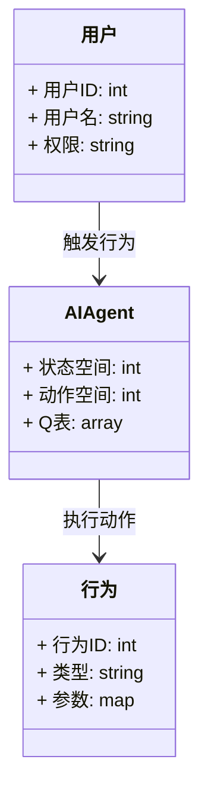
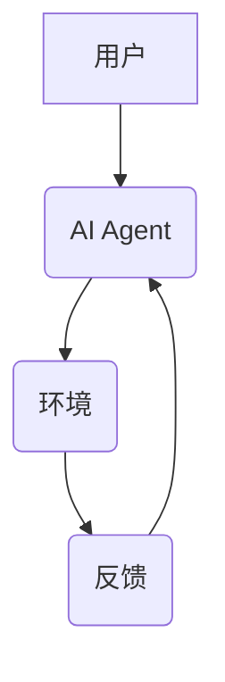
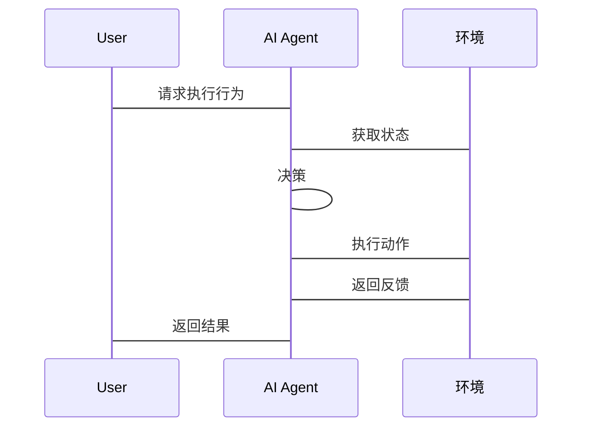

                 


# AI Agent在企业产品开发与创新中的角色

## 关键词：AI Agent，企业创新，产品开发，人工智能技术，算法原理，系统架构，应用案例

## 摘要：  
本文探讨了AI Agent（人工智能代理）在企业产品开发与创新中的核心角色。通过分析AI Agent的基本概念、算法原理、系统架构以及实际应用案例，本文详细阐述了AI Agent如何助力企业实现高效的产品开发和持续创新。文章从背景介绍、核心概念、算法原理、系统设计、项目实战到最佳实践，全面解析了AI Agent在企业中的应用价值和实现路径。

---

# 正文

## 第一部分：AI Agent的基本概念与背景

### 第1章：AI Agent的基本概念与背景

#### 1.1 AI Agent的定义与核心概念

**1.1.1 什么是AI Agent**  
AI Agent（人工智能代理）是指能够感知环境、自主决策并执行任务的智能实体。与传统软件不同，AI Agent具有自主性、反应性和目标导向性，能够根据环境输入动态调整行为。

**1.1.2 AI Agent的核心属性**  
AI Agent的核心属性包括：  
1. **自主性**：能够在无外部干预的情况下自主运作。  
2. **反应性**：能够实时感知环境变化并做出响应。  
3. **目标导向性**：基于预设目标或学习目标进行决策。  
4. **学习能力**：通过数据和经验不断优化自身的决策模型。  

**1.1.3 AI Agent与传统软件开发的区别**  
AI Agent的核心区别在于其智能性和自主性。传统软件通常基于固定的逻辑执行任务，而AI Agent能够动态调整行为以适应环境变化。  

**1.1.4 企业产品开发中的AI Agent角色**  
在企业产品开发中，AI Agent可以作为辅助工具，帮助开发团队优化设计、预测市场需求、自动化测试和部署等。

---

#### 1.2 企业产品开发与创新的背景

**1.2.1 传统企业产品开发模式**  
传统的企业产品开发模式通常依赖于人工经验和固定流程，效率较低且难以快速响应市场变化。

**1.2.2 当前企业创新面临的挑战**  
1. 市场需求变化快，企业需要快速迭代产品。  
2. 产品复杂度高，开发周期长，资源消耗大。  
3. 数据量爆炸式增长，人工分析效率低下。  

**1.2.3 AI Agent如何助力企业创新**  
AI Agent通过自动化分析、决策和执行，能够显著提高企业的产品开发效率，降低开发成本，并加速创新周期。

---

## 第二部分：AI Agent的核心概念与联系

### 第2章：AI Agent的核心概念与联系

#### 2.1 AI Agent的核心原理

**2.1.1 感知层**  
AI Agent通过传感器或数据接口感知环境信息，例如用户行为数据、市场趋势等。

**2.1.2 决策层**  
基于感知到的信息，AI Agent通过算法（如强化学习或监督学习）生成决策。

**2.1.3 执行层**  
AI Agent根据决策执行具体操作，例如调整产品参数、优化流程等。

#### 2.2 AI Agent的属性特征对比

| 属性         | 自主性       | 反应性       | 目标导向性   |
|--------------|--------------|--------------|--------------|
| 描述         | 能够自主运作 | 能够实时响应 | 以目标为导向 |
| 示例         | 自动化测试   | 实时监控     | 需求预测     |

#### 2.3 AI Agent的ER实体关系图

```mermaid
er
    actor: 用户
    agent: AI Agent
    action: 行为
    goal: 目标
    rule: 规则
    relation: 用户 -> "触发" -> 行为
    relation: 行为 -> "驱动" -> 目标
    relation: 目标 -> "遵循" -> 规则
    relation: 规则 -> "指导" -> 行为
```

---

## 第三部分：AI Agent的算法原理

### 第3章：AI Agent的算法原理

#### 3.1 AI Agent的基本算法

**3.1.1 感知算法**  
感知算法通常包括特征提取和数据处理。例如，使用CNN提取图像特征，或使用NLP技术处理文本数据。

**3.1.2 决策算法**  
决策算法包括强化学习（如Q-Learning）和监督学习（如随机森林）。例如，强化学习通过奖励机制优化决策策略。

**3.1.3 执行算法**  
执行算法通常涉及自动化脚本或API调用。例如，通过API调用外部系统执行操作。

#### 3.2 AI Agent的数学模型

**3.2.1 状态空间模型**  
状态空间模型描述了AI Agent可能遇到的所有状态。例如，状态空间可以表示为：

$$ S = \{ s_1, s_2, ..., s_n \} $$

**3.2.2 动作空间模型**  
动作空间模型描述了AI Agent在每个状态下可能执行的动作。例如：

$$ A = \{ a_1, a_2, ..., a_m \} $$

**3.2.3 奖励函数模型**  
奖励函数模型定义了AI Agent在执行动作后的奖励值。例如：

$$ R(s, a) = \begin{cases} 
1 & \text{如果动作 } a \text{ 正确} \\
0 & \text{否则}
\end{cases} $$

#### 3.3 AI Agent的代码实现

**3.3.1 环境搭建**

```python
# 安装所需的库
import gym
import numpy as np
```

**3.3.2 核心算法实现**

```python
class AI_Agent:
    def __init__(self, state_space, action_space):
        self.state_space = state_space
        self.action_space = action_space
        self.q_table = np.zeros((state_space, action_space))
    
    def感知(self, state):
        # 返回当前状态的特征表示
        return state
    
    def 决策(self, state):
        # 使用Q-Learning算法进行决策
        q_values = self.q_table[state, :]
        action = np.argmax(q_values)
        return action
    
    def 执行(self, action):
        # 执行具体操作
        # 示例：调用外部API
        pass
    
    def 学习(self, state, action, reward, next_state):
        # 更新Q表
        self.q_table[state, action] += reward
```

---

## 第四部分：AI Agent的系统分析与架构设计

### 第4章：系统分析与架构设计

#### 4.1 问题场景介绍

**4.1.1 产品开发中的问题**  
企业产品开发通常面临以下问题：  
1. 开发周期长，效率低。  
2. 市场需求变化快，难以快速响应。  
3. 数据分析能力有限，难以从海量数据中提取有价值的信息。  

**4.1.2 问题解决目标**  
通过引入AI Agent，企业可以实现自动化的产品设计、预测和优化，从而提高开发效率和产品质量。

#### 4.2 系统功能设计

**4.2.1 领域模型类图**



**4.2.2 系统架构设计**



**4.2.3 系统接口设计**  
AI Agent与外部系统的交互接口包括：  
1. 数据接口：获取环境数据。  
2. 行为接口：执行具体操作。  
3. 反馈接口：接收执行结果。  

**4.2.4 系统交互流程**



---

## 第五部分：AI Agent的项目实战

### 第5章：项目实战

#### 5.1 环境安装

```bash
pip install gym numpy
```

#### 5.2 核心代码实现

```python
import gym
import numpy as np

class AI_Agent:
    def __init__(self, env):
        self.env = env
        self.q_table = np.zeros([env.observation_space.shape[0], env.action_space.n])
    
    def感知(self, state):
        return state
    
    def 决策(self, state):
        return np.argmax(self.q_table[state])
    
    def 执行(self, action):
        return self.env.step(action)
    
    def 学习(self, state, action, reward, next_state):
        self.q_table[state][action] += reward

# 初始化环境和AI Agent
env = gym.make('CartPole-v1')
agent = AI_Agent(env)

# 训练过程
for episode in range(1000):
    state = env.reset()
    while True:
        action = agent.决策(state)
        next_state, reward, done, _ = agent.执行(action)
        agent.学习(state, action, reward, next_state)
        if done:
            break
```

#### 5.3 代码解读与分析

1. **环境初始化**：使用OpenAI Gym库初始化环境。  
2. **AI Agent初始化**：创建AI Agent实例，并初始化Q表。  
3. **感知与决策**：AI Agent根据当前状态生成决策。  
4. **执行与学习**：AI Agent执行决策，并根据结果更新Q表。  

#### 5.4 实际案例分析

**案例：自动化测试优化**  
某企业引入AI Agent优化其自动化测试流程。通过分析测试结果，AI Agent能够自动识别瓶颈并提出优化建议，显著提高了测试效率。

#### 5.5 项目小结

通过项目实战，我们可以看到AI Agent在企业产品开发中的巨大潜力。其核心在于通过自动化和智能化手段，显著提高开发效率和产品质量。

---

## 第六部分：AI Agent的最佳实践

### 第6章：最佳实践

#### 6.1 小结

AI Agent通过自动化和智能化手段，显著提高了企业产品开发的效率和创新能力。其核心价值在于帮助企业在快速变化的市场中保持竞争力。

#### 6.2 注意事项

1. **数据质量**：AI Agent的性能高度依赖数据质量。  
2. **模型选择**：选择合适的算法和模型至关重要。  
3. **安全性**：确保AI Agent的行为符合企业安全和合规要求。  

#### 6.3 拓展阅读

1. 《强化学习导论》  
2. 《人工智能系统设计》  
3. 《企业创新与数字化转型》  

---

## 结语

AI Agent作为人工智能技术的核心应用之一，在企业产品开发与创新中发挥着越来越重要的作用。通过本文的分析，我们可以看到，AI Agent不仅能够提高开发效率，还能为企业带来新的竞争优势。未来，随着技术的不断发展，AI Agent将在企业创新中扮演更加关键的角色。

--- 

# END

