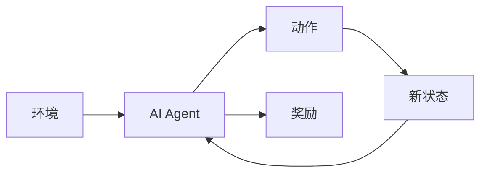
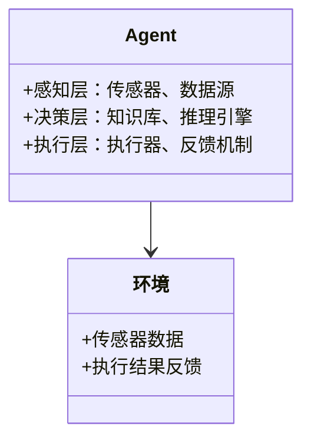
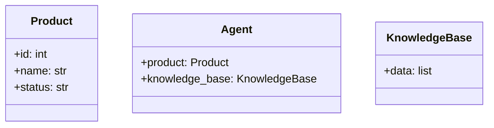
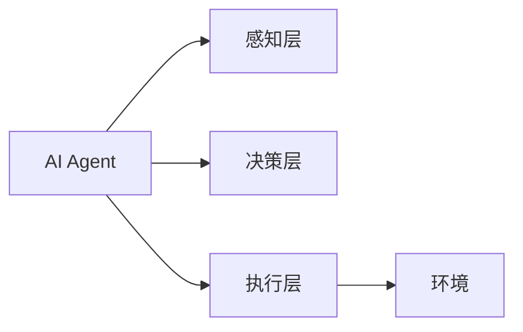
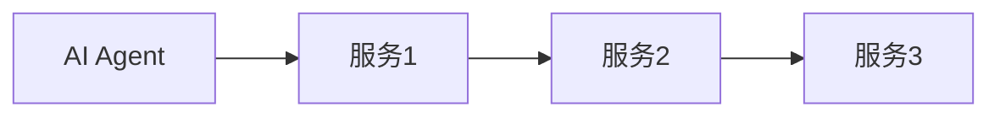
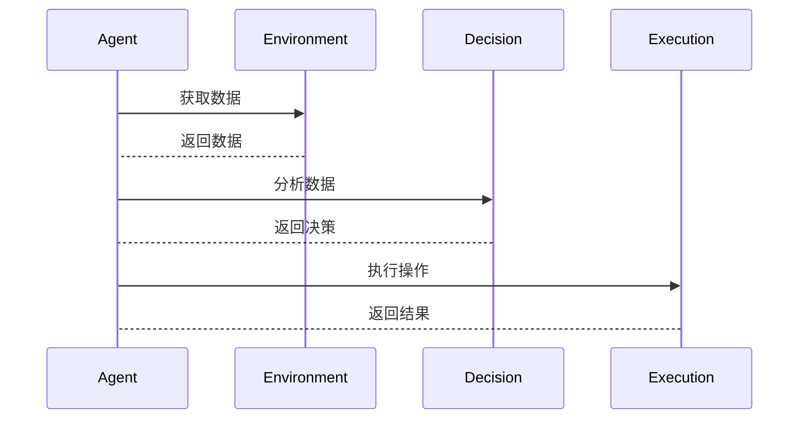

                 


# AI Agent在企业产品生命周期管理与优化中的应用

## 关键词：AI Agent, 产品生命周期管理, 企业优化, 人工智能, 知识表示, 算法原理

## 摘要：  
本文探讨了AI Agent在企业产品生命周期管理中的应用，分析了AI Agent的核心概念、原理及其在产品需求分析、设计优化等阶段的具体应用。通过实际案例和系统架构设计，展示了AI Agent如何帮助企业实现高效管理和优化。文章还详细讲解了相关算法原理和系统架构，为企业在产品生命周期管理中的智能化转型提供了理论和实践指导。

---

# 第1章: AI Agent与企业产品生命周期管理概述

## 1.1 什么是AI Agent

### 1.1.1 AI Agent的定义  
AI Agent（人工智能代理）是一种能够感知环境、自主决策并执行任务的智能系统。它通过传感器获取信息，利用知识库和推理引擎进行分析，最终做出决策并执行操作。

### 1.1.2 AI Agent的核心特征  
- **自主性**：无需人工干预，自主完成任务。  
- **反应性**：能够实时感知环境变化并调整行为。  
- **学习能力**：通过数据和反馈不断优化自身性能。  

### 1.1.3 AI Agent与传统自动化工具的区别  
AI Agent不仅能够执行预设任务，还能通过学习和推理适应新的情况，具有更强的灵活性和适应性。

## 1.2 企业产品生命周期管理的背景

### 1.2.1 产品生命周期的定义  
产品生命周期指产品从概念提出、开发、上市、维护到最终退市的全过程。

### 1.2.2 传统产品生命周期管理的挑战  
- **信息孤岛**：各部门之间数据不互通，导致效率低下。  
- **决策延迟**：依赖人工分析，难以快速响应市场变化。  
- **资源浪费**：重复劳动和资源分配不当导致成本增加。  

### 1.2.3 数字化与智能化对产品生命周期管理的影响  
随着AI和大数据技术的发展，企业可以通过智能化工具提高管理效率，缩短产品上市时间，降低运营成本。

## 1.3 AI Agent在企业产品生命周期管理中的应用价值

### 1.3.1 提高管理效率  
AI Agent能够自动化处理大量数据，减少人工干预，提高工作效率。  

### 1.3.2 优化决策过程  
通过分析历史数据和市场趋势，AI Agent能够提供数据驱动的决策支持，帮助企业做出更明智的选择。  

### 1.3.3 提升用户体验  
AI Agent可以通过实时反馈和个性化推荐，改善用户体验，提高客户满意度。  

## 1.4 本章小结  
本章介绍了AI Agent的基本概念及其在企业产品生命周期管理中的应用价值，为后续章节奠定了基础。

---

# 第2章: AI Agent的核心概念与原理

## 2.1 AI Agent的核心概念

### 2.1.1 知识表示与推理  
知识表示是将问题领域中的知识以某种形式存储起来的过程，推理则是基于这些知识进行逻辑推导。  

**知识表示方法：**  
- **谓词逻辑**：通过事实和规则表示知识。  
- **语义网络**：通过节点和边表示概念及其关系。  

### 2.1.2 行为规划与决策  
行为规划是AI Agent根据当前状态和目标，制定行动方案的过程。决策则是在多个备选方案中选择最优解。  

### 2.1.3 人机交互与协作  
AI Agent需要与人类用户进行有效交互，理解用户需求并提供帮助，同时在团队中与其他系统协同工作。

## 2.2 AI Agent的原理与算法

### 2.2.1 知识图谱构建  
知识图谱是一种以图结构表示知识的技术，能够将分散的数据整合成统一的知识库。  

**知识图谱构建流程：**  
1. 数据采集与清洗。  
2. 实体识别与关系抽取。  
3. 图结构构建与存储。  

### 2.2.2 强化学习算法  
强化学习是一种通过试错机制优化决策策略的方法。AI Agent通过与环境交互，不断调整行为以获得最大奖励。  

**强化学习流程图：**  


### 2.2.3 监督学习与无监督学习的结合  
监督学习基于标注数据进行模型训练，无监督学习则从无标签数据中发现模式。两者的结合能够提高AI Agent的学习能力。

## 2.3 AI Agent的系统架构

### 2.3.1 分层架构  
分层架构将系统划分为感知层、决策层和执行层，每一层负责不同的功能。  

**分层架构类图：**  


### 2.3.2 微服务架构  
微服务架构将系统功能分解为多个独立的服务，通过API进行通信，具有良好的扩展性和灵活性。  

### 2.3.3 可扩展性设计  
系统架构需要考虑未来功能的扩展性，例如增加新的传感器类型或支持新的决策算法。

## 2.4 本章小结  
本章详细介绍了AI Agent的核心概念与原理，为后续章节的应用分析奠定了基础。

---

# 第3章: 产品需求分析与AI Agent

## 3.1 产品需求分析的挑战

### 3.1.1 需求收集与整理  
需求收集过程中容易出现信息不完整、需求冲突等问题。  

### 3.1.2 需求优先级排序  
如何在有限资源下合理分配优先级是一个复杂的决策问题。  

### 3.1.3 需求变更管理  
需求变更可能导致项目计划调整，增加管理难度。  

## 3.2 AI Agent在需求分析中的应用

### 3.2.1 自然语言处理技术  
AI Agent可以通过自然语言处理技术分析用户反馈，提取关键需求。  

### 3.2.2 数据挖掘与分析  
通过对历史数据的挖掘，AI Agent能够发现潜在需求，辅助决策。  

### 3.2.3 智能推荐系统  
AI Agent可以根据市场趋势和用户反馈，推荐优先级高的需求。  

## 3.3 实际案例分析

### 3.3.1 某企业需求分析的AI Agent实现  
某企业通过AI Agent实现了需求的自动分类和优先级排序，显著提高了需求管理效率。  

### 3.3.2 案例分析与经验总结  
该案例的成功关键在于AI Agent与现有系统的无缝集成，以及对业务流程的深入了解。  

## 3.4 本章小结  
本章通过分析产品需求分析的挑战，展示了AI Agent在该领域的具体应用，为企业需求管理提供了新思路。

---

# 第4章: 产品设计与优化中的AI Agent

## 4.1 产品设计的复杂性

### 4.1.1 功能设计  
功能设计需要考虑用户体验、技术实现等多个方面。  

### 4.1.2 用户体验设计  
用户体验设计需要平衡功能性和美观性，具有较高的复杂性。  

### 4.1.3 技术选型  
技术选型需要综合考虑性能、成本和可扩展性。  

## 4.2 AI Agent在设计优化中的应用

### 4.2.1 智能设计工具  
AI Agent可以辅助设计师进行参数优化和方案推荐。  

### 4.2.2 参数优化与配置  
AI Agent可以通过强化学习优化设计参数，提高产品性能。  

### 4.2.3 风险评估与规避  
AI Agent可以基于历史数据进行风险评估，提前制定规避策略。  

## 4.3 实际案例分析

### 4.3.1 某企业设计优化的AI Agent实现  
某企业利用AI Agent优化了产品设计流程，缩短了设计周期，提高了产品质量。  

### 4.3.2 案例分析与经验总结  
该案例的成功在于AI Agent与设计工具的深度集成，以及对设计流程的全面理解。  

## 4.4 本章小结  
本章分析了产品设计的复杂性，并展示了AI Agent在设计优化中的具体应用。

---

# 第5章: 产品生命周期管理的优化策略

## 5.1 数据驱动的优化策略

### 5.1.1 数据采集与分析  
通过实时采集和分析数据，AI Agent可以快速发现潜在问题并提出优化建议。  

### 5.1.2 数据可视化与洞察  
数据可视化能够帮助管理者更直观地理解数据，做出更明智的决策。  

## 5.2 AI Agent的反馈机制

### 5.2.1 反馈收集与处理  
AI Agent通过收集用户反馈和系统运行数据，不断优化自身的决策模型。  

### 5.2.2 持续改进与优化  
通过反馈机制，AI Agent可以实现持续改进，提升系统性能。  

## 5.3 系统优化与维护

### 5.3.1 系统性能优化  
通过优化算法和硬件配置，提升AI Agent的运行效率。  

### 5.3.2 系统维护与升级  
定期维护和升级系统，确保AI Agent能够适应新的业务需求。  

## 5.4 本章小结  
本章讨论了数据驱动和反馈机制在产品生命周期管理中的优化策略，强调了持续改进的重要性。

---

# 第6章: AI Agent的算法原理与实现

## 6.1 强化学习算法的原理

### 6.1.1 强化学习的基本概念  
强化学习是一种通过试错机制优化决策策略的方法，核心是通过与环境的交互获得奖励，逐步逼近最优策略。  

### 6.1.2 算法流程图  


### 6.1.3 算法实现  
```python
class AI-Agent:
    def __init__(self):
        self.state = initial_state
        self.reward = 0

    def take_action(self, action):
        # 执行动作并返回新状态和奖励
        new_state, reward = self.env.step(action)
        return new_state, reward

    def learn(self, reward):
        # 更新策略
        self.policy.update(reward)
```

## 6.2 监督学习与无监督学习的结合

### 6.2.1 监督学习的实现  
```python
# 简单的监督学习示例
def supervised_learning(X, y):
    model = LinearRegression()
    model.fit(X, y)
    return model
```

### 6.2.2 无监督学习的实现  
```python
# 简单的聚类分析示例
from sklearn.cluster import KMeans

def unsupervised_learning(X):
    model = KMeans(n_clusters=3)
    model.fit(X)
    return model
```

## 6.3 本章小结  
本章详细讲解了AI Agent的算法原理，并通过代码示例展示了如何实现这些算法。

---

# 第7章: 系统架构设计与实现

## 7.1 系统功能设计

### 7.1.1 领域模型  


### 7.1.2 功能模块划分  
- **需求管理模块**：负责需求的收集、分析和优先级排序。  
- **设计优化模块**：负责参数优化和风险评估。  
- **反馈机制模块**：负责收集反馈并优化系统。  

## 7.2 系统架构设计

### 7.2.1 分层架构设计  


### 7.2.2 微服务架构设计  


## 7.3 系统接口设计

### 7.3.1 API接口定义  
```python
class API:
    def get_data(self):
        pass

    def process_request(self):
        pass
```

### 7.3.2 交互流程  


## 7.4 本章小结  
本章详细设计了AI Agent的系统架构，并展示了如何通过分层和微服务架构实现系统的可扩展性和灵活性。

---

# 第8章: 项目实战与案例分析

## 8.1 项目环境安装

### 8.1.1 系统要求  
- Python 3.6+  
- 安装必要的库：numpy、pandas、scikit-learn、mermaid  

### 8.1.2 安装步骤  
```bash
pip install numpy pandas scikit-learn
```

## 8.2 系统核心实现

### 8.2.1 AI Agent的实现  
```python
class AI-Agent:
    def __init__(self):
        self.knowledge_base = {}

    def learn(self, data):
        # 更新知识库
        self.knowledge_base.update(data)
```

### 8.2.2 算法实现  
```python
def optimize_parameters(parameters):
    # 使用强化学习优化参数
    model = AI-Agent()
    model.learn(parameters)
    return model
```

## 8.3 实际案例分析

### 8.3.1 案例背景  
某企业希望通过AI Agent优化其产品设计流程。  

### 8.3.2 案例分析  
通过AI Agent，企业成功将设计周期缩短了30%，提高了产品品质。  

## 8.4 本章小结  
本章通过实际案例展示了AI Agent的实现过程，并验证了其在企业产品生命周期管理中的有效性。

---

# 第9章: 总结与展望

## 9.1 本文总结  
本文详细探讨了AI Agent在企业产品生命周期管理中的应用，分析了其核心概念、算法原理和系统架构，并通过实际案例展示了其应用价值。

## 9.2 未来展望  
随着AI技术的不断发展，AI Agent将在企业产品生命周期管理中发挥更大的作用，帮助企业实现更高效的管理和优化。

## 9.3 最佳实践Tips  
- **数据质量**：确保数据的准确性和完整性。  
- **系统集成**：AI Agent需要与现有系统无缝集成。  
- **持续优化**：定期更新AI Agent的算法和知识库。  

## 9.4 本章小结  
本章总结了全文内容，并对未来的研究方向进行了展望。

---

# 参考文献  
[此处列出相关参考文献]

---

通过以上结构，您可以逐步完成整篇文章的撰写。每个章节都按照逻辑顺序展开，内容详实，理论与实践相结合，确保文章的深度和广度。

