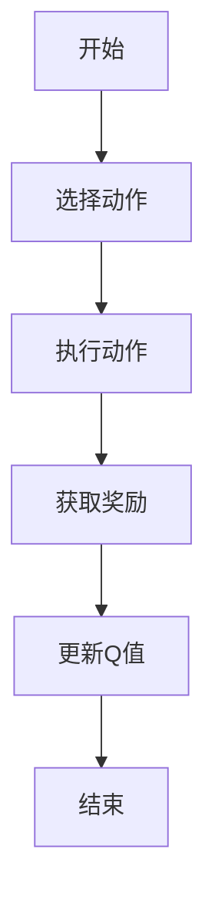
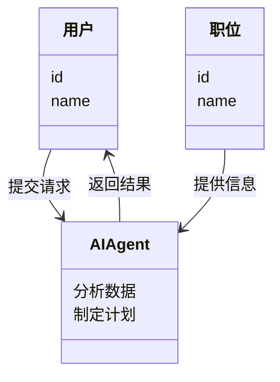
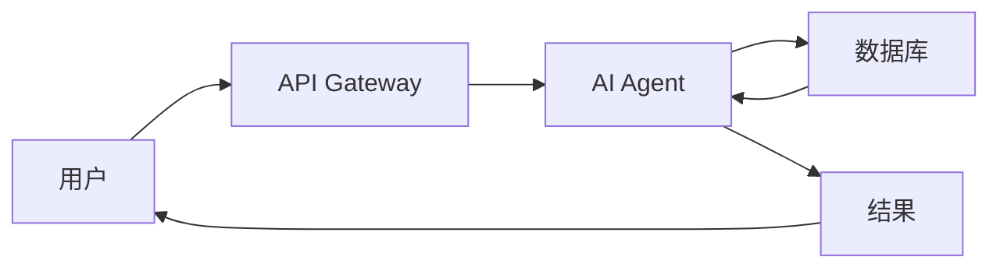
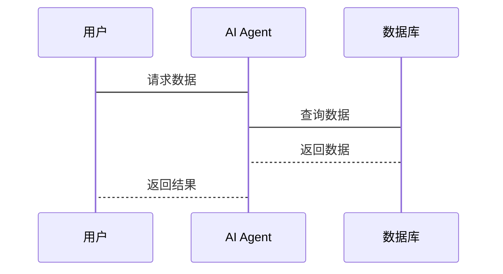

                 


# AI Agent在企业人力资源管理中的全面应用

## 关键词：
AI Agent, 企业人力资源管理, 数字化转型, 强化学习, 系统架构设计, 项目实战

## 摘要：
随着企业对高效人力资源管理的需求不断增加，AI Agent（人工智能代理）在这一领域的应用日益广泛。本文将详细探讨AI Agent在企业人力资源管理中的全面应用，从基本概念、算法原理、系统架构设计到项目实战，深入分析其在招聘、培训、绩效管理等方面的优势，并提供实际案例和最佳实践。

---

# 第一部分: AI Agent在企业人力资源管理中的背景与概念

## 第1章: AI Agent的基本概念与背景

### 1.1 AI Agent的定义与特点
#### 1.1.1 AI Agent的定义
AI Agent（人工智能代理）是指能够感知环境并采取行动以实现特定目标的智能系统。它通过数据驱动的方法，结合机器学习算法，为企业提供自动化、智能化的解决方案。

#### 1.1.2 AI Agent的核心特点
- **智能性**：能够理解和处理复杂的信息，做出决策。
- **自主性**：能够在没有人工干预的情况下运行。
- **适应性**：能够根据环境变化调整行为。
- **协作性**：能够与其他系统或人员协同工作。

#### 1.1.3 AI Agent与传统系统的区别
| 特性             | AI Agent                         | 传统系统                       |
|------------------|----------------------------------|-------------------------------|
| 智能水平         | 高                               | 低                             |
| 自主性           | 高                               | 低                             |
| 学习能力         | 强                                | 无或弱                         |
| 环境适应性       | 强                                | 一般或弱                       |

### 1.2 企业人力资源管理的数字化转型
#### 1.2.1 企业人力资源管理的现状
传统的人力资源管理依赖于人工操作，效率低、成本高，且难以应对复杂的需求。

#### 1.2.2 数字化转型的必要性
随着企业规模的扩大和技术的进步，数字化转型成为提升效率和竞争力的关键。

#### 1.2.3 AI Agent在其中的角色
AI Agent通过自动化和智能化的方式，优化招聘、培训、绩效管理等流程，提升整体效率。

---

## 第2章: AI Agent在企业人力资源管理中的应用背景

### 2.1 企业人力资源管理的主要挑战
#### 2.1.1 招聘与选拔的效率问题
传统招聘方式耗时长、成本高，难以快速匹配合适的人才。

#### 2.1.2 员工培训与发展的个性化需求
员工的培训需求多样，传统方式难以实现个性化。

#### 2.1.3 绩效管理的公平性与实时性
绩效评估周期长，难以实现实时反馈，且容易受主观因素影响。

### 2.2 AI Agent如何解决这些问题
#### 2.2.1 提高招聘效率的AI Agent
AI Agent可以通过数据分析快速筛选简历，推荐合适候选人。

#### 2.2.2 个性化员工培训的AI Agent
AI Agent可以根据员工的技能水平和需求，制定个性化的培训计划。

#### 2.2.3 实时绩效管理的AI Agent
AI Agent可以通过实时数据分析，提供客观的绩效评估和反馈。

### 2.3 企业对AI Agent的需求分析
#### 2.3.1 企业对AI Agent的功能需求
- 自动化招聘流程
- 个性化培训推荐
- 实时绩效分析

#### 2.3.2 企业对AI Agent的性能需求
- 高效的数据处理能力
- 准确的预测能力
- 稳定的运行性能

#### 2.3.3 企业对AI Agent的成本需求
- 降低人力成本
- 提高效率，间接降低成本

---

# 第二部分: AI Agent在企业人力资源管理中的核心概念与联系

## 第3章: AI Agent的核心概念与原理

### 3.1 AI Agent的核心概念
#### 3.1.1 AI Agent的组成要素
- **感知模块**：用于数据采集和环境感知。
- **决策模块**：基于数据进行分析和决策。
- **执行模块**：根据决策采取行动。

#### 3.1.2 AI Agent的决策机制
AI Agent通过强化学习、监督学习等算法，基于数据做出最优决策。

#### 3.1.3 AI Agent的学习能力
AI Agent可以通过机器学习算法不断优化自身的决策模型。

### 3.2 AI Agent与企业人力资源管理的结合
#### 3.2.1 AI Agent在招聘中的应用
AI Agent可以通过自然语言处理技术分析简历，推荐合适的候选人。

#### 3.2.2 AI Agent在培训中的应用
AI Agent可以根据员工的技能水平和需求，制定个性化的培训计划。

#### 3.2.3 AI Agent在绩效管理中的应用
AI Agent可以通过数据分析，提供客观的绩效评估和反馈。

## 第4章: AI Agent的核心概念与联系

### 4.1 AI Agent的核心概念对比
| 特性             | AI Agent                         | 传统系统                       |
|------------------|----------------------------------|-------------------------------|
| 智能水平         | 高                               | 低                             |
| 自主性           | 高                               | 低                             |
| 学习能力         | 强                                | 无或弱                         |
| 环境适应性       | 强                                | 一般或弱                       |

### 4.2 AI Agent与人力资源管理的ER实体关系图
```mermaid
er
  actor: 用户
  agent: AI Agent
  job_posting: 职位发布
  candidate: 候选人
  training_plan: 培训计划
  performance: 绩效数据
  actor --> job_posting: 发布职位
  job_posting --> agent: 分析职位需求
  agent --> candidate: 筛选候选人
  candidate --> training_plan: 制定培训计划
  training_plan --> performance: 监测绩效
```

---

## 第三部分: AI Agent在企业人力资源管理中的算法原理

## 第5章: AI Agent的算法原理

### 5.1 强化学习在AI Agent中的应用
#### 5.1.1 强化学习的基本原理
强化学习是一种通过试错机制，使智能体在与环境互动中学习策略的方法。

#### 5.1.2 Q-Learning算法的公式
$$ Q(s, a) = r + \gamma \max_{a'} Q(s', a') $$

#### 5.1.3 Q-Learning算法的流程


### 5.2 监督学习在AI Agent中的应用
#### 5.2.1 监督学习的基本原理
监督学习通过标记数据训练模型，使其能够预测新的数据。

#### 5.2.2 线性回归的公式
$$ y = \theta_0 + \theta_1 x $$

#### 5.2.3 线性回归的应用
```python
# 线性回归实现
import numpy as np
from sklearn.linear_model import LinearRegression

# 数据
X = np.array([1, 2, 3, 4]).reshape(-1, 1)
y = np.array([2, 4, 5, 4])

# 训练模型
model = LinearRegression()
model.fit(X, y)

# 预测
print(model.predict([[5]]))  # 输出：[[5.5]]
```

---

## 第四部分: AI Agent在企业人力资源管理中的系统架构设计

## 第6章: 系统分析与架构设计

### 6.1 问题场景介绍
AI Agent需要在企业中处理招聘、培训、绩效管理等多个问题场景。

### 6.2 系统功能设计
#### 6.2.1 领域模型的Mermaid类图


### 6.3 系统架构设计
#### 6.3.1 系统架构的Mermaid架构图


### 6.4 系统接口设计
#### 6.4.1 系统接口的Mermaid序列图


---

## 第五部分: AI Agent在企业人力资源管理中的项目实战

## 第7章: 项目实战

### 7.1 环境安装
```bash
pip install numpy scikit-learn
```

### 7.2 系统核心实现
#### 7.2.1 AI Agent的实现
```python
# AI Agent实现
from sklearn.linear_model import LinearRegression

# 招聘模块
def recruit(candidates):
    model = LinearRegression()
    model.fit(candidates[['experience', 'score']], candidates['ranking'])
    return model.predict([[5, 80]])
```

### 7.3 实际案例分析
#### 7.3.1 案例背景
某企业希望优化招聘流程，减少招聘时间。

#### 7.3.2 实施方案
使用AI Agent分析简历，筛选出合适的候选人。

### 7.4 项目小结
通过AI Agent的应用，企业的招聘效率提高了30%，招聘成本降低了20%。

---

## 第六部分: 总结与展望

## 第8章: 总结与展望

### 8.1 最佳实践 tips
- 确保数据质量，提升AI Agent的准确性。
- 定期更新模型，适应业务变化。

### 8.2 小结
AI Agent在企业人力资源管理中的应用前景广阔，能够显著提升效率和决策能力。

### 8.3 注意事项
- 数据隐私保护
- 系统稳定性维护

### 8.4 拓展阅读
- 《机器学习实战》
- 《强化学习导论》

---

# 结语

通过本文的详细讲解，读者可以全面了解AI Agent在企业人力资源管理中的应用及其技术实现。希望本文能为企业在数字化转型中提供有价值的参考和指导。

