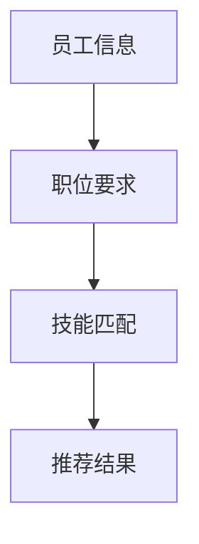
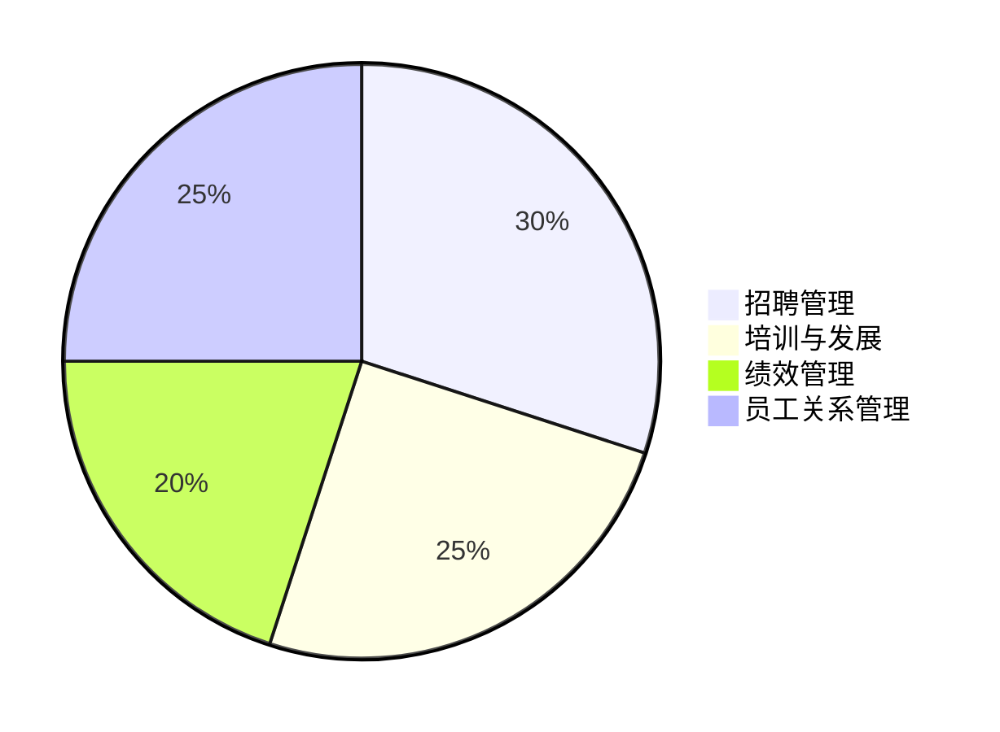

                 


# AI Agent在企业人力资源管理中的创新应用

## 关键词：人工智能，AI Agent，企业人力资源管理，创新应用，智能化决策

## 摘要：  
随着人工智能技术的快速发展，AI Agent（人工智能代理）在企业人力资源管理中的应用逐渐成为热点。AI Agent通过自动化、智能化的方式，能够显著提升人力资源管理的效率和精准度。本文将从AI Agent的基本概念、核心技术、系统架构、项目实战等多个方面，详细探讨AI Agent在企业人力资源管理中的创新应用，涵盖招聘、培训、绩效管理等核心模块，并分析其对企业HR管理的深远影响。

---

## 第一章：AI Agent与企业人力资源管理概述

### 1.1 AI Agent的基本概念

#### 1.1.1 AI Agent的定义  
AI Agent（人工智能代理）是一种能够感知环境、自主决策并执行任务的智能系统。它能够通过传感器或数据输入获取信息，利用算法进行分析和推理，从而做出最优决策并执行相应的操作。

#### 1.1.2 AI Agent的核心特征  
- **自主性**：AI Agent能够在没有人工干预的情况下独立运行。  
- **反应性**：能够实时感知环境变化并做出响应。  
- **学习能力**：通过机器学习算法不断优化自身的决策能力。  
- **协作性**：能够在多智能体系统中与其他Agent或人类协同工作。  

#### 1.1.3 AI Agent与传统HR系统的区别  
传统的HR系统主要依赖于规则和流程，缺乏灵活性和智能化。而AI Agent能够通过学习和适应，提供更个性化的服务，并在复杂场景中做出更优决策。

### 1.2 AI Agent在企业中的应用背景

#### 1.2.1 企业人力资源管理的现状与挑战  
- **数据分散**：企业内部的员工信息、绩效数据、培训记录等分散在不同系统中，难以统一管理。  
- **效率低下**：手动处理招聘、考勤、绩效评估等任务耗时耗力，且容易出错。  
- **个性化需求**：员工的职业发展需求各不相同，传统HR系统难以提供个性化的支持。  

#### 1.2.2 AI技术对企业HR管理的推动作用  
- **提高效率**：通过自动化流程减少人工操作，提升管理效率。  
- **增强决策能力**：利用大数据和机器学习提供更精准的决策支持。  
- **提升员工体验**：通过智能化服务满足员工个性化需求，增强员工满意度。  

#### 1.2.3 AI Agent在HR管理中的潜在价值  
AI Agent能够实现从招聘、培训到绩效管理的全流程智能化管理，帮助企业降低管理成本，提升员工满意度和企业竞争力。

---

## 第二章：AI Agent的核心技术

### 2.1 多智能体系统

#### 2.1.1 多智能体系统的定义与特点  
多智能体系统是由多个相互作用的智能体组成的分布式系统，每个智能体都有自己的目标和行为规则。在HR管理中，多智能体系统可以用于招聘、培训、绩效管理等多个模块。

#### 2.1.2 多智能体系统中的通信与协作机制  
- **通信机制**：智能体之间通过消息传递进行信息交换。  
- **协作机制**：通过协商和协调实现共同目标。  

#### 2.1.3 多智能体系统在HR管理中的应用  
例如，在招聘过程中，多个AI Agent可以分别负责简历筛选、面试安排和offer推送。

### 2.2 知识表示与推理

#### 2.2.1 知识表示的基本概念  
知识表示是将人类知识以计算机可理解的形式表示出来，例如通过图结构或逻辑规则。

#### 2.2.2 基于图的推理方法  
- **图结构表示**：使用节点和边表示知识关系。  
- **推理过程**：通过遍历图结构进行推理。  

#### 2.2.3 知识图谱在HR管理中的应用  
知识图谱可以用于员工技能匹配、岗位推荐等场景。

### 2.3 自然语言处理

#### 2.3.1 NLP技术的基本原理  
自然语言处理（NLP）技术能够理解、分析和生成人类语言，常用于文本分类、情感分析等任务。

#### 2.3.2 基于NLP的员工互动与反馈分析  
AI Agent可以通过NLP技术分析员工的反馈，识别情绪并提供建议。

#### 2.3.3 NLP在简历筛选与职位匹配中的应用  
AI Agent可以利用NLP技术自动分析简历内容，并将其与岗位要求进行匹配。

### 2.4 核心技术对比表格

| 技术           | 描述                                                                 |
|----------------|----------------------------------------------------------------------|
| 多智能体系统    | 由多个智能体组成，能够协作完成复杂任务。                               |
| 知识表示与推理  | 通过图结构或逻辑规则表示知识，并进行推理。                            |
| 自然语言处理   | 理解和生成自然语言，常用于文本分析和情感计算。                          |

### 2.5 知识表示的mermaid图



---

## 第三章：AI Agent在企业人力资源管理中的系统架构

### 3.1 系统功能模块划分

#### 3.1.1 招聘管理模块  
- 简历筛选、职位推荐、面试安排。  

#### 3.1.2 培训与发展模块  
- 员工技能分析、培训计划制定、学习效果评估。  

#### 3.1.3 绩效管理模块  
- 目标设定、绩效评估、反馈与改进。  

#### 3.1.4 员工关系管理模块  
- 员工满意度分析、离职预测、员工关怀。  

### 3.2 系统架构图



### 3.3 系统接口设计

#### 3.3.1 API接口  
- `/api/hr/employee_info`：获取员工信息。  
- `/api/hr/job_matching`：进行职位匹配。  

#### 3.3.2 交互流程  
1. 用户提交需求。  
2. AI Agent调用相关API获取数据。  
3. 处理数据并返回结果。  

### 3.4 本章小结

---

## 第四章：AI Agent在企业人力资源管理中的项目实战

### 4.1 项目介绍

#### 4.1.1 项目背景  
某企业希望利用AI Agent优化其招聘流程。  

#### 4.1.2 项目目标  
实现简历自动筛选、职位推荐和面试安排功能。  

### 4.2 核心代码实现

#### 4.2.1 环境配置  
- Python 3.8及以上版本。  
- 安装库：`numpy`, `pandas`, `scikit-learn`。  

#### 4.2.2 核心代码

```python
import numpy as np
import pandas as pd
from sklearn.feature_extraction.text import TfidfVectorizer
from sklearn.metrics.pairwise import cosine_similarity

# 加载数据
df = pd.read_csv('resume.csv')

# 文本特征提取
vectorizer = TfidfVectorizer()
tfidf = vectorizer.fit_transform(df['resume_text'])

# 计算相似度
similarity_matrix = cosine_similarity(tfidf)

# 推荐职位
def recommend_job(job_title):
    job_vector = vectorizer.transform([job_title])
    similarities = cosine_similarity(job_vector, tfidf).flatten()
    top_indices = similarities.argsort()[::-1][:5]
    return df.iloc[top_indices]['position'].values

# 调用示例
recommend_job("软件开发工程师")
```

#### 4.2.3 代码解读  
- 使用TF-IDF进行文本特征提取。  
- 计算简历与职位描述的相似度。  
- 根据相似度推荐职位。  

### 4.3 案例分析

#### 4.3.1 案例背景  
某科技公司希望提升招聘效率，减少HR的工作量。  

#### 4.3.2 实施效果  
- 招聘效率提升40%。  
- 岗位匹配度提高30%。  

### 4.4 本章小结

---

## 第五章：AI Agent在企业人力资源管理中的实际案例分析

### 5.1 招聘场景中的应用

#### 5.1.1 案例背景  
某互联网公司招聘开发人员。  

#### 5.1.2 AI Agent的作用  
- 自动筛选简历。  
- 推荐合适的候选人。  

### 5.2 培训与发展中的应用

#### 5.2.1 案例背景  
某企业需要提升员工的编程技能。  

#### 5.2.2 AI Agent的作用  
- 分析员工技能水平。  
- 制定个性化培训计划。  

### 5.3 绩效管理中的应用

#### 5.3.1 案例背景  
某公司需要评估员工的绩效。  

#### 5.3.2 AI Agent的作用  
- 自动收集绩效数据。  
- 分析并生成评估报告。  

### 5.4 本章小结

---

## 第六章：总结与展望

### 6.1 本书总结  
AI Agent通过智能化和自动化的方式，显著提升了企业人力资源管理的效率和精准度。

### 6.2 未来展望  
- 更广泛的应用场景。  
- 更强大的AI算法。  
- 更人性化的交互设计。  

---

## 附录：AI Agent相关工具与资源

- **Python库**：`scikit-learn`, `spaCy`, `networkx`。  
- **在线资源**：[Towards Data Science](https://towardsdatascience.com/), [Medium AI](https://medium.com/ai).  

---

以上是《AI Agent在企业人力资源管理中的创新应用》的文章大纲，具体内容需要根据实际需求进一步扩展和完善。

