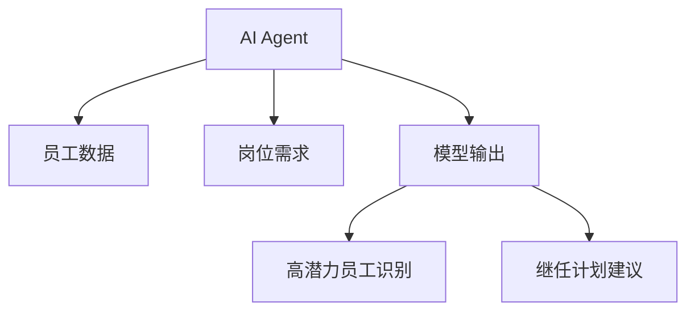
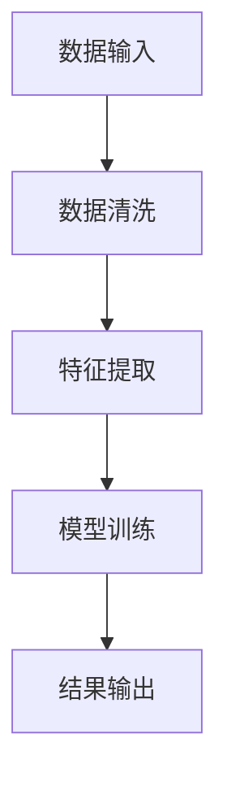
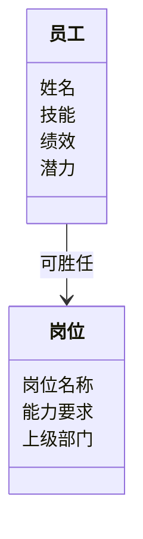
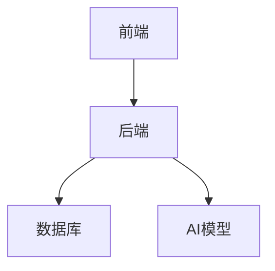
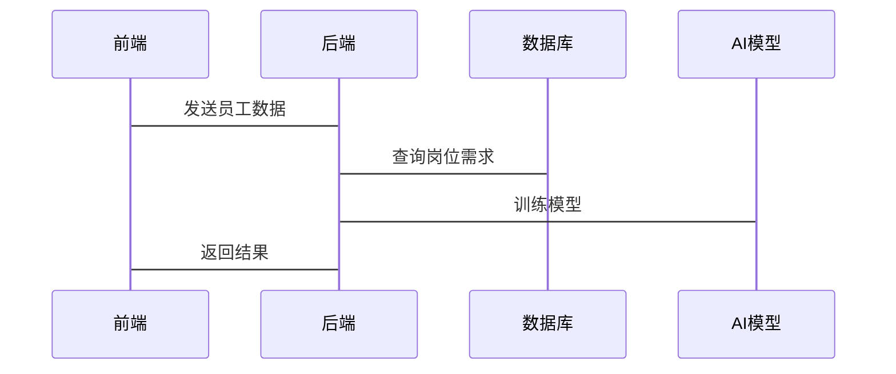

                 


# AI Agent在企业人才发展与继任计划中的应用

> 关键词：AI Agent, 企业人才发展, 继任计划, 人工智能, 人才管理, 系统架构

> 摘要：本文详细探讨了AI Agent在企业人才发展与继任计划中的应用。通过分析AI Agent的核心概念、算法原理、系统架构以及实际项目案例，阐述了如何利用AI技术提升企业人才管理效率和精准度。文章结合理论与实践，为企业的AI Agent应用提供了全面的指导。

---

# 第1章: AI Agent与企业人才发展的概述

## 1.1 问题背景与问题描述

### 1.1.1 传统企业人才发展面临的挑战
传统企业人才发展过程中存在以下问题：
- **人才识别困难**：难以准确识别高潜力员工。
- **继任计划不精准**：缺乏数据支持的继任计划。
- **管理效率低下**：手动筛选和评估耗时耗力。
- **反馈机制缺失**：员工与企业之间的反馈不及时。

### 1.1.2 继任计划中的关键问题
- **关键岗位的空缺风险**：核心岗位缺乏合适候选人。
- **人才培养与实际需求脱节**：培训内容与员工发展需求不匹配。
- **人才流失风险**：高潜力员工容易被竞争对手挖走。

### 1.1.3 AI Agent如何解决这些问题
AI Agent通过以下方式解决人才发展与继任计划中的问题：
- **数据驱动决策**：利用AI分析员工数据，精准识别高潜力人才。
- **实时反馈与建议**：为员工和管理者提供实时反馈，优化发展路径。
- **自动化流程**：减少人工干预，提高管理效率。

## 1.2 AI Agent的核心概念与定义

### 1.2.1 AI Agent的基本定义
AI Agent是一种智能代理系统，能够感知环境、自主决策并执行任务。在企业人才发展中，AI Agent用于分析员工数据，提供个性化的职业发展建议。

### 1.2.2 AI Agent在企业中的应用场景
- **人才识别**：通过数据分析，识别高潜力员工。
- **继任计划制定**：根据员工能力和岗位需求，推荐合适的候选人。
- **培训建议**：基于员工技能差距，制定个性化培训计划。

### 1.2.3 人才发展与继任计划的核心要素
- **员工数据**：包括技能、绩效、潜力评估。
- **岗位需求**：包括岗位职责、能力要求、晋升路径。
- **反馈机制**：员工与企业的双向反馈。

## 1.3 AI Agent与企业人才发展的边界与外延

### 1.3.1 AI Agent的应用边界
- **数据隐私**：AI Agent需要处理员工数据，需确保数据隐私和合规性。
- **决策透明性**：AI Agent的决策需透明，避免员工对算法决策的不信任。

### 1.3.2 人才发展的外延领域
- **文化建设**：通过AI Agent促进企业文化建设。
- **员工体验**：提升员工满意度和归属感。
- **领导力发展**：通过AI Agent辅助领导力培训。

### 1.3.3 继任计划的范围与限制
- **范围**：继任计划主要关注关键岗位的后备人才。
- **限制**：AI Agent无法完全替代人类决策，需结合人工审核。

## 1.4 核心概念结构与组成

### 1.4.1 AI Agent的组成要素
- **数据输入**：员工数据、岗位需求。
- **算法模型**：用于分析数据并生成建议。
- **输出结果**：高潜力员工识别、继任计划建议。

### 1.4.2 人才发展的关键环节
- **识别与评估**：识别高潜力员工。
- **培养与发展**：制定个性化发展计划。
- **评估与反馈**：评估计划效果并提供反馈。

### 1.4.3 继任计划的核心模型
- **岗位需求模型**：明确各岗位的能力要求。
- **人才匹配模型**：将员工能力与岗位需求匹配。

## 1.5 本章小结
本章介绍了AI Agent在企业人才发展中的背景、核心概念和应用边界。通过分析传统人才管理的挑战，阐述了AI Agent如何通过数据驱动的方式解决这些问题，并明确了其在人才发展中的核心作用。

---

# 第2章: AI Agent的核心概念与原理

## 2.1 AI Agent的核心原理

### 2.1.1 人工智能的基本原理
AI Agent基于机器学习算法，通过数据训练模型，实现对员工能力、潜力的预测和评估。

### 2.1.2 AI Agent的工作机制
AI Agent通过以下步骤实现人才管理：
1. **数据收集**：从企业系统中获取员工数据。
2. **数据处理**：清洗和预处理数据。
3. **模型训练**：训练机器学习模型。
4. **结果输出**：生成高潜力员工名单和继任计划建议。

### 2.1.3 代理与环境的交互模型
AI Agent与企业环境的交互模型如下：


## 2.2 AI Agent的属性特征对比

### 2.2.1 不同AI Agent的属性对比
| 属性 | 传统规则式AI | 基于机器学习的AI Agent |
|------|--------------|--------------------------|
| 数据依赖 | 无依赖 | 高依赖 |
| 自适应性 | 低 | 高 |
| 决策能力 | 基于规则 | 数据驱动 |

### 2.2.2 人才发展中的特征分析
- **数据驱动**：AI Agent依赖员工数据进行分析。
- **实时性**：能够实时更新员工数据并提供反馈。
- **个性化**：为每位员工提供个性化的职业发展建议。

### 2.2.3 继任计划中的关键指标
- **岗位匹配度**：员工能力与岗位需求的匹配程度。
- **潜力评估**：员工在未来岗位上的发展潜力。
- **稳定性**：员工在企业内的稳定性。

## 2.3 AI Agent的ER实体关系图

```mermaid
er
  员工 --> 具备能力
  能力 <-- 属于岗位
  岗位 <-- 需求部门
  员工 <-- 反馈结果
```

## 2.4 本章小结
本章详细解释了AI Agent的核心原理，对比了不同AI Agent的属性特征，并通过ER实体关系图展示了人才发展中的数据关系。

---

# 第3章: AI Agent在企业人才发展中的算法原理

## 3.1 算法原理概述

### 3.1.1 AI Agent的核心算法
AI Agent常用算法包括：
- **机器学习算法**：如随机森林、XGBoost。
- **自然语言处理（NLP）**：用于分析员工反馈和简历。

### 3.1.2 算法的基本流程
AI Agent的算法流程如下：


### 3.1.3 算法的优化方向
- **模型优化**：通过调参提高模型准确率。
- **数据增强**：增加数据多样性。
- **实时更新**：定期更新模型以适应变化。

## 3.2 算法的数学模型与公式

### 3.2.1 算法的数学表达式
随机森林算法的数学表达式如下：
$$f(x) = \sum_{i=1}^{n} w_i x_i + b$$
其中，$w_i$是特征$x_i$的权重，$b$是偏置项。

### 3.2.2 算法的优化目标
优化目标为最大化模型准确率：
$$\min_{\theta} \frac{1}{2m} \sum_{i=1}^{m} (y_i - h_\theta(x_i))^2$$
其中，$y_i$是真实标签，$h_\theta(x_i)$是模型预测值。

### 3.2.3 优化方法
使用梯度下降法优化模型参数：
$$\theta_{new} = \theta_{old} - \eta \frac{\partial L}{\partial \theta}$$
其中，$\eta$是学习率，$L$是损失函数。

## 3.3 算法实现的代码示例

### 3.3.1 数据清洗与特征提取
```python
import pandas as pd
from sklearn.preprocessing import StandardScaler

# 数据清洗
df = pd.read_csv('employee_data.csv')
df.dropna(inplace=True)

# 特征提取
features = df[['技能', '绩效', '潜力']]
scaler = StandardScaler()
features_scaled = scaler.fit_transform(features)
```

### 3.3.2 模型训练
```python
from sklearn.ensemble import RandomForestClassifier

model = RandomForestClassifier(n_estimators=100)
model.fit(features_scaled, df['标签'])
```

### 3.3.3 结果输出
```python
importances = model.feature_importances_
print(importances)
```

## 3.4 本章小结
本章详细讲解了AI Agent在人才发展中的算法原理，通过数学公式和代码示例展示了如何实现模型训练和结果输出。

---

# 第4章: AI Agent的系统分析与架构设计

## 4.1 问题场景介绍

### 4.1.1 系统目标
- **目标1**：识别高潜力员工。
- **目标2**：制定个性化继任计划。

### 4.1.2 项目介绍
本项目旨在通过AI Agent优化企业人才发展流程，提升管理效率。

## 4.2 系统功能设计

### 4.2.1 领域模型


### 4.2.2 功能模块
- **数据采集模块**：采集员工数据。
- **数据分析模块**：分析数据并生成建议。
- **反馈模块**：提供反馈给员工和管理者。

## 4.3 系统架构设计

### 4.3.1 系统架构


### 4.3.2 接口设计
- **输入接口**：员工数据输入。
- **输出接口**：高潜力员工名单和继任计划建议。

### 4.3.3 交互流程


## 4.4 本章小结
本章通过系统分析和架构设计，展示了AI Agent在企业人才发展中的实现方式。

---

# 第5章: 项目实战

## 5.1 环境安装

### 5.1.1 安装Python
```bash
python --version
pip install --upgrade pip
```

### 5.1.2 安装依赖库
```bash
pip install numpy pandas scikit-learn mermaid4jupyter
```

## 5.2 核心代码实现

### 5.2.1 数据清洗与特征提取
```python
import pandas as pd
from sklearn.preprocessing import StandardScaler

df = pd.read_csv('employee_data.csv')
df.dropna(inplace=True)

features = df[['技能', '绩效', '潜力']]
scaler = StandardScaler()
features_scaled = scaler.fit_transform(features)
```

### 5.2.2 模型训练
```python
from sklearn.ensemble import RandomForestClassifier

model = RandomForestClassifier(n_estimators=100)
model.fit(features_scaled, df['标签'])
```

### 5.2.3 结果输出
```python
importances = model.feature_importances_
print(importances)
```

## 5.3 代码解读与分析

### 5.3.1 数据清洗
- **步骤1**：读取数据并删除缺失值。
- **步骤2**：提取关键特征并进行标准化。

### 5.3.2 模型训练
- **步骤1**：初始化随机森林模型。
- **步骤2**：训练模型并输出特征重要性。

## 5.4 实际案例分析

### 5.4.1 案例背景
某企业希望通过AI Agent识别高潜力员工。

### 5.4.2 数据分析
通过模型训练，识别出5名高潜力员工。

### 5.4.3 案例结果
- **结果1**：识别出高潜力员工。
- **结果2**：生成继任计划建议。

## 5.5 本章小结
本章通过实际案例展示了AI Agent在企业人才发展中的应用，并详细解读了核心代码。

---

# 第6章: 最佳实践、小结与注意事项

## 6.1 最佳实践

### 6.1.1 数据隐私保护
- **措施1**：确保数据加密存储。
- **措施2**：遵守数据隐私法规。

### 6.1.2 模型优化
- **建议1**：定期更新模型。
- **建议2**：引入新的数据源。

## 6.2 小结

### 6.2.1 本章总结
AI Agent通过数据驱动的方式，显著提升了企业人才管理的效率和精准度。

### 6.2.2 重要性
- **重要性1**：AI Agent帮助企业识别高潜力员工。
- **重要性2**：优化了继任计划的制定过程。

## 6.3 注意事项

### 6.3.1 数据质量
- **注意1**：确保数据准确性和完整性。
- **注意2**：数据清洗是关键。

### 6.3.2 模型解释性
- **注意1**：模型需具备可解释性。
- **注意2**：避免黑箱模型。

## 6.4 拓展阅读

### 6.4.1 推荐书籍
- 《机器学习实战》
- 《人工智能：一种现代的方法》

### 6.4.2 推荐博客
- [AI Agent技术博客](https://example.com)
- [企业人才管理博客](https://example.com)

---

# 第7章: 总结与展望

## 7.1 总结
AI Agent在企业人才发展与继任计划中的应用，显著提升了企业的管理效率和精准度。通过数据驱动的方式，AI Agent能够准确识别高潜力员工，并制定个性化的发展计划。

## 7.2 展望
未来，AI Agent在人才管理中的应用将更加广泛。随着技术的进步，AI Agent将具备更强的自适应性和实时性，为企业提供更精准的决策支持。

---

# 参考文献

1. 周志华. 机器学习[M]. 清华大学出版社, 2016.
2. Russell S, Norvig P. 人工智能:一种现代的方法[M]. 清华大学出版社, 2018.
3. Goodfellow I, Bengio Y, Courville A. 深度学习[M]. 人民邮电出版社, 2018.

---

以上是《AI Agent在企业人才发展与继任计划中的应用》的完整目录和内容概览，您可以根据需要进一步扩展或调整各章节的具体内容。

