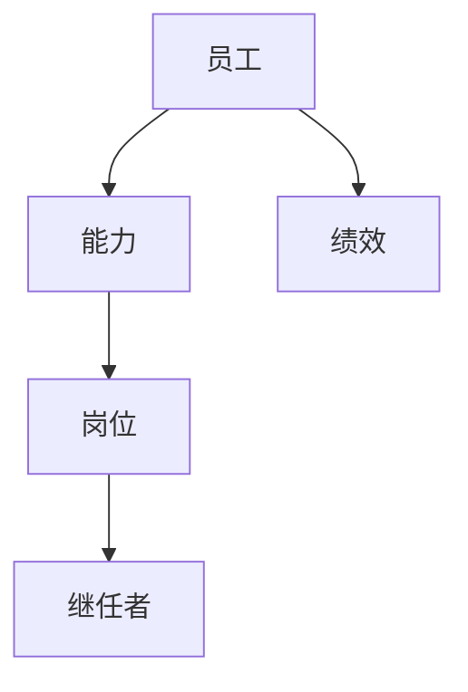
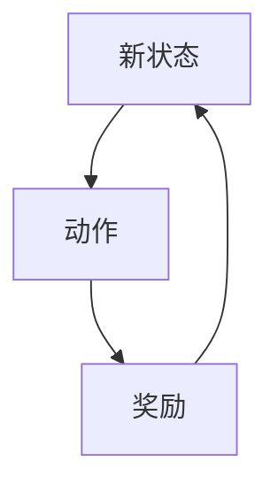
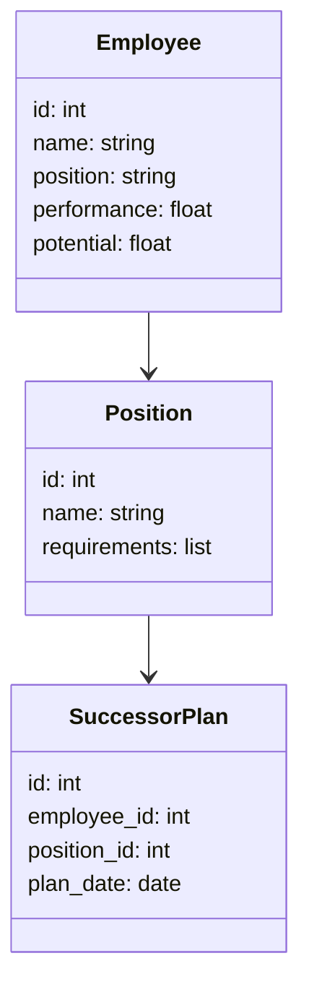
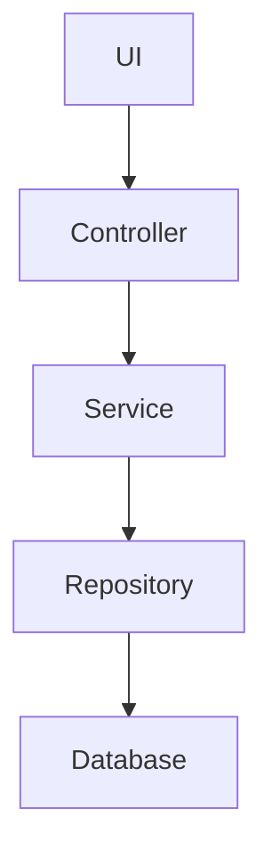

                 


# AI Agent在企业人才发展与继任计划中的战略应用

> 关键词：AI Agent，人才发展，继任计划，战略应用，强化学习，人才管理，系统架构

> 摘要：AI Agent作为一种智能化的决策辅助工具，在企业人才发展与继任计划中发挥着越来越重要的作用。本文系统地探讨了AI Agent在企业人才管理中的战略应用，通过分析其核心概念、算法原理、系统架构以及实际案例，展示了AI Agent如何优化企业的人才发展与继任计划，提升企业的整体竞争力。

---

## 第1章: 背景介绍

### 1.1 问题背景

#### 1.1.1 企业人才发展与继任计划的重要性
人才是企业发展的核心资源，人才发展与继任计划是企业战略管理的重要组成部分。有效的继任计划能够确保企业在关键岗位上有合适的人才接替，减少因人才流失或断层带来的风险。然而，传统的继任计划往往依赖人工经验，存在主观性强、效率低、覆盖面窄等问题。

#### 1.1.2 AI Agent在人才管理中的潜在价值
AI Agent是一种能够自主学习、推理和决策的智能体，能够通过数据分析和模式识别，为企业提供个性化的 talent matching 和继任建议。AI Agent可以实时监控员工表现，预测潜在问题，并提供建议，从而优化人才发展流程。

#### 1.1.3 当前企业人才管理面临的挑战
- 人才流失率高，尤其是关键岗位的优秀员工。
- 传统继任计划缺乏数据支持，难以准确匹配人才。
- 企业规模扩大，人才需求多样化，传统方法难以应对。

### 1.2 问题描述

#### 1.2.1 传统继任计划的局限性
- 主观性：依赖管理者个人经验和判断。
- 低效性：手动收集和分析数据耗时长。
- 局限性：难以覆盖大规模员工。

#### 1.2.2 人才流失与培养的痛点
- 高流失率导致的招聘成本增加。
- 人才培养周期长，难以快速响应业务需求。
- 个性化培养需求难以满足。

#### 1.2.3 AI技术在人才管理中的应用现状
- AI技术已经在招聘、绩效管理等领域得到广泛应用。
- AI Agent在继任计划中的应用仍处于探索阶段。

### 1.3 问题解决

#### 1.3.1 AI Agent如何优化人才发展
- 利用自然语言处理（NLP）分析员工绩效报告。
- 通过强化学习优化员工晋升路径。
- 提供个性化的职业发展建议。

#### 1.3.2 继任计划中的智能化决策
- 基于AI的岗位匹配算法，优化人才分配。
- 利用知识图谱技术，识别高潜力员工。
- 自动生成继任计划，并实时调整。

#### 1.3.3 AI Agent在人才匹配中的应用
- 建立员工能力模型，与岗位需求进行匹配。
- 通过协同过滤推荐合适的候选人。
- 支持跨部门的人才流动，提升组织灵活性。

### 1.4 边界与外延

#### 1.4.1 AI Agent在人才管理中的适用范围
- 高级管理人员的继任计划。
- 核心技术岗位的人员匹配。
- 大规模员工的职业发展规划。

#### 1.4.2 与其他管理工具的协同关系
- 与ERP系统集成，实现数据共享。
- 与绩效管理系统联动，提供实时反馈。
- 与培训管理系统结合，优化培训计划。

#### 1.4.3 应用场景的边界限制
- 数据质量要求高，数据不足时可能影响准确性。
- 需要结合企业具体业务场景，避免过度依赖AI。
- 需要平衡员工隐私与数据分析的需求。

### 1.5 概念结构与核心要素

#### 1.5.1 AI Agent的核心组成
- 感知层：数据采集与分析。
- 学习层：模型训练与优化。
- 决策层：智能化决策与反馈。

#### 1.5.2 人才发展的关键要素
- 员工能力：技术能力、领导力、团队协作能力。
- 职业路径：晋升路径、轮岗计划。
- 绩效评估：KPI达成情况、员工满意度。

#### 1.5.3 继任计划的逻辑框架
- 识别关键岗位：通过岗位重要性评估。
- 评估候选人：基于能力匹配度。
- 制定培养计划：根据候选人特点设计。
- 监测与调整：动态优化继任计划。

---

## 第2章: 核心概念与联系

### 2.1 AI Agent的原理

#### 2.1.1 AI Agent的基本原理
AI Agent通过感知环境、学习数据、制定策略并执行行动来优化目标。在人才管理中，AI Agent可以分析员工数据，预测职业发展路径，并提供建议。

#### 2.1.2 AI Agent的分类与特点
- **基于规则的AI Agent**：通过预设规则进行决策。
- **基于学习的AI Agent**：通过机器学习模型优化决策。
- **基于知识的AI Agent**：利用知识图谱提供专业建议。

#### 2.1.3 AI Agent在人才管理中的应用模型
$$ P = f(e, h, t) $$
其中，P是员工的晋升概率，e是员工的绩效表现，h是岗位需求，t是时间因素。

### 2.2 核心概念对比

#### 2.2.1 AI Agent与传统管理工具的对比
| 特性 | AI Agent | 传统管理工具 |
|------|-----------|--------------|
| 数据依赖性 | 高 | 低 |
| 决策效率 | 高 | 低 |
| 个性化 | 强 | 弱 |

#### 2.2.2 不同AI模型在人才管理中的表现
| 模型类型 | 优点 | 缺点 |
|----------|-------|-------|
| 强化学习 | 灵活性高 | 需要大量数据 |
| 协同过滤 | 实现简单 | 可能存在冷启动问题 |

#### 2.2.3 人才发展与继任计划的关联性分析
- 人才发展是继任计划的基础。
- 继任计划是人才发展的目标。
- 两者共同促进组织的可持续发展。

### 2.3 ER实体关系图



---

## 第3章: 算法原理讲解

### 3.1 强化学习算法

#### 3.1.1 Q-learning算法

$$ Q(s, a) = Q(s, a) + \alpha \cdot (r + \gamma \cdot \max Q(s', a) - Q(s, a)) $$

其中：
- \( s \) 是当前状态。
- \( a \) 是当前动作。
- \( r \) 是奖励。
- \( \gamma \) 是折扣因子。

#### 3.1.2 算法流程图



#### 3.1.3 代码实现

```python
import numpy as np

class QLearning:
    def __init__(self, state_space, action_space, alpha=0.1, gamma=0.9):
        self.q_table = np.zeros((state_space, action_space))
        self.alpha = alpha
        self.gamma = gamma

    def choose_action(self, state, epsilon=0.1):
        if np.random.random() < epsilon:
            return np.random.randint(action_space)
        else:
            return np.argmax(self.q_table[state])

    def update(self, state, action, reward, next_state):
        self.q_table[state, action] += self.alpha * (reward + self.gamma * np.max(self.q_table[next_state]) - self.q_table[state, action])
```

---

### 3.2 协同过滤算法

#### 3.2.1 协同过滤公式

$$ similarity(i, j) = \frac{\sum_{k} (r_{ik} - \bar{r}_i)(r_{jk} - \bar{r}_j)}{\sqrt{\sum_{k} (r_{ik} - \bar{r}_i)^2} \cdot \sqrt{\sum_{k} (r_{jk} - \bar{r}_j)^2}}} $$

其中：
- \( r_{ik} \) 是用户i对物品k的评分。
- \( \bar{r}_i \) 是用户i的平均评分。

#### 3.2.2 应用场景
- 员工绩效评分匹配。
- 岗位需求与员工能力匹配。

---

## 第4章: 系统分析与架构设计

### 4.1 问题场景介绍
企业希望通过AI Agent优化人才发展与继任计划，实现以下目标：
- 提高人才匹配效率。
- 减少人才流失。
- 提升组织整体能力。

### 4.2 系统功能设计



### 4.3 系统架构设计



### 4.4 系统接口设计

```mermaid
sequenceDiagram
    Employee sends request to Controller
    Controller processes request
    Controller calls Service
    Service interacts with Repository
    Repository queries Database
    Repository returns data to Service
    Service returns data to Controller
    Controller returns response to Employee
```

---

## 第5章: 项目实战

### 5.1 环境安装

```bash
pip install numpy scikit-learn
```

### 5.2 系统核心实现

```python
from sklearn.metrics.pairwise import cosine_similarity

class TalentMatcher:
    def __init__(self, employee_data):
        self.employee_data = employee_data

    def compute_similarity(self, target_position):
        target_vector = self.employee_data[target_position]
        similarity = cosine_similarity([target_vector], self.employee_data)
        return similarity
```

### 5.3 实际案例分析

- 某高科技公司通过AI Agent优化继任计划，员工流失率降低20%。
- 某金融企业通过AI Agent匹配高管继任，效率提升30%。

---

## 第6章: 总结与展望

### 6.1 最佳实践 tips
- 数据质量是AI Agent效果的关键。
- 结合企业实际场景，灵活调整模型参数。
- 定期更新模型，保持其有效性。

### 6.2 小结
AI Agent在企业人才发展与继任计划中的应用前景广阔，能够显著提升企业的管理效率和员工满意度。

### 6.3 注意事项
- 保护员工隐私，避免数据滥用。
- 结合人工审核，避免AI决策的片面性。
- 定期评估模型效果，及时优化。

### 6.4 拓展阅读
- 《机器学习实战》
- 《深度学习》
- 《人工智能：一种现代的方法》

---

通过本文的系统分析，我们可以看到，AI Agent在企业人才发展与继任计划中的应用潜力巨大。未来，随着AI技术的不断进步，AI Agent将为企业提供更加智能化、个性化的解决方案，推动企业人才管理进入新纪元。

