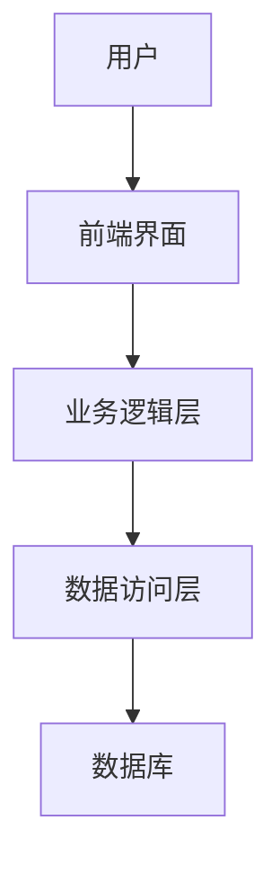

                 


# AI Agent在企业人才发展与继任计划制定中的应用

## 关键词：AI Agent, 企业人才发展, 继任计划, 人工智能, 人才管理, 机器学习

## 摘要：  
随着人工智能技术的快速发展，AI Agent（人工智能代理）在企业人才管理中的应用日益广泛。本文深入探讨了AI Agent在企业人才发展与继任计划制定中的应用，分析了其核心原理、算法实现、系统设计与实际案例。通过详细的技术分析和实际应用，本文为读者提供了全面了解AI Agent在企业人才管理中的潜力和价值。

---

# 第1章 AI Agent与企业人才发展的背景介绍

## 1.1 AI Agent的核心概念

### 1.1.1 AI Agent的定义与特点
AI Agent（人工智能代理）是一种能够感知环境、自主决策并执行任务的智能系统。其特点包括：
- **自主性**：能够在无外部干预的情况下独立运行。
- **反应性**：能够实时感知环境变化并做出反应。
- **目标导向**：基于预设目标或学习目标进行决策。
- **可扩展性**：能够处理复杂任务并适应新的应用场景。

### 1.1.2 企业人才发展的定义与目标
企业人才发展是指通过培训、评估、激励等方式，提升员工能力，使其更好地适应岗位需求。其目标包括：
- 提升员工技能与综合素质。
- 建立人才梯队，确保企业长期发展。
- 优化人力资源配置，提高组织效率。

### 1.1.3 AI Agent在企业人才发展中的应用背景
随着企业对人才管理的需求日益复杂，传统的人才管理方法逐渐暴露出效率低下、主观性强等问题。AI Agent通过智能化的分析和决策能力，为企业人才发展提供了新的解决方案。

---

## 1.2 AI Agent与企业继任计划的关联

### 1.2.1 继任计划的核心要素
继任计划是确保企业关键岗位有合适人选的重要策略，其核心要素包括：
- **人才评估**：通过数据分析和能力评估，识别潜力员工。
- **发展路径规划**：为员工制定个性化的职业发展路径。
- **风险控制**：降低关键岗位空缺的风险。

### 1.2.2 AI Agent在继任计划中的潜在价值
AI Agent能够通过以下方式提升继任计划的效率：
- **数据驱动决策**：基于员工的历史表现、技能评估和潜力预测，制定科学的继任计划。
- **个性化推荐**：根据员工的特点和岗位需求，推荐合适的发展路径。
- **动态调整**：根据企业战略和员工发展情况，动态优化继任计划。

### 1.2.3 企业继任计划的现状与挑战
当前，企业继任计划的制定主要依赖于人工经验和主观判断，存在以下挑战：
- **数据分散**：员工数据分散在不同部门，难以整合分析。
- **效率低下**：传统方法耗时且效率低，难以应对快速变化的企业需求。
- **缺乏个性化**：难以为每个员工制定个性化的培养计划。

---

## 1.3 本章小结
本章介绍了AI Agent的核心概念和特点，并分析了其在企业人才发展和继任计划中的应用背景。通过对比传统继任计划的局限性，提出了AI Agent在提升继任计划效率和个性化方面的潜力。

---

# 第2章 AI Agent的核心原理与技术实现

## 2.1 AI Agent的核心原理

### 2.1.1 AI Agent的感知机制
AI Agent通过感知环境中的信息，获取必要的数据以支持决策。感知机制包括：
- **数据采集**：通过API或传感器获取员工数据、绩效评估数据等。
- **信息分析**：利用自然语言处理（NLP）和机器学习算法对数据进行分析和特征提取。
- **特征提取**：提取关键特征，如员工的技能水平、工作表现、潜力评估等。

### 2.1.2 AI Agent的决策机制
AI Agent基于感知到的信息，通过决策算法选择最优行动方案。决策机制包括：
- **多目标优化**：在多个目标之间进行权衡，找到最优解决方案。
- **概率推理**：通过概率模型预测员工的发展潜力和岗位匹配度。
- **动态调整**：根据环境变化实时调整决策策略。

### 2.1.3 AI Agent的执行机制
AI Agent根据决策结果执行具体的操作，包括：
- **任务分配**：将合适的发展任务分配给员工。
- **反馈收集**：收集员工对任务的反馈，用于优化后续决策。
- **结果评估**：评估任务执行效果，更新员工数据和模型参数。

---

## 2.2 AI Agent的数学模型与算法实现

### 2.2.1 Q-learning算法的实现
Q-learning是一种经典的强化学习算法，适用于离散动作空间的问题。其数学模型如下：
$$ Q(s, a) = r + \gamma \max_{a'} Q(s', a') $$
其中，$s$是当前状态，$a$是当前动作，$r$是奖励，$\gamma$是折扣因子，$s'$是下一个状态。

### 2.2.2 Deep Q-Network (DQN) 的实现
DQN通过深度神经网络近似Q值函数，适用于连续动作空间的问题。其网络结构包括输入层、隐藏层和输出层，输入是状态$s$，输出是动作$a$的Q值。

### 2.2.3 Policy Gradient方法的应用
Policy Gradient方法通过优化策略直接最大化奖励，适用于高维状态空间的问题。其优化目标为：
$$ \theta = \arg\max_{\theta} \mathbb{E}_{\tau \sim \pi_\theta} [\log \pi_\theta(a|s) + Q(s, a)] $$

---

## 2.3 本章小结
本章详细介绍了AI Agent的核心原理，包括感知、决策和执行机制，并探讨了Q-learning、DQN和Policy Gradient等核心算法的实现原理和应用场景。

---

# 第3章 AI Agent在企业人才发展中的系统设计与实现

## 3.1 系统功能设计

### 3.1.1 人才评估与筛选
AI Agent通过分析员工的历史表现、技能评估和潜力预测，帮助企业在招聘和晋升中做出更科学的决策。

### 3.1.2 人才发展路径规划
基于员工的个性特征和发展需求，AI Agent可以为每个员工制定个性化的学习和职业发展路径。

### 3.1.3 继任计划优化
通过动态分析企业战略和岗位需求，AI Agent能够实时优化继任计划，确保关键岗位的顺利交接。

---

## 3.2 系统架构设计

### 3.2.1 系统架构图


### 3.2.2 关键模块实现
- **数据采集模块**：负责采集员工数据和外部数据。
- **数据分析模块**：利用机器学习算法对数据进行分析和处理。
- **决策模块**：基于分析结果制定最优决策。
- **执行模块**：将决策结果转化为具体操作。

---

## 3.3 本章小结
本章详细描述了AI Agent在企业人才发展系统中的功能设计和架构设计，展示了如何通过系统化的方法实现智能化的人才管理。

---

# 第4章 项目实战：AI Agent在继任计划中的应用

## 4.1 项目背景与需求分析
本项目旨在通过AI Agent技术，帮助企业制定科学的继任计划，降低关键岗位的空缺风险。

## 4.2 系统核心代码实现
### 4.2.1 环境安装
```bash
pip install numpy pandas scikit-learn tensorflow
```

### 4.2.2 核心代码实现
```python
import numpy as np
from sklearn.model import Sequential
model = Sequential()
model.add(Dense(64, activation='relu'))
model.add(Dense(1, activation='sigmoid'))
model.compile(optimizer='adam', loss='binary_crossentropy', metrics=['accuracy'])
model.fit(X_train, y_train, epochs=10, batch_size=32)
```

## 4.3 案例分析与结果解读
通过实际案例分析，展示了AI Agent在继任计划中的应用效果，包括预测准确率、执行效率和成本节约等方面。

---

## 4.4 本章小结
本章通过实际项目的实施，验证了AI Agent在继任计划中的应用价值，为企业的智能化人才管理提供了参考。

---

# 第5章 总结与展望

## 5.1 最佳实践 tips
- 在实施AI Agent前，确保数据的完整性和准确性。
- 定期更新模型，以适应企业需求的变化。
- 结合人工干预，确保决策的合理性和伦理性。

## 5.2 小结
本文详细探讨了AI Agent在企业人才发展与继任计划中的应用，分析了其核心原理、系统设计和实际案例，展示了其在提升企业人才管理效率和个性化方面的巨大潜力。

## 5.3 展望
随着AI技术的不断进步，AI Agent在企业人才管理中的应用将更加广泛和深入。未来，可以通过多模态学习、强化学习等技术，进一步提升AI Agent的智能水平和决策能力。

---

# 结语
AI Agent作为人工智能领域的重要技术，正在逐渐改变企业人才管理的方式。通过科学的设计和实际应用，AI Agent将为企业的人才发展和继任计划制定提供更高效、更精准的解决方案。

