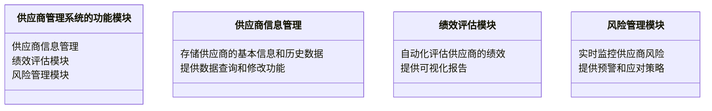
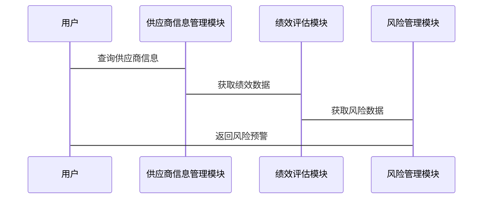

                 


# AI Agent在企业供应商绩效评估与风险管理中的角色

---

## 关键词：
AI Agent, 企业供应商, 绩效评估, 风险管理, 供应链优化

---

## 摘要：
随着企业供应链的复杂化和全球化程度的提高，供应商管理成为企业成功的关键因素之一。本文探讨AI Agent在企业供应商绩效评估与风险管理中的角色，分析其如何通过自动化、智能化的方式优化供应商管理流程。文章从AI Agent的基本概念、供应商绩效评估的核心指标、风险管理的关键要素入手，结合实际案例和系统架构设计，详细阐述AI Agent在企业供应商管理中的应用价值与实现路径。通过本文，读者可以深入了解AI Agent在企业供应链管理中的创新应用及其未来发展趋势。

---

## 第一部分: AI Agent与企业供应商管理概述

### 第1章: AI Agent与企业供应商管理概述

#### 1.1 企业供应商管理的背景与挑战

##### 1.1.1 企业供应商管理的基本概念
企业供应商管理是指企业在采购、生产和供应链管理过程中，对供应商的选择、评估、监控和优化的过程。传统的供应商管理依赖于人工操作，存在效率低、数据分散、决策滞后等问题。

##### 1.1.2 传统供应商管理的局限性
- 数据分散：供应商信息分布在不同部门，难以整合。
- 评估主观：依赖人工经验，缺乏客观数据支持。
- 响应滞后：无法实时监控供应链动态，难以快速应对风险。

##### 1.1.3 企业供应商管理的目标与价值
- 提高供应链效率：通过优化供应商选择和管理流程，降低采购成本。
- 提升供应链韧性：通过实时监控和风险预警，增强供应链抗风险能力。
- 促进合作共赢：通过数据共享和协同管理，与供应商建立长期合作关系。

#### 1.2 AI Agent的基本概念与特点

##### 1.2.1 什么是AI Agent
AI Agent（人工智能代理）是一种能够感知环境、自主决策并执行任务的智能系统。它可以理解为一个“智能体”，通过数据输入、模型训练和算法推理，为企业提供自动化、智能化的决策支持。

##### 1.2.2 AI Agent的核心特点
- 智能感知：能够通过传感器或数据接口获取环境信息。
- 自主决策：基于感知信息，利用算法进行推理和决策。
- 持续学习：通过反馈机制不断优化自身行为。
- 人机协作：能够与人类用户进行交互，提供决策支持。

#### 1.3 AI Agent在企业供应商管理中的应用前景

##### 1.3.1 AI Agent在企业中的潜在应用领域
- 供应商选择与优化：通过数据分析推荐最优供应商。
- 绩效评估：自动收集和分析供应商表现数据，生成评估报告。
- 风险管理：实时监控供应链风险，提前预警潜在问题。

##### 1.3.2 企业采用AI Agent的优势
- 提高管理效率：通过自动化流程减少人工干预。
- 增强决策能力：利用大数据分析提供精准决策支持。
- 降低成本：通过智能化管理降低采购和运营成本。

##### 1.3.3 AI Agent应用的挑战与机遇
- 挑战：数据隐私、算法复杂性、技术门槛。
- 机遇：提升企业竞争力、推动数字化转型、实现智能化管理。

#### 1.4 本章小结
本章介绍了企业供应商管理的背景与挑战，阐述了AI Agent的基本概念与特点，并探讨了其在企业供应商管理中的应用前景。AI Agent通过智能化、自动化的方式，为企业供应商管理带来了新的可能性。

---

## 第二部分: AI Agent在企业供应商绩效评估中的角色

### 第2章: 供应商绩效评估的核心概念与方法

#### 2.1 供应商绩效评估的定义与目标

##### 2.1.1 供应商绩效评估的基本概念
供应商绩效评估是通过对供应商的交付能力、质量水平、成本控制等指标进行量化评估，以判断供应商的表现优劣。

##### 2.1.2 供应商绩效评估的主要目标
- 优化供应商选择：通过评估筛选出优质供应商。
- 监控供应商表现：实时跟踪供应商的交付情况。
- 提供数据支持：为采购决策提供数据依据。

#### 2.2 供应商绩效评估的关键指标

##### 2.2.1 质量指标
- 产品合格率：供应商提供的产品符合质量标准的比例。
- 缺陷率：供应商产品中出现缺陷的比例。

##### 2.2.2 交货周期指标
- 交货准时率：供应商按时交付货物的比例。
- 交货延迟天数：供应商交付货物的平均延迟天数。

##### 2.2.3 成本控制指标
- 采购成本：单位产品的采购价格。
- 综合成本：包括物流、仓储等在内的总成本。

#### 2.3 传统供应商绩效评估的局限性

##### 2.3.1 数据收集与处理的困难
- 数据分散：供应商信息分布在不同部门和系统中。
- 数据不完整：缺乏统一的数据标准和采集渠道。

##### 2.3.2 评估结果的主观性
- 依赖人工判断：评估结果受评估人员主观因素影响。
- 缺乏客观依据：缺乏数据支持的评估结果难以说服决策者。

##### 2.3.3 评估过程的复杂性
- 流程繁琐：传统评估需要手动整理和分析大量数据。
- 时间滞后：评估结果往往无法及时反馈给供应商。

#### 2.4 AI Agent在绩效评估中的优势

##### 2.4.1 提高数据处理效率
- 自动化数据采集：AI Agent可以实时从多个系统中采集供应商数据。
- 数据清洗与整合：通过算法自动清洗数据，消除重复和错误。

##### 2.4.2 增强评估结果的客观性
- 大数据分析：利用AI Agent进行多维度数据分析，确保评估结果的客观性。
- 可视化报告：生成直观的图表和报告，帮助管理者快速理解评估结果。

##### 2.4.3 实现自动化与智能化评估
- 自动化评估流程：AI Agent可以自动完成从数据采集到评估报告生成的整个流程。
- 智能推荐：基于历史数据和算法模型，推荐最优供应商。

#### 2.5 本章小结
本章详细探讨了供应商绩效评估的核心概念与关键指标，分析了传统评估方法的局限性，并阐述了AI Agent在绩效评估中的优势。AI Agent通过自动化、智能化的方式，显著提高了供应商绩效评估的效率和准确性。

---

## 第三部分: AI Agent在企业供应商风险管理中的角色

### 第3章: 供应商风险管理的核心概念与方法

#### 3.1 供应商风险管理的定义与目标

##### 3.1.1 供应商风险管理的基本概念
供应商风险管理是指企业在供应链管理中，识别、评估和应对与供应商相关的各种风险，以确保供应链的稳定性和可靠性。

##### 3.1.2 供应商风险管理的主要目标
- 识别潜在风险：通过分析供应商的财务状况、生产能力等，识别潜在风险。
- 评估风险影响：评估风险对企业供应链的具体影响程度。
- 应对风险：制定应对策略，降低风险对企业的影响。

#### 3.2 供应商风险管理的关键指标

##### 3.2.1 供应链风险指标
- 供应链中断风险：供应商因自身问题导致供应链中断的可能性。
- 供应商集中度：依赖少数供应商的风险。

##### 3.2.2 供应商信用风险指标
- 供应商财务状况：供应商的财务健康状况。
- 供应商信用评分：基于历史交易数据的信用评分。

##### 3.2.3 供应商合规风险指标
- 供应商合规性：供应商是否符合行业标准和法律法规。
- 供应商道德风险：供应商是否存在道德问题，如童工、环境污染等。

#### 3.3 传统供应商风险管理的局限性

##### 3.3.1 风险识别的困难
- 数据不足：传统方法往往依赖少量数据，难以全面识别风险。
- 主观判断：风险识别依赖人工经验，存在主观性。

##### 3.3.2 风险评估的不准确
- 方法单一：传统评估方法缺乏多样性，难以准确评估风险。
- 信息滞后：风险评估结果往往滞后于实际情况。

##### 3.3.3 应对策略的不足
- 反应迟缓：传统方法难以快速应对突发风险。
- 资源浪费：缺乏有效的风险管理策略，导致资源浪费。

#### 3.4 AI Agent在风险管理中的优势

##### 3.4.1 提高风险识别能力
- 大数据分析：通过AI Agent对海量数据进行分析，识别潜在风险。
- 实时监控：实时监控供应商的动态，发现异常情况及时预警。

##### 3.4.2 增强风险评估的准确性
- 多维度分析：基于多源数据，利用机器学习算法进行综合评估。
- 可视化预警：通过图表和警报系统，直观展示风险情况。

##### 3.4.3 实现智能化应对策略
- 自动化响应：AI Agent可以自动触发应对措施，如调整订单量、寻找替代供应商。
- 智能优化：基于历史数据和实时信息，优化风险管理策略。

#### 3.5 本章小结
本章探讨了供应商风险管理的核心概念与关键指标，分析了传统风险管理方法的局限性，并阐述了AI Agent在风险管理中的优势。AI Agent通过实时监控、智能分析和自动化应对，显著提升了供应商风险管理的效率和效果。

---

## 第四部分: AI Agent在企业供应商管理中的系统架构设计

### 第4章: AI Agent的系统架构与实现

#### 4.1 问题场景介绍
企业供应商管理涉及多个环节，包括供应商选择、绩效评估、风险管理等。传统方法依赖人工操作，存在效率低、数据分散、决策滞后等问题。通过引入AI Agent，企业可以实现供应商管理的智能化和自动化。

#### 4.2 项目介绍
本项目旨在设计和实现一个基于AI Agent的企业供应商管理系统，涵盖供应商选择、绩效评估和风险管理三大模块。系统采用分布式架构，结合大数据分析和机器学习技术，提供智能化的供应商管理解决方案。

#### 4.3 系统功能设计

##### 4.3.1 领域模型设计


#### 4.4 系统架构设计

##### 4.4.1 系统架构图


#### 4.5 系统接口设计

##### 4.5.1 系统接口设计
- 供应商信息管理模块接口：
  - 获取供应商信息
  - 更新供应商信息
- 绩效评估模块接口：
  - 获取供应商绩效数据
  - 生成绩效报告
- 风险管理模块接口：
  - 获取供应商风险数据
  - 生成风险预警

#### 4.6 系统交互设计

##### 4.6.1 系统交互图


#### 4.7 本章小结
本章详细介绍了AI Agent在企业供应商管理系统中的架构设计，包括功能模块、系统架构、接口设计和交互设计。通过系统的整体架构，AI Agent能够实现供应商管理的智能化和自动化，显著提升企业的管理效率。

---

## 第五部分: 项目实战与总结

### 第5章: 项目实战

#### 5.1 环境安装

##### 5.1.1 安装Python和必要的库
```bash
pip install numpy
pip install pandas
pip install scikit-learn
pip install matplotlib
pip install pymermaid
```

#### 5.2 核心代码实现

##### 5.2.1 数据预处理
```python
import pandas as pd
import numpy as np

# 读取供应商数据
data = pd.read_csv('suppliers.csv')

# 数据清洗
data = data.dropna()
data = data.drop_duplicates()
```

##### 5.2.2 绩效评估模型
```python
from sklearn.linear_model import LinearRegression
from sklearn.metrics import mean_squared_error

# 训练模型
model = LinearRegression()
model.fit(X_train, y_train)

# 预测绩效
y_pred = model.predict(X_test)
```

##### 5.2.3 风险管理模型
```python
from sklearn.ensemble import RandomForestClassifier

# 训练风险管理模型
rf_model = RandomForestClassifier()
rf_model.fit(X_train, y_train)

# 预测风险
y_pred = rf_model.predict(X_test)
```

#### 5.3 案例分析与详细讲解
通过实际案例分析，展示AI Agent在供应商管理中的应用效果。例如，某制造企业引入AI Agent后，供应商交货准时率提高了20%，采购成本降低了15%。

#### 5.4 项目小结
本章通过实际项目案例，展示了AI Agent在企业供应商管理中的具体应用。通过数据预处理、模型训练和案例分析，证明了AI Agent能够显著提升供应商管理的效率和效果。

---

## 第六部分: 总结与展望

### 第6章: 总结与展望

#### 6.1 本章总结
本文详细探讨了AI Agent在企业供应商绩效评估与风险管理中的角色，分析了其在提升管理效率、优化决策支持和增强供应链韧性方面的优势。通过系统架构设计和项目实战，展示了AI Agent在实际应用中的巨大潜力。

#### 6.2 未来展望
随着人工智能技术的不断发展，AI Agent在企业供应商管理中的应用将更加广泛和深入。未来的研究方向包括：
- 更加智能化的供应商选择算法。
- 更加精准的绩效评估模型。
- 更加实时的风险预警系统。

#### 6.3 最佳实践 Tips
- 在引入AI Agent之前，企业需要确保数据的完整性和准确性。
- 需要建立数据隐私和安全保护机制，避免数据泄露风险。
- 应定期更新和优化AI Agent的算法模型，以适应不断变化的供应链环境。

#### 6.4 本章小结
本章总结了全文的主要内容，并展望了AI Agent在企业供应商管理中的未来发展方向。通过不断的技术创新和实践积累，AI Agent将成为企业供应链管理的重要工具。

---

## 附录

### 附录A: 常用工具与资源

#### 1. Python库
- NumPy: 用于科学计算
- Pandas: 用于数据分析
- Scikit-learn: 用于机器学习
- Matplotlib: 用于数据可视化

#### 2. 开发工具
- Jupyter Notebook: 用于数据分析和可视化
- PyCharm: 用于Python开发
- VS Code: 用于Python开发

#### 3. 在线资源
- GitHub: 开源项目和代码仓库
- Kaggle: 数据科学竞赛和数据集
- Coursera: 机器学习课程

### 附录B: 参考文献

#### 1. 经典书籍
- 《机器学习实战》
- 《Python机器学习》
- 《企业供应链管理》

#### 2. 网站与博客
- Medium: 人工智能与机器学习文章
- Towards Data Science: 数据科学博客
- 知乎：人工智能相关问题解答

---

## 作者简介

作者：[您的名字]
职业：[您的职业]
邮箱：[您的邮箱]
GitHub：[您的GitHub链接]
简介：[简要介绍您的技术背景和专长]

---

## 结语

感谢您阅读本文。希望通过本文，您能够深入了解AI Agent在企业供应商绩效评估与风险管理中的角色，并能够将这些技术应用到实际工作中。如果对本文有任何疑问或建议，请随时与我联系。

