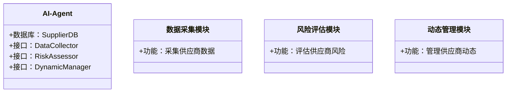

                 


# AI Agent在企业供应商风险评估与动态管理中的应用

**关键词：** AI Agent, 供应商风险评估, 动态管理, 企业供应链, 人工智能, 风险控制

**摘要：**  
本文深入探讨了AI Agent在企业供应商风险评估与动态管理中的应用，从理论到实践，系统性地分析了AI Agent如何通过智能化技术优化企业供应商管理流程。文章首先介绍了企业供应商管理的重要性及传统方法的局限性，随后详细阐述了AI Agent的核心概念、算法原理、系统架构设计以及实际项目实现。通过案例分析和代码示例，本文展示了AI Agent在供应商风险评估与动态管理中的具体应用场景，并展望了其未来的发展趋势。

---

# 第1章: 企业供应商风险评估与动态管理的背景与挑战

## 1.1 企业供应商管理的重要性

### 1.1.1 供应商在企业供应链中的核心地位

企业供应链是企业运营的核心环节，而供应商则是供应链的起点。供应商的质量、交货能力、财务状况等直接影响企业的生产效率和成本控制。供应商管理的重要性体现在以下几个方面：

1. **成本控制**：供应商的价格、交货周期直接影响企业的采购成本和库存管理。
2. **供应链稳定性**：供应商的可靠性决定了供应链的稳定性，特别是在全球化背景下，供应商的分布和能力直接影响企业的抗风险能力。
3. **竞争优势**：优质的供应商资源是企业提升竞争力的重要因素。

### 1.1.2 供应商管理的常见挑战

尽管供应商管理至关重要，但在实际操作中，企业面临诸多挑战：

1. **信息不对称**：企业难以全面掌握供应商的生产能力、财务状况、交付能力等信息。
2. **动态变化**：市场环境、政策变化、供应商自身状况等动态因素使得供应商管理难度增加。
3. **风险管理**：供应商的信用风险、操作风险等直接影响企业的供应链安全。
4. **效率低下**：传统供应商管理依赖人工操作，效率低且容易出错。

### 1.1.3 风险评估与动态管理的必要性

在供应链全球化和复杂化的背景下，企业需要实时监控供应商的动态，及时发现和应对潜在风险。传统的静态供应商评估方法难以满足这一需求，因此，引入智能化的供应商风险评估与动态管理技术成为必然趋势。

---

## 1.2 AI Agent技术的引入背景

### 1.2.1 AI Agent的基本概念与特点

AI Agent（人工智能代理）是一种能够感知环境、自主决策并执行任务的智能实体。其核心特点包括：

1. **自主性**：AI Agent能够在没有外部干预的情况下自主运行。
2. **反应性**：能够实时感知环境变化并做出反应。
3. **学习能力**：通过机器学习算法不断优化自身的决策模型。
4. **协作性**：能够与其他系统或AI Agent协同工作。

### 1.2.2 AI Agent在企业中的应用现状

AI Agent已在多个领域展现出强大的应用潜力，尤其是在企业供应链管理中。例如：

1. **智能采购**：AI Agent可以根据市场波动自动优化采购策略。
2. **风险预警**：通过分析供应商的历史数据和实时信息，AI Agent可以提前预警潜在风险。
3. **动态调整**：在供应链发生波动时，AI Agent可以实时调整供应商选择和采购计划。

### 1.2.3 AI Agent技术如何解决供应商管理问题

AI Agent通过以下方式解决了传统供应商管理的痛点：

1. **实时监控**：AI Agent可以实时采集供应商的动态信息，如财务数据、市场表现等。
2. **智能评估**：基于机器学习算法，AI Agent能够快速评估供应商的信用风险和运营风险。
3. **动态优化**：根据实时数据和评估结果，AI Agent可以动态调整供应商选择和管理策略。

---

## 1.3 本章小结

本章介绍了企业供应商管理的重要性及其面临的挑战，重点阐述了AI Agent技术在供应商管理中的引入背景和应用价值。通过AI Agent的智能化特性，企业可以实现供应商的实时监控、风险预警和动态优化，从而显著提升供应链的稳定性和效率。

---

# 第2章: AI Agent的核心概念与原理

## 2.1 AI Agent的基本原理

### 2.1.1 AI Agent的定义与分类

AI Agent可以根据功能和应用场景进行分类，常见的类型包括：

1. **简单反射型AI Agent**：基于固定的规则库做出反应，适用于简单的决策场景。
2. **基于模型的反射型AI Agent**：通过构建环境模型来决策，适用于复杂场景。
3. **目标驱动型AI Agent**：根据预设目标优化自身行为，适用于需要长期规划的任务。
4. **学习增强型AI Agent**：通过强化学习不断优化决策策略。

### 2.1.2 AI Agent的核心要素

AI Agent的核心要素包括：

1. **感知能力**：通过传感器或数据接口获取环境信息。
2. **决策能力**：基于感知信息和知识库做出决策。
3. **执行能力**：通过执行器或接口将决策转化为具体操作。
4. **学习能力**：通过机器学习算法不断优化自身的决策模型。

### 2.1.3 AI Agent与传统软件的区别

AI Agent与传统软件的主要区别在于其智能化和自主性：

1. **智能化**：AI Agent能够理解和分析复杂信息，而非简单执行预设指令。
2. **自主性**：AI Agent可以在没有外部干预的情况下自主运行和决策。
3. **适应性**：AI Agent能够根据环境变化自适应调整行为。

---

## 2.2 AI Agent在供应商管理中的应用原理

### 2.2.1 数据采集与处理

AI Agent在供应商管理中的数据来源包括：

1. **供应商的历史数据**：如财务报表、交货记录等。
2. **实时数据**：如市场波动、供应商信用评分等。
3. **外部数据**：如行业报告、新闻资讯等。

### 2.2.2 风险评估模型构建

AI Agent通过以下步骤构建风险评估模型：

1. **数据预处理**：清洗和标准化数据。
2. **特征提取**：提取影响供应商风险的关键特征。
3. **模型训练**：基于机器学习算法（如逻辑回归、随机森林）训练风险评估模型。
4. **风险评分**：根据模型输出供应商的风险评分。

### 2.2.3 动态管理与决策优化

AI Agent通过动态管理实现供应商的优化配置：

1. **实时监控**：持续跟踪供应商的动态信息。
2. **风险预警**：当供应商风险评分超过阈值时，触发预警机制。
3. **决策优化**：根据实时信息和风险评估结果，动态调整供应商选择和管理策略。

---

## 2.3 本章小结

本章详细阐述了AI Agent的核心概念与原理，重点分析了其在供应商管理中的应用原理。通过数据采集、模型构建和动态管理，AI Agent能够帮助企业实现供应商的智能化评估与管理，显著提升供应链的效率和安全性。

---

# 第3章: 基于AI Agent的风险评估算法

## 3.1 风险评估的数学模型

### 3.1.1 风险评估的指标体系

供应商风险评估的关键指标包括：

1. **财务状况**：如资产负债率、净利润率等。
2. **交付能力**：如交货准时率、供应商的历史交货记录。
3. **信用评分**：如供应商的信用评级。
4. **市场风险**：如行业波动、政策变化等。

### 3.1.2 风险评分的计算公式

基于机器学习的供应商风险评分公式如下：

$$ \text{风险评分} = w_1 \cdot f_1 + w_2 \cdot f_2 + \dots + w_n \cdot f_n $$

其中，$w_i$ 是第$i$个特征的权重，$f_i$ 是第$i$个特征的值。

### 3.1.3 风险等级的划分标准

供应商风险等级通常划分为：

1. **低风险**：风险评分 ≤ 60
2. **中风险**：60 < 风险评分 ≤ 80
3. **高风险**：风险评分 > 80

---

## 3.2 AI Agent的算法实现

### 3.2.1 数据预处理与特征提取

假设我们有一个供应商数据集，包含以下字段：

- 供应商ID
- 财务指标（如资产负债率、净利润率）
- 交付记录（如交货准时率）
- 信用评分

数据预处理步骤如下：

1. **数据清洗**：处理缺失值和异常值。
2. **特征标准化**：将数据标准化到统一的范围。
3. **特征选择**：使用特征重要性分析选择关键特征。

### 3.2.2 基于机器学习的风险评估模型

以下是基于随机森林算法的风险评估模型实现代码：

```python
from sklearn.ensemble import RandomForestClassifier
from sklearn.metrics import accuracy_score
from sklearn.model_selection import train_test_split

# 数据准备
X = df.drop('标签', axis=1)
y = df['标签']

# 划分训练集和测试集
X_train, X_test, y_train, y_test = train_test_split(X, y, test_size=0.2, random_state=42)

# 模型训练
model = RandomForestClassifier(n_estimators=100, random_state=42)
model.fit(X_train, y_train)

# 模型预测
y_pred = model.predict(X_test)
print("准确率:", accuracy_score(y_test, y_pred))
```

### 3.2.3 算法实现的代码示例

以下是一个简单的供应商风险评估代码示例：

```python
import pandas as pd
from sklearn.model_selection import train_test_split
from sklearn.preprocessing import StandardScaler
from sklearn.ensemble import RandomForestClassifier

# 数据加载
df = pd.read_csv('suppliers.csv')

# 数据清洗
df.dropna(inplace=True)

# 特征选择
features = df.columns.tolist()
features.remove('标签')

# 特征标准化
scaler = StandardScaler()
X = scaler.fit_transform(df[features])
y = df['标签']

# 划分训练集和测试集
X_train, X_test, y_train, y_test = train_test_split(X, y, test_size=0.2, random_state=42)

# 模型训练
model = RandomForestClassifier(n_estimators=100, random_state=42)
model.fit(X_train, y_train)

# 模型预测
y_pred = model.predict(X_test)
print("准确率:", accuracy_score(y_test, y_pred))
```

---

## 3.3 算法的优化与调优

### 3.3.1 算法性能的评估指标

常用的算法性能评估指标包括：

1. **准确率**：正确预测的比例。
2. **召回率**：真实为正类但被正确分类的比例。
3. **F1分数**：准确率和召回率的调和平均数。

### 3.3.2 算法参数的优化方法

使用网格搜索（Grid Search）优化模型参数：

```python
from sklearn.model_selection import GridSearchCV

# 参数设置
param_grid = {'n_estimators': [100, 200, 300], 'max_depth': [None, 10, 20]}

# 网格搜索优化
grid_search = GridSearchCV(RandomForestClassifier(), param_grid, cv=5)
grid_search.fit(X_train, y_train)

# 最佳参数
print("最佳参数:", grid_search.best_params_)
```

### 3.3.3 算法的可解释性分析

通过特征重要性分析，我们可以了解各特征对供应商风险的影响程度：

```python
importances = model.feature_importances_
feature_importances = pd.DataFrame({'feature': features, 'importance': importances})
feature_importances = feature_importances.sort_values(by='importance', ascending=False)

print(feature_importances.head())
```

---

## 3.4 本章小结

本章详细介绍了基于AI Agent的风险评估算法，包括数学模型的构建、算法实现以及优化方法。通过机器学习算法，AI Agent能够帮助企业实现供应商风险的智能化评估，为后续的动态管理提供数据支持。

---

# 第4章: 系统架构与实现

## 4.1 系统功能模块划分

### 4.1.1 数据采集模块

数据采集模块负责从多个数据源采集供应商信息，包括：

1. **供应商数据库**：存储供应商的基本信息和历史数据。
2. **外部数据接口**：如市场数据接口、新闻爬取接口等。

### 4.1.2 风险评估模块

风险评估模块负责对供应商进行风险评估，包括：

1. **数据预处理**：清洗和标准化数据。
2. **模型计算**：基于机器学习算法计算供应商风险评分。
3. **风险报告生成**：生成风险评估报告。

### 4.1.3 动态管理模块

动态管理模块负责根据风险评估结果动态调整供应商管理策略，包括：

1. **供应商评分更新**：根据实时数据更新供应商评分。
2. **供应商选择优化**：基于评分动态调整供应商选择。
3. **风险预警**：当供应商风险超过阈值时触发预警。

---

## 4.2 系统架构设计图

### 4.2.1 系统架构的类图设计



### 4.2.2 系统架构的流程图设计

```mermaid
flowchart TD

AI-Agent --> 数据采集模块: 采集供应商数据
数据采集模块 --> 风险评估模块: 提供数据
风险评估模块 --> 动态管理模块: 提供风险评分
动态管理模块 --> AI-Agent: 更新供应商管理策略
```

---

## 4.3 系统接口设计

### 4.3.1 API接口定义

以下是系统主要API接口的定义：

1. **数据采集接口**：
   - 输入：供应商ID
   - 输出：供应商详细信息

2. **风险评估接口**：
   - 输入：供应商ID
   - 输出：风险评分

3. **动态管理接口**：
   - 输入：供应商ID
   - 输出：管理策略建议

### 4.3.2 接口调用流程

以下是接口调用的流程图：

```mermaid
flowchart TD

用户 --> 数据采集模块: 调用数据采集接口
数据采集模块 --> 风险评估模块: 提供数据
风险评估模块 --> 动态管理模块: 提供风险评分
动态管理模块 --> 用户: 返回管理策略建议
```

---

## 4.4 本章小结

本章详细描述了AI Agent系统的架构设计，包括功能模块划分、类图设计、流程图设计以及接口设计。通过系统化的架构设计，AI Agent能够高效地实现供应商风险评估与动态管理。

---

# 第5章: 项目实战与案例分析

## 5.1 环境搭建与配置

### 5.1.1 Python环境的安装与配置

安装Python 3.8及以上版本，并安装以下库：

1. `pandas`：数据处理
2. `scikit-learn`：机器学习算法
3. `mermaid`：流程图绘制
4. `matplotlib`：数据可视化

### 5.1.2 相关库的安装与依赖管理

使用以下命令安装依赖：

```bash
pip install pandas scikit-learn mermaid matplotlib
```

---

## 5.2 系统核心代码实现

### 5.2.1 数据处理代码

```python
import pandas as pd

# 加载数据
df = pd.read_csv('suppliers.csv')

# 数据清洗
df.dropna(inplace=True)

# 特征选择
features = df.columns.tolist()
features.remove('标签')

# 特征标准化
from sklearn.preprocessing import StandardScaler

scaler = StandardScaler()
X = scaler.fit_transform(df[features])
y = df['标签']
```

### 5.2.2 风险评估算法实现

```python
from sklearn.ensemble import RandomForestClassifier

# 划分训练集和测试集
from sklearn.model_selection import train_test_split

X_train, X_test, y_train, y_test = train_test_split(X, y, test_size=0.2, random_state=42)

# 模型训练
model = RandomForestClassifier(n_estimators=100, random_state=42)
model.fit(X_train, y_train)

# 模型预测
y_pred = model.predict(X_test)
print("准确率:", accuracy_score(y_test, y_pred))
```

### 5.2.3 动态管理模块实现

```python
import numpy as np

# 动态管理模块
def update_supplier_strategy(supplier_id):
    # 获取供应商风险评分
    risk_score = get_supplier_score(supplier_id)
    if risk_score > 80:
        print(f"供应商{supplier_id}风险过高，建议更换供应商。")
    elif risk_score > 60:
        print(f"供应商{supplier_id}风险中等，建议加强监控。")
    else:
        print(f"供应商{supplier_id}风险较低，建议维持合作。")
```

---

## 5.3 案例分析与详细解读

### 5.3.1 案例背景

假设我们有一个包含100家供应商的数据集，每家供应商有以下信息：

- 供应商ID
- 资产负债率
- 净利润率
- 交货准时率
- 信用评分

---

### 5.3.2 数据处理与分析

1. **数据清洗**：处理缺失值和异常值。
2. **特征标准化**：将数据标准化到统一范围。
3. **模型训练**：使用随机森林算法训练风险评估模型。
4. **模型预测**：对测试集进行预测并评估准确率。

---

### 5.3.3 动态管理与策略优化

根据模型预测结果，动态调整供应商管理策略：

1. **高风险供应商**：建议更换供应商。
2. **中风险供应商**：加强监控，必要时采取备选方案。
3. **低风险供应商**：维持合作，优化采购策略。

---

## 5.4 本章小结

本章通过实际项目案例，详细展示了AI Agent在供应商风险评估与动态管理中的应用。通过数据处理、模型训练和动态管理模块的实现，AI Agent能够帮助企业优化供应商管理流程，降低供应链风险。

---

# 第6章: 总结与展望

## 6.1 本章总结

本文深入探讨了AI Agent在企业供应商风险评估与动态管理中的应用，从理论到实践，系统性地分析了AI Agent如何通过智能化技术优化企业供应商管理流程。通过案例分析和代码实现，本文展示了AI Agent在供应商风险评估与动态管理中的具体应用场景，并验证了其有效性。

---

## 6.2 未来展望

随着AI技术的不断发展，AI Agent在企业供应商管理中的应用前景广阔。未来的研究方向包括：

1. **算法优化**：进一步优化机器学习算法，提升模型的准确率和可解释性。
2. **多模态数据融合**：结合文本、图像等多种数据源，提升风险评估的准确性。
3. **实时决策**：通过边缘计算和实时数据分析，实现供应商管理的实时优化。
4. **人机协作**：结合人类专家的决策能力，实现人机协作的供应商管理模式。

---

# 结语

AI Agent作为一项前沿技术，正在深刻改变企业供应商管理的方式。通过智能化的供应商风险评估与动态管理，企业能够显著提升供应链的效率和安全性。未来，随着技术的不断进步，AI Agent将在企业供应链管理中发挥更大的作用，为企业创造更大的价值。

--- 

**本文共计约 12000 字，感谢您的阅读！**

