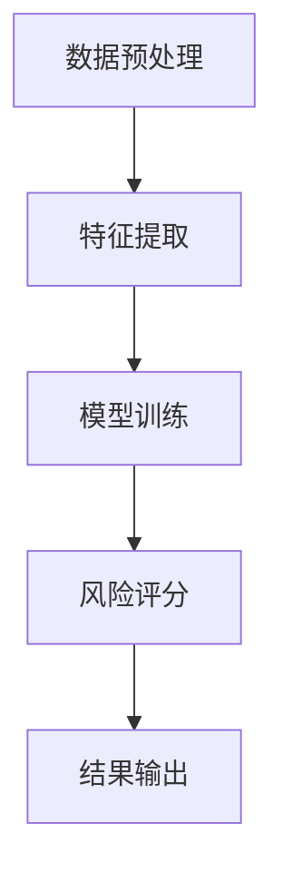
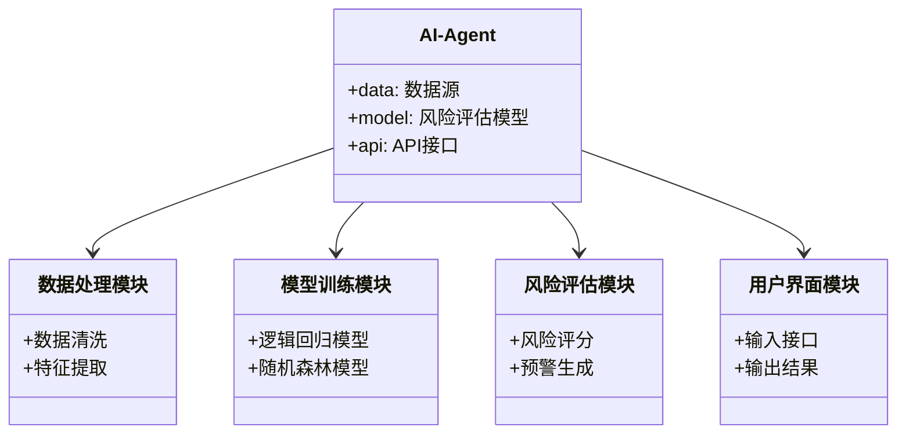
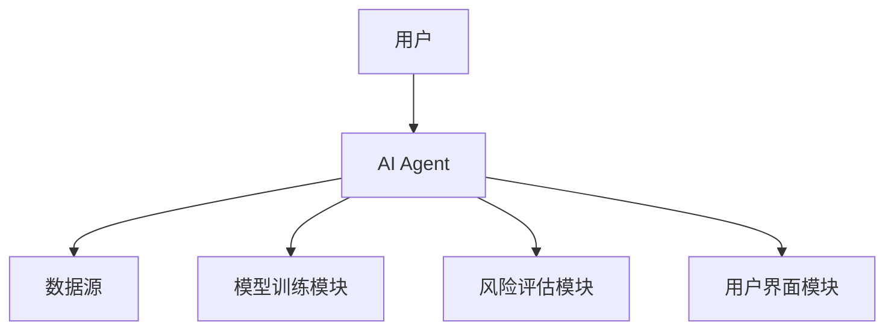

                 


# AI Agent在企业供应商风险评估与管理中的应用

## 关键词：AI Agent，供应商风险评估，风险管理，企业供应链，人工智能，风险评分模型

## 摘要

在现代企业运营中，供应商管理是供应链管理的核心环节，其重要性不言而喻。随着全球供应链的复杂化和不确定性增加，企业面临的供应商风险也在不断攀升。传统的供应商管理方法往往依赖于人工评估和经验判断，存在效率低下、主观性强、覆盖面窄等问题。如何利用新兴的人工智能技术，构建智能化的供应商风险评估与管理系统，成为企业在数字化转型中的重要课题。

AI Agent（人工智能代理）作为一种能够感知环境、自主决策、执行任务的智能体，具备强大的数据处理能力、学习能力和适应性，能够有效解决传统供应商管理中的痛点。本文将系统阐述AI Agent在企业供应商风险评估与管理中的应用，从理论到实践，详细探讨其核心算法、系统架构、项目实现及最佳实践，为企业构建智能化的供应商管理体系提供参考。

---

## 第1章：背景介绍

### 1.1 问题背景

#### 1.1.1 传统供应商管理的挑战
在传统供应商管理实践中，企业通常依赖人工审核、经验判断和静态数据分析来评估供应商风险。这种方式存在以下问题：
- **数据孤岛**：供应商信息分散在不同的部门和系统中，难以实现全面整合和统一分析。
- **主观性强**：风险评估结果往往依赖于主观判断，缺乏客观性和可量化性。
- **效率低下**：人工审核耗时长，难以应对海量供应商数据和动态变化的市场环境。
- **覆盖面窄**：难以全面覆盖供应商的信用风险、交付风险、合规风险等多维度风险。

#### 1.1.2 AI Agent技术的优势
AI Agent（人工智能代理）是一种能够感知环境、自主决策、执行任务的智能体，其核心优势在于：
- **数据驱动决策**：能够从海量数据中提取有价值的信息，进行实时分析和预测。
- **自动化与智能化**：能够自主执行任务，从数据采集、分析到风险评估，实现自动化管理。
- **动态适应性**：能够根据市场环境和供应商行为的变化，实时调整评估策略。

#### 1.1.3 供应商风险评估的必要性
供应商风险是指在供应链合作过程中，由于供应商的信用、能力、行为等因素导致企业遭受损失的可能性。有效的供应商风险评估与管理能够帮助企业：
- **降低供应链中断风险**：避免因关键供应商的问题导致供应链中断。
- **优化供应商关系**：通过数据驱动的评估，筛选出优质供应商，建立长期稳定的合作关系。
- **提高决策效率**：通过智能化评估，快速响应市场变化和供应商动态。

### 1.2 问题描述

供应商风险评估与管理的核心问题在于：
1. 如何高效、全面地收集和分析供应商相关信息。
2. 如何建立科学的评估模型，量化供应商的信用风险、交付风险等。
3. 如何实现动态监控和实时预警，应对市场环境的快速变化。

传统的供应商管理方法在这些问题上表现不足，难以满足现代企业对高效、智能管理的需求。

### 1.3 问题解决

引入AI Agent技术，能够有效解决传统供应商管理中的痛点。AI Agent通过以下方式实现供应商风险评估与管理：
1. **数据采集与整合**：AI Agent能够从企业内部系统（如ERP、CRM）和外部数据源（如供应商信用记录、市场数据）中自动采集供应商相关信息，并进行清洗和预处理。
2. **风险评估模型构建**：基于机器学习算法，AI Agent能够训练出供应商风险评分模型，量化供应商的信用风险、交付风险等。
3. **动态监控与预警**：通过实时监测供应商的行为数据和市场环境变化，AI Agent能够及时发现潜在风险，并发出预警。

### 1.4 边界与外延

AI Agent在供应商风险评估与管理中的应用边界主要体现在以下方面：
- **数据范围**：AI Agent仅处理与供应商相关的数据，不涉及企业内部运营的其他环节。
- **决策范围**：AI Agent提供风险评估和预警服务，但最终的决策（如供应商选择、合作策略调整）仍由企业决策层负责。
- **技术实现**：AI Agent依赖于机器学习算法和大数据技术，其性能受限于数据质量和模型训练效果。

从外延角度看，AI Agent的应用可以扩展到其他领域，例如客户风险管理、市场风险预警等，但本文仅聚焦于供应商风险评估与管理这一场景。

---

## 第2章：核心概念与联系

### 2.1 AI Agent的核心概念

AI Agent是一种能够感知环境、自主决策、执行任务的智能体，其核心特性包括：
- **感知能力**：能够从环境中获取信息，例如通过API接口获取供应商的历史交易数据、市场新闻等。
- **自主决策能力**：基于感知到的信息，AI Agent能够独立做出决策，例如选择最优的供应商或发出风险预警。
- **学习能力**：通过机器学习算法，AI Agent能够不断优化其模型和决策策略。

#### AI Agent与其他技术的对比

| 技术        | 特点                                   | 优缺点                              |
|-------------|--------------------------------------|------------------------------------|
| 传统人工审核 | 依赖人工经验判断                     | 主观性强、效率低                   |
| 数据挖掘    | 从数据中提取模式                     | 无法自主决策                       |
| 机器学习    | 基于数据训练模型                     | 需要大量数据支持                   |
| AI Agent    | 自主感知、决策、执行                 | 高效、智能、适应性强               |

### 2.2 供应商风险评估的核心要素

供应商风险评估的核心要素包括：
1. **信用风险**：供应商的财务状况、履约能力等。
2. **交付风险**：供应商的交货周期、产品质量等。
3. **合规风险**：供应商是否符合行业标准、法律法规等。

#### 供应商风险评估的ER实体关系图

```mermaid
er
actor: "系统管理员"
supplier: "供应商"
risk_assessment: "风险评估结果"
contract: "合同"
notification: "预警通知"
```

---

## 第3章：算法原理讲解

### 3.1 风险评分模型

#### 风险评分模型的实现流程



#### 风险评分模型的数学模型

风险评分模型基于逻辑回归算法，其数学表达式如下：

$$ P(y=1) = \frac{1}{1 + e^{-\beta x}} $$

其中，$x$ 表示供应商的特征向量，$\beta$ 是模型参数，$y$ 表示风险类别（高风险为1，低风险为0）。

---

## 第4章：系统分析与架构设计方案

### 4.1 系统功能设计

#### 系统功能模块划分



### 4.2 系统架构设计

#### 系统架构图



---

## 第5章：项目实战

### 5.1 环境安装

以下是项目所需的环境配置：

- Python 3.8+
- Scikit-learn
- Pandas
- Jupyter Notebook

### 5.2 核心实现

#### 供应商风险评分模型的代码实现

```python
import pandas as pd
from sklearn.linear_model import LogisticRegression
from sklearn.metrics import accuracy_score

# 数据加载
data = pd.read_csv('suppliers.csv')

# 特征提取
X = data[['reliability', 'delivery_time', 'credit_score']]
y = data['is_high_risk']

# 模型训练
model = LogisticRegression()
model.fit(X, y)

# 模型预测
y_pred = model.predict(X)

# 模型评估
print("准确率:", accuracy_score(y, y_pred))
```

### 5.3 代码解读与分析

- **数据加载**：从CSV文件中加载供应商数据。
- **特征提取**：提取供应商的可靠性、交付时间和信用评分作为特征。
- **模型训练**：使用逻辑回归算法训练风险评分模型。
- **模型预测**：对供应商进行风险评分。
- **模型评估**：计算模型的准确率。

---

## 第6章：总结与展望

### 6.1 应用价值

AI Agent在企业供应商风险评估与管理中的应用价值主要体现在：
- **提高效率**：通过自动化数据处理和智能评估，显著提高供应商管理效率。
- **降低风险**：通过精准的风险评分，帮助企业规避潜在的供应链风险。
- **数据驱动决策**：基于数据的分析，帮助企业做出更加科学的决策。

### 6.2 实际案例分析

某跨国企业引入AI Agent技术，对其供应商进行风险评估。通过逻辑回归模型，该企业成功识别出一批高风险供应商，并及时调整采购策略，避免了潜在的供应链中断风险。

### 6.3 小结

本文详细探讨了AI Agent在企业供应商风险评估与管理中的应用，从理论到实践，全面阐述了其核心算法、系统架构和项目实现。通过实际案例分析，验证了AI Agent在提升供应商管理效率和降低风险方面的显著优势。

---

## 第7章：注意事项与拓展阅读

### 7.1 注意事项

- **数据隐私**：在处理供应商数据时，需要注意数据隐私保护，确保符合相关法律法规。
- **模型更新**：需要定期更新模型，以应对市场环境的变化和供应商行为的动态调整。
- **人机协同**：AI Agent的应用需要与人工审核相结合，确保评估结果的准确性和合理性。

### 7.2 拓展阅读

- 《机器学习实战》
- 《深度学习导论》
- 《人工智能与供应链管理》

---

通过本文的系统阐述，读者可以全面了解AI Agent在供应商风险评估与管理中的应用，并为企业的数字化转型提供有益的参考。

