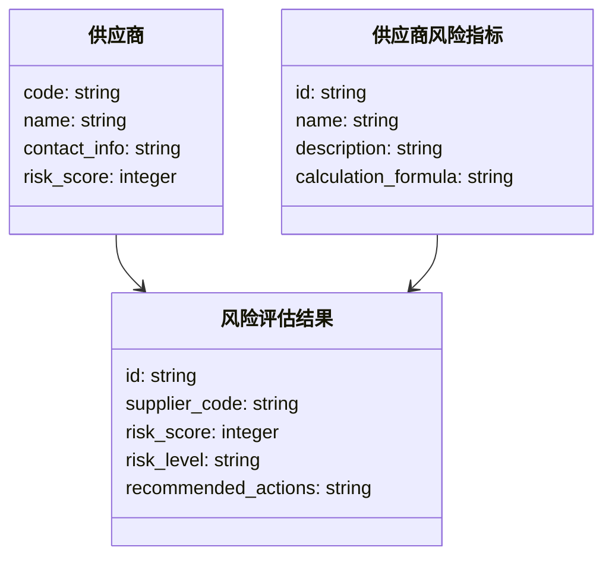

                 


# AI Agent在企业供应商风险评估与管理中的角色

**关键词**：AI Agent，供应商风险管理，企业供应链，机器学习，自然语言处理

**摘要**：随着全球供应链的复杂化，企业面临越来越多的供应商风险管理挑战。本文探讨AI Agent在供应商风险评估与管理中的角色，分析其核心概念、技术原理、系统架构，并通过实际案例展示其应用价值。通过本文，读者将了解如何利用AI技术提升供应商风险管理的效率与准确性，降低企业运营风险。

---

## 第1章: 供应商风险评估与管理的背景与挑战

### 1.1 供应商风险管理的重要性

#### 1.1.1 供应链对企业运营的核心作用
供应链是企业运营的命脉，供应商的稳定性直接影响企业的生产效率和成本控制。在当今全球化背景下，供应链的复杂性不断增加，供应商风险管理的重要性日益凸显。

#### 1.1.2 供应商风险管理的定义与目标
供应商风险管理是指通过识别、评估和控制与供应商相关的风险，确保供应链的稳定性和可持续性。其目标是降低因供应商问题导致的中断风险，优化供应链成本，并确保合规性。

#### 1.1.3 当前供应商风险管理的主要挑战
- 数据分散：供应商信息分布在不同部门和系统中，难以整合和分析。
- 风险预测滞后：传统方法依赖历史数据，无法实时捕捉市场变化和潜在风险。
- 人工评估低效：手动评估供应商风险耗时长，且容易出错。

### 1.2 企业供应商风险的主要类型

#### 1.2.1 供应链中断风险
供应商因自然灾害、疫情或其他不可抗力因素导致的供应中断，可能对企业生产造成严重损失。

#### 1.2.2 供应商财务风险
供应商财务状况不稳定，可能导致企业面临付款问题或供应链中断。

#### 1.2.3 供应商合规性风险
供应商可能违反法律法规或企业内部政策，例如劳工权益、环保要求等。

#### 1.2.4 供应商交付风险
供应商交付延迟或产品质量不符合要求，影响企业的交货时间和客户满意度。

### 1.3 传统供应商风险管理的局限性

#### 1.3.1 人工评估的低效性
传统供应商风险管理依赖人工分析，耗时长且容易受主观因素影响。

#### 1.3.2 数据孤岛与信息不透明
企业内部数据分散在不同部门，缺乏统一的数据平台，导致信息不透明。

#### 1.3.3 风险预测的滞后性
传统方法依赖历史数据，难以实时捕捉市场变化和潜在风险，导致风险应对滞后。

### 1.4 AI Agent在供应商风险管理中的应用前景

#### 1.4.1 AI技术如何赋能供应商风险管理
AI技术可以通过自动化数据处理、实时监控和智能预测，提升供应商风险管理的效率和准确性。

#### 1.4.2 AI Agent的核心优势与价值
- **自动化**：AI Agent可以自动收集、分析和处理供应商数据，减少人工干预。
- **实时性**：AI Agent能够实时监控市场动态和供应商表现，提前预警潜在风险。
- **精准性**：基于机器学习算法，AI Agent可以提供更精准的风险评估和预测。

#### 1.4.3 未来发展趋势与潜在价值
随着AI技术的不断发展，AI Agent在供应商风险管理中的应用将更加广泛，帮助企业实现智能化、数据驱动的供应链管理。

---

## 第2章: AI Agent的核心概念与技术原理

### 2.1 AI Agent的基本概念

#### 2.1.1 AI Agent的定义与分类
AI Agent是一种智能代理系统，能够感知环境、自主决策并执行任务。根据功能和应用场景，AI Agent可以分为监督学习型、强化学习型和无监督学习型。

#### 2.1.2 AI Agent的主要功能与特点
- 数据采集与处理
- 风险评估与预测
- 自动化决策与优化
- 实时监控与反馈

#### 2.1.3 AI Agent与传统软件的区别
AI Agent具备学习能力和自适应性，能够根据数据动态调整行为，而传统软件依赖预定义规则。

### 2.2 AI Agent的核心技术原理

#### 2.2.1 机器学习算法在AI Agent中的应用
机器学习算法是AI Agent的核心，用于分析供应商数据并预测潜在风险。常用算法包括线性回归、支持向量机（SVM）、随机森林和神经网络。

#### 2.2.2 自然语言处理（NLP）在供应商信息分析中的作用
NLP技术用于分析供应商的文本数据，例如新闻报道、行业报告和供应商文档，提取关键信息并评估风险。

#### 2.2.3 知识图谱与数据挖掘技术在风险评估中的应用
知识图谱用于构建供应商之间的关联关系，数据挖掘技术用于发现潜在风险模式。

### 2.3 AI Agent的系统架构

#### 2.3.1 数据采集模块
数据采集模块负责从企业内部系统和外部数据源（如新闻、社交媒体）获取供应商相关信息。

#### 2.3.2 数据处理与分析模块
数据处理模块对采集到的数据进行清洗和预处理，分析模块利用机器学习算法进行风险评估。

#### 2.3.3 风险评估与决策模块
风险评估模块基于分析结果生成风险评分，决策模块根据评分制定应对策略。

#### 2.3.4 人机交互界面
人机交互界面是用户与AI Agent的桥梁，用户可以通过界面查看风险评估结果并进行交互操作。

### 2.4 AI Agent的实体关系图（ER图）

```mermaid
erDiagram
    actor 供应商管理部 {
        role 供应商信息录入
        role 风险评估请求
    }
    actor AI Agent {
        role 数据分析请求
        role 风险评估结果展示
    }
    entity 供应商 {
        code: string
        name: string
        contact_info: string
    }
    entity 供应商风险指标 {
        id: string
        name: string
        description: string
        calculation_formula: string
    }
    entity 风险评估结果 {
        id: string
        supplier_code: string
        risk_score: integer
        risk_level: string
        recommended_actions: string
    }
    supplier-management <=> AI-Agent
    AI-Agent --> 供应商风险指标
    AI-Agent --> 风险评估结果
```

### 2.5 AI Agent的风险评估算法原理

#### 2.5.1 算法流程
1. 数据预处理：清洗和转换供应商数据，提取关键特征。
2. 模型训练：使用历史数据训练机器学习模型，如随机森林或XGBoost。
3. 风险预测：基于实时数据，模型预测供应商风险评分。
4. 风险分类：根据风险评分将供应商分为不同风险等级。

#### 2.5.2 算法实现
以下是基于随机森林算法的风险评估代码示例：

```python
import pandas as pd
from sklearn.ensemble import RandomForestClassifier
from sklearn.model_selection import train_test_split
from sklearn.metrics import accuracy_score

# 加载数据
data = pd.read_csv('suppliers.csv')

# 数据预处理
X = data.drop(columns=['risk_level'])
y = data['risk_level']

# 划分训练集和测试集
X_train, X_test, y_train, y_test = train_test_split(X, y, test_size=0.2, random_state=42)

# 初始化模型
model = RandomForestClassifier(n_estimators=100, random_state=42)

# 训练模型
model.fit(X_train, y_train)

# 预测
y_pred = model.predict(X_test)

# 评估准确率
print("Accuracy:", accuracy_score(y_test, y_pred))
```

#### 2.5.3 数学模型与公式
随机森林算法基于决策树构建多个树模型，并通过投票或加权的方式得出最终结果。其核心公式包括特征重要性计算和模型集成。

$$ \text{特征重要性} = \sum_{i=1}^{n} \text{特征贡献度} $$

$$ \text{最终预测结果} = \sum_{j=1}^{m} \text{树模型预测值} \times \text{权重} $$

---

## 第3章: 系统分析与架构设计方案

### 3.1 问题场景介绍

企业需要一个智能化的供应商风险管理平台，能够实时监控供应商风险，提供预警和优化建议。

### 3.2 系统功能设计

#### 3.2.1 领域模型类图


#### 3.2.2 系统架构设计
```mermaid
containerDiagram
    container 系统架构 {
        component 数据采集模块 {
            uses 数据源
        }
        component 数据处理模块 {
            uses 数据存储
        }
        component 风险评估模块 {
            uses 数据处理模块
            uses 模型训练模块
        }
        component 人机交互界面 {
            uses 风险评估模块
        }
    }
```

#### 3.2.3 系统接口设计
- 数据采集接口：从ERP系统获取供应商数据。
- 风险评估接口：接收供应商数据并返回风险评估结果。
- 人机交互接口：用户查看和操作风险评估结果。

#### 3.2.4 系统交互流程图
```mermaid
sequenceDiagram
    actor 用户
    actor 数据源
    component 数据采集模块
    component 数据处理模块
    component 风险评估模块
    component 人机交互界面

    用户 -> 数据采集模块: 请求供应商数据
    数据采集模块 -> 数据源: 获取供应商数据
    数据采集模块 -> 数据处理模块: 传递供应商数据
    数据处理模块 -> 风险评估模块: 请求风险评估
    风险评估模块 -> 数据处理模块: 返回风险评估结果
    数据处理模块 -> 人机交互界面: 更新用户界面
    用户 -> 人机交互界面: 查看风险评估结果
```

---

## 第4章: 项目实战与案例分析

### 4.1 环境安装与配置

安装Python、Pandas、Scikit-learn等依赖库：

```bash
pip install numpy pandas scikit-learn
```

### 4.2 系统核心实现

实现风险评估模块的代码：

```python
from sklearn.ensemble import RandomForestClassifier
from sklearn.metrics import accuracy_score
import pandas as pd

# 加载数据
data = pd.read_csv('suppliers.csv')

# 数据预处理
X = data.drop(columns=['risk_level'])
y = data['risk_level']

# 划分训练集和测试集
X_train, X_test, y_train, y_test = train_test_split(X, y, test_size=0.2, random_state=42)

# 初始化模型
model = RandomForestClassifier(n_estimators=100, random_state=42)

# 训练模型
model.fit(X_train, y_train)

# 预测
y_pred = model.predict(X_test)

# 评估准确率
print("Accuracy:", accuracy_score(y_test, y_pred))
```

### 4.3 案例分析

以某制造企业为例，分析AI Agent如何帮助其实现供应商风险管理：

1. **数据采集**：从ERP系统获取供应商数据，包括供应商代码、名称、联系信息和历史交货记录。
2. **数据处理**：清洗数据并提取关键特征，如交货准时率、财务状况和合规性记录。
3. **风险评估**：基于随机森林算法，模型预测供应商的风险评分，并生成风险报告。
4. **优化建议**：根据风险评分，系统推荐优化措施，如更换高风险供应商或增加备选供应商。

---

## 第5章: 最佳实践与总结

### 5.1 小结

AI Agent通过自动化数据处理、实时监控和智能预测，显著提升了供应商风险管理的效率和准确性。企业可以利用AI技术优化供应链管理，降低运营风险。

### 5.2 注意事项

- 数据隐私与安全：确保供应商数据的安全性和合规性。
- 模型可解释性：避免过于复杂的模型导致决策不可解释。
- 持续优化：定期更新模型和数据，确保风险评估的准确性。

### 5.3 拓展阅读

- 《机器学习实战》：深入理解机器学习算法的应用。
- 《数据驱动的供应链管理》：探讨数据在供应链管理中的应用。

---

## 结语

随着AI技术的不断发展，AI Agent在企业供应商风险管理中的应用前景广阔。通过自动化、实时性和精准性，AI Agent帮助企业优化供应链管理，降低风险，提升竞争力。未来，随着技术的进一步成熟，AI Agent将在更多领域发挥重要作用。

