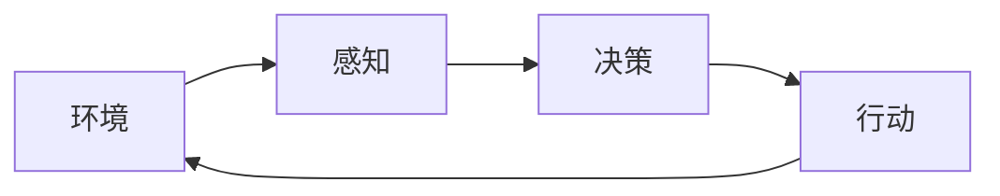
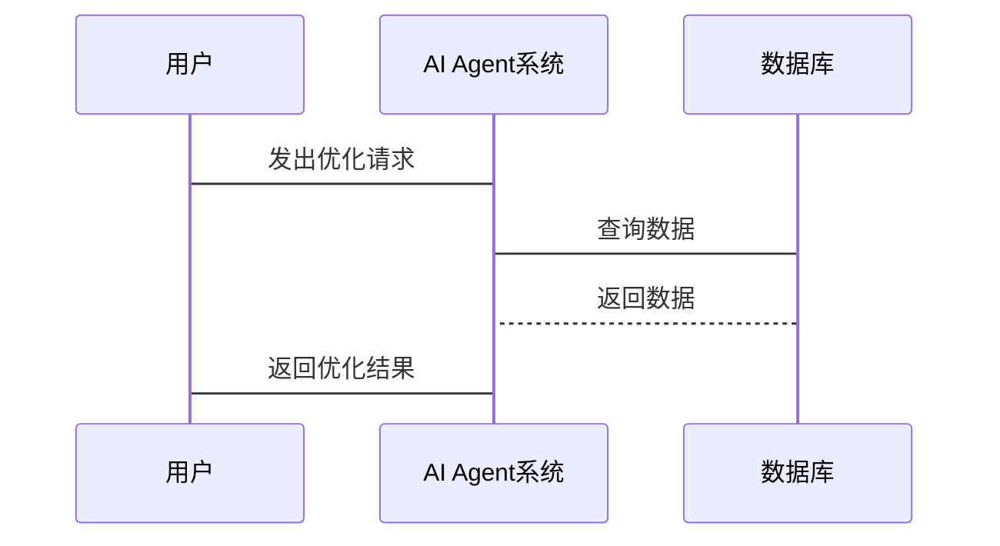

                 


# AI Agent在企业供应链优化中的角色与实践

## 关键词：AI Agent, 供应链优化, 强化学习, 多智能体协作, 企业供应链管理

## 摘要：本文深入探讨了AI Agent在企业供应链优化中的应用及其实践。从AI Agent的基本概念和核心原理出发，结合具体的算法和系统架构，分析了其在供应链优化中的优势和应用场景。通过项目实战和案例分析，详细解读了AI Agent如何助力企业实现高效供应链管理，并提出了相关最佳实践和未来发展方向。

---

# 第1章: 供应链优化与AI Agent的背景介绍

## 1.1 供应链优化的基本概念

### 1.1.1 供应链的基本组成与功能

供应链是一个复杂的系统，包括供应商、制造商、分销商、零售商和消费者等角色。其功能涵盖采购、生产、库存管理、物流配送等环节，目标是实现资源的高效配置和成本最小化。

### 1.1.2 供应链优化的目标与意义

供应链优化旨在通过协调各环节的活动，提升整体效率，降低成本，提高客户满意度。其意义在于帮助企业增强竞争力，快速响应市场需求，优化资源配置。

### 1.1.3 传统供应链优化的挑战与局限性

传统供应链优化依赖人工决策和静态模型，存在灵活性差、实时性弱、难以应对不确定性等问题。例如，传统预测模型难以处理需求波动，导致库存积压或缺货。

---

## 1.2 AI Agent的核心概念与技术特点

### 1.2.1 AI Agent的定义与分类

AI Agent是指能够感知环境、自主决策并采取行动的智能体。根据智能体的协作方式，可以分为单一智能体和多智能体系统。

### 1.2.2 AI Agent在供应链优化中的优势

AI Agent能够实时感知环境变化，通过学习和自适应优化决策，显著提升了供应链的响应速度和灵活性。

### 1.2.3 AI Agent与传统优化算法的对比

AI Agent在动态环境下的适应能力和实时决策能力是传统算法难以比拟的。

---

## 1.3 企业供应链优化中的AI Agent应用场景

### 1.3.1 需求预测与库存优化

AI Agent通过历史数据分析和机器学习模型，准确预测需求，优化库存水平。

### 1.3.2 采购与供应商管理

AI Agent协助企业选择最优供应商，优化采购计划，降低采购成本。

### 1.3.3 生产调度与物流规划

AI Agent优化生产排产和物流路径，提升效率，降低成本。

---

# 第2章: AI Agent的核心概念与原理

## 2.1 AI Agent的基本原理

### 2.1.1 AI Agent的感知与决策机制

AI Agent通过传感器或数据源获取环境信息，利用算法进行分析，做出决策并执行行动。

### 2.1.2 AI Agent的学习与自适应能力

基于强化学习和深度学习，AI Agent能够不断优化决策策略。

### 2.1.3 AI Agent的多智能体协作

多智能体系统通过协调合作，实现复杂供应链问题的最优解。

---

## 2.2 AI Agent在供应链优化中的数学模型与算法

### 2.2.1 基于强化学习的AI Agent优化

强化学习通过奖励机制，训练AI Agent做出最优决策。



### 2.2.2 遗传算法在供应链优化中的应用

遗传算法模拟生物进化过程，用于优化供应链中的路径规划。

```python
import numpy as np

def fitness_func(solution):
    # 计算适应度
    return -np.sum(solution)

def genetic_algorithm(population_size, generations):
    for _ in range(generations):
        # 选择、交叉、变异
        pass
```

### 2.2.3 群智能算法（如Ant Colony）

基于蚂蚁觅食行为的算法，优化路径选择。

```python
def ant_colony Optimization(n_ants, n_iterations):
    for _ in range(n_iterations):
        for ant in range(n_ants):
            # 选择路径
            pass
```

---

# 第3章: 供应链优化中的系统架构与设计

## 3.1 系统功能模块设计

### 3.1.1 需求预测模块

基于历史数据和机器学习模型，预测未来需求。

### 3.1.2 采购与供应商管理模块

优化采购计划，评估供应商绩效。

### 3.1.3 生产调度模块

优化生产排产，提高效率。

### 3.1.4 物流与库存管理模块

优化库存水平和物流路径。

---

## 3.2 系统架构设计


---

## 3.3 系统接口与交互设计



---

# 第4章: 项目实战与案例分析

## 4.1 项目环境与工具安装

安装Python、TensorFlow、Scikit-learn等工具。

## 4.2 系统核心实现

### 4.2.1 需求预测代码实现

```python
import pandas as pd
from sklearn.ensemble import RandomForestRegressor

data = pd.read_csv('demand.csv')
X = data[['price', 'promotion']]
y = data['demand']

model = RandomForestRegressor()
model.fit(X, y)
```

### 4.2.2 采购优化代码实现

```python
import numpy as np
from sklearn.linear_model import LinearRegression

X = np.array([[price1, supplier1], [price2, supplier2]])
y = np.array([cost1, cost2])

model = LinearRegression()
model.fit(X, y)
```

## 4.3 案例分析与结果解读

分析预测结果和优化建议，评估系统性能。

---

# 第5章: 最佳实践与未来展望

## 5.1 最佳实践

### 5.1.1 数据质量的重要性

确保数据的准确性和完整性。

### 5.1.2 模型调优与评估

通过交叉验证优化模型性能。

## 5.2 小结与注意事项

AI Agent的应用需结合企业实际情况，注重数据安全和隐私保护。

## 5.3 未来展望

随着AI技术的发展，AI Agent在供应链优化中的应用将更加广泛和深入。

---

# 结语

AI Agent技术正在改变企业供应链管理的方式，通过实时感知、智能决策和优化执行，帮助企业实现高效供应链管理。未来，随着技术的进步，AI Agent将在供应链优化中发挥更大的作用。

--- 

# 参考文献

[此处列出相关文献和资源]

