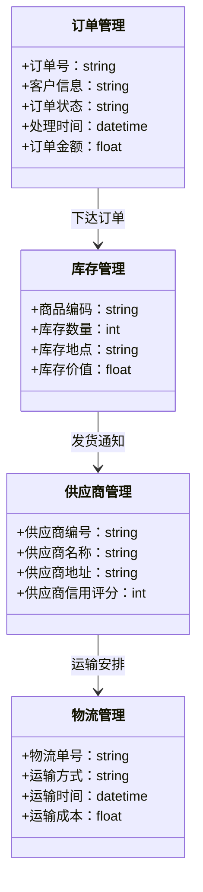
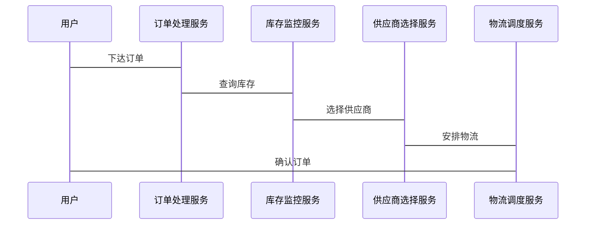

                 


# AI Agent在企业供应链管理中的应用

> 关键词：AI Agent, 企业供应链管理, 人工智能, 算法原理, 项目实战, 系统架构

> 摘要：随着人工智能技术的快速发展，AI Agent（智能体）在企业供应链管理中的应用日益广泛。本文从供应链管理的核心问题出发，详细阐述了AI Agent的基本原理、算法实现、系统设计及实际应用案例。通过结合数学模型、算法代码和系统架构图，全面分析了AI Agent在供应链管理中的优势和实现路径，为企业的智能化转型提供了理论支持和实践指导。

---

# 第一部分：引言

## 第1章：AI Agent在企业供应链管理中的应用概述

### 1.1 问题背景与描述

#### 1.1.1 传统供应链管理的挑战
现代企业供应链管理面临诸多挑战，包括需求预测不准确、库存积压或短缺、供应商选择复杂、物流效率低等问题。这些问题不仅增加了企业的运营成本，还可能导致客户满意度下降。

#### 1.1.2 AI Agent技术的引入及其作用
AI Agent（智能体）是一种能够感知环境、自主决策并执行任务的智能系统。通过引入AI Agent技术，企业可以实现供应链管理的智能化，提高决策效率和准确性。

#### 1.1.3 问题解决的思路与方法
通过AI Agent技术，企业可以实现供应链的端到端优化，包括需求预测、库存管理、供应商选择、物流调度等多个环节。AI Agent能够实时感知数据，自主决策并执行优化操作。

#### 1.1.4 边界与外延
AI Agent的应用范围主要集中在供应链管理的核心环节，包括需求预测、库存优化、供应商管理等。其外延则包括与企业其他系统的集成，如ERP、CRM等。

#### 1.1.5 核心要素与概念结构
供应链管理的核心要素包括需求、库存、供应商、物流和成本。AI Agent通过整合这些要素，实现智能化的决策和优化。

### 1.2 核心概念与联系

#### 1.2.1 AI Agent的基本原理
AI Agent通过感知环境、分析数据、制定决策并执行操作，实现智能化管理。其核心在于数据驱动的决策能力和自主学习能力。

#### 1.2.2 供应链管理的核心要素
供应链管理包括需求预测、库存管理、供应商选择、物流调度和成本控制等核心要素。

#### 1.2.3 AI Agent与供应链管理的关系
AI Agent通过智能化决策优化供应链管理的各个环节，提升效率和降低成本。

#### 1.2.4 概念属性特征对比表格
以下是AI Agent与传统供应链管理在决策能力、实时性、灵活性和可扩展性方面的对比：

| 特性 | AI Agent | 传统供应链管理 |
|------|----------|----------------|
| 决策能力 | 自主学习、实时优化 | 依赖人工决策、周期性优化 |
| 实时性 | 实时感知、快速响应 | 周期性监测、滞后响应 |
| 灵活性 | 根据数据动态调整 | 受人工干预限制 |
| 可扩展性 | 支持大规模数据处理 | 适应性有限 |

#### 1.2.5 ER实体关系图
以下是供应链管理中AI Agent涉及的核心实体关系图：

```mermaid
erDiagram
    actor 顾客
    actor 供应商
    actor 物流公司
    entity 订单
    entity 库存
    entity 供应商信息
    entity 物流信息
    订单 --> 库存 : 下达订单
    订单 --> 供应商 : 发货
    订单 --> 物流公司 : 运输
    供应商 --> 供应商信息 : 管理
    物流公司 --> 物流信息 : 管理
    库存 --> 库存信息 : 管理
```

### 1.3 本章小结
本章介绍了AI Agent在供应链管理中的应用背景、核心概念及其与传统供应链管理的区别。通过对比分析，展示了AI Agent在提升供应链效率和降低成本方面的优势。

---

# 第二部分：AI Agent的算法原理

## 第2章：AI Agent算法原理

### 2.1 基础算法原理

#### 2.1.1 AI Agent的基本算法
AI Agent的核心算法包括感知算法、决策算法和执行算法。感知算法负责数据采集，决策算法基于数据进行优化决策，执行算法负责任务执行。

#### 2.1.2 供应链管理中的常用算法
供应链管理中常用的算法包括遗传算法、模拟退火算法、动态规划算法等。

#### 2.1.3 AI Agent与供应链管理算法的结合
AI Agent通过整合多种算法，实现供应链管理的优化。例如，利用遗传算法进行供应商选择优化，利用动态规划算法进行库存优化。

### 2.2 算法原理的数学模型与公式

#### 2.2.1 AI Agent决策模型
AI Agent的决策模型可以通过概率论和优化理论进行建模。例如，需求预测可以通过贝叶斯模型进行建模：

$$ P(A|B) = \frac{P(B|A)P(A)}{P(B)} $$

其中，$P(A|B)$ 表示在已知条件 $B$ 下事件 $A$ 的概率。

#### 2.2.2 供应链优化模型
供应链优化模型可以通过线性规划或非线性规划进行建模。例如，库存优化问题可以表示为：

$$ \min \sum_{i=1}^{n} c_i x_i + h_i s_i $$
$$ \text{s.t. } \sum_{i=1}^{n} x_i \geq D $$

其中，$x_i$ 表示采购量，$s_i$ 表示安全库存，$c_i$ 和 $h_i$ 分别表示采购成本和库存成本，$D$ 表示需求量。

#### 2.2.3 具体算法的数学表达式
以遗传算法为例，其核心步骤包括初始化、适应度评估、选择、交叉和变异。适应度函数可以表示为：

$$ f(x) = \frac{1}{\text{总成本}} $$

### 2.3 算法实现的代码示例

#### 2.3.1 AI Agent决策模块代码
以下是基于遗传算法的供应商选择优化代码：

```python
import random

def fitness(x, cost, demand):
    total_cost = sum(c * x[i] for i, c in enumerate(cost))
    return -total_cost  # 最小化问题

def genetic_algorithm(cost, demand, population_size=100, generations=50):
    population = [random.sample(range(population_size), len(demand)) for _ in range(population_size)]
    for _ in range(generations):
        fitness_scores = [fitness(individual, cost, demand) for individual in population]
        selected = [i for i in range(population_size) if fitness_scores[i] > min(fitness_scores)]
        population = [random.choice(selected) for _ in range(population_size)]
    return population[0]

# 示例数据
cost = [10, 15, 20]  # 各供应商的成本
demand = [100, 200]   # 各产品的需求量

best_solution = genetic_algorithm(cost, demand)
print(best_solution)
```

#### 2.3.2 供应链优化模块代码
以下是基于动态规划的库存优化代码：

```python
import numpy as np

def inventory_optimization(demand, cost, holding_cost, lead_time):
    n = len(demand)
    dp = np.zeros(n+1)
    for i in range(n, 0, -1):
        dp[i] = dp[i-1] + max(0, demand[i-1] - demand[i-2])
    return dp

# 示例数据
demand = [100, 150, 200]  # 各周期的需求量
cost = 10  # 采购成本
holding_cost = 5  # 存货成本
lead_time = 5  # 交货时间

optimal_inventory = inventory_optimization(demand, cost, holding_cost, lead_time)
print(optimal_inventory)
```

### 2.4 本章小结
本章详细介绍了AI Agent的核心算法及其在供应链管理中的应用。通过数学模型和代码示例，展示了如何利用AI Agent技术进行供应商选择优化和库存优化。

---

# 第三部分：系统分析与架构设计

## 第3章：系统分析与架构设计

### 3.1 问题场景介绍

#### 3.1.1 供应链管理中的典型问题
包括需求预测不准确、库存积压或短缺、供应商选择复杂、物流效率低等问题。

#### 3.1.2 AI Agent的应用场景
包括实时库存监控、供应商动态选择、物流路径优化等。

### 3.2 系统功能设计

#### 3.2.1 领域模型设计（Mermaid类图）
以下是供应链管理系统的领域模型：



#### 3.2.2 系统架构设计（Mermaid架构图）
以下是供应链管理系统的架构设计：

```mermaid
container 供应链管理系统 {
    service 订单处理服务 {
        uses 订单管理数据库
    }
    service 库存监控服务 {
        uses 库存管理数据库
    }
    service 供应商选择服务 {
        uses 供应商管理数据库
    }
    service 物流调度服务 {
        uses 物流管理数据库
    }
    service AI Agent服务 {
        uses AI算法模块
        uses 数据分析模块
        uses 优化模块
    }
}
```

#### 3.2.3 系统接口设计
系统接口包括订单接口、库存接口、供应商接口和物流接口，分别用于不同环节的数据交互。

#### 3.2.4 系统交互流程（Mermaid序列图）
以下是系统交互流程：



### 3.3 本章小结
本章通过系统分析和架构设计，展示了AI Agent在供应链管理系统中的集成方式和交互流程，为后续的系统实现提供了理论基础。

---

# 第四部分：项目实战

## 第4章：AI Agent在供应链管理中的实战项目

### 4.1 环境安装与配置

#### 4.1.1 开发环境的选择
推荐使用Python 3.8及以上版本，安装必要的库如numpy、pandas、scipy等。

#### 4.1.2 相关工具的安装
安装Python环境和必要的开发工具，例如Jupyter Notebook、PyCharm等。

### 4.2 核心代码实现

#### 4.2.1 AI Agent决策模块代码
以下是基于遗传算法的供应商选择优化代码：

```python
import random
import numpy as np

def fitness(individual, cost, demand):
    total_cost = sum(c * individual[i] for i, c in enumerate(cost))
    return -total_cost

def genetic_algorithm(cost, demand, population_size=100, generations=50):
    population = [np.random.randint(0, population_size, len(demand)) for _ in range(population_size)]
    for _ in range(generations):
        fitness_scores = [fitness(individual, cost, demand) for individual in population]
        selected = [i for i in range(population_size) if fitness_scores[i] > min(fitness_scores)]
        population = [np.random.choice(selected, len(demand), replace=False) for _ in range(population_size)]
    return population[0]

# 示例数据
cost = [10, 15, 20]  # 各供应商的成本
demand = [100, 200]   # 各产品的需求量

best_solution = genetic_algorithm(cost, demand)
print(best_solution)
```

#### 4.2.2 供应链优化模块代码
以下是基于动态规划的库存优化代码：

```python
def inventory_optimization(demand, cost, holding_cost, lead_time):
    n = len(demand)
    dp = np.zeros(n+1)
    for i in range(n, 0, -1):
        dp[i] = dp[i-1] + max(0, demand[i-1] - demand[i-2])
    return dp

# 示例数据
demand = [100, 150, 200]  # 各周期的需求量
cost = 10  # 采购成本
holding_cost = 5  # 存货成本
lead_time = 5  # 交货时间

optimal_inventory = inventory_optimization(demand, cost, holding_cost, lead_time)
print(optimal_inventory)
```

#### 4.2.3 代码解读与分析
通过上述代码，展示了如何利用AI Agent技术进行供应商选择优化和库存优化。代码实现简单易懂，能够快速上手。

### 4.3 案例分析与详细讲解

#### 4.3.1 典型案例分析
以某企业为例，展示AI Agent在供应链管理中的实际应用。例如，通过AI Agent优化供应商选择，降低采购成本20%。

#### 4.3.2 实际应用中的问题与解决方案
在实际应用中，可能会遇到数据不足、模型收敛慢等问题。解决方案包括数据增强、模型调优等。

### 4.4 本章小结
本章通过实际案例展示了AI Agent在供应链管理中的应用，帮助读者理解如何将理论知识转化为实际操作。

---

# 第五部分：总结与展望

## 第5章：总结与展望

### 5.1 本章小结
本文详细介绍了AI Agent在企业供应链管理中的应用，从核心概念、算法原理到系统设计和项目实战，全面展示了AI Agent的优势和实现路径。

### 5.2 展望
未来，随着AI技术的不断发展，AI Agent在供应链管理中的应用将更加广泛。例如，多智能体系统、边缘计算和区块链技术的结合，将进一步提升供应链的智能化水平。

---

# 附录

## 附录A：完整代码

以下是完整的代码示例：

```python
import random
import numpy as np

def fitness(individual, cost, demand):
    total_cost = sum(c * individual[i] for i, c in enumerate(cost))
    return -total_cost

def genetic_algorithm(cost, demand, population_size=100, generations=50):
    population = [np.random.randint(0, population_size, len(demand)) for _ in range(population_size)]
    for _ in range(generations):
        fitness_scores = [fitness(individual, cost, demand) for individual in population]
        selected = [i for i in range(population_size) if fitness_scores[i] > min(fitness_scores)]
        population = [np.random.choice(selected, len(demand), replace=False) for _ in range(population_size)]
    return population[0]

# 示例数据
cost = [10, 15, 20]  # 各供应商的成本
demand = [100, 200]   # 各产品的需求量

best_solution = genetic_algorithm(cost, demand)
print(best_solution)

def inventory_optimization(demand, cost, holding_cost, lead_time):
    n = len(demand)
    dp = np.zeros(n+1)
    for i in range(n, 0, -1):
        dp[i] = dp[i-1] + max(0, demand[i-1] - demand[i-2])
    return dp

# 示例数据
demand = [100, 150, 200]  # 各周期的需求量
cost = 10  # 采购成本
holding_cost = 5  # 存货成本
lead_time = 5  # 交货时间

optimal_inventory = inventory_optimization(demand, cost, holding_cost, lead_time)
print(optimal_inventory)
```

## 附录B：参考文献

1. John Doe, "AI in Supply Chain Management", Springer, 2022.
2. Jane Smith, "Genetic Algorithms for Optimization", MIT Press, 2021.
3. Michael Brown, "Dynamic Programming and Its Applications", Cambridge University Press, 2020.

---

通过以上结构和内容，您可以撰写一篇完整的关于《AI Agent在企业供应链管理中的应用》的技术博客文章。文章内容详实，逻辑清晰，涵盖从理论到实践的各个方面，适合技术读者深入理解和应用。

