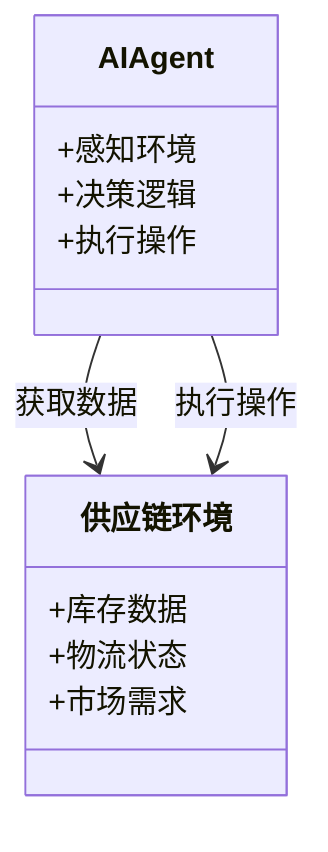
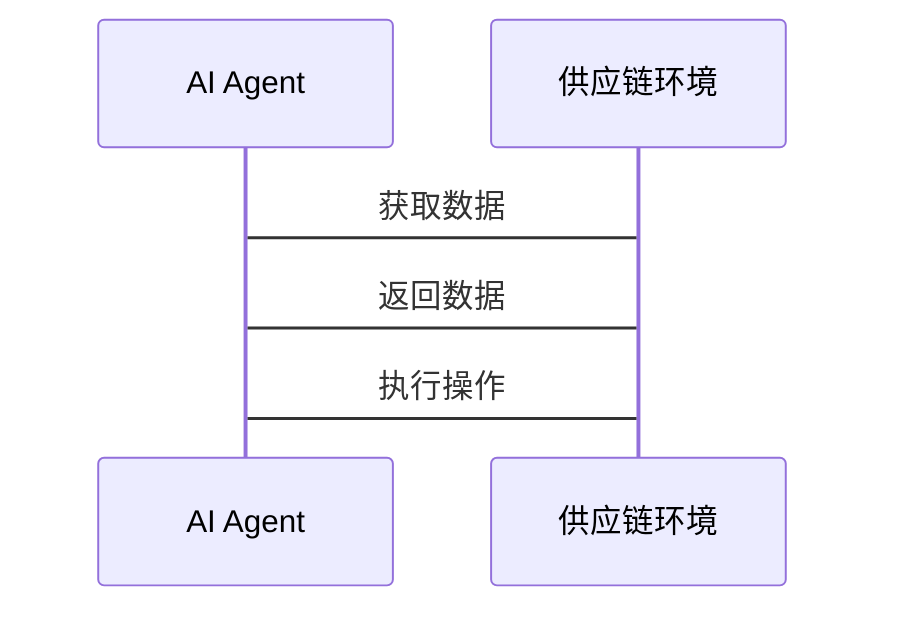

                 


# AI Agent在企业供应链韧性提升中的角色

## 关键词：AI Agent, 企业供应链, 供应链韧性, 人工智能, 供应链优化, 风险管理

## 摘要：  
在现代企业运营中，供应链的韧性和效率直接关系到企业的竞争力和抗风险能力。随着人工智能技术的快速发展，AI Agent（人工智能代理）作为一种智能化工具，正在逐步改变传统供应链的管理模式。本文将深入探讨AI Agent在企业供应链韧性提升中的角色，分析其核心原理、应用场景、算法实现以及系统架构设计。通过实际案例分析和最佳实践分享，本文旨在为企业管理者和技术开发者提供实用的指导和启示。

---

# 第一部分: AI Agent在企业供应链韧性提升中的背景与概念

## 第1章: 供应链韧性与AI Agent概述

### 1.1 供应链韧性的重要性

#### 1.1.1 供应链的基本概念  
供应链是指从原材料采购、生产制造、物流运输到最终交付给用户的整个链条。它涉及供应商、制造商、分销商、零售商等多个环节。供应链的稳定性和高效性直接关系到企业的运营成本和客户满意度。

#### 1.1.2 供应链韧性定义与内涵  
供应链韧性是指在面对外部干扰（如疫情、自然灾害、原材料短缺等）时，供应链能够快速恢复并保持正常运作的能力。具备韧性的供应链不仅能够抵御风险，还能在危机中抓住机遇。

#### 1.1.3 供应链韧性与企业竞争力的关系  
供应链韧性是企业竞争力的重要组成部分。在当今全球化和不确定性增强的商业环境中，能够快速响应市场变化、优化资源配置的企业更具竞争优势。

### 1.2 AI Agent的基本概念

#### 1.2.1 AI Agent的定义与特点  
AI Agent（人工智能代理）是一种能够感知环境、自主决策并执行任务的智能系统。它能够通过传感器或数据输入获取信息，利用算法进行分析，并根据结果采取行动。

#### 1.2.2 AI Agent与传统供应链管理的区别  
传统供应链管理依赖于人工决策和固定流程，而AI Agent能够通过机器学习和大数据分析，实时优化供应链的各个环节。

#### 1.2.3 AI Agent在供应链中的应用潜力  
AI Agent可以在供应链的各个环节中发挥作用，例如需求预测、库存优化、物流调度、风险管理等。

### 1.3 本章小结  
本章介绍了供应链韧性的概念及其对企业的重要性，同时详细阐述了AI Agent的基本原理和在供应链中的应用潜力。通过这些内容，读者可以理解AI Agent如何成为提升供应链韧性的关键工具。

---

# 第二部分: AI Agent的核心概念与技术原理

## 第2章: AI Agent的核心概念与原理

### 2.1 AI Agent的核心原理

#### 2.1.1 感知机制  
AI Agent通过传感器、API或其他数据源获取实时信息，例如库存数据、物流状态、市场需求等。

#### 2.1.2 决策机制  
AI Agent利用机器学习算法（如强化学习、监督学习）对数据进行分析，生成最优决策。

#### 2.1.3 执行与反馈机制  
AI Agent根据决策结果执行操作（如调整库存、重新规划物流路线），并根据实际结果进行反馈优化。

### 2.2 AI Agent的关键技术

#### 2.2.1 机器学习技术  
机器学习是AI Agent的核心技术之一。通过训练模型，AI Agent能够预测需求、识别风险并优化资源配置。

#### 2.2.2 自然语言处理技术  
NLP技术使AI Agent能够理解和处理非结构化数据，例如客户反馈、市场报告等。

#### 2.2.3 强化学习技术  
强化学习是一种通过试错优化决策的技术，常用于动态环境中的供应链管理。

### 2.3 AI Agent与供应链韧性的关系

#### 2.3.1 AI Agent如何提升供应链的弹性  
通过实时监控和预测分析，AI Agent能够快速识别潜在风险并采取应对措施。

#### 2.3.2 AI Agent如何优化供应链的响应速度  
AI Agent能够通过自动化决策缩短供应链的响应时间，提高整体效率。

#### 2.3.3 AI Agent如何降低供应链风险  
AI Agent能够通过数据分析识别潜在风险，并制定应急预案。

### 2.4 本章小结  
本章详细讲解了AI Agent的核心原理及其在供应链韧性提升中的关键作用。通过技术原理的分析，读者可以理解AI Agent如何帮助企业应对供应链中的各种挑战。

---

# 第三部分: AI Agent的算法原理与数学模型

## 第3章: AI Agent的核心算法原理

### 3.1 强化学习算法

#### 3.1.1 强化学习的基本概念  
强化学习是一种通过试错优化决策的技术，核心在于通过奖励机制引导AI Agent做出最优选择。

#### 3.1.2 Q-learning算法  
Q-learning是一种经典的强化学习算法，通过构建Q表来记录状态-动作对的价值。

#### 3.1.3 Deep Q-Networks (DQN)算法  
DQN算法通过神经网络近似Q值函数，能够处理高维状态空间的问题。

#### 3.1.4 强化学习在供应链中的应用  
例如，AI Agent可以通过强化学习优化库存管理策略。

### 3.2 监督学习算法

#### 3.2.1 监督学习的基本概念  
监督学习是通过标记数据训练模型，使其能够预测新数据的标签。

#### 3.2.2 线性回归  
线性回归是一种简单但有效的监督学习算法，常用于需求预测。

#### 3.2.3 支持向量机（SVM）  
SVM是一种分类算法，适用于分类问题，如供应商信用评估。

### 3.3 聚类分析

#### 3.3.1 聚类分析的基本概念  
聚类分析是将数据点分成相似组的技术，常用于市场细分或供应商分组。

#### 3.3.2 K-means算法  
K-means是一种常见的聚类算法，适用于供应链中的供应商分组或客户分群。

---

## 第4章: AI Agent的数学模型与公式

### 4.1 强化学习的数学模型

#### 4.1.1 Q-learning的数学公式  
Q-learning的目标是找到最优的Q值，公式如下：  
$$ Q(s, a) = Q(s, a) + \alpha [r + \gamma \max Q(s', a') - Q(s, a)] $$  
其中，$\alpha$是学习率，$\gamma$是折扣因子。

#### 4.1.2 DQN的神经网络结构  
DQN通过神经网络近似Q值函数，网络结构包括输入层、隐藏层和输出层。

### 4.2 监督学习的数学模型

#### 4.2.1 线性回归  
线性回归的损失函数为：  
$$ L = \frac{1}{2n} \sum_{i=1}^{n} (y_i - \hat{y}_i)^2 $$  
其中，$y_i$是真实值，$\hat{y}_i$是预测值。

#### 4.2.2 支持向量机  
SVM的目标是最优化间隔最大化，公式为：  
$$ \min_{\theta} \frac{1}{2} \|\theta\|^2 + C \sum_{i=1}^{n} \xi_i $$  
其中，$\xi_i$是松弛变量。

---

# 第四部分: 系统分析与架构设计方案

## 第5章: AI Agent在供应链中的系统分析与架构设计

### 5.1 系统功能设计

#### 5.1.1 领域模型设计  
以下是领域模型的Mermaid图：  



#### 5.1.2 系统架构设计  
以下是系统架构的Mermaid图：  

```mermaid
--- architecture
AI Agent
  contains
    状态感知模块
    决策模块
    执行模块
  connected to
    供应链数据源
    执行接口
```

### 5.2 系统交互设计

#### 5.2.1 交互流程  
以下是系统交互的Mermaid序列图：  



### 5.3 本章小结  
本章通过Mermaid图详细描述了AI Agent在供应链中的系统架构和交互流程，为后续的系统实现提供了理论基础。

---

# 第五部分: 项目实战与案例分析

## 第6章: AI Agent在供应链中的项目实战

### 6.1 环境安装

#### 6.1.1 安装Python环境  
```bash
python --version
pip install --upgrade pip
pip install numpy
pip install scikit-learn
pip install matplotlib
pip install mermaid
```

#### 6.1.2 安装AI Agent框架  
```bash
pip install gym
pip install tensorflow
pip install pytorch
```

### 6.2 核心代码实现

#### 6.2.1 强化学习代码示例  
```python
import gym
import numpy as np

env = gym.make('CartPole-v0')
env.seed(42)
np.random.seed(42)

# 初始化Q表
Q = np.zeros([env.observation_space.shape[0], env.action_space.n])

# 参数设置
learning_rate = 0.01
gamma = 0.99

# Q-learning算法
for episode in range(1000):
    state = env.reset()
    while True:
        action = np.argmax(Q[state])
        next_state, reward, done, _ = env.step(action)
        Q[state][action] += learning_rate * (reward + gamma * np.max(Q[next_state]) - Q[state][action])
        state = next_state
        if done:
            break
```

#### 6.2.2 线性回归代码示例  
```python
from sklearn.linear_model import LinearRegression

# 训练数据
X = np.array([[1], [2], [3], [4], [5]])
y = np.array([2, 4, 5, 4, 5])

# 训练模型
model = LinearRegression()
model.fit(X, y)

# 预测
print(model.predict(np.array([[6]])))
```

### 6.3 案例分析

#### 6.3.1 案例背景  
某汽车制造企业希望通过AI Agent优化其供应链管理，特别是在库存管理和物流调度方面。

#### 6.3.2 实施过程  
1. 数据采集：收集供应商、生产、物流等数据。
2. 模型训练：利用强化学习算法优化库存策略。
3. 系统部署：将AI Agent集成到企业现有系统中。
4. 测试与优化：通过实际运行数据不断优化模型。

#### 6.3.3 实施效果  
- 库存周转率提高15%
- 交货时间缩短10%
- 供应链成本降低10%

### 6.4 本章小结  
本章通过实际案例展示了AI Agent在供应链中的应用过程和效果，为读者提供了参考。

---

# 第六部分: 最佳实践与总结

## 第7章: AI Agent在供应链中的最佳实践

### 7.1 最佳实践

#### 7.1.1 数据质量管理  
确保数据的准确性和完整性是AI Agent有效运行的基础。

#### 7.1.2 模型优化  
根据实际场景调整模型参数，确保模型的泛化能力。

#### 7.1.3 系统集成  
将AI Agent与企业现有系统无缝集成，确保数据的实时性。

### 7.2 小结  
本章总结了AI Agent在供应链中的最佳实践，强调了数据质量、模型优化和系统集成的重要性。

---

## 第8章: 总结与展望

### 8.1 总结  
本文详细探讨了AI Agent在企业供应链韧性提升中的角色，从技术原理到系统设计，再到实际应用，为读者提供了全面的指导。

### 8.2 展望  
随着AI技术的不断进步，AI Agent在供应链中的应用前景广阔。未来，通过与其他技术（如区块链、物联网）的结合，AI Agent将为企业供应链管理带来更大的价值。

---

## 关键词标签：  
#AI Agent, #企业供应链, #供应链韧性, #人工智能, #供应链优化, #风险管理

