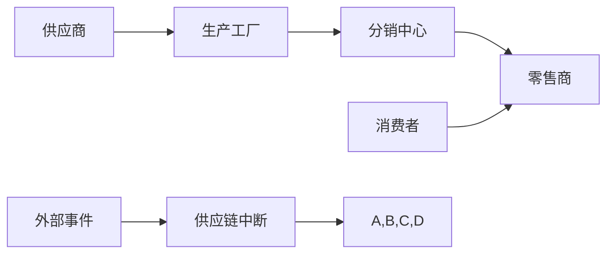
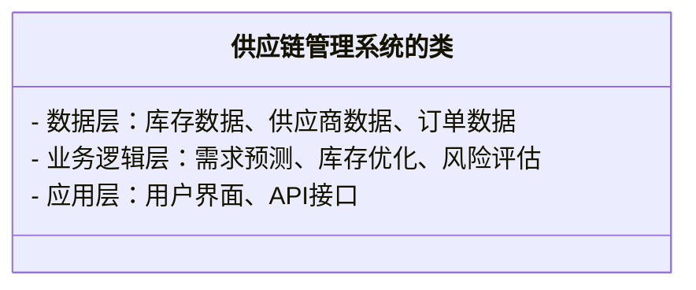
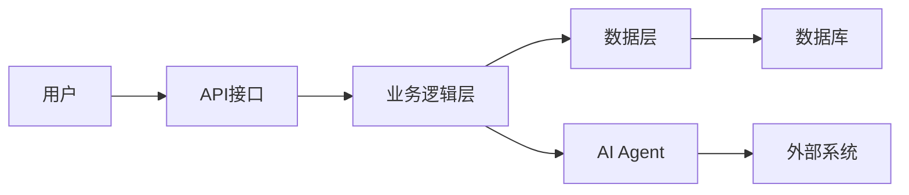
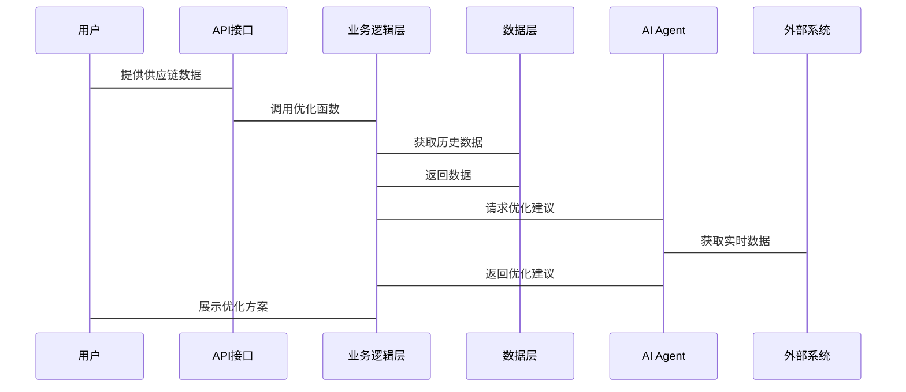

                 


# AI Agent在企业供应链韧性评估与提升中的应用

## 关键词：AI Agent，供应链韧性，企业供应链，人工智能技术，供应链管理，韧性评估

## 摘要：本文探讨AI Agent在企业供应链韧性评估与提升中的应用，详细分析了AI Agent的原理、算法、系统架构，以及在实际场景中的应用案例。通过对比分析和实战项目，展示了如何利用AI Agent技术提升供应链的抗风险能力和运营效率。

---

# 第一部分: AI Agent与供应链韧性概述

## 第1章: AI Agent与供应链韧性概述

### 1.1 AI Agent的基本概念

#### 1.1.1 AI Agent的定义与特点
- **AI Agent**（人工智能代理）是指能够感知环境、自主决策并执行任务的智能体。它能够通过传感器获取信息，利用算法进行分析，并通过执行器完成操作。
- **特点**：
  - **自主性**：能够在没有外部干预的情况下完成任务。
  - **反应性**：能够实时感知环境变化并做出响应。
  - **学习能力**：通过机器学习算法不断优化自身的决策能力。
  - **协作性**：能够与其他智能体或系统协同工作。

#### 1.1.2 AI Agent在企业中的应用场景
- **供应链管理**：优化库存、协调物流、预测需求。
- **风险管理**：识别潜在风险，制定应对策略。
- **客户体验**：提供个性化服务，提升客户满意度。

#### 1.1.3 供应链韧性的定义与重要性
- **供应链韧性**：指供应链在面对不确定性（如自然灾害、疫情、市场波动等）时，能够维持正常运作并快速恢复的能力。
- **重要性**：
  - 提高企业的抗风险能力。
  - 降低供应链中断对企业造成的损失。
  - 提升供应链的整体效率和灵活性。

### 1.2 AI Agent与供应链韧性的关系

#### 1.2.1 AI Agent在供应链管理中的作用
- **实时监控**：AI Agent可以实时监控供应链中的各个环节，发现潜在问题并及时预警。
- **智能决策**：通过分析历史数据和实时信息，AI Agent能够做出最优决策，如调整库存水平、优化物流路径等。
- **快速响应**：在供应链中断时，AI Agent能够快速制定应急方案，减少损失。

#### 1.2.2 供应链韧性评估的核心问题
- **数据获取**：如何收集和处理供应链中的海量数据。
- **模型构建**：如何建立准确的供应链韧性评估模型。
- **决策优化**：如何利用AI Agent优化供应链的运营策略。

#### 1.2.3 AI Agent如何提升供应链韧性
- **预测与预警**：通过机器学习算法预测潜在风险，提前采取措施。
- **动态优化**：根据实时数据动态调整供应链策略，提高灵活性。
- **协同合作**：通过多智能体协作，实现供应链各环节的高效协同。

### 1.3 本章小结
本章介绍了AI Agent的基本概念和特点，分析了其在企业中的应用场景，并重点探讨了AI Agent与供应链韧性的关系。通过AI Agent的应用，企业可以显著提升供应链的抗风险能力和运营效率。

---

## 第2章: 供应链韧性评估的核心概念与联系

### 2.1 核心概念与原理

#### 2.1.1 供应链韧性评估的指标体系
- **指标体系**：
  - **供应弹性**：供应链快速恢复的能力。
  - **需求弹性**：供应链满足多样化需求的能力。
  - **运营弹性**：供应链在极端情况下的运作能力。
  - **成本弹性**：供应链在不同情况下的成本控制能力。

#### 2.1.2 AI Agent在评估中的角色
- **数据采集**：AI Agent通过传感器和API获取供应链中的实时数据。
- **数据分析**：利用机器学习算法对数据进行分析，识别潜在风险。
- **决策支持**：基于分析结果，为供应链优化提供决策支持。

#### 2.1.3 供应链网络的复杂性与AI Agent的结合
- **复杂性分析**：供应链涉及多个环节和参与者，具有高度的复杂性。
- **AI Agent的优势**：通过分布式计算和协作机制，AI Agent能够有效应对供应链网络的复杂性。

### 2.2 核心概念对比表

| 对比维度       | 传统供应链管理 | AI Agent辅助的供应链管理 |
|----------------|----------------|-------------------------|
| **数据处理**   | 依赖人工分析    | 利用机器学习自动分析    |
| **决策速度**   | 较慢，依赖人工决策 | 快速，基于实时数据决策  |
| **灵活性**      | 较低            | 较高，能够快速调整策略  |
| **抗风险能力** | 较弱            | 较强，能够预测并应对风险 |

### 2.3 实体关系图



### 2.4 本章小结
本章分析了供应链韧性评估的核心概念，探讨了AI Agent在评估中的角色，并通过对比表和实体关系图展示了AI Agent如何与供应链各环节协同工作，提升供应链的整体韧性。

---

## 第3章: AI Agent的算法原理与数学模型

### 3.1 AI Agent的算法原理

#### 3.1.1 强化学习在AI Agent中的应用

- **强化学习**：一种通过试错机制优化决策的算法。
- **核心原理**：
  - **状态（State）**：环境中的当前情况。
  - **动作（Action）**：AI Agent基于当前状态做出的决策。
  - **奖励（Reward）**：环境对AI Agent动作的反馈，用于优化策略。
  - **策略（Policy）**：AI Agent在不同状态下的行动规则。

#### 3.1.2 多智能体协作机制

- **多智能体系统**：由多个智能体组成的协作系统，能够共同完成复杂任务。
- **协作机制**：
  - **通信协议**：智能体之间通过特定协议交换信息。
  - **协同决策**：基于共享信息，智能体共同制定最优策略。

#### 3.1.3 案例分析：基于强化学习的供应链决策

- **案例背景**：一家制造企业需要优化其库存管理。
- **算法实现**：
  1. **状态定义**：库存水平、需求预测、供应商交货时间。
  2. **动作定义**：调整订单量、优化交货时间。
  3. **奖励机制**：库存成本降低时获得正奖励，库存积压或缺货时获得负奖励。

### 3.2 数学模型与公式

#### 3.2.1 强化学习的数学模型

$$ Q(s, a) = r + \gamma \max_{a'} Q(s', a') $$

- **解释**：
  - $Q(s, a)$：状态$s$下动作$a$的期望奖励。
  - $r$：当前动作的即时奖励。
  - $\gamma$：折扣因子，表示未来奖励的权重。
  - $\max_{a'} Q(s', a')$：下一个状态下的最大期望奖励。

#### 3.2.2 多智能体协作的数学模型

$$ V(s) = \max_{a} \ \min_{a'} \ V(s', a') $$

- **解释**：
  - $V(s)$：状态$s$下的最优价值。
  - $\max_{a}$：选择使价值最大的动作。
  - $\min_{a'}$：最小化对手策略下的价值。

### 3.3 本章小结
本章详细介绍了AI Agent的核心算法，包括强化学习和多智能体协作机制，并通过案例分析展示了算法在供应链管理中的应用。数学模型的引入为读者理解AI Agent的决策机制提供了理论基础。

---

## 第4章: 系统分析与架构设计

### 4.1 问题场景介绍

- **供应链中断案例**：假设某地发生自然灾害，导致部分供应商无法供货。
- **目标**：通过AI Agent快速识别替代供应商，调整生产计划，减少损失。

### 4.2 系统功能设计

#### 4.2.1 领域模型类图



#### 4.2.2 系统架构设计



### 4.3 系统接口设计

- **API接口**：
  - **输入**：供应链各环节的数据（如库存、订单、物流）。
  - **输出**：AI Agent的优化建议（如调整订单量、更换供应商）。

### 4.4 系统交互序列图



### 4.5 本章小结
本章从系统架构的角度，详细分析了AI Agent在供应链管理中的应用场景，展示了系统的整体架构和交互流程。

---

## 第5章: 项目实战

### 5.1 环境安装

- **Python环境**：安装Python 3.8及以上版本。
- **依赖库**：安装numpy、pandas、scikit-learn、tensorflow等。

### 5.2 核心代码实现

#### 5.2.1 强化学习算法实现

```python
import numpy as np
import random

class AI-Agent:
    def __init__(self, state_space, action_space):
        self.state_space = state_space
        self.action_space = action_space
        self.Q = np.zeros((state_space, action_space))
    
    def act(self, state):
        if random.uniform(0, 1) < 0.1:  # 探索
            return random.randint(0, self.action_space-1)
        else:  # 利用
            return np.argmax(self.Q[state, :])
    
    def learn(self, state, action, reward, next_state):
        self.Q[state, action] = reward + 0.9 * np.max(self.Q[next_state, :])
```

#### 5.2.2 多智能体协作实现

```python
from agents import AI-Agent

class Multi-Agent-System:
    def __init__(self, num_agents):
        self.agents = [AI-Agent() for _ in range(num_agents)]
    
    def step(self, states, actions, rewards, next_states):
        for i in range(len(self.agents)):
            self.agents[i].learn(states[i], actions[i], rewards[i], next_states[i])
```

### 5.3 实际案例分析

#### 5.3.1 案例背景

- **企业**：一家电子产品制造企业。
- **问题**：某供应商因疫情停工，导致原材料短缺。
- **目标**：通过AI Agent快速找到替代供应商，调整生产计划。

#### 5.3.2 实施步骤

1. **数据收集**：收集所有供应商的历史数据、交货时间、质量等信息。
2. **模型训练**：利用强化学习算法训练AI Agent，使其能够识别最佳供应商。
3. **优化建议**：AI Agent根据当前情况推荐替代供应商，调整生产计划。
4. **效果评估**：对比调整前后的供应链表现，验证AI Agent的效果。

### 5.4 本章小结
本章通过实际案例展示了AI Agent在供应链管理中的应用，详细讲解了项目的实施过程和代码实现，帮助读者更好地理解和应用相关技术。

---

## 第6章: 最佳实践与小结

### 6.1 小结

- **AI Agent的优势**：
  - 提高供应链的抗风险能力。
  - 优化供应链的运营效率。
  - 实现供应链的智能化管理。

### 6.2 注意事项

- **数据质量**：AI Agent的性能依赖于数据的质量和完整性。
- **模型迭代**：需要定期更新模型，以适应供应链环境的变化。
- **隐私与安全**：在处理供应链数据时，需要注意数据隐私和安全问题。

### 6.3 拓展阅读

- **推荐书籍**：
  - 《供应链管理：原理与应用》
  - 《强化学习：理论与实践》
- **推荐博客**：
  - [Towards Data Science](https://towardsdatascience.com/)
  - [AI in Healthcare](https://www.nature.com/subjects/artificial-intelligence)

### 6.4 本章小结
本章总结了AI Agent在供应链管理中的应用，提出了实际应用中的注意事项，并推荐了相关的拓展阅读资料，帮助读者进一步深入学习。

---

# 结语

通过本文的详细分析，读者可以了解到AI Agent在企业供应链韧性评估与提升中的重要作用。从算法原理到系统架构，再到实际案例，本文为读者提供了全面的指导。希望本文能够为企业的供应链管理提供新的思路和方法，助力企业在复杂多变的市场环境中立于不败之地。

