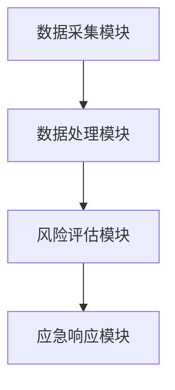

                 


# AI Agent在企业供应链韧性评估与预警中的应用

> 关键词：AI Agent, 供应链韧性, 风险预警, 企业供应链管理, 人工智能技术

> 摘要：随着全球供应链复杂性的增加，企业面临的风险也在不断加剧。本文探讨了AI Agent在企业供应链韧性评估与预警中的应用，详细分析了供应链韧性的概念、AI Agent的核心技术、在风险评估中的具体应用、系统实现方案以及实际案例分析。通过本文，读者可以全面了解如何利用AI Agent提升供应链的弹性和风险预警能力。

---

# 第1章 供应链韧性的概念与重要性

## 1.1 供应链韧性的定义与内涵

### 1.1.1 供应链的基本概念
供应链是指从供应商到消费者的整个链条，包括原材料采购、生产、物流、分销和最终交付等环节。供应链的稳定性直接关系到企业的运营效率和市场竞争力。

### 1.1.2 供应链韧性的定义
供应链韧性是指供应链在面对突发事件（如自然灾害、疫情、供应链断裂等）时，能够快速恢复并维持正常运营的能力。它强调供应链的抗风险能力和适应性。

### 1.1.3 供应链韧性的重要性
供应链韧性是企业应对不确定性的关键能力。在现代商业环境中，供应链中断可能导致巨大的经济损失，甚至影响企业的生存。因此，提升供应链韧性已成为企业的战略重点。

## 1.2 供应链韧性的影响因素

### 1.2.1 供应商稳定性
供应商的稳定性直接影响供应链的韧性。如果主要供应商因各种原因无法供货，企业需要有备用供应商或快速调整供应链结构。

### 1.2.2 物流能力
物流是供应链的重要组成部分。物流中断可能导致库存积压或交付延迟，从而影响整个供应链的稳定性。

### 1.2.3 库存管理
合理的库存管理可以有效应对供应链中断的风险。过多的库存会增加成本，而过少的库存则可能导致供应不足。

### 1.2.4 应急响应能力
企业在面对突发事件时的应急响应能力是供应链韧性的重要体现。包括快速决策、资源调配和危机公关能力等。

## 1.3 供应链韧性评估的指标

### 1.3.1 响应时间
企业在面对供应链中断时，能够多快恢复正常运营。

### 1.3.2 成本控制
供应链中断带来的额外成本，包括应急采购、物流调整等。

### 1.3.3 资源可用性
企业在供应链中断时能够快速调配的资源，包括备用供应商、库存和物流能力等。

### 1.3.4 供应链透明度
供应链的透明度越高，企业越能够及时发现问题并采取措施。

---

# 第2章 AI Agent的基本概念与技术

## 2.1 AI Agent的定义与特点

### 2.1.1 AI Agent的定义
AI Agent是指具有感知环境、自主决策和执行任务能力的智能体。它能够通过传感器或数据输入获取信息，并根据预设的目标和规则做出决策。

### 2.1.2 AI Agent的核心特点
- **自主性**：能够自主决策，无需人工干预。
- **反应性**：能够实时感知环境变化并做出反应。
- **学习能力**：通过机器学习不断优化自身的决策能力。
- **协作性**：能够与其他AI Agent或系统协同工作。

### 2.1.3 AI Agent与传统算法的区别
AI Agent不仅仅是一个算法，它是一个能够独立运行的智能体，具有更强的适应性和自主性。

## 2.2 AI Agent在供应链中的应用

### 2.2.1 AI Agent在供应链管理中的优势
- **实时监控**：能够实时监控供应链的各个环节，及时发现潜在问题。
- **预测能力**：通过机器学习模型预测供应链中断的可能性。
- **快速响应**：在发现问题后，能够快速制定解决方案并执行。

### 2.2.2 AI Agent在供应链风险预警中的作用
AI Agent能够通过分析历史数据和实时数据，预测潜在风险，并提前发出预警。

### 2.2.3 AI Agent在供应链优化中的应用
AI Agent可以通过优化算法，帮助企业在供应链的各个环节实现成本最小化和效率最大化。

## 2.3 AI Agent的关键技术

### 2.3.1 机器学习
机器学习是AI Agent的核心技术之一，用于分析数据、识别模式和做出预测。

### 2.3.2 自然语言处理
自然语言处理技术使AI Agent能够理解和处理文本信息，例如分析供应链相关的文档和报告。

### 2.3.3 实时数据分析
AI Agent能够实时分析供应链中的各种数据，包括库存、物流和销售数据，从而快速做出决策。

### 2.3.4 自适应优化算法
自适应优化算法使AI Agent能够根据实时数据和环境变化，动态调整供应链策略。

---

# 第3章 供应链风险评估的核心概念

## 3.1 供应链风险的定义与分类

### 3.1.1 供应链风险的定义
供应链风险是指在供应链的各个环节中，由于各种内外部因素可能导致的供应中断或效率下降的风险。

### 3.1.2 供应链风险的主要类型
- **供应风险**：供应商无法按时供货。
- **物流风险**：物流中断导致货物无法按时送达。
- **需求风险**：需求预测不准确导致库存积压或缺货。
- **运营风险**：供应链中的某个环节出现故障，导致整个供应链中断。

---

## 3.2 AI Agent在供应链风险评估中的应用

### 3.2.1 AI Agent的风险识别能力
AI Agent能够通过分析历史数据和实时数据，识别潜在的风险因素。

### 3.2.2 AI Agent的风险预测模型
AI Agent可以利用机器学习算法，建立风险预测模型，预测供应链中断的可能性。

### 3.2.3 AI Agent的风险评估方法
AI Agent可以通过多种方法评估供应链风险，包括定量分析和定性分析。

---

# 第4章 供应链预警机制的设计与实现

## 4.1 预警机制的核心概念

### 4.1.1 预警机制的定义
预警机制是指在供应链中建立一套监测和预警系统，能够在潜在风险发生前发出预警。

### 4.1.2 预警机制的作用
- **提前预警**：在潜在风险发生前发出预警，帮助企业采取预防措施。
- **快速响应**：在风险发生后，迅速采取措施减少损失。

## 4.2 预警机制的设计原则

### 4.2.1 实时监测
预警机制需要实时监测供应链的各个环节，确保能够及时发现问题。

### 4.2.2 数据驱动
预警机制需要基于大量数据进行分析，确保预警的准确性和可靠性。

### 4.2.3 可视化界面
预警机制需要有直观的可视化界面，帮助决策者快速理解和应对问题。

## 4.3 AI Agent在预警机制中的应用

### 4.3.1 AI Agent的实时监测能力
AI Agent能够实时监测供应链的各个环节，包括库存、物流和销售数据。

### 4.3.2 AI Agent的风险预警模型
AI Agent可以通过机器学习模型，预测潜在风险并发出预警。

### 4.3.3 AI Agent的应急响应能力
在风险发生后，AI Agent可以迅速制定应急方案，帮助企业快速恢复供应链的正常运营。

---

# 第5章 供应链韧性评估与预警的系统实现

## 5.1 系统架构设计

### 5.1.1 系统功能模块
- **数据采集模块**：负责采集供应链各个环节的数据。
- **数据处理模块**：对采集到的数据进行清洗和预处理。
- **风险评估模块**：利用AI Agent对供应链风险进行评估和预警。
- **应急响应模块**：在风险发生后，制定应急方案并执行。

### 5.1.2 系统架构图


## 5.2 核心算法实现

### 5.2.1 风险预测算法
```python
def risk_prediction(data):
    # 数据预处理
    processed_data = preprocess(data)
    
    # 训练机器学习模型
    model = train_model(processed_data)
    
    # 预测风险
    prediction = model.predict(processed_data)
    
    return prediction
```

### 5.2.2 应急响应算法
```python
def emergency_response(risk_level):
    if risk_level >= 0.8:
        return "启动应急方案"
    elif risk_level >= 0.5:
        return "加强监控"
    else:
        return "正常运行"
```

## 5.3 系统实现的注意事项

### 5.3.1 数据隐私与安全
在系统实现过程中，需要确保数据的隐私和安全，防止数据泄露和滥用。

### 5.3.2 系统可扩展性
系统设计需要具有良好的可扩展性，以便在未来扩展更多的功能模块。

### 5.3.3 系统稳定性
系统需要具有高度的稳定性，确保在高负载和高并发的情况下仍能正常运行。

---

# 第6章 供应链韧性评估与预警的案例分析

## 6.1 案例背景介绍

### 6.1.1 案例企业简介
某跨国企业在全球范围内采购和销售产品，供应链复杂，涉及多个供应商和分销商。

### 6.1.2 供应链中断的背景
由于疫情导致全球物流中断，该企业的部分供应商无法按时供货，导致生产延迟和库存积压。

## 6.2 AI Agent在案例中的应用

### 6.2.1 数据采集与处理
通过传感器和ERP系统采集供应链各个环节的数据，并进行清洗和预处理。

### 6.2.2 风险评估与预警
利用AI Agent建立风险预测模型，预测供应链中断的可能性，并发出预警。

### 6.2.3 应急响应与恢复
在风险发生后，AI Agent迅速制定应急方案，包括寻找备用供应商和调整物流路线，帮助企业在短时间内恢复供应链的正常运营。

## 6.3 案例分析与总结

### 6.3.1 案例的成功经验
通过AI Agent的应用，企业能够快速发现潜在风险并采取措施，有效降低了供应链中断的风险。

### 6.3.2 案例的局限性
AI Agent的预测模型依赖于历史数据的准确性和完整性，如果数据质量不高，可能会影响预测的准确性。

### 6.3.3 案例的未来展望
未来，随着AI技术的不断进步，AI Agent在供应链韧性评估与预警中的应用将更加广泛和深入。

---

# 第7章 总结与展望

## 7.1 本文总结

本文详细探讨了AI Agent在企业供应链韧性评估与预警中的应用，从供应链韧性的概念、AI Agent的核心技术、风险评估方法、预警机制设计到实际案例分析，全面分析了AI Agent在供应链管理中的重要作用。

## 7.2 未来展望

随着AI技术的不断发展，AI Agent在供应链管理中的应用将更加广泛和深入。未来，AI Agent将不仅仅局限于风险评估和预警，还将应用于供应链优化、智能决策等领域，成为企业供应链管理的核心工具。

---

# 参考文献

（此处可以列出相关的学术论文、技术报告和书籍等参考文献。）

---

通过本文的分析，我们可以看到，AI Agent在企业供应链韧性评估与预警中的应用具有重要的现实意义。它不仅能够帮助企业提前发现潜在风险，还能在风险发生后迅速采取措施，有效降低供应链中断的风险。随着AI技术的不断进步，AI Agent将在供应链管理中发挥越来越重要的作用，为企业创造更大的价值。

