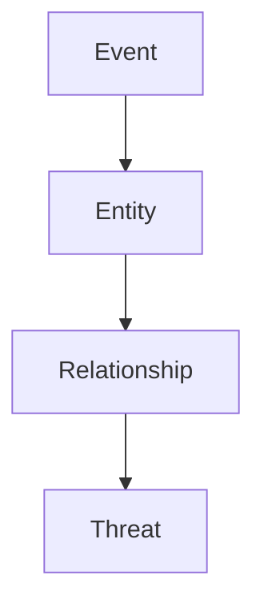
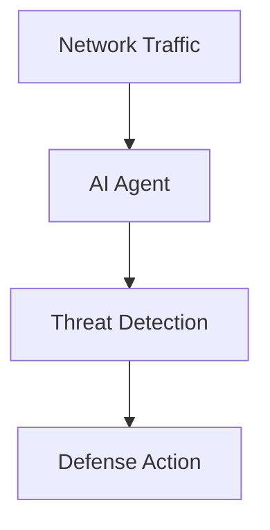
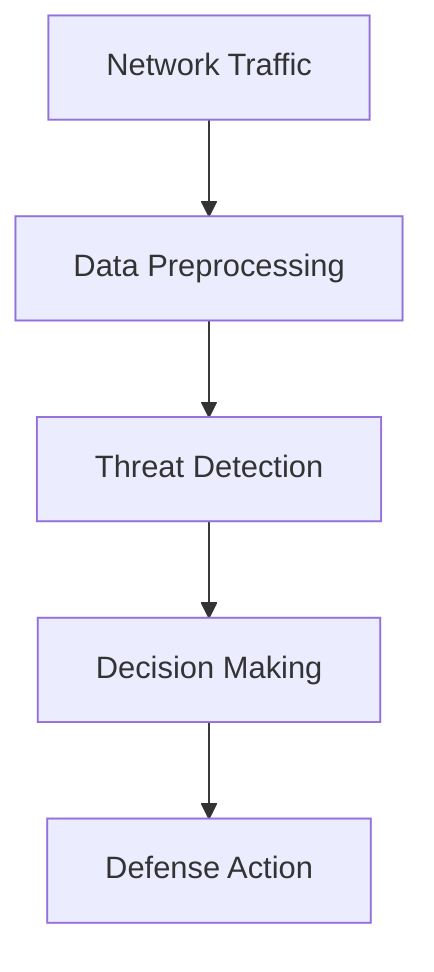
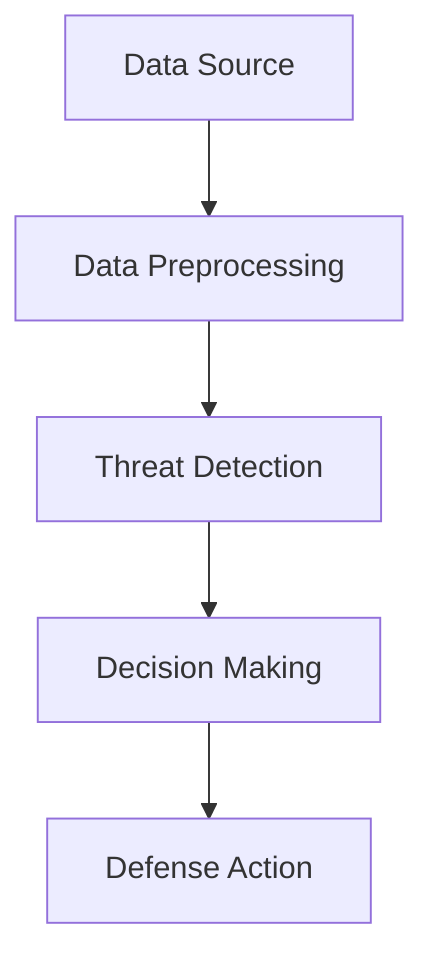

                 


# AI Agent在企业信息安全与隐私保护中的应用

> 关键词：AI Agent，企业信息安全，隐私保护，机器学习，数据安全，网络威胁

> 摘要：随着企业数字化转型的不断推进，信息安全和隐私保护面临着前所未有的挑战。AI Agent作为一种智能代理，通过其强大的感知和决策能力，在企业信息安全和隐私保护中发挥着重要作用。本文将从AI Agent的基本概念、算法原理、系统架构设计以及实际应用等方面，深入探讨AI Agent在企业信息安全与隐私保护中的应用。

---

# 第一部分: AI Agent与企业信息安全背景

## 第1章: AI Agent与企业信息安全背景

### 1.1 AI Agent的基本概念

#### 1.1.1 AI Agent的定义与特点
AI Agent，即人工智能代理，是一种能够感知环境、自主决策并采取行动以实现目标的智能系统。其特点包括：
- **自主性**：能够在没有外部干预的情况下自主运行。
- **反应性**：能够实时感知环境并做出反应。
- **学习能力**：通过机器学习不断优化自身的决策能力。
- **协作性**：能够与其他系统或AI Agent协同工作。

#### 1.1.2 AI Agent在企业中的角色与功能
在企业环境中，AI Agent主要承担以下角色：
- **安全监控**：实时监控网络流量、日志数据等，识别潜在的安全威胁。
- **威胁检测**：通过异常检测算法，发现潜在的网络攻击或数据泄露。
- **自动化响应**：在检测到威胁时，自动采取防御措施，如切断网络连接、隔离异常设备等。
- **隐私保护**：通过数据加密、数据脱敏等技术，保护企业数据的隐私性。

#### 1.1.3 企业信息安全的核心问题与挑战
企业信息安全的核心问题包括：
- **数据泄露**：未经授权的人员访问企业敏感数据，导致数据泄露。
- **网络攻击**：黑客利用漏洞发起攻击，破坏企业系统或窃取数据。
- **内部威胁**：企业内部员工或合作伙伴的恶意行为，导致数据泄露或系统破坏。
- **隐私保护**：随着数据保护法规的日益严格，企业需要确保数据在处理过程中的隐私性。

### 1.2 AI Agent与企业信息安全的关系

#### 1.2.1 AI Agent在企业信息安全中的应用场景
AI Agent在企业信息安全中的应用场景包括：
- **网络流量分析**：实时监控网络流量，识别异常流量模式，发现潜在的网络攻击。
- **日志分析**：分析系统日志，发现异常行为，识别潜在的安全威胁。
- **漏洞管理**：通过AI Agent自动识别系统漏洞，并提供修复建议。

#### 1.2.2 AI Agent如何提升企业信息安全能力
AI Agent通过以下方式提升企业信息安全能力：
- **自动化监控**：实时监控企业网络和系统，及时发现潜在威胁。
- **智能决策**：利用机器学习算法，分析大量数据，做出最优的安全决策。
- **快速响应**：在检测到威胁后，AI Agent可以迅速采取行动，减少潜在损失。

#### 1.2.3 AI Agent在隐私保护中的作用
AI Agent在隐私保护中的作用包括：
- **数据加密**：通过加密技术，保护数据在传输和存储过程中的安全性。
- **数据脱敏**：对敏感数据进行脱敏处理，确保数据在使用过程中不暴露真实信息。
- **隐私计算**：通过隐私计算技术，如联邦学习，保护数据隐私的同时进行数据分析和模型训练。

### 1.3 本章小结
本章介绍了AI Agent的基本概念、特点及其在企业信息安全和隐私保护中的作用。AI Agent作为一种智能代理，能够通过实时监控、智能决策和自动化响应，显著提升企业信息安全能力，并在数据隐私保护方面发挥重要作用。

---

# 第二部分: AI Agent的核心概念与原理

## 第2章: AI Agent的核心概念与原理

### 2.1 AI Agent的核心概念

#### 2.1.1 AI Agent的组成与结构
AI Agent的组成结构通常包括以下部分：
- **感知层**：负责感知环境中的信息，如网络流量、日志数据等。
- **推理层**：通过机器学习算法对感知到的信息进行分析和推理，识别潜在威胁。
- **决策层**：根据推理结果，制定安全策略和防御措施。
- **执行层**：将决策结果转化为具体行动，如切断网络连接、发出警报等。

#### 2.1.2 AI Agent的分类与特点
AI Agent可以根据功能和应用场景进行分类：
- **基于规则的AI Agent**：通过预定义的规则进行决策和行动。
- **基于机器学习的AI Agent**：利用机器学习算法进行自主学习和决策。
- **基于知识图谱的AI Agent**：通过知识图谱进行推理和决策。

#### 2.1.3 AI Agent与传统安全工具的区别
AI Agent与传统安全工具的主要区别在于：
- **自主性**：AI Agent能够自主决策和行动，而传统安全工具通常依赖于人工配置。
- **学习能力**：AI Agent能够通过机器学习不断优化自身的决策能力，而传统安全工具通常不具备这种能力。
- **实时性**：AI Agent能够实时感知和响应安全威胁，而传统安全工具往往需要人工干预。

### 2.2 AI Agent的原理与机制

#### 2.2.1 AI Agent的感知与决策机制
AI Agent的感知与决策机制包括以下几个步骤：
1. **数据采集**：通过传感器、日志系统等采集环境中的数据。
2. **数据处理**：对采集到的数据进行清洗、转换和特征提取。
3. **模型推理**：利用机器学习模型对数据进行分析和推理，识别潜在威胁。
4. **决策制定**：根据推理结果，制定相应的安全策略和防御措施。
5. **行动执行**：将决策结果转化为具体行动，如发出警报、切断网络连接等。

#### 2.2.2 AI Agent的学习与自适应能力
AI Agent的学习与自适应能力主要体现在以下几个方面：
- **在线学习**：AI Agent可以在运行过程中不断学习新的数据，优化自身的模型。
- **增量学习**：当遇到新的安全威胁时，AI Agent可以通过增量学习快速更新模型。
- **自适应推理**：AI Agent能够根据环境的变化，动态调整自身的推理策略。

#### 2.2.3 AI Agent的推理与问题解决能力
AI Agent的推理与问题解决能力主要依赖于以下几种技术：
- **基于规则的推理**：通过预定义的规则进行推理和决策。
- **基于逻辑的推理**：利用逻辑推理技术，分析数据之间的逻辑关系，识别潜在威胁。
- **基于概率的推理**：通过概率模型，评估不同事件的可能性，做出最优决策。

### 2.3 AI Agent的数学模型与算法

#### 2.3.1 基于概率的推理模型
基于概率的推理模型主要用于评估不同事件的可能性。例如，贝叶斯网络可以通过计算条件概率，评估某个事件发生的可能性。

$$ P(A|B) = \frac{P(B|A) \cdot P(A)}{P(B)} $$

#### 2.3.2 基于知识图谱的推理模型
基于知识图谱的推理模型通过构建知识图谱，分析数据之间的语义关系，识别潜在威胁。



#### 2.3.3 基于强化学习的决策模型
基于强化学习的决策模型通过强化学习算法，优化AI Agent的决策策略。例如，Q-learning算法可以通过奖励机制，优化AI Agent的决策行为。

$$ Q(s, a) = r + \gamma \max_{a'} Q(s', a') $$

### 2.4 本章小结
本章详细介绍了AI Agent的核心概念、组成结构、分类及其与传统安全工具的区别。同时，还探讨了AI Agent的感知与决策机制、学习与自适应能力以及推理与问题解决能力，并给出了相应的数学模型和算法。

---

# 第三部分: AI Agent在企业信息安全中的应用

## 第3章: AI Agent在企业信息安全中的应用

### 3.1 企业信息安全的主要挑战

#### 3.1.1 数据泄露与隐私保护
数据泄露是企业信息安全的主要挑战之一。企业需要通过数据加密、数据脱敏和隐私计算等技术，保护数据的隐私性。

#### 3.1.2 网络攻击与漏洞利用
网络攻击是企业信息安全的另一个主要挑战。企业需要通过实时监控和智能防御，防止网络攻击和漏洞利用。

#### 3.1.3 企业内部安全威胁
企业内部员工或合作伙伴的恶意行为也可能导致数据泄露或系统破坏。AI Agent可以通过行为分析，识别内部威胁。

### 3.2 AI Agent在企业信息安全中的应用场景

#### 3.2.1 威胁检测与防御
AI Agent可以通过实时监控网络流量和系统日志，识别潜在的网络攻击和异常行为。



#### 3.2.2 数据泄露防护
AI Agent可以通过数据加密、数据脱敏和隐私计算等技术，保护企业数据的隐私性。

#### 3.2.3 内部安全监控
AI Agent可以通过行为分析，识别企业内部的异常行为，预防内部威胁。

### 3.3 AI Agent在隐私保护中的具体应用

#### 3.3.1 数据加密与隐私保护
数据加密是保护数据隐私的重要手段。AI Agent可以通过加密技术，保护数据在传输和存储过程中的安全性。

#### 3.3.2 数据脱敏技术
数据脱敏技术可以将敏感数据转化为非敏感数据，同时保留数据的可用性。例如，通过模糊化处理，保护个人信息。

#### 3.3.3 隐私计算与联邦学习
隐私计算是一种在保护数据隐私的前提下进行数据分析和模型训练的技术。联邦学习是一种典型的隐私计算技术，可以在不共享原始数据的情况下，协同训练安全防护模型。

### 3.4 本章小结
本章探讨了AI Agent在企业信息安全中的具体应用，包括威胁检测与防御、数据泄露防护和内部安全监控。同时，还介绍了AI Agent在隐私保护中的具体应用，如数据加密、数据脱敏和隐私计算。

---

# 第四部分: AI Agent的算法原理与数学模型

## 第4章: AI Agent的算法原理与数学模型

### 4.1 AI Agent的感知与决策算法

#### 4.1.1 基于深度学习的威胁检测
基于深度学习的威胁检测算法可以通过卷积神经网络（CNN）或循环神经网络（RNN）对网络流量数据进行分析，识别潜在的网络攻击。

```python
import tensorflow as tf
from tensorflow.keras import layers

model = tf.keras.Sequential([
    layers.Conv2D(32, (3,3), activation='relu', input_shape=(None, None, 1)),
    layers.MaxPooling2D((2,2)),
    layers.Flatten(),
    layers.Dense(64, activation='relu'),
    layers.Dense(1, activation='sigmoid')
])
```

#### 4.1.2 基于强化学习的决策模型
基于强化学习的决策模型可以通过Q-learning算法优化AI Agent的决策策略。

```python
def q_learning(reward, Q, s, a, gamma=0.9):
    next_actions = [action for action in possible_actions if action != a]
    max_future_reward = max([Q[s_prime][a_prime] for s_prime, a_prime in next_actions])
    Q[s][a] = reward + gamma * max_future_reward
```

#### 4.1.3 基于图神经网络的知识推理
基于图神经网络的知识推理可以通过图嵌入技术，分析数据之间的语义关系，识别潜在威胁。


### 4.2 AI Agent的数学模型

#### 4.2.1 马尔可夫决策过程（MDP）
马尔可夫决策过程（MDP）是一种描述决策过程的数学模型，常用于强化学习。

$$ V(s) = \max_{a} \left( r + \gamma V(s') \right) $$

#### 4.2.2 增量式Q学习算法
增量式Q学习算法是一种基于强化学习的算法，用于优化AI Agent的决策策略。

$$ Q(s, a) = Q(s, a) + \alpha (r + \gamma \max Q(s', a') - Q(s, a)) $$

#### 4.2.3 知识图谱表示学习
知识图谱表示学习通过将知识图谱中的实体和关系表示为向量，进行语义分析和推理。

### 4.3 算法实现与代码示例

#### 4.3.1 基于Python的强化学习代码
以下是一个基于强化学习的AI Agent实现代码示例：

```python
import numpy as np
import gym

env = gym.make('CartPole-v1')
env.seed(42)

# 初始化Q表
Q = np.zeros([env.observation_space.n, env.action_space.n])

# 参数设置
alpha = 0.1
gamma = 0.9

# Q-learning算法
for episode in range(1000):
    state = env.reset()
    for t in range(1000):
        action = np.argmax(Q[state, :])
        next_state, reward, done, info = env.step(action)
        Q[state, action] = Q[state, action] + alpha * (reward + gamma * np.max(Q[next_state, :]) - Q[state, action])
        state = next_state
        if done:
            break
```

#### 4.3.2 基于TensorFlow的深度学习模型
以下是一个基于TensorFlow的深度学习模型实现代码示例：

```python
import tensorflow as tf
from tensorflow.keras import layers

model = tf.keras.Sequential([
    layers.Conv2D(32, (3,3), activation='relu', input_shape=(None, None, 1)),
    layers.MaxPooling2D((2,2)),
    layers.Flatten(),
    layers.Dense(64, activation='relu'),
    layers.Dense(1, activation='sigmoid')
])

model.compile(optimizer='adam', loss='binary_crossentropy', metrics=['accuracy'])
model.fit(x_train, y_train, epochs=10, batch_size=32)
```

#### 4.3.3 基于PyTorch的知识图谱
以下是一个基于PyTorch的知识图谱实现代码示例：

```python
import torch
from torch import nn

class KnowledgeGraph(nn.Module):
    def __init__(self, input_dim, hidden_dim, output_dim):
        super(KnowledgeGraph, self).__init__()
        self.embedding = nn.Embedding(input_dim, hidden_dim)
        self.fc = nn.Linear(hidden_dim, output_dim)
    
    def forward(self, x):
        x = self.embedding(x)
        x = self.fc(x)
        return x

model = KnowledgeGraph(input_dim, hidden_dim, output_dim)
criterion = nn.MSELoss()
optimizer = torch.optim.Adam(model.parameters(), lr=0.01)
```

### 4.4 本章小结
本章详细介绍了AI Agent的算法原理和数学模型，包括基于概率的推理模型、基于知识图谱的推理模型和基于强化学习的决策模型。同时，还提供了具体的代码实现示例，帮助读者更好地理解和应用这些算法。

---

# 第五部分: AI Agent的系统分析与架构设计

## 第5章: AI Agent的系统分析与架构设计

### 5.1 问题场景介绍
本章将设计一个基于AI Agent的企业信息安全防护系统，旨在通过AI Agent实现对网络流量的实时监控、威胁检测和自动化防御。

### 5.2 系统功能设计

#### 5.2.1 领域模型
领域模型描述了系统的功能模块及其之间的关系。



#### 5.2.2 系统架构设计
系统架构设计包括以下几个部分：
- **数据采集层**：负责采集网络流量、系统日志等数据。
- **数据处理层**：对采集到的数据进行清洗、转换和特征提取。
- **模型推理层**：利用机器学习模型对数据进行分析和推理，识别潜在威胁。
- **决策与响应层**：根据推理结果，制定安全策略并采取防御措施。

#### 5.2.3 系统接口设计
系统接口设计包括以下几个部分：
- **数据接口**：与数据源（如网络设备、日志系统）进行数据交互。
- **模型接口**：与机器学习模型进行交互，获取推理结果。
- **响应接口**：与安全设备（如防火墙、入侵检测系统）进行交互，执行防御措施。

### 5.3 系统架构设计

#### 5.3.1 系统架构图
系统架构图展示了各个功能模块之间的关系。



#### 5.3.2 功能模块设计
功能模块设计包括以下几个部分：
- **数据采集模块**：负责采集网络流量、系统日志等数据。
- **数据处理模块**：对采集到的数据进行清洗、转换和特征提取。
- **模型推理模块**：利用机器学习模型对数据进行分析和推理，识别潜在威胁。
- **决策与响应模块**：根据推理结果，制定安全策略并采取防御措施。

### 5.4 本章小结
本章设计了一个基于AI Agent的企业信息安全防护系统，包括数据采集、数据处理、模型推理和决策与响应四个功能模块。通过系统架构图和功能模块图，展示了各个模块之间的关系和流程。

---

# 第六部分: AI Agent的项目实战

## 第6章: AI Agent的项目实战

### 6.1 环境安装与配置

#### 6.1.1 安装Python
安装Python 3.8或更高版本。

#### 6.1.2 安装TensorFlow
安装TensorFlow 2.5或更高版本：

```bash
pip install tensorflow==2.5
```

#### 6.1.3 安装PyTorch
安装PyTorch 1.9或更高版本：

```bash
pip install torch==1.9
```

### 6.2 系统核心实现

#### 6.2.1 数据采集模块
数据采集模块负责采集网络流量数据。

```python
import socket

def receive_data():
    s = socket.socket(socket.AF_INET, socket.SOCK_DGRAM)
    s.bind(('0.0.0.0', 8080))
    while True:
        data, addr = s.recvfrom(1024)
        print(f"Received {data} from {addr}")
```

#### 6.2.2 数据处理模块
数据处理模块对采集到的数据进行预处理。

```python
import numpy as np

def preprocess_data(data):
    # 数据预处理逻辑
    processed_data = np.array(data)
    return processed_data
```

#### 6.2.3 模型推理模块
模型推理模块利用机器学习模型进行威胁检测。

```python
import tensorflow as tf

model = tf.keras.Sequential([
    layers.Conv2D(32, (3,3), activation='relu', input_shape=(None, None, 1)),
    layers.MaxPooling2D((2,2)),
    layers.Flatten(),
    layers.Dense(64, activation='relu'),
    layers.Dense(1, activation='sigmoid')
])

model.compile(optimizer='adam', loss='binary_crossentropy', metrics=['accuracy'])
```

#### 6.2.4 决策与响应模块
决策与响应模块根据推理结果，采取相应的防御措施。

```python
def take_action(threat_level):
    if threat_level > 0.9:
        # 切断网络连接
        print("Network connection severed")
    elif threat_level > 0.5:
        # 隔离异常设备
        print("Anomalous device isolated")
    else:
        # 发出警报
        print("Alarm triggered")
```

### 6.3 代码实现与应用解读

#### 6.3.1 数据采集与预处理
数据采集模块通过UDP协议接收网络流量数据，并将其传递给数据处理模块进行预处理。

#### 6.3.2 模型训练与推理
模型推理模块利用深度学习模型对预处理后的数据进行训练和推理，识别潜在的网络攻击。

#### 6.3.3 决策与响应
根据模型的推理结果，决策与响应模块采取相应的防御措施，如切断网络连接、隔离异常设备等。

### 6.4 案例分析与实际应用

#### 6.4.1 网络流量异常检测
通过AI Agent对网络流量进行实时监控，识别异常流量模式，发现潜在的网络攻击。

#### 6.4.2 数据泄露防护
通过数据加密和数据脱敏技术，保护企业数据的隐私性，防止数据泄露。

#### 6.4.3 内部安全监控
通过行为分析，识别企业内部的异常行为，预防内部威胁。

### 6.5 本章小结
本章通过具体的项目实战，详细介绍了AI Agent的环境配置、系统实现和实际应用。通过代码实现和案例分析，展示了AI Agent在企业信息安全与隐私保护中的具体应用。

---

# 第七部分: 总结与展望

## 第7章: 总结与展望

### 7.1 本章总结
本文详细探讨了AI Agent在企业信息安全与隐私保护中的应用。通过介绍AI Agent的基本概念、算法原理和系统架构设计，展示了AI Agent在威胁检测、数据泄露防护和内部安全监控中的具体应用。同时，还提供了具体的代码实现和案例分析，帮助读者更好地理解和应用这些技术。

### 7.2 未来展望
随着AI技术的不断发展，AI Agent在企业信息安全与隐私保护中的应用前景广阔。未来的研究方向包括：
- **更智能的AI Agent**：通过更先进的机器学习算法，提升AI Agent的感知和决策能力。
- **更安全的隐私保护**：通过更先进的隐私计算技术，进一步提升数据隐私保护能力。
- **更高效的协同工作**：通过多AI Agent协同工作，提升企业信息安全的整体防护能力。

### 7.3 最佳实践 tips
- **数据安全**：在使用AI Agent进行数据分析时，务必确保数据的安全性和隐私性。
- **模型优化**：定期优化AI Agent的模型，提升其检测准确性和响应速度。
- **系统维护**：定期维护和更新AI Agent系统，确保其正常运行和最佳性能。

### 7.4 本章小结
本文总结了AI Agent在企业信息安全与隐私保护中的应用，并展望了未来的研究方向。通过本文的探讨，读者可以更好地理解AI Agent在企业信息安全中的重要作用，并在实际应用中更好地利用这些技术。

---

# 结语

随着企业数字化转型的不断推进，信息安全和隐私保护面临着前所未有的挑战。AI Agent作为一种智能代理，通过其强大的感知和决策能力，在企业信息安全和隐私保护中发挥着重要作用。通过本文的探讨，读者可以更好地理解AI Agent在企业信息安全中的具体应用，并在实际应用中更好地利用这些技术，提升企业信息安全和隐私保护能力。

